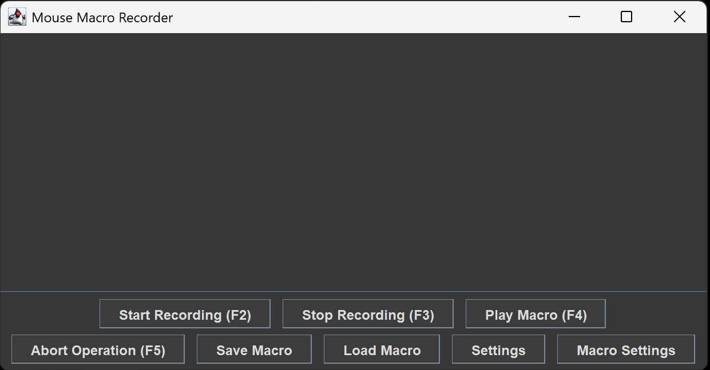
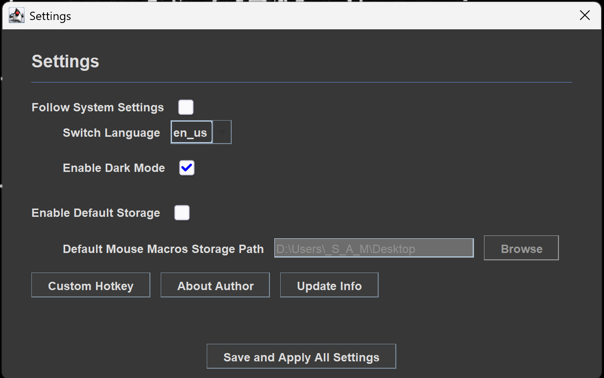

# MouseMacros

<p align="center">
  
  <br>
  <b>A lightweight, cross-platform Java tool for recording and replaying mouse and keyboard macros.</b>
  <br>
</p>

<p align="center">
  
  
  
  
  <br>
  
  <a href="https://deepwiki.com/Samera2022/MouseMacros"></a>
</p>

<div align="center">

| <sub>EN</sub> [English](./README.md) | <sub>ZH</sub> [中文](docs/zh/README_ZH_CN.md) |
|--------------------------------------|------------------------------------------|

</div>

## Preview
<p align="center">
  
<br>
  <sub style="font-size: 14px;"><i>The main interface of MouseMacros.</i></sub>
</p>

## Features

* **Comprehensive Recording**: Capture Mouse Left/Right/Middle clicks, Scroll Wheel movements, and Keyboard inputs seamlessly.
* **Global Hotkeys**: Control the application even when it's minimized. Fully customizable keys for:
    * Start/Stop Recording
    * Play Macro
    * Abort Operation (Emergency stop for runaway macros)
* **Multi-Language Support**: Built-in localization for **English (US)** and **Simplified Chinese**, other supported languages includes Japanese, Russian, Korean, Spanish and French.
* **Theme Engine**: Supports **Light** and **Dark** modes, with an option to follow system settings automatically.
* **Persistence**: Macros are saved as `.mmc` (CSV-formatted) files, allowing for easy sharing and manual editing.
* **Smart Memory**: Remembers window sizes, last-used directories, and custom configurations across sessions.
* **Floating Tooltip**: Shows helpful instructions and tips near the cursor for easier operation.
* **Powerful Scripting Engine**: Extend functionality with JavaScript for custom logic, event handling, and more.

## Security & Binary Integrity
To ensure the safety and authenticity of our Windows binaries, MouseMacros is currently integrating with SignPath Foundation for free code signing.
- Status: Application in progress / Integration pending.
- Future Releases: Once approved, all Windows installers (.msi) and executables (.exe) will be digitally signed by SignPath Foundation.


## Getting Started

### Quick Launch
I. Jar User
1. Make sure that you have installed JRE 1.8 or above. If not, you can download [HERE](https://www.oracle.com/technetwork/cn/java/javase/downloads/jre8-downloads-2133155-zhs.html).
2. Download the latest `.jar` file from the [Releases](https://github.com/Samera2022/MouseMacros/releases) page.
3. Double-click the jar file OR use cmd to run the application:
    ```bash
    java -jar MouseMacros.jar
    ```
II. Exe User
1. Download the latest `.exe` file from the [Releases](https://github.com/Samera2022/MouseMacros/releases) page.
2. Click to start! All environments are integrated into one `exe` file!

### Usage
<p align="center">
  
</p>

1. **Adjust**: The choose of language will determine the words in the frame, thus resulting in some buttons not being displayed in the frame.
   In this case, you will need to adjust the frame to the appropriate size.
2. **Configure**: Open the Settings dialog and Macros Settings dialog to set your preferred hotkeys. For detailed configuration docs, please refer to [Configuration](#configuration).
3. **Record**: Press your "Start Recording" hotkey or press this button in the frame and perform the actions.
4. **Save**: Use "Save Macros" to export your recording to a `.mmc` file.
5. **Replay**: Use "Load Macro" to load a `.mmc` file and press "Play Macro".

## Configuration

The application stores settings in the user's AppData directory:
`%USERPROFILE%/AppData/MouseMacros/`

| File         | Description                                                             |
|:-------------|:------------------------------------------------------------------------|
| `config.cfg` | Stores UI language, theme mode, key mappings, and default storage path. |
| `cache.json` | Stores recent file paths and window dimensions.                         |
| `white_list.json` | Stores user-approved scripts and authors that require native access. |

### Settings Dialog Options
| Name                             | Key                             | Description                                                                                                                                                                                                                                                                                                                           |
|:---------------------------------|:--------------------------------|:--------------------------------------------------------------------------------------------------------------------------------------------------------------------------------------------------------------------------------------------------------------------------------------------------------------------------------------|
| Follow System Settings           | `followSystemSettings`(boolean) | Controls whether to follow System default settings or not.                                                                                                                                                                                                                                                                            |
| Switch Language                  | `lang`(String)                  | If `followSystemSettings` is false, you can use this combo box to choose another display language.                                                                                                                                                                                                                                    |
| Enable Dark Mode                 | `enableDarkMode`(boolean)       | If `followSystemSettings` is false, you can use this check box to choose whether to enable Dark Mode.                                                                                                                                                                                                                                 |
| Enable Default Storage           | `enableDefaultStorage`(boolean) | Controls whether to enable `defaultMmcStoragePath`. If it is true, the `lastSaveDirectory` and `lastLoadDirectory` in cache.json will be ignored. Every time you open the FileChooserDialog(in "Save Macro" and "Load Macro"), it will automatically open the folder with `defaultMmcStoragePath`. The same applies in reverse.       |
| Default MouseMacros Storage Path | `defaultMmcStoragePath`(String) | If `followSystemSettings` is true, it will determine the default folder everytime you open the FileChooserDialog(in "Save Macro" and "Load Macro"). If the folder in this option doesn't exist, the app will first attempt to create this folder, otherwise it will automatically open the default folder(Your User Document Folder). |
| Enable Quick Mode                | `enableQuickMode`(boolean)      | Controls whether to enable no-delay mode. In this mode, MouseMacros will ignore the waiting time between each mouse/keyboard action. It is DANGEROUS, and it is STRONGLY ADVISED to set a proper **Abort Operation** Hotkey and the **Repeat Delay** in **Macro Settings Dialog** before you enable this mode.                        |
| Allow Long Tooltip               | `allowLongStr`(boolean)         | Controls whether to enable LongTooltip Display. If false, MouseMacros will display all tooltips in a given width, otherwise MouseMacros will attempt to display them in a long line unless exceeding the frame (if so, it will wrap lines and display it in two or more long lines).                                                  |
| Readjust Frame Mode              | `readjustFrameMode`(String)     | Controls the mode to display the window at a 3:2 ratio when there is no cache. If a cache exists, after changing the language, MouseMacros can choose among the three modes from the previous step when processing 'historical window size' and 'recommended window size'. You will get more detailed information in tooltip.         |

### Macro Settings Dialog Options
| Name                             | Key                                  | Description                                                                                                                                                    |
|:---------------------------------|:-------------------------------------|:---------------------------------------------------------------------------------------------------------------------------------------------------------------|
| Enable Custom Macro Settings     | `enableCustomMacroSettings`(boolean) | Controls whether to enable custom macro settings.                                                                                                              |
| Execution Repeat Times           | `repeatTime`(int)                    | If `enableCustomMacroSettings` is true, MouseMacros will automatically repeat your Macro at the given times.                                                   |
| Repeat Delay (s)                 | `repeatDelay`(double)                | If `enableCustomMacroSettings` is true, MouseMacros will postpone given time before the next execution. Supports three decimal places(to millisecond) at most. |

## 🔌 Extensibility via Scripting

MouseMacros features a powerful scripting system powered by GraalVM, allowing you to extend its functionality using JavaScript. You can listen to application events, interact with the core features, and create custom logic.

### How It Works

1.  **Create a Script**: Write a `.js` file and place it in the `scripts` folder inside your MouseMacros configuration directory (`%USERPROFILE%/AppData/MouseMacros/scripts`).
2.  **Define Metadata**: At the top of your script, define global variables to provide metadata. This is crucial for the application to manage your script correctly.

    ```javascript
    // ==UserScript==
    var display_name = "My Awesome Script";
    var register_name = "my_awesome_script"; // A unique, lowercase, snake_case identifier
    var author = "YourName"; // Single author only.
    var version = "1.0.0";
    var description = "This script does awesome things.";
    var available_version = "2.0.0~2.1.*"; // The compatible version of MouseMacros, supports wildcard syntax and range syntax.
    var hard_dependencies = ["another_script_name"]; // Scripts that MUST be enabled
    var soft_dependencies = []; // Optional scripts
    var requireNativeAccess = false; // For advanced (potential danger) functions, you have to to enable it.
    var requireNativeAccessDescription = "..."; // Your explanation for requesting Native Access. This will be displayed on warning frame. 
    // ==/UserScript==
    ```

3.  **Write Your Code**: Use the global `mm` object to interact with the application.

### Security and Native Access

For security, scripts run in a sandboxed environment with limited permissions. However, some scripts may require "native access" to perform advanced tasks (e.g., file I/O, running external processes).

-   **Requesting Access**: To request native access, add the following metadata to your script:
    ```javascript
    var requireNativeAccess = true;
    var requireNativeAccessDescription = "This script needs to read/write files to function.";
    ```
-   **User Approval**: When a script requiring native access is first loaded, it is **disabled by default**. The user must manually enable it through the `Settings > Scripts Manager`, where they will be shown a security warning.
-   **Whitelisting**: Upon approval, the user can choose to whitelist the specific script or the script's author, which is recorded in `white_list.json`. Whitelisted scripts/authors are automatically granted native access in the future.

### Script API Quick Reference

The API is exposed through the global `mm` object.

#### `mm` Object

| Method                               | Description                                                                                             |
| :----------------------------------- | :------------------------------------------------------------------------------------------------------ |
| `on(eventClassName, callback)`       | Registers a listener for a specific application event. The first argument is the full Java class name of the event. |
| `log(message)`                       | Prints a message to the application's log console.                                                      |
| `getContext()`                       | Returns the `ScriptContext` object for more advanced interactions.                                      |
| `cleanup()`                          | Unregisters all event listeners created by the script. This is called automatically when the script is disabled. |

#### `mm.getContext()` Object

| Method              | Description                                                              |
| :------------------ | :----------------------------------------------------------------------- |
| `simulate(action)`  | Simulates a mouse action. (Not yet fully implemented)                    |
| `getPixelColor(x,y)`| Gets the color of a pixel at the specified screen coordinates. (Not yet fully implemented) |
| `showToast(t, m)`   | Displays a toast notification. (Not yet fully implemented)               |
| `getAppConfig()`    | Returns an `IConfig` object to read application settings (`getBoolean`, `getInt`, `getString`, etc.). |

### Example Script

This script logs a message to the console when the application starts and when a macro begins recording.

```javascript
// ==UserScript==
var display_name = "Hello World Script";
var register_name = "hello_world";
var author = "ScriptDeveloper";
var version = "1.0.0";
var description = "A simple example script.";
var available_version = "*"; // Compatible with all versions
// ==/UserScript==

// Listen for the application launch event
mm.on('io.github.samera2022.mousemacros.api.event.events.OnAppLaunchedEvent', function(event) {
    mm.log("Hello from 'Hello World Script'!");
    mm.log("App Version: " + event.getAppVersion());
});

// Listen for the event fired just before recording starts
mm.on('io.github.samera2022.mousemacros.api.event.events.BeforeRecordStartEvent', function(event) {
    mm.log("Recording is about to start at " + event.getStartTime());
});
```

## Development Document

### Local Documentation

For in-depth information, refer to the following local documents:

*   [Script Development Guide](docs/en/SCRIPT_DEVELOPMENT_GUIDE.md) - Comprehensive guide for writing and managing JavaScript scripts.
*   [Extended API Reference](docs/en/EXTENDED_API_REFERENCE.md) - Detailed reference for the MouseMacros API.
*   [API Analysis Report](docs/en/API_ANALYSIS_REPORT.md) - Insights into the API design and implementation.
*   [Development FAQ](docs/en/FAQ_EN.md) - Answers to frequently asked questions about development, versioning, and CI/CD.

### External Resources

*   Detailed docs generated by DeepWiki is presented in [GitHub Wiki](https://github.com/Samera2022/MouseMacros/wiki). Notably, it may be outdated, since it was manually compiled by the author from DeepWiki.
*   For more up-to-date documents, you can refer to [Samera2022/MouseMacros | DeepWiki](https://deepwiki.com/Samera2022/MouseMacros) or just click the badge at the top of the article. The website weekly updates this project's docs and provides a "Refresh this wiki" with "Enter email to refresh" button to force update the docs if it hasn't indexed yet.

## Others

### Contributing
Contributions are welcome! If you find a bug or have a feature request, please open an issue.
### Author
**Developer: Samera2022**
* **GitHub**: [@Samera2022](https://github.com/Samera2022)
### License
This project is licensed under the GNU General Public License v3.0 License - see the `LICENSE` file for details.