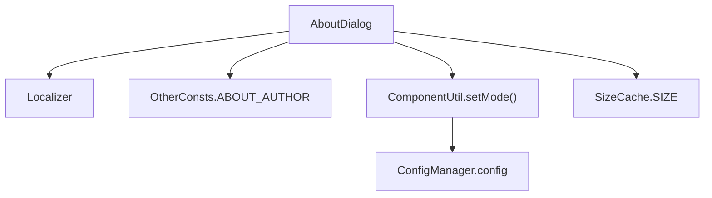
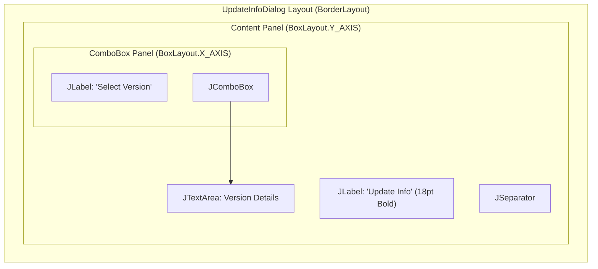
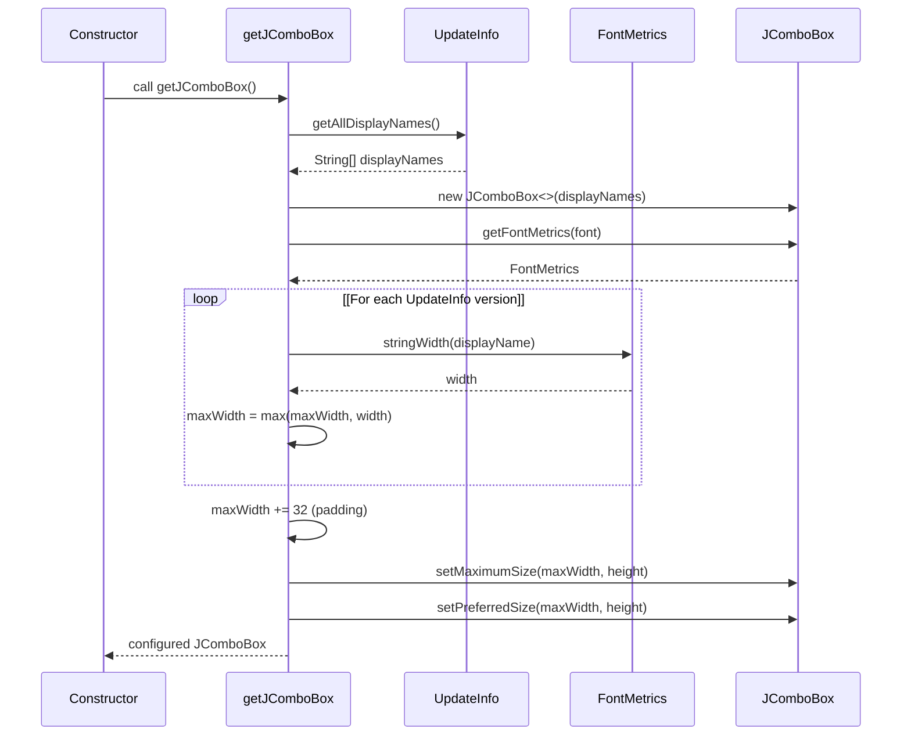
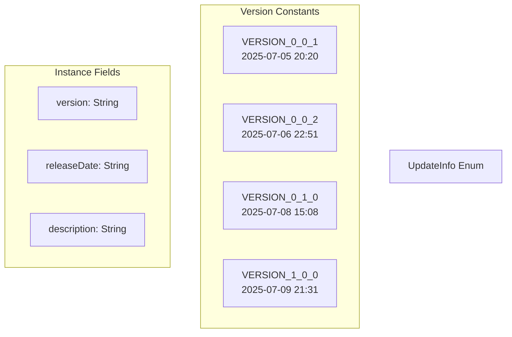
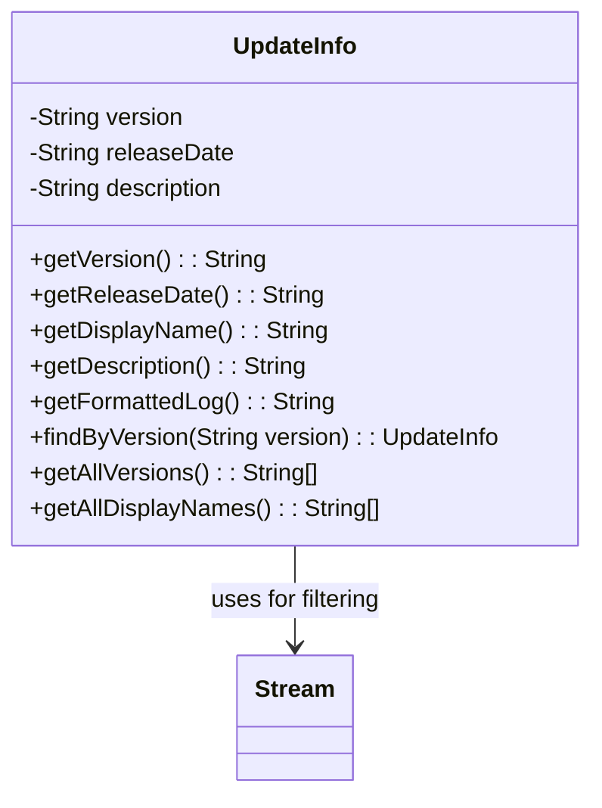
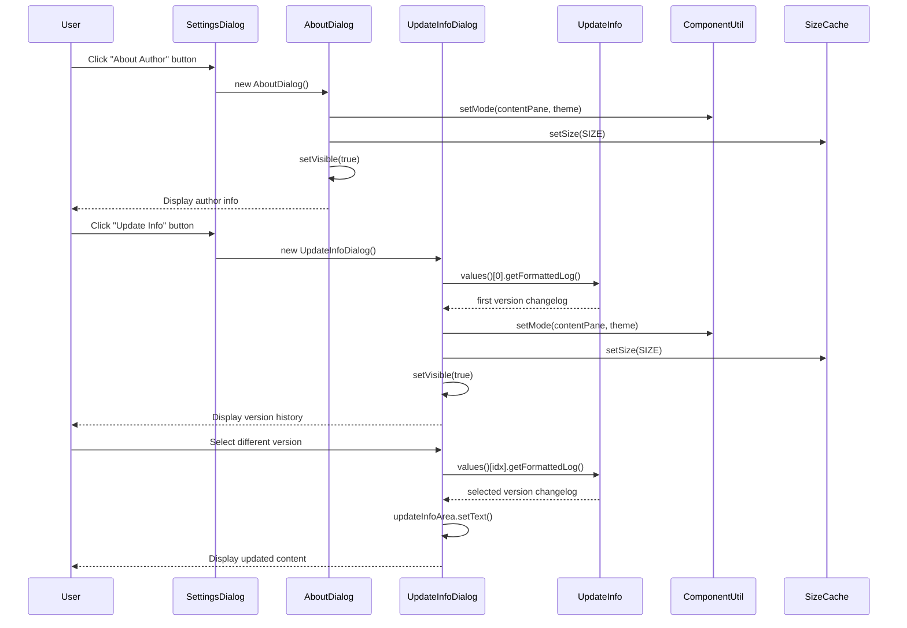

# About and Update Dialogs

> **Relevant source files**
> * [src/io/github/samera2022/mouse_macros/UpdateInfo.java](https://github.com/Samera2022/MouseMacros/blob/6b37ce1e/src/io/github/samera2022/mouse_macros/UpdateInfo.java)
> * [src/io/github/samera2022/mouse_macros/constant/FileConsts.java](https://github.com/Samera2022/MouseMacros/blob/6b37ce1e/src/io/github/samera2022/mouse_macros/constant/FileConsts.java)
> * [src/io/github/samera2022/mouse_macros/constant/OtherConsts.java](https://github.com/Samera2022/MouseMacros/blob/6b37ce1e/src/io/github/samera2022/mouse_macros/constant/OtherConsts.java)
> * [src/io/github/samera2022/mouse_macros/manager/config/FileChooserConfig.java](https://github.com/Samera2022/MouseMacros/blob/6b37ce1e/src/io/github/samera2022/mouse_macros/manager/config/FileChooserConfig.java)
> * [src/io/github/samera2022/mouse_macros/ui/frame/settings/AboutDialog.java](https://github.com/Samera2022/MouseMacros/blob/6b37ce1e/src/io/github/samera2022/mouse_macros/ui/frame/settings/AboutDialog.java)
> * [src/io/github/samera2022/mouse_macros/ui/frame/settings/UpdateInfoDialog.java](https://github.com/Samera2022/MouseMacros/blob/6b37ce1e/src/io/github/samera2022/mouse_macros/ui/frame/settings/UpdateInfoDialog.java)

## Purpose and Scope

This document describes the implementation of two informational dialog windows: `AboutDialog` and `UpdateInfoDialog`. These dialogs display static application information to users—author contact details and version history, respectively. Both dialogs are launched from the Settings interface and follow consistent patterns for theming, sizing, and localization.

For configuration of hotkeys and general settings, see [Settings Dialog](/Samera2022/MouseMacros/7.1-settings-dialog) and [Hotkey Dialog](/Samera2022/MouseMacros/7.2-hotkey-dialog). For the theming infrastructure used by these dialogs, see [Theming System](/Samera2022/MouseMacros/7.4-theming-system).

---

## AboutDialog

### Overview

`AboutDialog` is a modal dialog that displays author information and contact details. It presents a read-only text area containing static content about the application creator.

**Sources:** [src/io/github/samera2022/mouse_macros/ui/frame/settings/AboutDialog.java L1-L46](https://github.com/Samera2022/MouseMacros/blob/6b37ce1e/src/io/github/samera2022/mouse_macros/ui/frame/settings/AboutDialog.java#L1-L46)

### UI Structure

The dialog uses a `BorderLayout` with a single content panel using `BoxLayout.Y_AXIS` for vertical stacking:

| Component | Type | Purpose |
| --- | --- | --- |
| Title Label | `JLabel` | Displays localized "About Author" title with bold 18pt font |
| Separator | `JSeparator` | Visual divider between title and content |
| Content Area | `JTextArea` | Non-editable, word-wrapped text displaying author information |

The layout includes 20-30px padding via `EmptyBorder` and 10px vertical spacing between components.

**Sources:** [src/io/github/samera2022/mouse_macros/ui/frame/settings/AboutDialog.java L14-L39](https://github.com/Samera2022/MouseMacros/blob/6b37ce1e/src/io/github/samera2022/mouse_macros/ui/frame/settings/AboutDialog.java#L14-L39)

### Content Source

The dialog text is sourced from `OtherConsts.ABOUT_AUTHOR`, a static string constant containing:

* Author introduction (Samera2022)
* Contact information (Bilibili UID: 583460263, QQ: 3517085924)
* GitHub repository link ([https://github.com/Samera2022/MouseMacros](https://github.com/Samera2022/MouseMacros))
* Feedback guidelines (GitHub Issues preferred)

**Sources:** [src/io/github/samera2022/mouse_macros/constant/OtherConsts.java L9-L11](https://github.com/Samera2022/MouseMacros/blob/6b37ce1e/src/io/github/samera2022/mouse_macros/constant/OtherConsts.java#L9-L11)

### Theming and Localization



**Diagram: AboutDialog Dependencies**

The dialog integrates with three core systems:

1. **Localization**: Title text retrieved via `Localizer.get("settings.about_author")` [line 15, 22](https://github.com/Samera2022/MouseMacros/blob/6b37ce1e/line 15, 22)
2. **Theming**: Dark/light mode applied via `ComponentUtil.setMode()` based on `config.enableDarkMode` [line 40](https://github.com/Samera2022/MouseMacros/blob/6b37ce1e/line 40)
3. **Size Persistence**: Dialog dimensions set from `SizeCache.SIZE` to remember user preferences [line 43](https://github.com/Samera2022/MouseMacros/blob/6b37ce1e/line 43)

**Sources:** [src/io/github/samera2022/mouse_macros/ui/frame/settings/AboutDialog.java L15-L43](https://github.com/Samera2022/MouseMacros/blob/6b37ce1e/src/io/github/samera2022/mouse_macros/ui/frame/settings/AboutDialog.java#L15-L43)

---

## UpdateInfoDialog

### Overview

`UpdateInfoDialog` is a modal dialog that displays version history and changelogs. Unlike `AboutDialog`, it provides interactive version selection through a dropdown combo box, allowing users to browse different release notes.

**Sources:** [src/io/github/samera2022/mouse_macros/ui/frame/settings/UpdateInfoDialog.java L1-L88](https://github.com/Samera2022/MouseMacros/blob/6b37ce1e/src/io/github/samera2022/mouse_macros/ui/frame/settings/UpdateInfoDialog.java#L1-L88)

### UI Structure



**Diagram: UpdateInfoDialog Component Hierarchy**

The dialog layout consists of:

| Component | Type | Configuration | Purpose |
| --- | --- | --- | --- |
| Title Label | `JLabel` | Font: Bold, 18pt | Displays "Update Info" |
| Separator | `JSeparator` | - | Visual divider |
| Select Label | `JLabel` | Vertical center alignment | "Select Version" prompt |
| Version ComboBox | `JComboBox<String>` | Auto-sized to longest item | Version dropdown selector |
| Content Area | `JTextArea` | Non-editable, word-wrapped, opaque=false | Displays formatted changelog |

**Sources:** [src/io/github/samera2022/mouse_macros/ui/frame/settings/UpdateInfoDialog.java L18-L54](https://github.com/Samera2022/MouseMacros/blob/6b37ce1e/src/io/github/samera2022/mouse_macros/ui/frame/settings/UpdateInfoDialog.java#L18-L54)

### Version Selection Mechanism

The combo box is dynamically sized to accommodate the longest version string:



**Diagram: ComboBox Auto-Sizing Algorithm**

The `getJComboBox()` method [lines 72-87](https://github.com/Samera2022/MouseMacros/blob/6b37ce1e/lines 72-87)

 implements precise width calculation:

1. Retrieve all version display names from `UpdateInfo.getAllDisplayNames()`
2. Iterate through each `UpdateInfo` enum value
3. Calculate string width using `FontMetrics.stringWidth()`
4. Track maximum width across all versions
5. Add 32px padding for dropdown arrow and margins
6. Set both `setMaximumSize()` and `setPreferredSize()` to enforce the calculated width

**Sources:** [src/io/github/samera2022/mouse_macros/ui/frame/settings/UpdateInfoDialog.java L72-L87](https://github.com/Samera2022/MouseMacros/blob/6b37ce1e/src/io/github/samera2022/mouse_macros/ui/frame/settings/UpdateInfoDialog.java#L72-L87)

### Content Update on Selection

When users select a version from the combo box, an `ActionListener` updates the text area:

```python
// Simplified from lines 57-62
infoCombo.addActionListener(e -> {
    int idx = infoCombo.getSelectedIndex();
    if (idx >= 0 && idx < UpdateInfo.values().length) {
        updateInfoArea.setText(UpdateInfo.values()[idx].getFormattedLog());
    }
});
```

The listener validates the selected index and calls `UpdateInfo.getFormattedLog()` to retrieve formatted changelog text.

**Sources:** [src/io/github/samera2022/mouse_macros/ui/frame/settings/UpdateInfoDialog.java L57-L62](https://github.com/Samera2022/MouseMacros/blob/6b37ce1e/src/io/github/samera2022/mouse_macros/ui/frame/settings/UpdateInfoDialog.java#L57-L62)

---

## UpdateInfo Enum

### Structure and Purpose

`UpdateInfo` is an enum that serves as the single source of truth for application version history. With an importance score of 9.38 (highest individual cluster in the codebase), it maintains structured changelogs for all releases.

**Sources:** [src/io/github/samera2022/mouse_macros/UpdateInfo.java L1-L80](https://github.com/Samera2022/MouseMacros/blob/6b37ce1e/src/io/github/samera2022/mouse_macros/UpdateInfo.java#L1-L80)

### Enum Constants



**Diagram: UpdateInfo Enum Structure**

Each enum constant contains three fields:

| Field | Type | Example | Purpose |
| --- | --- | --- | --- |
| `version` | `String` | "0.0.1" | Semantic version number |
| `releaseDate` | `String` | "2025-07-05 20:20" | Release timestamp |
| `description` | `String` | Multi-line changelog | Formatted feature descriptions |

**Sources:** [src/io/github/samera2022/mouse_macros/UpdateInfo.java L7-L41](https://github.com/Samera2022/MouseMacros/blob/6b37ce1e/src/io/github/samera2022/mouse_macros/UpdateInfo.java#L7-L41)

### Version History Content

The enum documents four major releases:

**VERSION_0_0_1** (Initial Release)

* Basic macro recording and playback
* Save/load macro functionality
* Custom hotkey support
* Localization framework
* Adaptive window sizing

**VERSION_0_0_2** (Configuration System)

* Configuration file implementation (`config.cfg`)
* Settings dialog interface
* About Author button
* Update log viewer
* Settings hierarchy (followSystemSettings overrides dark mode and language)

**VERSION_0_1_0** (Architecture Refactor)

* Implemented keyMap configuration
* Restructured project to reduce coupling

**VERSION_1_0_0** (Extended Input Support)

* Middle mouse button support
* Mouse wheel support
* Keyboard input recording
* Custom macro settings
* Macro abort functionality
* File chooser path persistence

**Sources:** [src/io/github/samera2022/mouse_macros/UpdateInfo.java L7-L41](https://github.com/Samera2022/MouseMacros/blob/6b37ce1e/src/io/github/samera2022/mouse_macros/UpdateInfo.java#L7-L41)

### Utility Methods



**Diagram: UpdateInfo API Surface**

The enum provides seven accessor methods:

| Method | Return Type | Purpose |
| --- | --- | --- |
| `getVersion()` | `String` | Returns raw version number |
| `getReleaseDate()` | `String` | Returns release timestamp |
| `getDisplayName()` | `String` | Returns "[date] version" format for UI display |
| `getDescription()` | `String` | Returns raw changelog text |
| `getFormattedLog()` | `String` | Returns "[date] version\ndescription" formatted output |
| `findByVersion(String)` | `UpdateInfo` | Static search by version string, throws if not found |
| `getAllVersions()` | `String[]` | Static method returning all version numbers |
| `getAllDisplayNames()` | `String[]` | Static method returning all display names for combo box |

The static utility methods leverage Java 8 streams for efficient array generation [lines 65-79](https://github.com/Samera2022/MouseMacros/blob/6b37ce1e/lines 65-79)

**Sources:** [src/io/github/samera2022/mouse_macros/UpdateInfo.java L54-L79](https://github.com/Samera2022/MouseMacros/blob/6b37ce1e/src/io/github/samera2022/mouse_macros/UpdateInfo.java#L54-L79)

---

## Integration with Settings System

### Launch Flow



**Diagram: Dialog Launch and Interaction Flow**

Both dialogs are instantiated and displayed from `SettingsDialog` button action listeners. They follow an identical initialization pattern:

1. Constructor creates UI components
2. Apply theme via `ComponentUtil.setMode()` using `config.enableDarkMode`
3. Set size from `SizeCache.SIZE` (shared dimension constant)
4. Set modal to `true` to block parent window interaction
5. Center relative to parent using `setLocationRelativeTo(this)`
6. Make visible

**Sources:** [src/io/github/samera2022/mouse_macros/ui/frame/settings/AboutDialog.java L14-L45](https://github.com/Samera2022/MouseMacros/blob/6b37ce1e/src/io/github/samera2022/mouse_macros/ui/frame/settings/AboutDialog.java#L14-L45)

 [src/io/github/samera2022/mouse_macros/ui/frame/settings/UpdateInfoDialog.java L15-L69](https://github.com/Samera2022/MouseMacros/blob/6b37ce1e/src/io/github/samera2022/mouse_macros/ui/frame/settings/UpdateInfoDialog.java#L15-L69)

### Common Patterns

Both dialog classes share architectural patterns:

| Pattern | Implementation | Purpose |
| --- | --- | --- |
| **Modal Dialogs** | `setModal(true)` | Prevent interaction with parent until closed |
| **BoxLayout** | `BoxLayout.Y_AXIS` for content panel | Vertical component stacking |
| **Empty Borders** | `createEmptyBorder(20, 30, 20, 30)` | Consistent padding |
| **Localized Titles** | `Localizer.get("settings.*")` | Multi-language support |
| **Theme Integration** | `ComponentUtil.setMode(contentPane, theme)` | Dark/light mode consistency |
| **Size Persistence** | `setSize(SizeCache.SIZE)` | Remember user-adjusted dimensions |
| **Dispose on Close** | `setDefaultCloseOperation(DISPOSE_ON_CLOSE)` | Release resources on exit |
| **Centered Positioning** | `setLocationRelativeTo(this)` | Center dialog on screen |

**Sources:** [src/io/github/samera2022/mouse_macros/ui/frame/settings/AboutDialog.java L14-L45](https://github.com/Samera2022/MouseMacros/blob/6b37ce1e/src/io/github/samera2022/mouse_macros/ui/frame/settings/AboutDialog.java#L14-L45)

 [src/io/github/samera2022/mouse_macros/ui/frame/settings/UpdateInfoDialog.java L15-L69](https://github.com/Samera2022/MouseMacros/blob/6b37ce1e/src/io/github/samera2022/mouse_macros/ui/frame/settings/UpdateInfoDialog.java#L15-L69)

### Relationship to SizeCache

The `SizeCache.SIZE` constant provides a shared `Dimension` object for these informational dialogs. This creates consistent sizing across `AboutDialog`, `UpdateInfoDialog`, `HotkeyDialog`, and potentially other settings sub-dialogs. Users can resize any of these dialogs, and the new size persists across application sessions.

**Sources:** [src/io/github/samera2022/mouse_macros/cache/SizeCache.java](https://github.com/Samera2022/MouseMacros/blob/6b37ce1e/src/io/github/samera2022/mouse_macros/cache/SizeCache.java)

 (referenced in both dialog constructors)

---

## Code Entity Reference

### Class Locations

| Class | File Path | Lines |
| --- | --- | --- |
| `AboutDialog` | src/io/github/samera2022/mouse_macros/ui/frame/settings/AboutDialog.java | 13-46 |
| `UpdateInfoDialog` | src/io/github/samera2022/mouse_macros/ui/frame/settings/UpdateInfoDialog.java | 14-88 |
| `UpdateInfo` | src/io/github/samera2022/mouse_macros/UpdateInfo.java | 5-80 |
| `OtherConsts` | src/io/github/samera2022/mouse_macros/constant/OtherConsts.java | 5-16 |

### Key Constants

| Constant | Location | Value/Purpose |
| --- | --- | --- |
| `ABOUT_AUTHOR` | OtherConsts.java:9-11 | Static string containing author contact information |
| `DARK_MODE` | OtherConsts.java:6 | Integer constant `0` for dark theme selection |
| `LIGHT_MODE` | OtherConsts.java:7 | Integer constant `1` for light theme selection |

### Localization Keys

| Key | Purpose | Used By |
| --- | --- | --- |
| `settings.about_author` | Dialog title and heading | AboutDialog |
| `settings.update_info` | Dialog title and heading | UpdateInfoDialog |
| `settings.update_info.select_version` | Version selector label | UpdateInfoDialog |

**Sources:** [src/io/github/samera2022/mouse_macros/ui/frame/settings/AboutDialog.java L15-L22](https://github.com/Samera2022/MouseMacros/blob/6b37ce1e/src/io/github/samera2022/mouse_macros/ui/frame/settings/AboutDialog.java#L15-L22)

 [src/io/github/samera2022/mouse_macros/ui/frame/settings/UpdateInfoDialog.java L16-L34](https://github.com/Samera2022/MouseMacros/blob/6b37ce1e/src/io/github/samera2022/mouse_macros/ui/frame/settings/UpdateInfoDialog.java#L16-L34)