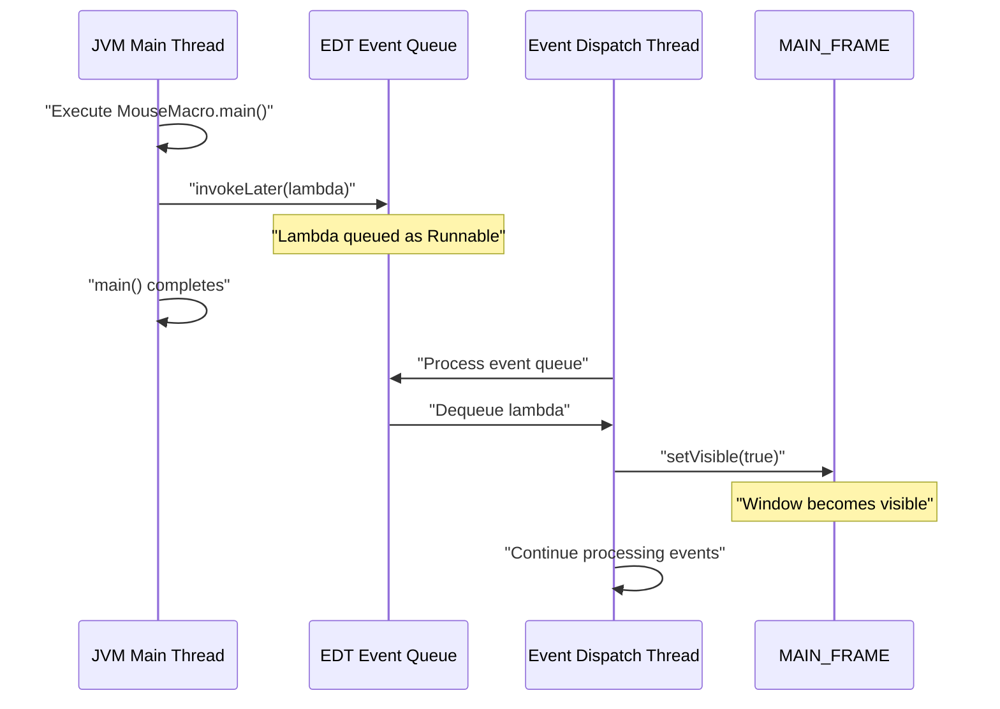
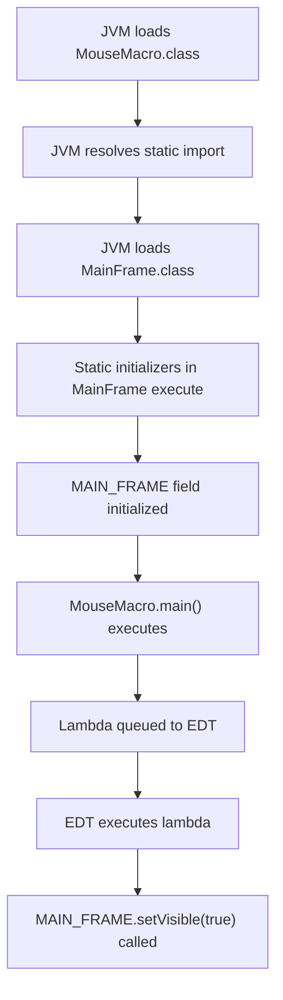
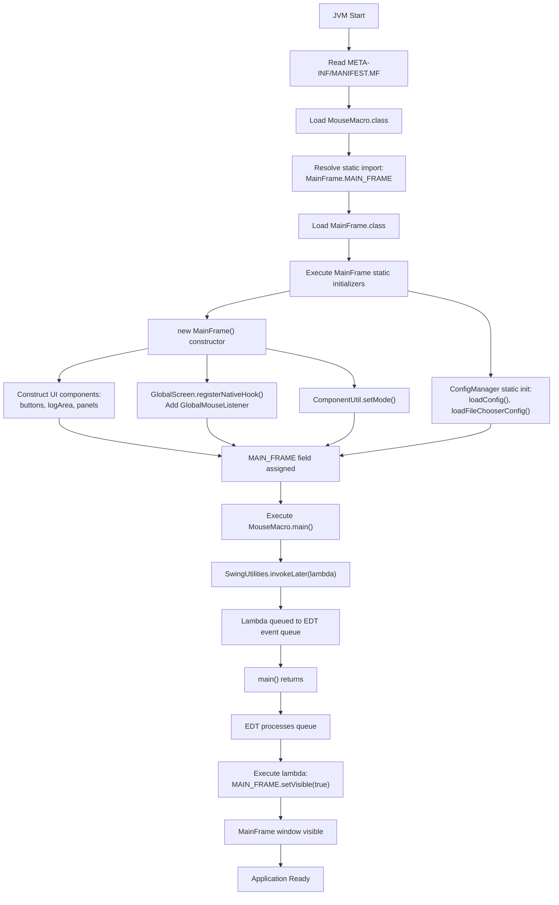
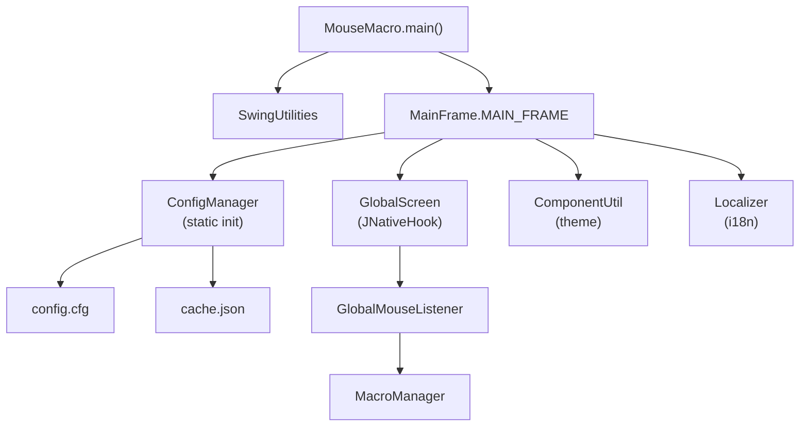

# Application Entry Point

> **Relevant source files**
> * [src/META-INF/MANIFEST.MF](https://github.com/Samera2022/MouseMacros/blob/6b37ce1e/src/META-INF/MANIFEST.MF)
> * [src/io/github/samera2022/mouse_macros/MouseMacro.java](https://github.com/Samera2022/MouseMacros/blob/6b37ce1e/src/io/github/samera2022/mouse_macros/MouseMacro.java)

## Purpose and Scope

This document describes the `MouseMacro` class, which serves as the application entry point for the MouseMacros system. It covers the `main` method implementation, thread safety considerations with Swing's Event Dispatch Thread (EDT), and the JAR manifest configuration.

For detailed information about the MainFrame initialization and UI construction that follows this bootstrap process, see [Main Window (MainFrame)](/Samera2022/MouseMacros/3.2-main-window-(mainframe)). For a comprehensive overview of the entire application architecture, see [Architecture Overview](/Samera2022/MouseMacros/3-architecture-overview).

---

## Entry Point Class Structure

The `MouseMacro` class is the JVM entry point for the application, defined in [src/io/github/samera2022/mouse_macros/MouseMacro.java L1-L11](https://github.com/Samera2022/MouseMacros/blob/6b37ce1e/src/io/github/samera2022/mouse_macros/MouseMacro.java#L1-L11)

### Class Definition

| Aspect | Details |
| --- | --- |
| **Package** | `io.github.samera2022.mouse_macros` |
| **Class Name** | `MouseMacro` |
| **Access Modifier** | `public` |
| **Type** | Standard Java class (not abstract, not final) |
| **Methods** | Single static `main` method |
| **Dependencies** | `javax.swing.SwingUtilities`, `MainFrame` |

The class follows a minimal design pattern where the entry point delegates immediately to the UI framework without performing business logic or heavy initialization.

**Sources:** [src/io/github/samera2022/mouse_macros/MouseMacro.java L1-L11](https://github.com/Samera2022/MouseMacros/blob/6b37ce1e/src/io/github/samera2022/mouse_macros/MouseMacro.java#L1-L11)

---

## Main Method Implementation

The `main` method at [src/io/github/samera2022/mouse_macros/MouseMacro.java L8-L10](https://github.com/Samera2022/MouseMacros/blob/6b37ce1e/src/io/github/samera2022/mouse_macros/MouseMacro.java#L8-L10)

 consists of a single statement:

```
SwingUtilities.invokeLater(() -> MAIN_FRAME.setVisible(true));
```

### Method Signature

```java
public static void main(String[] args)
```

### Parameters

The `String[] args` parameter is declared but **not used** in the current implementation. The application does not process command-line arguments.

**Sources:** [src/io/github/samera2022/mouse_macros/MouseMacro.java L8-L10](https://github.com/Samera2022/MouseMacros/blob/6b37ce1e/src/io/github/samera2022/mouse_macros/MouseMacro.java#L8-L10)

---

## Thread Safety and Event Dispatch Thread

The `SwingUtilities.invokeLater()` call is critical for thread safety in Swing applications. This section explains the threading model.



### Why SwingUtilities.invokeLater?

| Reason | Explanation |
| --- | --- |
| **Thread Safety** | Swing components are not thread-safe. All UI operations must execute on the EDT. |
| **Initialization Order** | By the time the lambda executes, the EDT is fully initialized and ready to process events. |
| **Non-Blocking** | `invokeLater` returns immediately, allowing the main thread to complete without waiting. |
| **Best Practice** | Oracle's Swing documentation recommends this pattern for all Swing application entry points. |

### Alternative: invokeAndWait

The application could have used `SwingUtilities.invokeAndWait()` instead, which blocks until the UI is visible. However, `invokeLater` is preferred because:

* The main thread has no additional work to perform after launching the UI
* Non-blocking behavior prevents potential deadlocks
* The application startup completes faster from the JVM's perspective

**Sources:** [src/io/github/samera2022/mouse_macros/MouseMacro.java L8-L10](https://github.com/Samera2022/MouseMacros/blob/6b37ce1e/src/io/github/samera2022/mouse_macros/MouseMacro.java#L8-L10)

---

## MainFrame Static Field Reference

The `MAIN_FRAME` constant is imported as a static field from `MainFrame`:

```javascript
import static io.github.samera2022.mouse_macros.ui.frame.MainFrame.MAIN_FRAME;
```

### Static Initialization Timing

This import triggers the static initialization of the `MainFrame` class **before** the lambda executes. The sequence is:



### MainFrame Initialization Side Effects

When `MainFrame` is loaded, its static initialization block executes, which performs:

1. **ConfigManager initialization** - Loads `config.cfg` from AppData
2. **MainFrame constructor execution** - Creates the singleton instance
3. **UI component construction** - Builds all buttons, panels, text areas
4. **GlobalScreen hook registration** - Registers JNativeHook listeners
5. **Theme application** - Applies dark or light mode based on configuration

For complete details on this initialization cascade, see [Main Window (MainFrame)](/Samera2022/MouseMacros/3.2-main-window-(mainframe)).

**Sources:** [src/io/github/samera2022/mouse_macros/MouseMacro.java L5](https://github.com/Samera2022/MouseMacros/blob/6b37ce1e/src/io/github/samera2022/mouse_macros/MouseMacro.java#L5-L5)

---

## JAR Manifest Configuration

The `MANIFEST.MF` file at [src/META-INF/MANIFEST.MF L1-L4](https://github.com/Samera2022/MouseMacros/blob/6b37ce1e/src/META-INF/MANIFEST.MF#L1-L4)

 configures the executable JAR:

```
Manifest-Version: 1.0
Main-Class: io.github.samera2022.mouse_macros.MouseMacro
```

### Manifest Fields

| Field | Value | Purpose |
| --- | --- | --- |
| `Manifest-Version` | `1.0` | Specifies the manifest file format version |
| `Main-Class` | `io.github.samera2022.mouse_macros.MouseMacro` | Fully qualified name of the class containing `main()` |

### JAR Execution

When the JAR is executed with `java -jar MouseMacros.jar`, the JVM:

1. Reads `META-INF/MANIFEST.MF`
2. Locates the `Main-Class` attribute
3. Loads `io.github.samera2022.mouse_macros.MouseMacro`
4. Invokes the `main(String[] args)` method

**Sources:** [src/META-INF/MANIFEST.MF L1-L4](https://github.com/Samera2022/MouseMacros/blob/6b37ce1e/src/META-INF/MANIFEST.MF#L1-L4)

---

## Bootstrap Flow Diagram

The following diagram maps the complete bootstrap sequence from JVM invocation to UI visibility, with precise code entity references:



### Critical Path Analysis

| Phase | Duration Characteristics | Blocking Operations |
| --- | --- | --- |
| **Class Loading** | ~10-50ms | File I/O for .class files |
| **Static Initialization** | ~50-200ms | Config loading, JNativeHook registration |
| **UI Construction** | ~20-100ms | Component instantiation, layout calculation |
| **EDT Queueing** | <1ms | Non-blocking |
| **Window Display** | ~10-50ms | Native window creation |

The static initialization phase is the longest, dominated by `GlobalScreen.registerNativeHook()`, which establishes OS-level input hooks.

**Sources:** [src/io/github/samera2022/mouse_macros/MouseMacro.java L1-L11](https://github.com/Samera2022/MouseMacros/blob/6b37ce1e/src/io/github/samera2022/mouse_macros/MouseMacro.java#L1-L11)

 [src/META-INF/MANIFEST.MF L1-L4](https://github.com/Samera2022/MouseMacros/blob/6b37ce1e/src/META-INF/MANIFEST.MF#L1-L4)

---

## Comparison with Alternative Entry Point Patterns

### Pattern: Direct setVisible Call

```java
// NOT USED: Unsafe pattern
public static void main(String[] args) {
    MAIN_FRAME.setVisible(true);  // Wrong thread!
}
```

**Why this is avoided:** The main thread is not the EDT. Direct UI manipulation from the main thread violates Swing's threading model and can cause race conditions.

### Pattern: Inline Frame Construction

```java
// NOT USED: Tight coupling
public static void main(String[] args) {
    SwingUtilities.invokeLater(() -> {
        MainFrame frame = new MainFrame();
        frame.setVisible(true);
    });
}
```

**Why this is avoided:** The singleton pattern with a static field (`MAIN_FRAME`) ensures:

* Single instance throughout application lifetime
* Global accessibility from other components
* Earlier initialization for better startup performance

### Pattern: Command Line Argument Processing

```java
// NOT IMPLEMENTED: No CLI arguments
public static void main(String[] args) {
    if (args.length > 0 && args[0].equals("--help")) {
        System.out.println("Usage...");
        return;
    }
    SwingUtilities.invokeLater(() -> MAIN_FRAME.setVisible(true));
}
```

**Why this is not implemented:** The application is GUI-focused with no command-line interface requirements. Future versions could add CLI support for headless macro playback.

**Sources:** [src/io/github/samera2022/mouse_macros/MouseMacro.java L8-L10](https://github.com/Samera2022/MouseMacros/blob/6b37ce1e/src/io/github/samera2022/mouse_macros/MouseMacro.java#L8-L10)

---

## Error Handling

The `main` method does **not** include explicit exception handling. Error handling relies on:

1. **JVM default behavior** - Uncaught exceptions print stack traces to stderr and terminate the application
2. **Swing's exception handling** - Exceptions on the EDT are caught by Swing and logged
3. **Component-level error handling** - Individual components like `ConfigManager` and `MacroManager` handle their own errors

### Potential Failure Points

| Failure Scenario | Detection | Recovery |
| --- | --- | --- |
| **Config file corruption** | `ConfigManager` catches exceptions during load | Falls back to default configuration |
| **JNativeHook registration failure** | `GlobalScreen.registerNativeHook()` throws `NativeHookException` | Exception propagates; application terminates |
| **UI construction failure** | Exception during `MainFrame` constructor | Application terminates with stack trace |
| **Missing language files** | `Localizer` detects missing resources | Falls back to English; continues operation |

For JNativeHook failures specifically, the application has no recovery strategy and will exit. This is acceptable because the macro recording feature cannot function without OS-level hooks.

**Sources:** [src/io/github/samera2022/mouse_macros/MouseMacro.java L8-L10](https://github.com/Samera2022/MouseMacros/blob/6b37ce1e/src/io/github/samera2022/mouse_macros/MouseMacro.java#L8-L10)

---

## Integration Points

The `MouseMacro` entry point integrates with several other systems:



### Dependency Initialization Order

1. `ConfigManager` (first, via static initializer)
2. `Localizer` (loaded during `MainFrame` constructor)
3. `GlobalScreen` + `GlobalMouseListener` (registered during `MainFrame` constructor)
4. `MacroManager` (instantiated during `MainFrame` constructor)
5. `ComponentUtil` (used to apply theme during `MainFrame` constructor)

This order ensures that configuration is available before any component that needs it.

**Sources:** [src/io/github/samera2022/mouse_macros/MouseMacro.java L1-L11](https://github.com/Samera2022/MouseMacros/blob/6b37ce1e/src/io/github/samera2022/mouse_macros/MouseMacro.java#L1-L11)

---

## Summary

The `MouseMacro` entry point follows a minimalist design:

* **10 lines of code** including package and imports
* **Single responsibility**: Launch the UI on the correct thread
* **Zero business logic**: All initialization delegated to `MainFrame`
* **Thread-safe**: Uses `SwingUtilities.invokeLater()` for EDT safety
* **JAR-ready**: Configured via `MANIFEST.MF` for executable JAR deployment

The simplicity of this entry point demonstrates good separation of concerns, with all application complexity delegated to appropriate subsystems rather than cluttering the bootstrap code.

**Sources:** [src/io/github/samera2022/mouse_macros/MouseMacro.java L1-L11](https://github.com/Samera2022/MouseMacros/blob/6b37ce1e/src/io/github/samera2022/mouse_macros/MouseMacro.java#L1-L11)

 [src/META-INF/MANIFEST.MF L1-L4](https://github.com/Samera2022/MouseMacros/blob/6b37ce1e/src/META-INF/MANIFEST.MF#L1-L4)