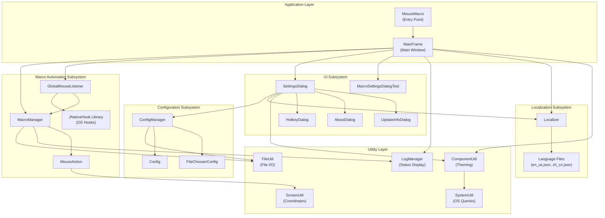
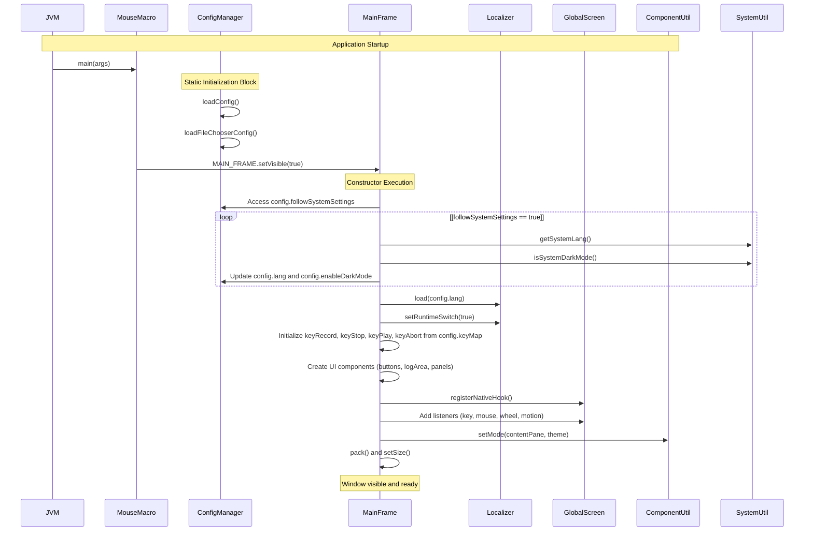
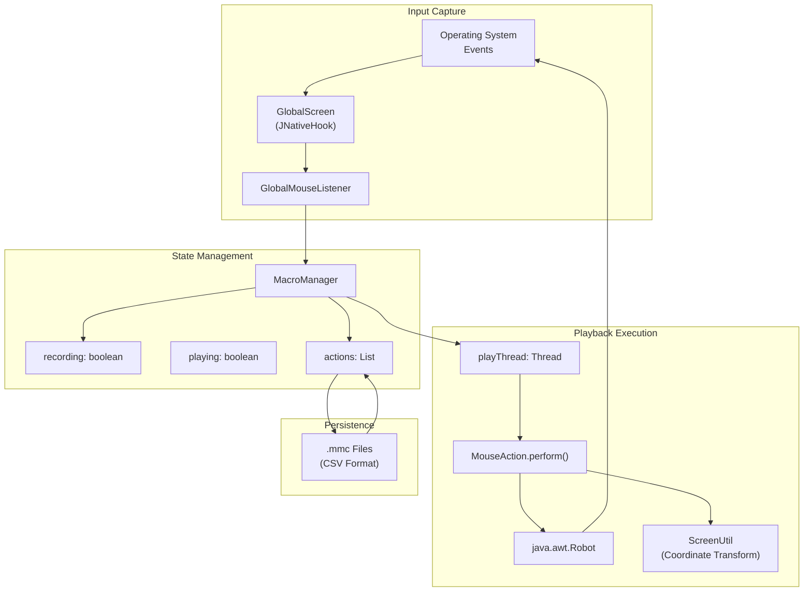
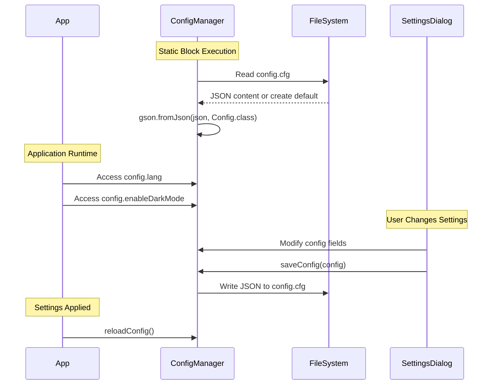
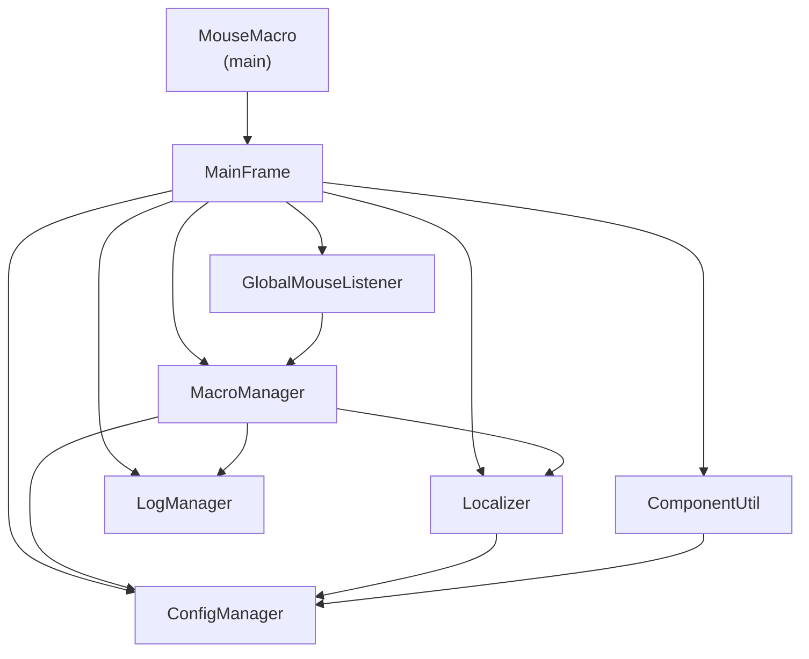

# Architecture Overview

> **Relevant source files**
> * [src/io/github/samera2022/mouse_macros/MouseMacro.java](https://github.com/Samera2022/MouseMacros/blob/6b37ce1e/src/io/github/samera2022/mouse_macros/MouseMacro.java)
> * [src/io/github/samera2022/mouse_macros/manager/ConfigManager.java](https://github.com/Samera2022/MouseMacros/blob/6b37ce1e/src/io/github/samera2022/mouse_macros/manager/ConfigManager.java)
> * [src/io/github/samera2022/mouse_macros/manager/MacroManager.java](https://github.com/Samera2022/MouseMacros/blob/6b37ce1e/src/io/github/samera2022/mouse_macros/manager/MacroManager.java)
> * [src/io/github/samera2022/mouse_macros/ui/frame/MainFrame.java](https://github.com/Samera2022/MouseMacros/blob/6b37ce1e/src/io/github/samera2022/mouse_macros/ui/frame/MainFrame.java)

## Purpose and Scope

This document provides a high-level overview of the MouseMacros application architecture, describing the major subsystems, their relationships, and key design patterns. It explains how components are organized and interact to deliver mouse and keyboard macro recording and playback functionality.

For detailed information about specific subsystems, see:

* Application startup process: [Application Entry Point](/Samera2022/MouseMacros/3.1-application-entry-point)
* Main window implementation: [Main Window (MainFrame)](/Samera2022/MouseMacros/3.2-main-window-(mainframe))
* Macro recording/playback internals: [Macro Recording and Playback System](/Samera2022/MouseMacros/4-macro-recording-and-playback-system)
* Configuration persistence: [Configuration System](/Samera2022/MouseMacros/5-configuration-system)
* Internationalization: [Localization System](/Samera2022/MouseMacros/6-localization-system)
* UI components and theming: [User Interface Components](/Samera2022/MouseMacros/7-user-interface-components)

---

## System Architecture

The MouseMacros application is structured around five primary subsystems that operate together to provide macro automation functionality. The architecture follows a layered approach with clear separation between UI, business logic, persistence, and cross-cutting concerns.

### High-Level Component Diagram



**Sources:** [src/io/github/samera2022/mouse_macros/MouseMacro.java L1-L11](https://github.com/Samera2022/MouseMacros/blob/6b37ce1e/src/io/github/samera2022/mouse_macros/MouseMacro.java#L1-L11)

 [src/io/github/samera2022/mouse_macros/ui/frame/MainFrame.java L1-L194](https://github.com/Samera2022/MouseMacros/blob/6b37ce1e/src/io/github/samera2022/mouse_macros/ui/frame/MainFrame.java#L1-L194)

 [src/io/github/samera2022/mouse_macros/manager/MacroManager.java L1-L202](https://github.com/Samera2022/MouseMacros/blob/6b37ce1e/src/io/github/samera2022/mouse_macros/manager/MacroManager.java#L1-L202)

 [src/io/github/samera2022/mouse_macros/manager/ConfigManager.java L1-L147](https://github.com/Samera2022/MouseMacros/blob/6b37ce1e/src/io/github/samera2022/mouse_macros/manager/ConfigManager.java#L1-L147)

---

## Core Subsystems

The application is organized into five major functional subsystems:

| Subsystem | Primary Classes | Responsibility |
| --- | --- | --- |
| **Macro Automation** | `MacroManager`, `MouseAction`, `GlobalMouseListener` | Record, store, and replay mouse/keyboard events using OS-level hooks |
| **Configuration** | `ConfigManager`, `Config`, `FileChooserConfig` | Persist application settings to `AppData/MouseMacros/` directory |
| **Localization** | `Localizer` + JSON files | Provide multi-language support with runtime language switching |
| **UI Layer** | `MainFrame`, `SettingsDialog`, and specialized dialogs | Present user interface with dark/light theme support |
| **Utilities** | `ComponentUtil`, `ScreenUtil`, `SystemUtil`, `FileUtil`, `LogManager` | Cross-cutting concerns (theming, coordinate transforms, file I/O, logging) |

---

## Application Bootstrap and Initialization

The application follows a specific initialization sequence that sets up all subsystems in the correct order.

### Initialization Sequence Diagram



**Sources:** [src/io/github/samera2022/mouse_macros/MouseMacro.java L8-L10](https://github.com/Samera2022/MouseMacros/blob/6b37ce1e/src/io/github/samera2022/mouse_macros/MouseMacro.java#L8-L10)

 [src/io/github/samera2022/mouse_macros/ui/frame/MainFrame.java L50-L162](https://github.com/Samera2022/MouseMacros/blob/6b37ce1e/src/io/github/samera2022/mouse_macros/ui/frame/MainFrame.java#L50-L162)

 [src/io/github/samera2022/mouse_macros/manager/ConfigManager.java L25-L28](https://github.com/Samera2022/MouseMacros/blob/6b37ce1e/src/io/github/samera2022/mouse_macros/manager/ConfigManager.java#L25-L28)

### Initialization Steps

The bootstrap process occurs in this order:

1. **Static Initialization** ([ConfigManager.java L25-L28](https://github.com/Samera2022/MouseMacros/blob/6b37ce1e/ConfigManager.java#L25-L28) ): The `ConfigManager` static block loads persisted configuration from `AppData/MouseMacros/config.cfg` and `cache.json` before any other code executes.
2. **System Settings Synchronization** ([MainFrame.java L52-L56](https://github.com/Samera2022/MouseMacros/blob/6b37ce1e/MainFrame.java#L52-L56) ): If `config.followSystemSettings` is enabled, the application queries the operating system for language preference and dark mode state via `SystemUtil`.
3. **Localization Setup** ([MainFrame.java L58-L60](https://github.com/Samera2022/MouseMacros/blob/6b37ce1e/MainFrame.java#L58-L60) ): The `Localizer` loads the appropriate language file (e.g., `lang/en_us.json`) based on `config.lang` and enables runtime language switching.
4. **Hotkey Configuration** ([MainFrame.java L62-L71](https://github.com/Samera2022/MouseMacros/blob/6b37ce1e/MainFrame.java#L62-L71) ): Default hotkey bindings (`F2`-`F5`) are overridden with values from `config.keyMap` if present.
5. **UI Construction** ([MainFrame.java L78-L122](https://github.com/Samera2022/MouseMacros/blob/6b37ce1e/MainFrame.java#L78-L122) ): The main window constructs `JButton` components, `JTextArea` for logging, and panel layouts with `GridLayout` and `FlowLayout`.
6. **Global Hook Registration** ([MainFrame.java L142-L150](https://github.com/Samera2022/MouseMacros/blob/6b37ce1e/MainFrame.java#L142-L150) ): The application registers with `GlobalScreen` from JNativeHook library to capture OS-level keyboard and mouse events through `GlobalMouseListener`.
7. **Theme Application** ([MainFrame.java L152](https://github.com/Samera2022/MouseMacros/blob/6b37ce1e/MainFrame.java#L152-L152) ): `ComponentUtil.setMode()` recursively applies dark or light theme colors to all UI components.

**Sources:** [src/io/github/samera2022/mouse_macros/ui/frame/MainFrame.java L50-L162](https://github.com/Samera2022/MouseMacros/blob/6b37ce1e/src/io/github/samera2022/mouse_macros/ui/frame/MainFrame.java#L50-L162)

 [src/io/github/samera2022/mouse_macros/manager/ConfigManager.java L25-L28](https://github.com/Samera2022/MouseMacros/blob/6b37ce1e/src/io/github/samera2022/mouse_macros/manager/ConfigManager.java#L25-L28)

---

## Macro Automation Pipeline

The core value proposition of MouseMacros is the ability to record and replay user input. This subsystem operates through a well-defined pipeline.

### Macro Recording and Playback Flow



**Sources:** [src/io/github/samera2022/mouse_macros/manager/MacroManager.java L21-L201](https://github.com/Samera2022/MouseMacros/blob/6b37ce1e/src/io/github/samera2022/mouse_macros/manager/MacroManager.java#L21-L201)

 [src/io/github/samera2022/mouse_macros/ui/frame/MainFrame.java L147-L150](https://github.com/Samera2022/MouseMacros/blob/6b37ce1e/src/io/github/samera2022/mouse_macros/ui/frame/MainFrame.java#L147-L150)

### Pipeline Stages

#### 1. Event Capture

* **OS Events → JNativeHook**: The JNativeHook library (`com.github.kwhat.jnativehook`) provides OS-level event hooks that capture all keyboard and mouse activity, even when the application is not focused.
* **GlobalScreen → GlobalMouseListener**: The `GlobalMouseListener` class implements `NativeMouseInputListener`, `NativeMouseWheelListener`, and `NativeKeyListener` interfaces to receive callbacks for native events.
* **Event Filtering**: The listener checks `MacroManager.isRecording()` before forwarding events ([GlobalMouseListener implementation]).

**Sources:** [src/io/github/samera2022/mouse_macros/ui/frame/MainFrame.java L142-L150](https://github.com/Samera2022/MouseMacros/blob/6b37ce1e/src/io/github/samera2022/mouse_macros/ui/frame/MainFrame.java#L142-L150)

#### 2. Recording Phase

* **State Management** ([MacroManager.java L22-L23](https://github.com/Samera2022/MouseMacros/blob/6b37ce1e/MacroManager.java#L22-L23) ): The `recording` and `playing` booleans ensure mutually exclusive operations.
* **Action Storage** ([MacroManager.java L88-L91](https://github.com/Samera2022/MouseMacros/blob/6b37ce1e/MacroManager.java#L88-L91) ): Each event becomes a `MouseAction` object stored in the `actions` list with timestamp deltas calculated from `lastTime`.
* **Action Types**: The system records mouse presses/releases, mouse moves, wheel scrolls, and key presses with associated coordinates, button codes, and timing information.

**Sources:** [src/io/github/samera2022/mouse_macros/manager/MacroManager.java L28-L38](https://github.com/Samera2022/MouseMacros/blob/6b37ce1e/src/io/github/samera2022/mouse_macros/manager/MacroManager.java#L28-L38)

#### 3. Persistence

* **File Format**: Macro files use `.mmc` extension with CSV format ([MacroManager.java L122-L126](https://github.com/Samera2022/MouseMacros/blob/6b37ce1e/MacroManager.java#L122-L126) ).
* **Field Structure**: Each line contains: `x,y,type,button,delay,wheelAmount,keyCode,awtKeyCode` (8 fields in current version).
* **Backward Compatibility** ([MacroManager.java L156-L190](https://github.com/Samera2022/MouseMacros/blob/6b37ce1e/MacroManager.java#L156-L190) ): The loader supports 5, 6, 7, or 8-field formats for legacy macro files.
* **Character Encoding**: All file operations use `StandardCharsets.UTF_8` to prevent encoding issues.

**Sources:** [src/io/github/samera2022/mouse_macros/manager/MacroManager.java L107-L131](https://github.com/Samera2022/MouseMacros/blob/6b37ce1e/src/io/github/samera2022/mouse_macros/manager/MacroManager.java#L107-L131)

 [src/io/github/samera2022/mouse_macros/manager/MacroManager.java L133-L200](https://github.com/Samera2022/MouseMacros/blob/6b37ce1e/src/io/github/samera2022/mouse_macros/manager/MacroManager.java#L133-L200)

#### 4. Playback Execution

* **Thread Isolation** ([MacroManager.java L47-L68](https://github.com/Samera2022/MouseMacros/blob/6b37ce1e/MacroManager.java#L47-L68) ): Playback runs in a dedicated `playThread` to avoid blocking the UI thread.
* **Repetition Control** ([MacroManager.java L49](https://github.com/Samera2022/MouseMacros/blob/6b37ce1e/MacroManager.java#L49-L49) ): The outer loop iterates `config.repeatTime` times.
* **Timing Precision** ([MacroManager.java L54](https://github.com/Samera2022/MouseMacros/blob/6b37ce1e/MacroManager.java#L54-L54) ): Each action's `delay` field (milliseconds since previous action) is honored via `Thread.sleep()`.
* **Action Execution**: `MouseAction.perform()` uses `java.awt.Robot` to simulate mouse/keyboard events and `ScreenUtil` for coordinate transformation.
* **Interruption Support** ([MacroManager.java L51-L52](https://github.com/Samera2022/MouseMacros/blob/6b37ce1e/MacroManager.java#L51-L52) ): The playback thread checks `Thread.interrupted()` to support abort operations.

**Sources:** [src/io/github/samera2022/mouse_macros/manager/MacroManager.java L40-L86](https://github.com/Samera2022/MouseMacros/blob/6b37ce1e/src/io/github/samera2022/mouse_macros/manager/MacroManager.java#L40-L86)

---

## Configuration Architecture

Configuration management provides persistence for user preferences across application sessions.

### Configuration Components and Storage

| Component | File Path | Purpose |
| --- | --- | --- |
| `Config` class | `AppData/MouseMacros/config.cfg` | Application settings (language, theme, hotkeys, repeat count) |
| `FileChooserConfig` class | `AppData/MouseMacros/cache.json` | UI state (last used directories for save/load dialogs) |

### Configuration Class Structure

The `Config` class ([ConfigManager.java L30-L38](https://github.com/Samera2022/MouseMacros/blob/6b37ce1e/ConfigManager.java#L30-L38)

) contains these fields:

```
Config
├── followSystemSettings: boolean    // Auto-sync with OS language/theme
├── lang: String                     // Language code (e.g., "en_us", "zh_cn")
├── enableDarkMode: boolean          // Dark theme toggle
├── defaultMmcStoragePath: String    // Default save location for macros
├── keyMap: Map<String, String>      // Custom hotkey bindings
├── enableCustomMacroSettings: boolean
└── repeatTime: int                  // Playback repetition count
```

### Configuration Lifecycle



**Sources:** [src/io/github/samera2022/mouse_macros/manager/ConfigManager.java L18-L66](https://github.com/Samera2022/MouseMacros/blob/6b37ce1e/src/io/github/samera2022/mouse_macros/manager/ConfigManager.java#L18-L66)

The `ConfigManager` uses Gson for JSON serialization ([ConfigManager.java L22](https://github.com/Samera2022/MouseMacros/blob/6b37ce1e/ConfigManager.java#L22-L22)

) and stores files in the user's `AppData/MouseMacros/` directory ([ConfigManager.java L19](https://github.com/Samera2022/MouseMacros/blob/6b37ce1e/ConfigManager.java#L19-L19)

). The static initialization block ([ConfigManager.java L25-L28](https://github.com/Samera2022/MouseMacros/blob/6b37ce1e/ConfigManager.java#L25-L28)

) ensures configuration is loaded before any application code accesses it.

**Sources:** [src/io/github/samera2022/mouse_macros/manager/ConfigManager.java L18-L66](https://github.com/Samera2022/MouseMacros/blob/6b37ce1e/src/io/github/samera2022/mouse_macros/manager/ConfigManager.java#L18-L66)

---

## Design Patterns and Principles

### Singleton Pattern

The application uses static singleton instances for several key components:

* **`MainFrame.MAIN_FRAME`** ([MainFrame.java L39](https://github.com/Samera2022/MouseMacros/blob/6b37ce1e/MainFrame.java#L39-L39) ): Single main window instance
* **`GlobalMouseListener.GML`** ([MainFrame.java L37](https://github.com/Samera2022/MouseMacros/blob/6b37ce1e/MainFrame.java#L37-L37) ): Single global event listener
* **`ConfigManager.config`** ([ConfigManager.java L23](https://github.com/Samera2022/MouseMacros/blob/6b37ce1e/ConfigManager.java#L23-L23) ): Single configuration instance

This pattern ensures shared state and prevents duplicate initialization of expensive resources like global hooks.

### Static Manager Pattern

Both `MacroManager` and `LogManager` expose static methods rather than instance methods:

```
MacroManager
├── static void startRecording()
├── static void stopRecording()
├── static void play()
├── static void abort()
├── static void recordAction(MouseAction)
├── static void saveToFile(Component)
└── static void loadFromFile(Component)
```

This pattern simplifies access from multiple UI components without passing references.

**Sources:** [src/io/github/samera2022/mouse_macros/manager/MacroManager.java L21-L201](https://github.com/Samera2022/MouseMacros/blob/6b37ce1e/src/io/github/samera2022/mouse_macros/manager/MacroManager.java#L21-L201)

### Localization Strategy Pattern

The `Localizer` class implements a fallback strategy:

1. Attempt to retrieve translation from current language file
2. If key not found, attempt retrieval from `en_us.json` (fallback language)
3. If still not found, return the key itself as the display string

This ensures the UI never displays empty strings and provides graceful degradation.

**Sources:** Referenced from diagram analysis

### Observer Pattern (Implicit)

The JNativeHook library implements the observer pattern:

* **Subject**: `GlobalScreen` (OS event source)
* **Observers**: `GlobalMouseListener` implements listener interfaces
* **Registration**: [MainFrame.java L147-L150](https://github.com/Samera2022/MouseMacros/blob/6b37ce1e/MainFrame.java#L147-L150)  adds the listener to receive callbacks

### MVC-Inspired Separation

While not strictly MVC, the architecture separates concerns:

* **Model**: `MacroManager.actions`, `Config`, `MouseAction` data structures
* **View**: `MainFrame`, `SettingsDialog`, and other UI components
* **Controller**: Event handlers in UI classes that delegate to manager classes

**Sources:** [src/io/github/samera2022/mouse_macros/ui/frame/MainFrame.java L128-L135](https://github.com/Samera2022/MouseMacros/blob/6b37ce1e/src/io/github/samera2022/mouse_macros/ui/frame/MainFrame.java#L128-L135)

---

## Dependency Graph

The following diagram shows the primary dependencies between major components:



**Sources:** [src/io/github/samera2022/mouse_macros/MouseMacro.java L1-L11](https://github.com/Samera2022/MouseMacros/blob/6b37ce1e/src/io/github/samera2022/mouse_macros/MouseMacro.java#L1-L11)

 [src/io/github/samera2022/mouse_macros/ui/frame/MainFrame.java L1-L194](https://github.com/Samera2022/MouseMacros/blob/6b37ce1e/src/io/github/samera2022/mouse_macros/ui/frame/MainFrame.java#L1-L194)

 [src/io/github/samera2022/mouse_macros/manager/MacroManager.java L1-L202](https://github.com/Samera2022/MouseMacros/blob/6b37ce1e/src/io/github/samera2022/mouse_macros/manager/MacroManager.java#L1-L202)

### Key Dependency Relationships

| Component | Depends On | Purpose |
| --- | --- | --- |
| `MouseMacro` | `MainFrame` | Application entry point creates and displays main window |
| `MainFrame` | `MacroManager` | UI delegates recording/playback operations |
| `MainFrame` | `GlobalMouseListener` | Registers listener with `GlobalScreen` for event capture |
| `MacroManager` | `LogManager` | Outputs status messages to UI log area |
| `MacroManager` | `Localizer` | Retrieves localized status messages |
| `GlobalMouseListener` | `MacroManager` | Forwards captured events during recording state |
| `Localizer` | `ConfigManager` | Reads `config.lang` to determine which language file to load |
| `ComponentUtil` | `ConfigManager` | Reads `config.enableDarkMode` to apply appropriate theme |

**Sources:** Multiple files referenced above

---

## File Organization

The source code is organized into packages by functional area:

```
src/io/github/samera2022/mouse_macros/
├── MouseMacro.java                 // Entry point
├── Localizer.java                  // Localization utility
├── UpdateInfo.java                 // Version history enum
├── action/
│   └── MouseAction.java            // Event representation
├── constant/
│   ├── ColorConsts.java            // Theme color definitions
│   ├── FileConsts.java             // File filters
│   ├── IconConsts.java             // Custom UI icons
│   └── OtherConsts.java            // Miscellaneous constants
├── listener/
│   └── GlobalMouseListener.java    // JNativeHook event adapter
├── manager/
│   ├── ConfigManager.java          // Configuration persistence
│   ├── LogManager.java             // UI logging
│   ├── MacroManager.java           // Core macro operations
│   └── config/
│       └── FileChooserConfig.java  // File dialog state
├── ui/
│   ├── component/
│   │   ├── CustomFileChooser.java  // Themed file chooser
│   │   └── CustomScrollBarUI.java  // Themed scrollbar
│   └── frame/
│       ├── MainFrame.java          // Main window
│       ├── SettingsDialog.java     // Settings UI
│       └── settings/
│           ├── AboutDialog.java    // About information
│           ├── HotkeyDialog.java   // Hotkey configuration
│           ├── MacroSettingsDialogTest.java
│           └── UpdateInfoDialog.java
└── util/
    ├── ComponentUtil.java          // UI utilities
    ├── FileUtil.java               // File I/O
    ├── OtherUtil.java              // Miscellaneous utilities
    ├── ScreenUtil.java             // Coordinate transforms
    └── SystemUtil.java             // OS queries
```

**Sources:** File structure derived from provided file paths

---

## Thread Architecture

The application uses multiple threads to maintain UI responsiveness:

| Thread | Purpose | Lifecycle |
| --- | --- | --- |
| **EDT (Event Dispatch Thread)** | Swing UI operations | Entire application lifetime |
| **JNativeHook Thread** | Global event capture | Created by `GlobalScreen.registerNativeHook()` |
| **Playback Thread** ([MacroManager.java L47-L68](https://github.com/Samera2022/MouseMacros/blob/6b37ce1e/MacroManager.java#L47-L68) <br> ) | Macro execution | Created per playback operation, terminated after completion or abort |

The playback thread ([MacroManager.java L26](https://github.com/Samera2022/MouseMacros/blob/6b37ce1e/MacroManager.java#L26-L26)

) is stored in a static field to enable interruption via `MacroManager.abort()` ([MacroManager.java L79-L86](https://github.com/Samera2022/MouseMacros/blob/6b37ce1e/MacroManager.java#L79-L86)

).

**Sources:** [src/io/github/samera2022/mouse_macros/manager/MacroManager.java L26](https://github.com/Samera2022/MouseMacros/blob/6b37ce1e/src/io/github/samera2022/mouse_macros/manager/MacroManager.java#L26-L26)

 [src/io/github/samera2022/mouse_macros/manager/MacroManager.java L40-L86](https://github.com/Samera2022/MouseMacros/blob/6b37ce1e/src/io/github/samera2022/mouse_macros/manager/MacroManager.java#L40-L86)

---

## External Dependencies

The application relies on these external libraries:

| Library | Purpose | Integration Point |
| --- | --- | --- |
| **JNativeHook** (`com.github.kwhat.jnativehook`) | OS-level input hooks | `GlobalScreen` in [MainFrame.java L142-L150](https://github.com/Samera2022/MouseMacros/blob/6b37ce1e/MainFrame.java#L142-L150) |
| **Gson** (`com.google.gson`) | JSON serialization/deserialization | `ConfigManager` [ConfigManager.java L3-L22](https://github.com/Samera2022/MouseMacros/blob/6b37ce1e/ConfigManager.java#L3-L22) |
| **Java AWT Robot** | Event simulation during playback | `MouseAction.perform()` |
| **Swing** (`javax.swing`) | UI framework | All UI classes |

**Sources:** [src/io/github/samera2022/mouse_macros/ui/frame/MainFrame.java L3-L6](https://github.com/Samera2022/MouseMacros/blob/6b37ce1e/src/io/github/samera2022/mouse_macros/ui/frame/MainFrame.java#L3-L6)

 [src/io/github/samera2022/mouse_macros/manager/ConfigManager.java L3-L4](https://github.com/Samera2022/MouseMacros/blob/6b37ce1e/src/io/github/samera2022/mouse_macros/manager/ConfigManager.java#L3-L4)

---

## Summary

The MouseMacros architecture demonstrates clear separation of concerns with five distinct subsystems: macro automation (core functionality), configuration (persistence), localization (i18n), UI (presentation), and utilities (cross-cutting concerns). The design emphasizes:

* **Static singletons** for shared state (configuration, managers)
* **Event-driven architecture** using JNativeHook for input capture
* **Thread isolation** for non-blocking playback
* **Fallback strategies** for localization and configuration
* **Modular organization** with packages grouped by functional area

For implementation details of individual subsystems, see the child pages under Architecture Overview.

**Sources:** All files referenced throughout this document