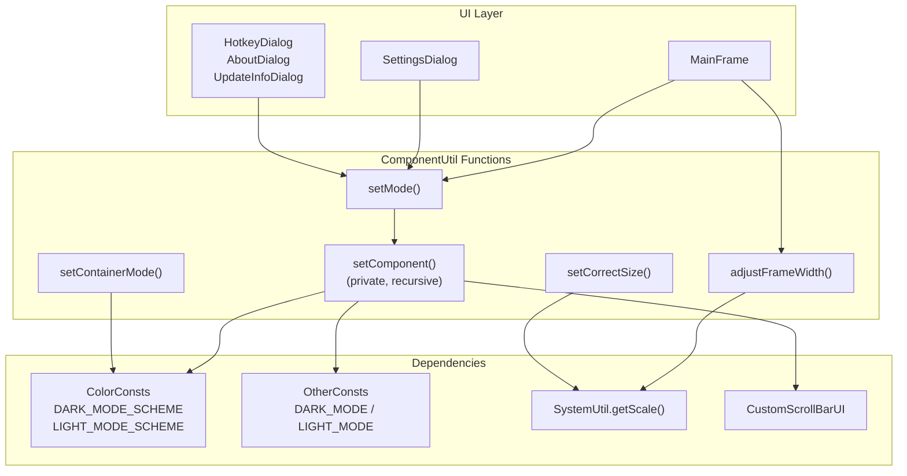
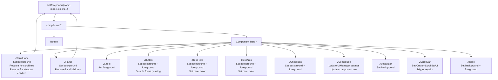
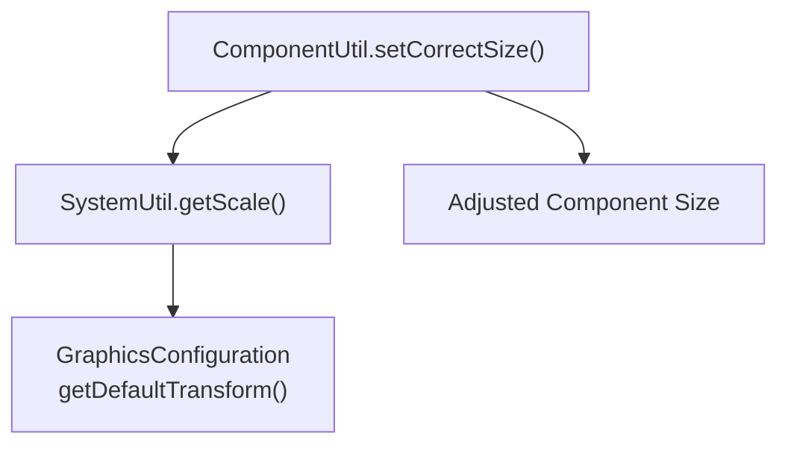

# Component Utilities

> **Relevant source files**
> * [src/io/github/samera2022/mouse_macros/constant/ColorConsts.java](https://github.com/Samera2022/MouseMacros/blob/6b37ce1e/src/io/github/samera2022/mouse_macros/constant/ColorConsts.java)
> * [src/io/github/samera2022/mouse_macros/util/ComponentUtil.java](https://github.com/Samera2022/MouseMacros/blob/6b37ce1e/src/io/github/samera2022/mouse_macros/util/ComponentUtil.java)

## Purpose and Scope

This page documents the `ComponentUtil` class, which provides utility functions for UI component sizing and theme application. `ComponentUtil` is responsible for:

* Automatic frame width adjustment based on button content
* Recursive theme application across component trees
* DPI-aware component sizing
* Direct container theme styling

For information about the broader theming system architecture, color schemes, and custom UI components, see [Theming System](/Samera2022/MouseMacros/7.4-theming-system). For system-level utilities like display scaling detection, see [System Utilities](/Samera2022/MouseMacros/8.2-system-utilities).

**Sources:** [src/io/github/samera2022/mouse_macros/util/ComponentUtil.java L1-L139](https://github.com/Samera2022/MouseMacros/blob/6b37ce1e/src/io/github/samera2022/mouse_macros/util/ComponentUtil.java#L1-L139)

---

## Overview

The `ComponentUtil` class located at [src/io/github/samera2022/mouse_macros/util/ComponentUtil.java](https://github.com/Samera2022/MouseMacros/blob/6b37ce1e/src/io/github/samera2022/mouse_macros/util/ComponentUtil.java)

 is a static utility class that bridges UI component management with the application's theming system. It provides methods that are called from `MainFrame` and various dialog classes to apply consistent styling across the entire UI hierarchy.

The class serves three primary functions:

1. **Layout sizing** - calculating appropriate frame dimensions based on content
2. **Theme application** - recursively styling component trees with dark/light mode colors
3. **DPI scaling** - adjusting component sizes for high-DPI displays



**Diagram: ComponentUtil Architecture and Dependencies**

**Sources:** [src/io/github/samera2022/mouse_macros/util/ComponentUtil.java L1-L139](https://github.com/Samera2022/MouseMacros/blob/6b37ce1e/src/io/github/samera2022/mouse_macros/util/ComponentUtil.java#L1-L139)

---

## Frame Width Adjustment

The `adjustFrameWidth()` method automatically calculates and sets the appropriate width for `MainFrame` based on the preferred sizes of its buttons. This ensures the window is wide enough to display all UI elements without clipping.

### Method Signature

```
public static void adjustFrameWidth(JFrame jf, JButton... btns)
```

### Implementation Details

The method is defined at [src/io/github/samera2022/mouse_macros/util/ComponentUtil.java L15-L22](https://github.com/Samera2022/MouseMacros/blob/6b37ce1e/src/io/github/samera2022/mouse_macros/util/ComponentUtil.java#L15-L22)

 It operates on the assumption that `MainFrame` uses a two-row button layout:

* **Row 1**: First three buttons (indices 0-2) with 40 pixels spacing
* **Row 2**: Next two buttons (indices 3-4) with 20 pixels spacing
* **Padding**: 80 pixels additional margin

The width calculation is: `max(row1Width, row2Width) + padding`

### Usage

Called from `MainFrame` during initialization, after all buttons have been created and localized (when their preferred sizes are finalized):

```sql
MainFrame initialization sequence:
  └─> Create buttons
      └─> Localize button text
          └─> ComponentUtil.adjustFrameWidth(this, button array)
```

This ensures the frame width adapts to different language text lengths automatically.

**Sources:** [src/io/github/samera2022/mouse_macros/util/ComponentUtil.java L15-L22](https://github.com/Samera2022/MouseMacros/blob/6b37ce1e/src/io/github/samera2022/mouse_macros/util/ComponentUtil.java#L15-L22)

---

## Theme Application System

The core functionality of `ComponentUtil` is its recursive theme application system, which applies consistent dark or light mode styling to entire component hierarchies.

### Entry Point: setMode()

The public entry point is `setMode()` at [src/io/github/samera2022/mouse_macros/util/ComponentUtil.java L24-L26](https://github.com/Samera2022/MouseMacros/blob/6b37ce1e/src/io/github/samera2022/mouse_macros/util/ComponentUtil.java#L24-L26)

:

```
public static void setMode(Component root, int mode)
```

**Parameters:**

* `root` - The top-level component (typically a `JFrame` or `JDialog`)
* `mode` - Either `OtherConsts.DARK_MODE` or `OtherConsts.LIGHT_MODE`

This method delegates to the private `setComponent()` method to perform the actual work.

### Color Scheme Selection

The overloaded `setComponent()` method at [src/io/github/samera2022/mouse_macros/util/ComponentUtil.java L28-L44](https://github.com/Samera2022/MouseMacros/blob/6b37ce1e/src/io/github/samera2022/mouse_macros/util/ComponentUtil.java#L28-L44)

 selects the appropriate color scheme based on the `mode` parameter:

| Mode | Color Array | Source |
| --- | --- | --- |
| `DARK_MODE` | `ColorConsts.DARK_MODE_SCHEME` | [src/io/github/samera2022/mouse_macros/constant/ColorConsts.java L21-L22](https://github.com/Samera2022/MouseMacros/blob/6b37ce1e/src/io/github/samera2022/mouse_macros/constant/ColorConsts.java#L21-L22) |
| `LIGHT_MODE` | `ColorConsts.LIGHT_MODE_SCHEME` | [src/io/github/samera2022/mouse_macros/constant/ColorConsts.java L41-L42](https://github.com/Samera2022/MouseMacros/blob/6b37ce1e/src/io/github/samera2022/mouse_macros/constant/ColorConsts.java#L41-L42) |

Each color scheme is a 9-element array containing:

| Index | Purpose | Dark Mode Example | Light Mode Example |
| --- | --- | --- | --- |
| 0 | General background | RGB(40,40,40) | White |
| 1 | General foreground | RGB(220,220,220) | Black |
| 2 | Panel background | RGB(55,55,55) | RGB(245,245,245) |
| 3 | Panel foreground | RGB(220,220,220) | Black |
| 4 | Button background | RGB(60,60,60) | RGB(240,240,240) |
| 5 | Button foreground | RGB(220,220,220) | Black |
| 6 | List background | RGB(45,45,45) | RGB(250,250,250) |
| 7 | List foreground | RGB(220,220,220) | RGB(50,50,50) |
| 8 | Caret color | RGB(180,180,180) | Black |

If the color scheme array length is incorrect (not 9 elements), the system falls back to `DARK_MODE` and prints an error message.

**Sources:** [src/io/github/samera2022/mouse_macros/util/ComponentUtil.java L28-L44](https://github.com/Samera2022/MouseMacros/blob/6b37ce1e/src/io/github/samera2022/mouse_macros/util/ComponentUtil.java#L28-L44)

 [src/io/github/samera2022/mouse_macros/constant/ColorConsts.java L21-L22](https://github.com/Samera2022/MouseMacros/blob/6b37ce1e/src/io/github/samera2022/mouse_macros/constant/ColorConsts.java#L21-L22)

 [src/io/github/samera2022/mouse_macros/constant/ColorConsts.java L41-L42](https://github.com/Samera2022/MouseMacros/blob/6b37ce1e/src/io/github/samera2022/mouse_macros/constant/ColorConsts.java#L41-L42)

### Recursive Component Styling

The core recursive method is at [src/io/github/samera2022/mouse_macros/util/ComponentUtil.java L47-L121](https://github.com/Samera2022/MouseMacros/blob/6b37ce1e/src/io/github/samera2022/mouse_macros/util/ComponentUtil.java#L47-L121)

 This method traverses the entire component tree, applying colors based on component type.



**Diagram: Recursive Component Styling Flow**

### Component Type Handling

The following table documents how each component type is styled:

| Component Type | Lines | Styling Operations |
| --- | --- | --- |
| `JScrollPane` | [55-61](https://github.com/Samera2022/MouseMacros/blob/6b37ce1e/55-61) | Set background to panel background colorRecursively style vertical and horizontal scrollbarsRecursively style all viewport components |
| `JPanel` | [62-66](https://github.com/Samera2022/MouseMacros/blob/6b37ce1e/62-66) | Set background to panel background colorRecursively style all child components (with null check) |
| `JLabel` | [67-69](https://github.com/Samera2022/MouseMacros/blob/6b37ce1e/67-69) | Set foreground to general foreground color |
| `JButton` | [70-73](https://github.com/Samera2022/MouseMacros/blob/6b37ce1e/70-73) | Set `focusPainted` to `false`Set background to button background colorSet foreground to button foreground color |
| `JTextField` | [74-77](https://github.com/Samera2022/MouseMacros/blob/6b37ce1e/74-77) | Set background to panel background colorSet foreground to panel foreground colorSet caret color |
| `JTextArea` | [78-81](https://github.com/Samera2022/MouseMacros/blob/6b37ce1e/78-81) | Set background to panel background colorSet foreground to panel foreground colorSet caret color |
| `JCheckBox` | [82-84](https://github.com/Samera2022/MouseMacros/blob/6b37ce1e/82-84) | Set background to panel background colorSet foreground to panel foreground color |
| `JComboBox` | [85-109](https://github.com/Samera2022/MouseMacros/blob/6b37ce1e/85-109) | Update `UIManager` properties for dropdown stylingCall `SwingUtilities.updateComponentTreeUI()` |
| `JSeparator` | [110-111](https://github.com/Samera2022/MouseMacros/blob/6b37ce1e/110-111) | Set background to panel background color |
| `JScrollBar` | [112-114](https://github.com/Samera2022/MouseMacros/blob/6b37ce1e/112-114) | Set custom UI (`CustomScrollBarUI`)Trigger asynchronous repaint via `SwingUtilities.invokeLater()` |
| `JTable` | [115-119](https://github.com/Samera2022/MouseMacros/blob/6b37ce1e/115-119) | Set background to general background colorSet foreground to general foreground color |

**Sources:** [src/io/github/samera2022/mouse_macros/util/ComponentUtil.java L47-L121](https://github.com/Samera2022/MouseMacros/blob/6b37ce1e/src/io/github/samera2022/mouse_macros/util/ComponentUtil.java#L47-L121)

### Special Handling: JComboBox

`JComboBox` requires special handling because it's a complex compound component. Rather than directly setting colors on the component, the method updates Swing's `UIManager` properties at [src/io/github/samera2022/mouse_macros/util/ComponentUtil.java L85-L109](https://github.com/Samera2022/MouseMacros/blob/6b37ce1e/src/io/github/samera2022/mouse_macros/util/ComponentUtil.java#L85-L109)

:

**Dark Mode UIManager Properties:**

* `ComboBox.disabledBackground` → `DARK_MODE_DISABLED_BACKGROUND`
* `ComboBox.disabledForeground` → `DARK_MODE_DISABLED_FOREGROUND`
* `ComboBox.background` → `DARK_MODE_PANEL_BACKGROUND`
* `ComboBox.foreground` → `DARK_MODE_PANEL_FOREGROUND`
* `ComboBox.selectionBackground` → `DARK_MODE_BACKGROUND`
* `ComboBox.selectionForeground` → `DARK_MODE_FOREGROUND`
* `ComboBox.buttonBackground` → `DARK_MODE_BUTTON_BACKGROUND`
* `ComboBox.buttonShadow` → `DARK_MODE_BUTTON_FOREGROUND`

**Light Mode UIManager Properties:**
Parallel properties using `LIGHT_MODE_*` constants from `ColorConsts`.

After updating `UIManager`, the method calls `SwingUtilities.updateComponentTreeUI(comp)` to force re-rendering with the new properties.

**Sources:** [src/io/github/samera2022/mouse_macros/util/ComponentUtil.java L85-L109](https://github.com/Samera2022/MouseMacros/blob/6b37ce1e/src/io/github/samera2022/mouse_macros/util/ComponentUtil.java#L85-L109)

 [src/io/github/samera2022/mouse_macros/constant/ColorConsts.java L23-L24](https://github.com/Samera2022/MouseMacros/blob/6b37ce1e/src/io/github/samera2022/mouse_macros/constant/ColorConsts.java#L23-L24)

 [src/io/github/samera2022/mouse_macros/constant/ColorConsts.java L43-L44](https://github.com/Samera2022/MouseMacros/blob/6b37ce1e/src/io/github/samera2022/mouse_macros/constant/ColorConsts.java#L43-L44)

### Special Handling: JScrollBar

For `JScrollBar` components, the method installs a custom UI delegate (`CustomScrollBarUI`) at [src/io/github/samera2022/mouse_macros/util/ComponentUtil.java L112-L114](https://github.com/Samera2022/MouseMacros/blob/6b37ce1e/src/io/github/samera2022/mouse_macros/util/ComponentUtil.java#L112-L114)

:

```
((JScrollBar) comp).setUI(new CustomScrollBarUI(mode));
SwingUtilities.invokeLater(comp::repaint);
```

The `CustomScrollBarUI` instance is mode-aware and renders scrollbars with appropriate colors for the current theme. The asynchronous `repaint()` call ensures the scrollbar is visually updated after the UI change.

**Sources:** [src/io/github/samera2022/mouse_macros/util/ComponentUtil.java L112-L114](https://github.com/Samera2022/MouseMacros/blob/6b37ce1e/src/io/github/samera2022/mouse_macros/util/ComponentUtil.java#L112-L114)

---

## DPI-Aware Sizing

The `setCorrectSize()` method provides DPI-aware component sizing at [src/io/github/samera2022/mouse_macros/util/ComponentUtil.java L123-L125](https://github.com/Samera2022/MouseMacros/blob/6b37ce1e/src/io/github/samera2022/mouse_macros/util/ComponentUtil.java#L123-L125)

:

```
public static void setCorrectSize(Component c, int x, int y) {
    c.setSize((int)(x/SystemUtil.getScale()[0]), (int)(y/SystemUtil.getScale()[1]));
}
```

### Scaling Calculation

The method:

1. Queries the current display scaling factors via `SystemUtil.getScale()`, which returns a 2-element double array `[horizontalScale, verticalScale]`
2. Divides the desired pixel dimensions by the scaling factors
3. Sets the component size to the adjusted dimensions

This ensures components appear at the correct physical size on high-DPI displays (e.g., 150%, 200% scaling on Windows).

### Integration with SystemUtil



**Diagram: DPI Scaling Integration**

For detailed information about how `SystemUtil.getScale()` works, see [System Utilities](/Samera2022/MouseMacros/8.2-system-utilities).

**Sources:** [src/io/github/samera2022/mouse_macros/util/ComponentUtil.java L123-L125](https://github.com/Samera2022/MouseMacros/blob/6b37ce1e/src/io/github/samera2022/mouse_macros/util/ComponentUtil.java#L123-L125)

---

## Container Theming

The `setContainerMode()` method provides a lightweight alternative to `setMode()` for simple containers at [src/io/github/samera2022/mouse_macros/util/ComponentUtil.java L127-L138](https://github.com/Samera2022/MouseMacros/blob/6b37ce1e/src/io/github/samera2022/mouse_macros/util/ComponentUtil.java#L127-L138)

:

```
public static void setContainerMode(Container c, int mode)
```

### Functionality

Unlike the recursive `setMode()`, this method only sets the background and foreground colors of the container itself, without traversing child components:

| Mode | Background | Foreground |
| --- | --- | --- |
| `DARK_MODE` | `ColorConsts.DARK_MODE_BACKGROUND` | `ColorConsts.DARK_MODE_FOREGROUND` |
| `LIGHT_MODE` | `ColorConsts.LIGHT_MODE_BACKGROUND` | `ColorConsts.LIGHT_MODE_FOREGROUND` |

### Use Cases

This method is suitable for:

* Containers where child components manage their own styling
* Performance optimization when recursive styling is unnecessary
* Simple containers with minimal or no child components

**Sources:** [src/io/github/samera2022/mouse_macros/util/ComponentUtil.java L127-L138](https://github.com/Samera2022/MouseMacros/blob/6b37ce1e/src/io/github/samera2022/mouse_macros/util/ComponentUtil.java#L127-L138)

 [src/io/github/samera2022/mouse_macros/constant/ColorConsts.java L7-L8](https://github.com/Samera2022/MouseMacros/blob/6b37ce1e/src/io/github/samera2022/mouse_macros/constant/ColorConsts.java#L7-L8)

 [src/io/github/samera2022/mouse_macros/constant/ColorConsts.java L27-L28](https://github.com/Samera2022/MouseMacros/blob/6b37ce1e/src/io/github/samera2022/mouse_macros/constant/ColorConsts.java#L27-L28)

---

## Integration with Other Systems

### Color Constants Integration

`ComponentUtil` is tightly integrated with `ColorConsts` at [src/io/github/samera2022/mouse_macros/constant/ColorConsts.java](https://github.com/Samera2022/MouseMacros/blob/6b37ce1e/src/io/github/samera2022/mouse_macros/constant/ColorConsts.java)

 All color values are sourced from this constants class, ensuring:

* Consistent color definitions across the application
* Centralized color management
* Easy theme modification by updating a single source

The color scheme arrays (`DARK_MODE_SCHEME`, `LIGHT_MODE_SCHEME`) are imported at [src/io/github/samera2022/mouse_macros/util/ComponentUtil.java L11](https://github.com/Samera2022/MouseMacros/blob/6b37ce1e/src/io/github/samera2022/mouse_macros/util/ComponentUtil.java#L11-L11)

:

```javascript
import static io.github.samera2022.mouse_macros.constant.ColorConsts.*;
```

### MainFrame Usage Pattern

The typical usage pattern from `MainFrame`:

```python
MainFrame constructor:
  ├─> Create all UI components
  ├─> Read config.enableDarkMode from ConfigManager
  ├─> Determine theme mode (dark/light)
  ├─> ComponentUtil.adjustFrameWidth(this, buttons)
  └─> ComponentUtil.setMode(contentPane, theme)
```

When the user changes theme via `SettingsDialog`:

```sql
SettingsDialog theme change:
  ├─> Update config.enableDarkMode
  ├─> ConfigManager.saveConfig()
  ├─> For each open window:
  │     └─> ComponentUtil.setMode(contentPane, newTheme)
  └─> Refresh UI
```

### Custom UI Components

`ComponentUtil` creates instances of custom UI components during theme application:

* `CustomScrollBarUI` at [src/io/github/samera2022/mouse_macros/util/ComponentUtil.java L113](https://github.com/Samera2022/MouseMacros/blob/6b37ce1e/src/io/github/samera2022/mouse_macros/util/ComponentUtil.java#L113-L113)

These custom components are part of the theming system documented in [Theming System](/Samera2022/MouseMacros/7.4-theming-system).

**Sources:** [src/io/github/samera2022/mouse_macros/util/ComponentUtil.java L1-L139](https://github.com/Samera2022/MouseMacros/blob/6b37ce1e/src/io/github/samera2022/mouse_macros/util/ComponentUtil.java#L1-L139)

 [src/io/github/samera2022/mouse_macros/constant/ColorConsts.java L1-L45](https://github.com/Samera2022/MouseMacros/blob/6b37ce1e/src/io/github/samera2022/mouse_macros/constant/ColorConsts.java#L1-L45)

---

## Summary

The `ComponentUtil` class provides three essential utilities for the MouseMacros application:

1. **Frame Width Adjustment** - Automatically sizes `MainFrame` based on button content to accommodate different language text lengths
2. **Recursive Theme Application** - Traverses component trees and applies consistent dark/light mode styling to 11+ component types
3. **DPI-Aware Sizing** - Adjusts component dimensions for high-DPI displays using display scaling factors

The class integrates with `ColorConsts` for color definitions, `SystemUtil` for DPI scaling, and `CustomScrollBarUI` for scrollbar theming. It is called from `MainFrame` and dialog classes to maintain visual consistency across the entire application UI.

**Sources:** [src/io/github/samera2022/mouse_macros/util/ComponentUtil.java L1-L139](https://github.com/Samera2022/MouseMacros/blob/6b37ce1e/src/io/github/samera2022/mouse_macros/util/ComponentUtil.java#L1-L139)

 [src/io/github/samera2022/mouse_macros/constant/ColorConsts.java L1-L45](https://github.com/Samera2022/MouseMacros/blob/6b37ce1e/src/io/github/samera2022/mouse_macros/constant/ColorConsts.java#L1-L45)