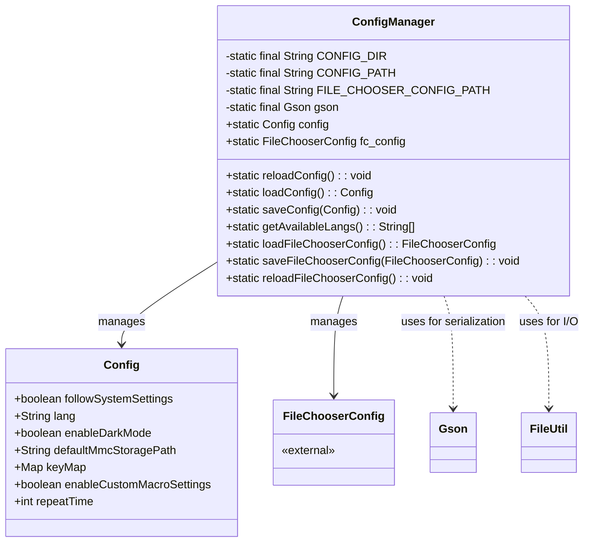
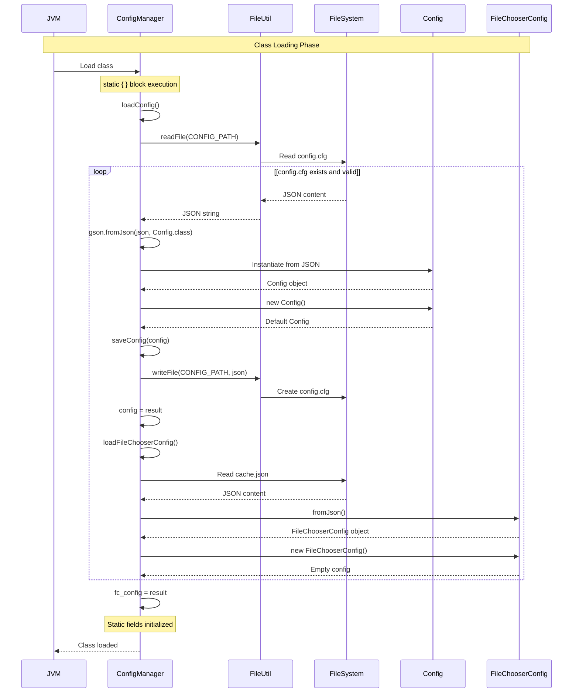
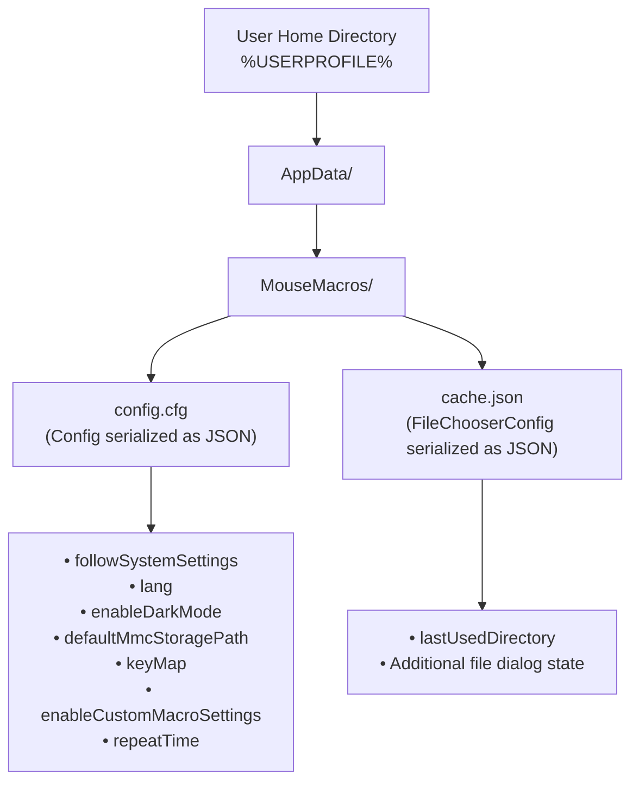
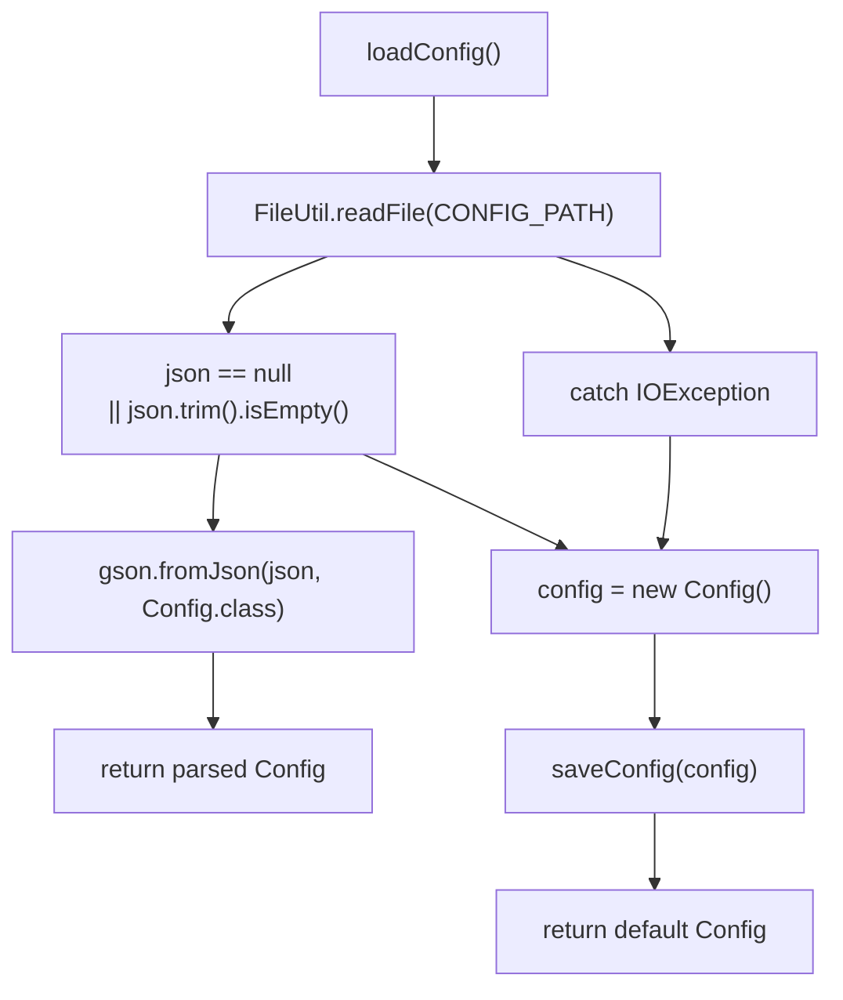
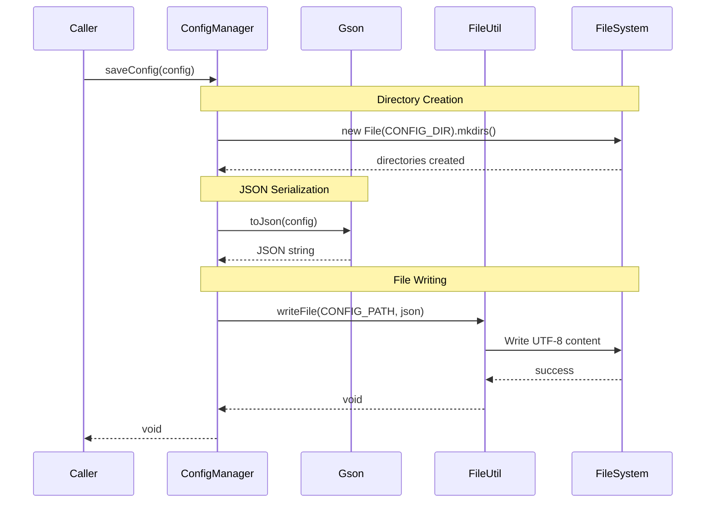
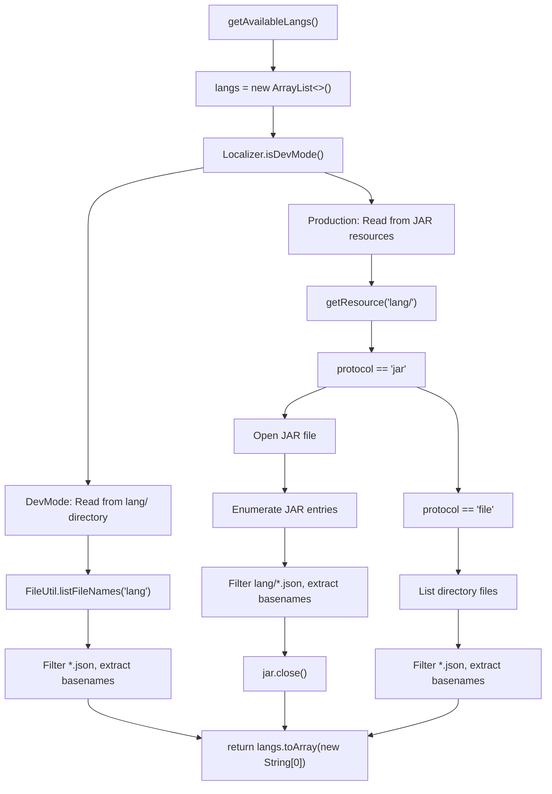
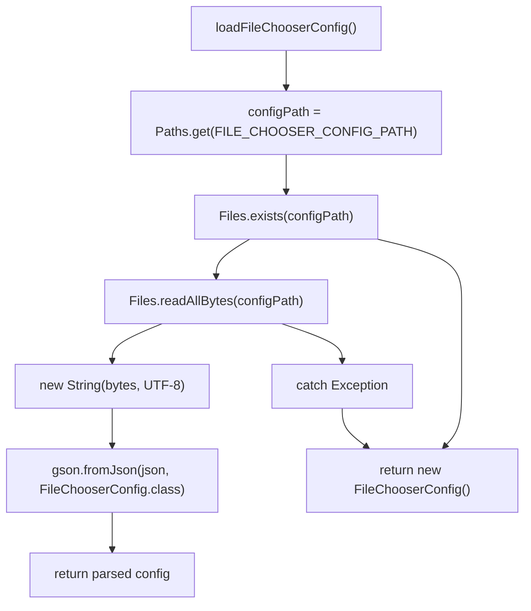
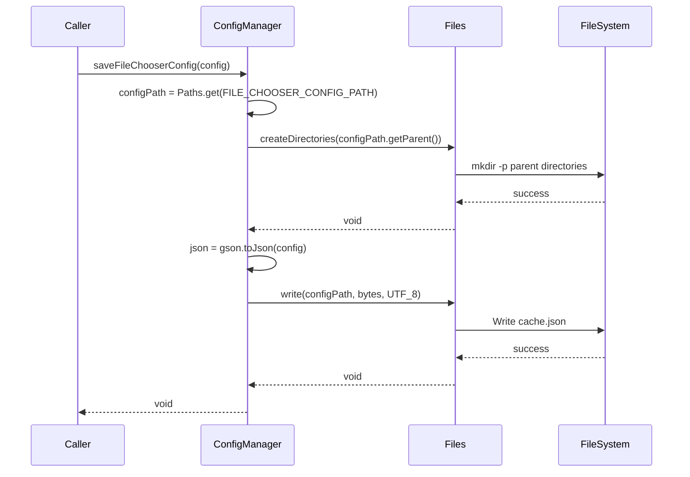
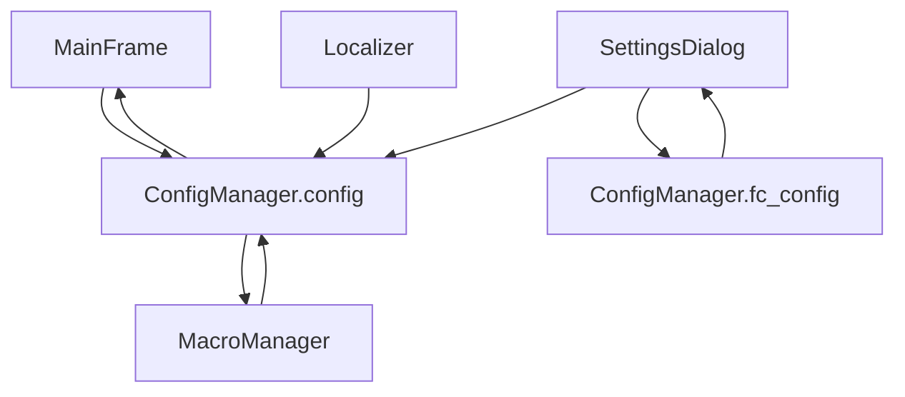
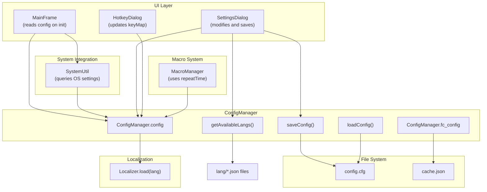

# ConfigManager

> **Relevant source files**
> * [src/io/github/samera2022/mouse_macros/manager/ConfigManager.java](https://github.com/Samera2022/MouseMacros/blob/6b37ce1e/src/io/github/samera2022/mouse_macros/manager/ConfigManager.java)
> * [src/io/github/samera2022/mouse_macros/util/FileUtil.java](https://github.com/Samera2022/MouseMacros/blob/6b37ce1e/src/io/github/samera2022/mouse_macros/util/FileUtil.java)

## Purpose and Scope

This document describes the `ConfigManager` class, which provides centralized configuration management for the MouseMacros application. ConfigManager handles loading, saving, and reloading of application settings stored in persistent files within the user's AppData directory. It manages two distinct configuration domains: general application settings (`Config`) and file chooser UI state (`FileChooserConfig`).

For information about the structure and fields of configuration files, see [Configuration Files](/Samera2022/MouseMacros/5.2-configuration-files). For details on FileChooserConfig specifically, see [File Chooser Configuration](/Samera2022/MouseMacros/5.3-file-chooser-configuration).

**Sources:** [src/io/github/samera2022/mouse_macros/manager/ConfigManager.java L1-L147](https://github.com/Samera2022/MouseMacros/blob/6b37ce1e/src/io/github/samera2022/mouse_macros/manager/ConfigManager.java#L1-L147)

---

## Overview

`ConfigManager` is a static utility class that serves as the single point of access for all configuration operations in the application. It initializes configuration state during class loading via a static initializer block and provides methods for reading and writing configuration to persistent storage.

The class manages configuration for:

* **Application Settings**: User preferences including language, theme, hotkeys, macro behavior, and system integration settings
* **File Chooser State**: Last-used directories for file dialogs to improve user experience
* **Language Detection**: Discovery of available localization files from the `lang/` directory

All configuration files are stored in `%USERPROFILE%/AppData/MouseMacros/` on Windows systems.

**Sources:** [src/io/github/samera2022/mouse_macros/manager/ConfigManager.java L18-L28](https://github.com/Samera2022/MouseMacros/blob/6b37ce1e/src/io/github/samera2022/mouse_macros/manager/ConfigManager.java#L18-L28)

---

## Class Structure

### Static Fields and Constants



**Key Constants:**

| Constant | Value | Purpose |
| --- | --- | --- |
| `CONFIG_DIR` | `%USERPROFILE%/AppData/MouseMacros/` | Configuration directory path |
| `CONFIG_PATH` | `CONFIG_DIR + "config.cfg"` | Main configuration file path |
| `FILE_CHOOSER_CONFIG_PATH` | `CONFIG_DIR + "cache.json"` | File chooser state file path |
| `gson` | `new Gson()` | JSON serialization engine |

**Sources:** [src/io/github/samera2022/mouse_macros/manager/ConfigManager.java L18-L22](https://github.com/Samera2022/MouseMacros/blob/6b37ce1e/src/io/github/samera2022/mouse_macros/manager/ConfigManager.java#L18-L22)

---

### Config Inner Class

The `Config` class is a simple data container (POJO) representing application-wide settings:

| Field | Type | Default Value | Purpose |
| --- | --- | --- | --- |
| `followSystemSettings` | `boolean` | `true` | Enable automatic synchronization with OS language and dark mode settings |
| `lang` | `String` | `"zh_cn"` | Current localization language code |
| `enableDarkMode` | `boolean` | `false` | Dark theme toggle |
| `defaultMmcStoragePath` | `String` | `""` | Default directory for saving/loading `.mmc` macro files |
| `keyMap` | `Map<String, String>` | Empty | Hotkey bindings mapping action names to key codes |
| `enableCustomMacroSettings` | `boolean` | `false` | Toggle for per-macro configuration options |
| `repeatTime` | `int` | `1` | Number of times to repeat macro playback |

**Sources:** [src/io/github/samera2022/mouse_macros/manager/ConfigManager.java L30-L38](https://github.com/Samera2022/MouseMacros/blob/6b37ce1e/src/io/github/samera2022/mouse_macros/manager/ConfigManager.java#L30-L38)

---

### Static Initialization Sequence



The static initializer block [ConfigManager.java L25-L28](https://github.com/Samera2022/MouseMacros/blob/6b37ce1e/ConfigManager.java#L25-L28)

 executes during class loading, ensuring that `config` and `fc_config` are available before any application code accesses them. This guarantees that configuration is loaded exactly once during application startup.

**Sources:** [src/io/github/samera2022/mouse_macros/manager/ConfigManager.java L25-L28](https://github.com/Samera2022/MouseMacros/blob/6b37ce1e/src/io/github/samera2022/mouse_macros/manager/ConfigManager.java#L25-L28)

 [src/io/github/samera2022/mouse_macros/manager/ConfigManager.java L43-L53](https://github.com/Samera2022/MouseMacros/blob/6b37ce1e/src/io/github/samera2022/mouse_macros/manager/ConfigManager.java#L43-L53)

 [src/io/github/samera2022/mouse_macros/manager/ConfigManager.java L117-L128](https://github.com/Samera2022/MouseMacros/blob/6b37ce1e/src/io/github/samera2022/mouse_macros/manager/ConfigManager.java#L117-L128)

---

## Configuration Persistence

### File System Structure



The `CONFIG_DIR` constant is constructed dynamically using `System.getProperty("user.home")` with path manipulation to ensure cross-platform compatibility [ConfigManager.java L19](https://github.com/Samera2022/MouseMacros/blob/6b37ce1e/ConfigManager.java#L19-L19)

:

```
"D" + System.getProperty("user.home").substring(1).replace('\\','/')
```

This construction normalizes Windows paths to use forward slashes while preserving the drive letter.

**Sources:** [src/io/github/samera2022/mouse_macros/manager/ConfigManager.java L19-L21](https://github.com/Samera2022/MouseMacros/blob/6b37ce1e/src/io/github/samera2022/mouse_macros/manager/ConfigManager.java#L19-L21)

---

### Loading Configuration

The `loadConfig()` method implements a robust loading strategy with automatic fallback to default configuration:



**Implementation Details:**

1. **File Reading**: Delegates to `FileUtil.readFile()` [ConfigManager.java L45](https://github.com/Samera2022/MouseMacros/blob/6b37ce1e/ConfigManager.java#L45-L45)  which returns `null` if the file doesn't exist
2. **Empty Check**: Returns a new `Config` if the file is empty or contains only whitespace [ConfigManager.java L46](https://github.com/Samera2022/MouseMacros/blob/6b37ce1e/ConfigManager.java#L46-L46)
3. **JSON Deserialization**: Uses Gson to parse JSON into a `Config` object [ConfigManager.java L47](https://github.com/Samera2022/MouseMacros/blob/6b37ce1e/ConfigManager.java#L47-L47)
4. **Exception Handling**: If an `IOException` occurs (e.g., parsing error), creates and saves a default configuration [ConfigManager.java L48-L52](https://github.com/Samera2022/MouseMacros/blob/6b37ce1e/ConfigManager.java#L48-L52)

The method is invoked:

* During static initialization [ConfigManager.java L26](https://github.com/Samera2022/MouseMacros/blob/6b37ce1e/ConfigManager.java#L26-L26)
* Explicitly via `reloadConfig()` when configuration needs to be refreshed from disk [ConfigManager.java L40](https://github.com/Samera2022/MouseMacros/blob/6b37ce1e/ConfigManager.java#L40-L40)

**Sources:** [src/io/github/samera2022/mouse_macros/manager/ConfigManager.java L43-L53](https://github.com/Samera2022/MouseMacros/blob/6b37ce1e/src/io/github/samera2022/mouse_macros/manager/ConfigManager.java#L43-L53)

 [src/io/github/samera2022/mouse_macros/util/FileUtil.java L8-L19](https://github.com/Samera2022/MouseMacros/blob/6b37ce1e/src/io/github/samera2022/mouse_macros/util/FileUtil.java#L8-L19)

---

### Saving Configuration

The `saveConfig(Config)` method persists configuration to disk:



**Key Operations:**

1. **Directory Guarantee**: Ensures `CONFIG_DIR` exists by calling `mkdirs()` [ConfigManager.java L59-L60](https://github.com/Samera2022/MouseMacros/blob/6b37ce1e/ConfigManager.java#L59-L60)
2. **Serialization**: Converts `Config` object to JSON string using Gson [ConfigManager.java L61](https://github.com/Samera2022/MouseMacros/blob/6b37ce1e/ConfigManager.java#L61-L61)
3. **File Write**: Delegates to `FileUtil.writeFile()` with UTF-8 encoding [ConfigManager.java L62](https://github.com/Samera2022/MouseMacros/blob/6b37ce1e/ConfigManager.java#L62-L62)
4. **Error Handling**: Prints stack trace on `IOException` but does not throw [ConfigManager.java L63-L65](https://github.com/Samera2022/MouseMacros/blob/6b37ce1e/ConfigManager.java#L63-L65)

**Sources:** [src/io/github/samera2022/mouse_macros/manager/ConfigManager.java L56-L66](https://github.com/Samera2022/MouseMacros/blob/6b37ce1e/src/io/github/samera2022/mouse_macros/manager/ConfigManager.java#L56-L66)

 [src/io/github/samera2022/mouse_macros/util/FileUtil.java L22-L29](https://github.com/Samera2022/MouseMacros/blob/6b37ce1e/src/io/github/samera2022/mouse_macros/util/FileUtil.java#L22-L29)

---

## Language Detection

### getAvailableLangs() Method

The `getAvailableLangs()` method discovers available localization files from the `lang/` directory, supporting both development (file system) and production (JAR) environments:



**Implementation Modes:**

| Mode | Detection | Implementation | Lines |
| --- | --- | --- | --- |
| **Development** | `Localizer.isDevMode() == true` | Uses `FileUtil.listFileNames("lang")` to read from file system | [72-81](https://github.com/Samera2022/MouseMacros/blob/6b37ce1e/72-81) |
| **Production (JAR)** | Resource URL protocol is `"jar"` | Opens JAR file, enumerates entries matching `lang/*.json` | [84-96](https://github.com/Samera2022/MouseMacros/blob/6b37ce1e/84-96) |
| **Production (file)** | Resource URL protocol is `"file"` | Uses `File.listFiles()` with `.json` filter | [97-109](https://github.com/Samera2022/MouseMacros/blob/6b37ce1e/97-109) |

**Filename Processing:**

All modes extract the base filename without extension:

* Input: `"zh_cn.json"`
* Output: `"zh_cn"`

This is accomplished by finding the last `.` character and taking the substring before it [ConfigManager.java L76-L106](https://github.com/Samera2022/MouseMacros/blob/6b37ce1e/ConfigManager.java#L76-L106)

**Sources:** [src/io/github/samera2022/mouse_macros/manager/ConfigManager.java L69-L114](https://github.com/Samera2022/MouseMacros/blob/6b37ce1e/src/io/github/samera2022/mouse_macros/manager/ConfigManager.java#L69-L114)

 [src/io/github/samera2022/mouse_macros/util/FileUtil.java L32-L42](https://github.com/Samera2022/MouseMacros/blob/6b37ce1e/src/io/github/samera2022/mouse_macros/util/FileUtil.java#L32-L42)

---

## FileChooserConfig Management

`ConfigManager` provides parallel management methods for `FileChooserConfig`, which stores UI state for file dialogs:

### Loading FileChooserConfig



**Key Differences from Config Loading:**

* Uses Java NIO `Files` API instead of `FileUtil` [ConfigManager.java L119-L122](https://github.com/Samera2022/MouseMacros/blob/6b37ce1e/ConfigManager.java#L119-L122)
* Explicit existence check with `Files.exists()` [ConfigManager.java L120](https://github.com/Samera2022/MouseMacros/blob/6b37ce1e/ConfigManager.java#L120-L120)
* Returns empty `FileChooserConfig` on any exception, without saving [ConfigManager.java L124-L127](https://github.com/Samera2022/MouseMacros/blob/6b37ce1e/ConfigManager.java#L124-L127)

**Sources:** [src/io/github/samera2022/mouse_macros/manager/ConfigManager.java L117-L128](https://github.com/Samera2022/MouseMacros/blob/6b37ce1e/src/io/github/samera2022/mouse_macros/manager/ConfigManager.java#L117-L128)

---

### Saving FileChooserConfig

The `saveFileChooserConfig(FileChooserConfig)` method mirrors the general config save pattern:



**Implementation Notes:**

* Uses `Files.createDirectories()` to ensure parent directory exists [ConfigManager.java L138](https://github.com/Samera2022/MouseMacros/blob/6b37ce1e/ConfigManager.java#L138-L138)
* Writes JSON bytes directly with `Files.write()` [ConfigManager.java L140-L141](https://github.com/Samera2022/MouseMacros/blob/6b37ce1e/ConfigManager.java#L140-L141)
* Logs errors to `System.err` but does not throw [ConfigManager.java L142-L144](https://github.com/Samera2022/MouseMacros/blob/6b37ce1e/ConfigManager.java#L142-L144)

**Reload Method:**

The `reloadFileChooserConfig()` method [ConfigManager.java L130-L132](https://github.com/Samera2022/MouseMacros/blob/6b37ce1e/ConfigManager.java#L130-L132)

 provides a simple wrapper that reloads `fc_config` from disk, similar to `reloadConfig()`.

**Sources:** [src/io/github/samera2022/mouse_macros/manager/ConfigManager.java L135-L145](https://github.com/Samera2022/MouseMacros/blob/6b37ce1e/src/io/github/samera2022/mouse_macros/manager/ConfigManager.java#L135-L145)

 [src/io/github/samera2022/mouse_macros/manager/ConfigManager.java L130-L132](https://github.com/Samera2022/MouseMacros/blob/6b37ce1e/src/io/github/samera2022/mouse_macros/manager/ConfigManager.java#L130-L132)

---

## Usage Patterns

### Static Access Pattern

All components access configuration via static fields:



**Common Access Patterns:**

1. **Reading Configuration:** ``` String language = ConfigManager.config.lang; boolean darkMode = ConfigManager.config.enableDarkMode; Map<String, String> hotkeys = ConfigManager.config.keyMap; ```
2. **Modifying and Saving:** ``` ConfigManager.config.enableDarkMode = true; ConfigManager.saveConfig(ConfigManager.config); ```
3. **Reloading After External Changes:** ``` ConfigManager.reloadConfig(); // ConfigManager.config now reflects disk state ```

**Sources:** [src/io/github/samera2022/mouse_macros/manager/ConfigManager.java L23-L24](https://github.com/Samera2022/MouseMacros/blob/6b37ce1e/src/io/github/samera2022/mouse_macros/manager/ConfigManager.java#L23-L24)

---

### Integration Points



**Key Integration Scenarios:**

1. **Application Startup** ([see Architecture Overview](/Samera2022/MouseMacros/3-architecture-overview)): * `ConfigManager` static block loads configuration * `MainFrame` reads `config.lang` and calls `Localizer.load()` * If `config.followSystemSettings == true`, `SystemUtil` updates language and dark mode from OS
2. **Settings Modification**: * User opens `SettingsDialog` * Dialog modifies `ConfigManager.config` fields * Dialog calls `ConfigManager.saveConfig()` on apply/save * UI components reload to reflect new settings
3. **Language Selection**: * `SettingsDialog` calls `ConfigManager.getAvailableLangs()` to populate language dropdown * User selects language * `config.lang` is updated and saved * `Localizer.load()` is called with new language * All UI components refresh text via `Localizer.get(key)` calls

**Sources:** [src/io/github/samera2022/mouse_macros/manager/ConfigManager.java L1-L147](https://github.com/Samera2022/MouseMacros/blob/6b37ce1e/src/io/github/samera2022/mouse_macros/manager/ConfigManager.java#L1-L147)

---

## Summary

`ConfigManager` provides a clean, static API for configuration management with the following characteristics:

| Feature | Implementation | Benefit |
| --- | --- | --- |
| **Static Initialization** | Loads config during class loading | Configuration available immediately at startup |
| **Dual Configuration Domains** | Separate `Config` and `FileChooserConfig` | Clear separation of application vs. UI state |
| **Automatic Fallback** | Creates default config on load failure | Application never fails to start due to config issues |
| **Environment Awareness** | Detects development vs. production mode | Supports both IDE development and JAR deployment |
| **Language Discovery** | Scans `lang/` directory dynamically | New languages can be added without code changes |
| **UTF-8 Encoding** | All file operations use UTF-8 | Supports international characters in configuration |
| **Directory Management** | Automatically creates parent directories | No manual setup required |

The class serves as a critical foundation for the entire application, enabling persistent user preferences and supporting the localization, theming, and macro systems.

**Sources:** [src/io/github/samera2022/mouse_macros/manager/ConfigManager.java L1-L147](https://github.com/Samera2022/MouseMacros/blob/6b37ce1e/src/io/github/samera2022/mouse_macros/manager/ConfigManager.java#L1-L147)

 [src/io/github/samera2022/mouse_macros/util/FileUtil.java L1-L44](https://github.com/Samera2022/MouseMacros/blob/6b37ce1e/src/io/github/samera2022/mouse_macros/util/FileUtil.java#L1-L44)