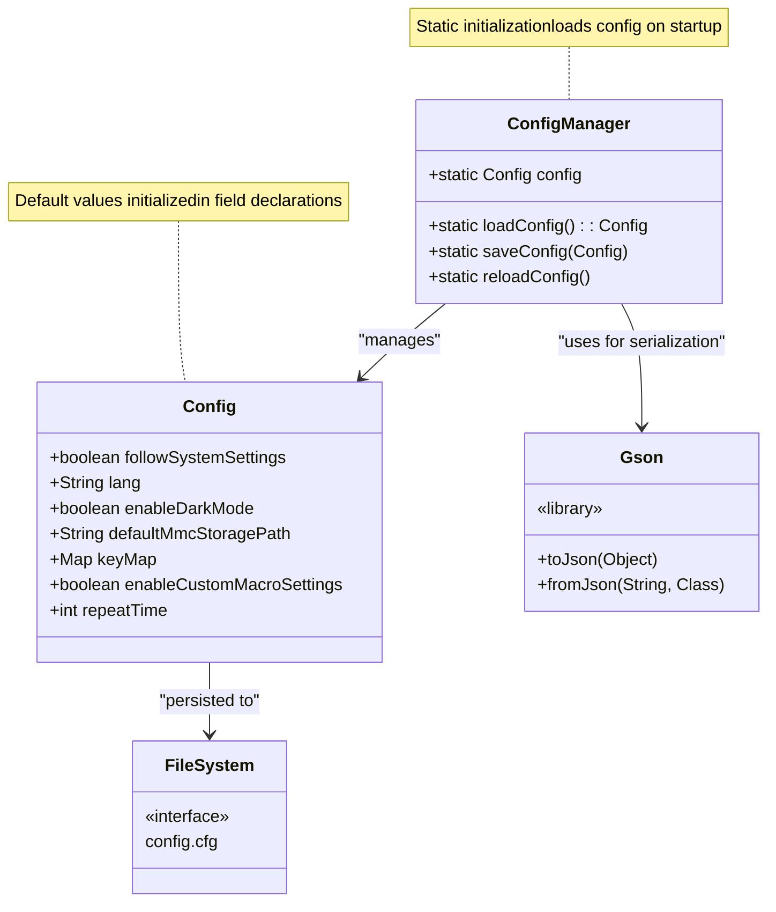
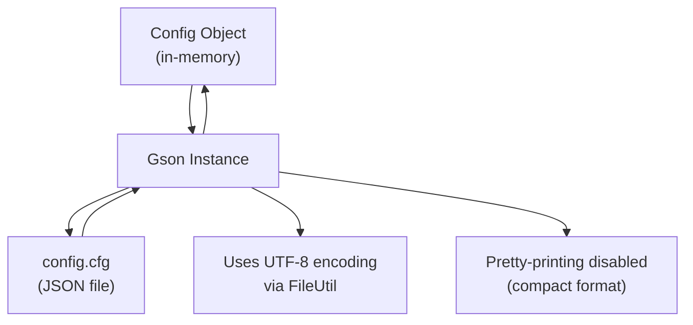
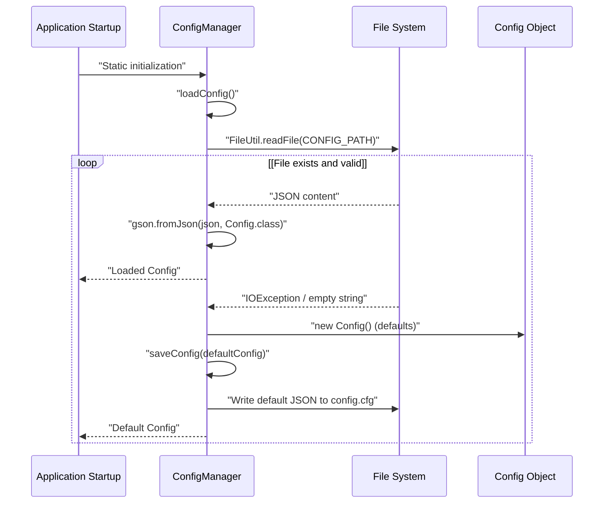
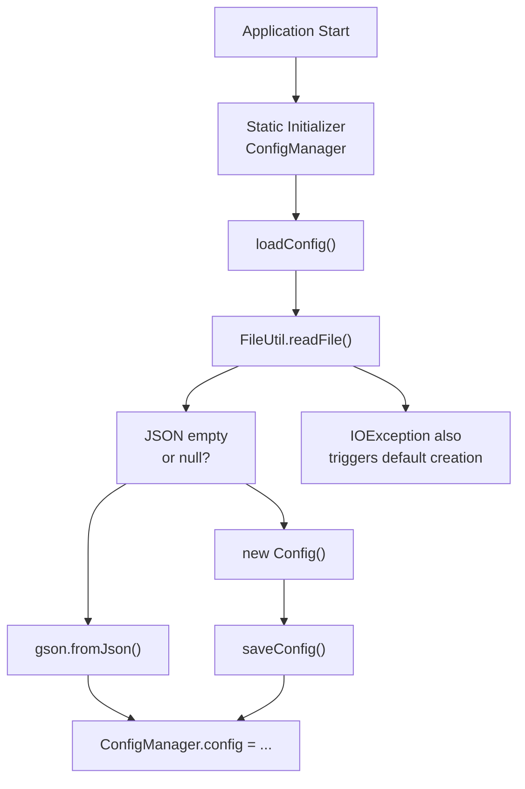
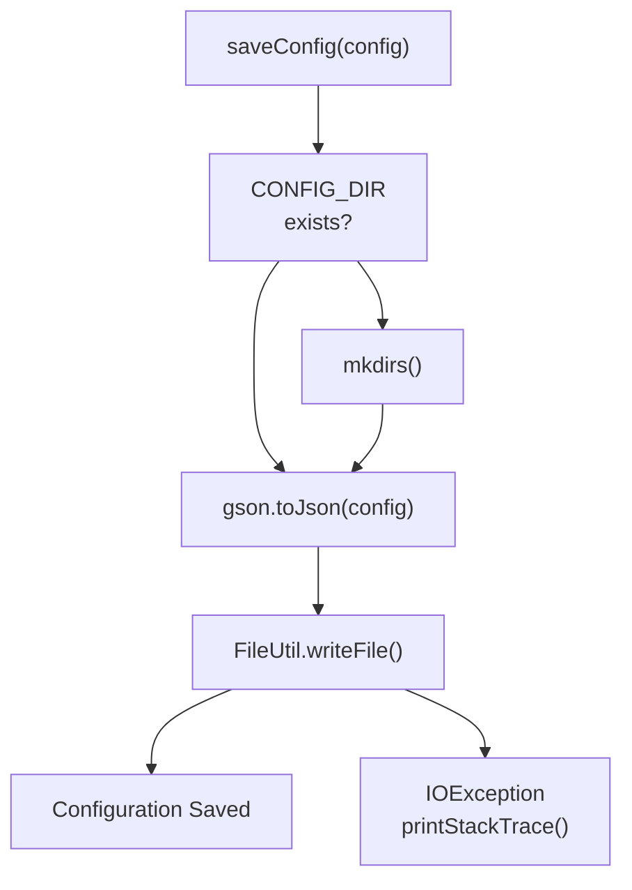
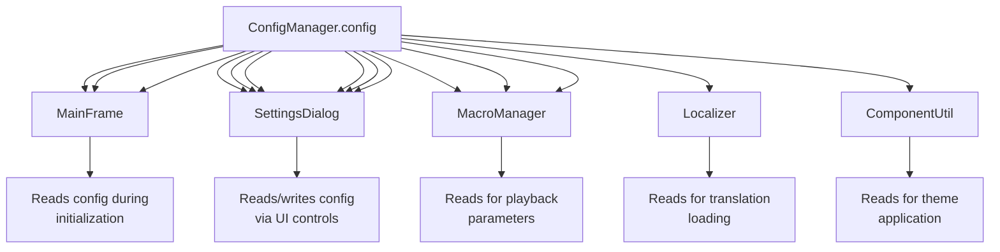
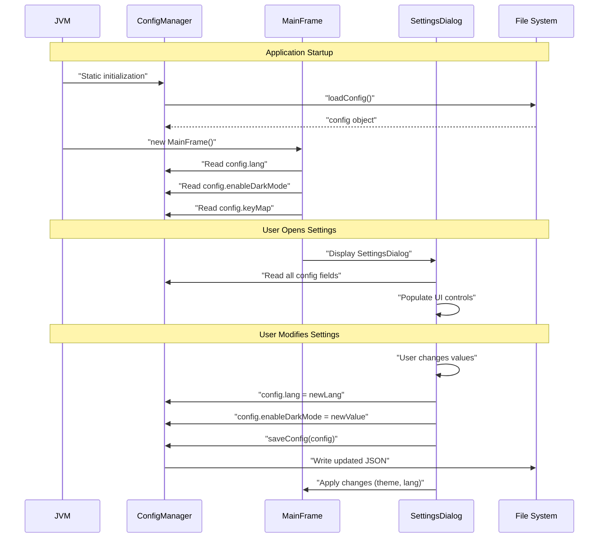

# Configuration Files

> **Relevant source files**
> * [src/io/github/samera2022/mouse_macros/constant/FileConsts.java](https://github.com/Samera2022/MouseMacros/blob/6b37ce1e/src/io/github/samera2022/mouse_macros/constant/FileConsts.java)
> * [src/io/github/samera2022/mouse_macros/constant/OtherConsts.java](https://github.com/Samera2022/MouseMacros/blob/6b37ce1e/src/io/github/samera2022/mouse_macros/constant/OtherConsts.java)
> * [src/io/github/samera2022/mouse_macros/manager/ConfigManager.java](https://github.com/Samera2022/MouseMacros/blob/6b37ce1e/src/io/github/samera2022/mouse_macros/manager/ConfigManager.java)
> * [src/io/github/samera2022/mouse_macros/manager/config/FileChooserConfig.java](https://github.com/Samera2022/MouseMacros/blob/6b37ce1e/src/io/github/samera2022/mouse_macros/manager/config/FileChooserConfig.java)

## Purpose and Scope

This page documents the structure and format of the primary configuration file (`config.cfg`) used by the MouseMacros application to persist user preferences between sessions. It covers the `Config` class structure, field descriptions, JSON serialization format, default values, and file storage location.

For information about the `ConfigManager` class that handles loading, saving, and managing configuration files, see [ConfigManager](/Samera2022/MouseMacros/5.1-configmanager). For details about the separate file chooser state persistence (`cache.json`), see [File Chooser Configuration](/Samera2022/MouseMacros/5.3-file-chooser-configuration).

---

## File Storage Location

The MouseMacros application stores configuration files in the user's AppData directory under a dedicated folder structure.

### Directory Path Construction

The configuration directory path is constructed programmatically:

```
{user.home}/AppData/MouseMacros/
```

**Sources:** [src/io/github/samera2022/mouse_macros/manager/ConfigManager.java L19](https://github.com/Samera2022/MouseMacros/blob/6b37ce1e/src/io/github/samera2022/mouse_macros/manager/ConfigManager.java#L19-L19)

The `CONFIG_DIR` constant concatenates the user's home directory (obtained via `System.getProperty("user.home")`) with `/AppData/MouseMacros/`, converting Windows backslashes to forward slashes for consistency.

### Configuration File Paths

| File | Path | Purpose |
| --- | --- | --- |
| `config.cfg` | `{CONFIG_DIR}/config.cfg` | Primary application configuration |
| `cache.json` | `{CONFIG_DIR}/cache.json` | File chooser state (see [5.3](/Samera2022/MouseMacros/5.3-file-chooser-configuration)) |

**Sources:** [src/io/github/samera2022/mouse_macros/manager/ConfigManager.java L20-L21](https://github.com/Samera2022/MouseMacros/blob/6b37ce1e/src/io/github/samera2022/mouse_macros/manager/ConfigManager.java#L20-L21)

**Example absolute paths on Windows:**

* `C:/Users/JohnDoe/AppData/MouseMacros/config.cfg`
* `C:/Users/JohnDoe/AppData/MouseMacros/cache.json`

---

## Config Class Structure

The configuration is represented by the `Config` inner class within `ConfigManager`, which defines all persistent application settings.



**Sources:** [src/io/github/samera2022/mouse_macros/manager/ConfigManager.java L30-L38](https://github.com/Samera2022/MouseMacros/blob/6b37ce1e/src/io/github/samera2022/mouse_macros/manager/ConfigManager.java#L30-L38)

The `Config` class is defined as a static inner class at [src/io/github/samera2022/mouse_macros/manager/ConfigManager.java L30-L38](https://github.com/Samera2022/MouseMacros/blob/6b37ce1e/src/io/github/samera2022/mouse_macros/manager/ConfigManager.java#L30-L38)

 with field-level default value initialization.

---

## Configuration Fields

### Field Reference Table

| Field Name | Type | Default Value | Description |
| --- | --- | --- | --- |
| `followSystemSettings` | `boolean` | `true` | Synchronize language and dark mode with OS settings |
| `lang` | `String` | `"zh_cn"` | Active language code (e.g., "en_us", "zh_cn") |
| `enableDarkMode` | `boolean` | `false` | Enable dark theme for UI components |
| `defaultMmcStoragePath` | `String` | `""` | Default directory for saving/loading .mmc macro files |
| `keyMap` | `Map<String, String>` | `new HashMap<>()` | Mapping of action names to hotkey strings |
| `enableCustomMacroSettings` | `boolean` | `false` | Enable per-macro configuration dialog |
| `repeatTime` | `int` | `1` | Number of times to repeat macro playback |

**Sources:** [src/io/github/samera2022/mouse_macros/manager/ConfigManager.java L31-L37](https://github.com/Samera2022/MouseMacros/blob/6b37ce1e/src/io/github/samera2022/mouse_macros/manager/ConfigManager.java#L31-L37)

### Detailed Field Descriptions

#### followSystemSettings

**Type:** `boolean`
**Default:** `true`

When enabled, the application queries the operating system to automatically configure:

* **Language:** Detected via `SystemUtil.getSystemLang()` (see [System Utilities](/Samera2022/MouseMacros/8.2-system-utilities))
* **Dark Mode:** Detected via Windows Registry query for `AppsUseLightTheme` (see [Theming System](/Samera2022/MouseMacros/7.4-theming-system))

This provides seamless integration with OS appearance preferences without manual configuration.

#### lang

**Type:** `String`
**Default:** `"zh_cn"`

Specifies the active language for UI localization. Valid values correspond to JSON files in the `lang/` directory (e.g., `en_us`, `zh_cn`). The `Localizer` class uses this value to load the appropriate translation file (see [Localization System](/Samera2022/MouseMacros/6-localization-system)).

#### enableDarkMode

**Type:** `boolean`
**Default:** `false`

Controls the application theme. When `true`, `ComponentUtil` applies the `DARK_MODE_SCHEME` color palette recursively to all UI components. When `false`, the `LIGHT_MODE_SCHEME` is used (see [Theming System](/Samera2022/MouseMacros/7.4-theming-system)).

**Related Constants:**

* `OtherConsts.DARK_MODE = 0`
* `OtherConsts.LIGHT_MODE = 1`

**Sources:** [src/io/github/samera2022/mouse_macros/constant/OtherConsts.java L6-L7](https://github.com/Samera2022/MouseMacros/blob/6b37ce1e/src/io/github/samera2022/mouse_macros/constant/OtherConsts.java#L6-L7)

#### defaultMmcStoragePath

**Type:** `String`
**Default:** `""` (empty string)

Specifies the default directory path for file dialogs when saving or loading macro files. When empty, the system uses the user's home directory or the last-used directory from `FileChooserConfig` (see [File Chooser Configuration](/Samera2022/MouseMacros/5.3-file-chooser-configuration)).

#### keyMap

**Type:** `Map<String, String>`
**Default:** `new HashMap<>()`

Stores custom hotkey bindings for macro operations. Keys are action identifiers, and values are human-readable key combination strings (e.g., `"F2"`, `"Ctrl+Alt+R"`).

**Typical entries:**

* `"record"` → `"F2"`
* `"stop"` → `"F3"`
* `"play"` → `"F4"`
* `"abort"` → `"F5"`

The `HotkeyDialog` allows users to customize these mappings (see [Hotkey Dialog](/Samera2022/MouseMacros/7.2-hotkey-dialog)).

#### enableCustomMacroSettings

**Type:** `boolean`
**Default:** `false`

When enabled, displays the `MacroSettingsDialog` before macro playback, allowing per-macro configuration of repeat counts and other playback parameters.

#### repeatTime

**Type:** `int`
**Default:** `1`

Specifies how many times the macro should be repeated during playback. The `MacroManager.play()` method uses this value when `enableCustomMacroSettings` is disabled (see [MacroManager](/Samera2022/MouseMacros/4.1-macromanager)).

---

## JSON File Format

The `config.cfg` file uses JSON serialization via the Gson library. Below is the structure with annotated field descriptions:

### Example config.cfg

```json
{
  "followSystemSettings": true,
  "lang": "zh_cn",
  "enableDarkMode": false,
  "defaultMmcStoragePath": "C:/Users/JohnDoe/Documents/Macros",
  "keyMap": {
    "record": "F2",
    "stop": "F3",
    "play": "F4",
    "abort": "F5"
  },
  "enableCustomMacroSettings": false,
  "repeatTime": 3
}
```

### Serialization Details



**Sources:** [src/io/github/samera2022/mouse_macros/manager/ConfigManager.java L22](https://github.com/Samera2022/MouseMacros/blob/6b37ce1e/src/io/github/samera2022/mouse_macros/manager/ConfigManager.java#L22-L22)

 [src/io/github/samera2022/mouse_macros/manager/ConfigManager.java L56-L66](https://github.com/Samera2022/MouseMacros/blob/6b37ce1e/src/io/github/samera2022/mouse_macros/manager/ConfigManager.java#L56-L66)

**Serialization process:**

1. `ConfigManager.saveConfig(config)` is called with a `Config` instance
2. The directory is created if it doesn't exist: `new File(CONFIG_DIR).mkdirs()`
3. Gson converts the object to JSON: `gson.toJson(config)`
4. `FileUtil.writeFile()` writes the JSON string to `config.cfg` with UTF-8 encoding

**Deserialization process:**

1. `ConfigManager.loadConfig()` reads the file via `FileUtil.readFile(CONFIG_PATH)`
2. Gson parses the JSON: `gson.fromJson(json, Config.class)`
3. If the file doesn't exist or is empty, a new `Config()` with defaults is returned
4. The default `Config` is automatically saved to create the file

---

## Default Configuration Behavior

### Static Initialization

The `ConfigManager` class uses a static initializer block to load the configuration at application startup:

```
static {
    config = loadConfig();
    fc_config = loadFileChooserConfig();
}
```

**Sources:** [src/io/github/samera2022/mouse_macros/manager/ConfigManager.java L25-L28](https://github.com/Samera2022/MouseMacros/blob/6b37ce1e/src/io/github/samera2022/mouse_macros/manager/ConfigManager.java#L25-L28)

This ensures that `ConfigManager.config` is always populated before any other application code accesses it.

### First-Run Behavior



**Sources:** [src/io/github/samera2022/mouse_macros/manager/ConfigManager.java L43-L53](https://github.com/Samera2022/MouseMacros/blob/6b37ce1e/src/io/github/samera2022/mouse_macros/manager/ConfigManager.java#L43-L53)

On the first run or if `config.cfg` is missing:

1. `loadConfig()` catches the `IOException`
2. A new `Config` object is instantiated with field-level defaults
3. `saveConfig()` is immediately called to persist the defaults
4. The directory is created if necessary via `mkdirs()`

This ensures the configuration file always exists after the first launch.

---

## Configuration Lifecycle

### Loading Configuration



**Sources:** [src/io/github/samera2022/mouse_macros/manager/ConfigManager.java L43-L53](https://github.com/Samera2022/MouseMacros/blob/6b37ce1e/src/io/github/samera2022/mouse_macros/manager/ConfigManager.java#L43-L53)

The `loadConfig()` method at [src/io/github/samera2022/mouse_macros/manager/ConfigManager.java L43-L53](https://github.com/Samera2022/MouseMacros/blob/6b37ce1e/src/io/github/samera2022/mouse_macros/manager/ConfigManager.java#L43-L53)

 handles three scenarios:

1. **File exists with valid JSON:** Deserialize and return
2. **File exists but empty:** Return new `Config()` with defaults
3. **IOException (file missing):** Create new `Config()`, save it, and return

### Saving Configuration

The `saveConfig()` method at [src/io/github/samera2022/mouse_macros/manager/ConfigManager.java L56-L66](https://github.com/Samera2022/MouseMacros/blob/6b37ce1e/src/io/github/samera2022/mouse_macros/manager/ConfigManager.java#L56-L66)

 performs the following operations:



**Sources:** [src/io/github/samera2022/mouse_macros/manager/ConfigManager.java L56-L66](https://github.com/Samera2022/MouseMacros/blob/6b37ce1e/src/io/github/samera2022/mouse_macros/manager/ConfigManager.java#L56-L66)

**Key operations:**

1. Check if `CONFIG_DIR` exists using `File.exists()`
2. Create directory structure if needed: `mkdirs()`
3. Serialize config object: `gson.toJson(config)`
4. Write JSON to file: `FileUtil.writeFile(CONFIG_PATH, json)`
5. Print stack trace if `IOException` occurs (silently fails)

### Runtime Reloading

The `reloadConfig()` method at [src/io/github/samera2022/mouse_macros/manager/ConfigManager.java L40](https://github.com/Samera2022/MouseMacros/blob/6b37ce1e/src/io/github/samera2022/mouse_macros/manager/ConfigManager.java#L40-L40)

 allows refreshing the configuration from disk without restarting the application:

```
public static void reloadConfig() {
    config = loadConfig();
}
```

This is useful when external processes modify `config.cfg` or when debugging configuration changes.

---

## Integration with Application Components

### Configuration Consumers

The following components access `ConfigManager.config` fields during runtime:



**Sources:** [src/io/github/samera2022/mouse_macros/manager/ConfigManager.java L23](https://github.com/Samera2022/MouseMacros/blob/6b37ce1e/src/io/github/samera2022/mouse_macros/manager/ConfigManager.java#L23-L23)

### Configuration Flow During Application Lifecycle



**Sources:** Multiple files including MainFrame, SettingsDialog, and ConfigManager

---

## Error Handling and Edge Cases

### Missing Configuration File

When `config.cfg` is missing or cannot be read, the application gracefully falls back to defaults:

**Behavior:**

1. `loadConfig()` catches `IOException` at [src/io/github/samera2022/mouse_macros/manager/ConfigManager.java L48](https://github.com/Samera2022/MouseMacros/blob/6b37ce1e/src/io/github/samera2022/mouse_macros/manager/ConfigManager.java#L48-L48)
2. Creates new `Config()` with field-level defaults
3. Immediately calls `saveConfig()` to persist the defaults
4. Returns the default configuration

**Result:** The application always operates with valid configuration values, even on first launch.

### Corrupted JSON

If the JSON is malformed or contains invalid data:

**Behavior:**

1. Gson's `fromJson()` may throw a `JsonSyntaxException`
2. The exception is not explicitly caught, causing application startup failure
3. **Manual intervention required:** User must delete or fix `config.cfg`

**Improvement opportunity:** Consider wrapping deserialization in try-catch to handle corrupted JSON gracefully.

### Empty or Null Fields

When deserializing, if a field is missing from the JSON:

**Behavior:**

1. Gson uses the field's default value from the class definition
2. For `String` fields without explicit defaults, `null` is assigned
3. For primitive wrappers (`Boolean`, `Integer`), `null` is assigned
4. For primitives (`boolean`, `int`), Java default values are used (false, 0)

**Example:** If `config.cfg` contains `{"lang": "en_us"}` without other fields:

* `followSystemSettings` → `false` (Java default, not field default of `true`)
* `enableDarkMode` → `false`
* `repeatTime` → `0` (Java default, not field default of `1`)

**Note:** This behavior means existing configs without newer fields will use Java defaults, not field-level defaults.

### Directory Creation Failure

If the AppData directory cannot be created:

**Behavior:**

1. `saveConfig()` calls `mkdirs()` at [src/io/github/samera2022/mouse_macros/manager/ConfigManager.java L60](https://github.com/Samera2022/MouseMacros/blob/6b37ce1e/src/io/github/samera2022/mouse_macros/manager/ConfigManager.java#L60-L60)
2. If `mkdirs()` returns `false`, `FileUtil.writeFile()` still attempts to write
3. The write operation fails with `IOException`
4. Stack trace is printed to `System.err` at [src/io/github/samera2022/mouse_macros/manager/ConfigManager.java L64](https://github.com/Samera2022/MouseMacros/blob/6b37ce1e/src/io/github/samera2022/mouse_macros/manager/ConfigManager.java#L64-L64)
5. **Application continues running** with in-memory config, but changes are not persisted

---

## Related Configuration Files

While this page focuses on `config.cfg`, the MouseMacros application uses additional configuration files:

| File | Purpose | Documentation |
| --- | --- | --- |
| `config.cfg` | Primary application settings | This page (5.2) |
| `cache.json` | File chooser directory state | [File Chooser Configuration](/Samera2022/MouseMacros/5.3-file-chooser-configuration) |
| `.mmc` files | Macro action sequences | [Macro File Format](/Samera2022/MouseMacros/4.4-macro-file-format-(.mmc)) |

**Sources:** [src/io/github/samera2022/mouse_macros/manager/ConfigManager.java L20-L21](https://github.com/Samera2022/MouseMacros/blob/6b37ce1e/src/io/github/samera2022/mouse_macros/manager/ConfigManager.java#L20-L21)

---

## Summary

The `config.cfg` file serves as the persistent storage for all user preferences in the MouseMacros application. Key characteristics:

* **Location:** `{user.home}/AppData/MouseMacros/config.cfg`
* **Format:** JSON serialized via Gson
* **Structure:** 7 fields spanning UI preferences, macro behavior, and hotkeys
* **Lifecycle:** Loaded on startup via static initialization, saved on user action
* **Defaults:** Field-level initialization ensures valid fallback values
* **Error Handling:** Missing files trigger automatic default creation; corrupted JSON causes startup failure

The configuration system integrates with multiple application subsystems including localization (via `lang`), theming (via `enableDarkMode`), macro playback (via `repeatTime`), and global hotkeys (via `keyMap`).

**Sources:**

* [src/io/github/samera2022/mouse_macros/manager/ConfigManager.java L1-L147](https://github.com/Samera2022/MouseMacros/blob/6b37ce1e/src/io/github/samera2022/mouse_macros/manager/ConfigManager.java#L1-L147)
* [src/io/github/samera2022/mouse_macros/constant/OtherConsts.java L1-L17](https://github.com/Samera2022/MouseMacros/blob/6b37ce1e/src/io/github/samera2022/mouse_macros/constant/OtherConsts.java#L1-L17)