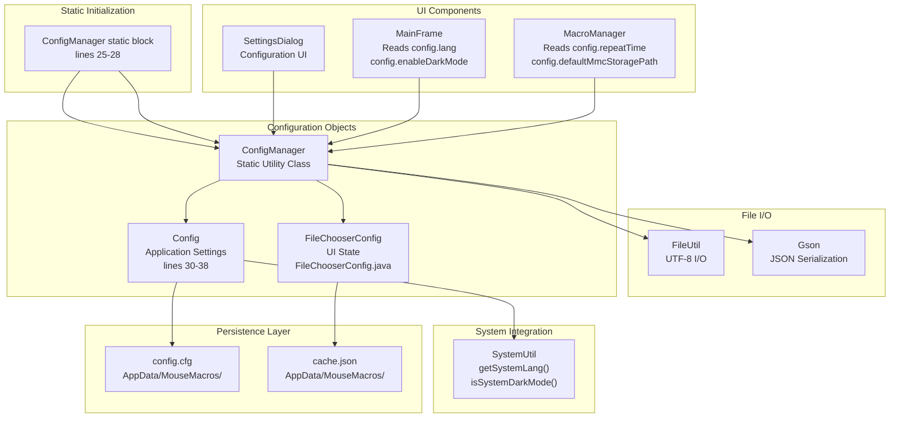
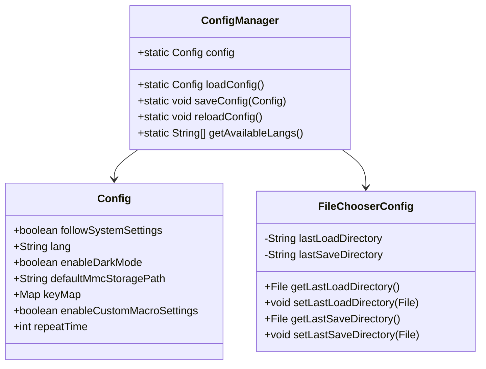
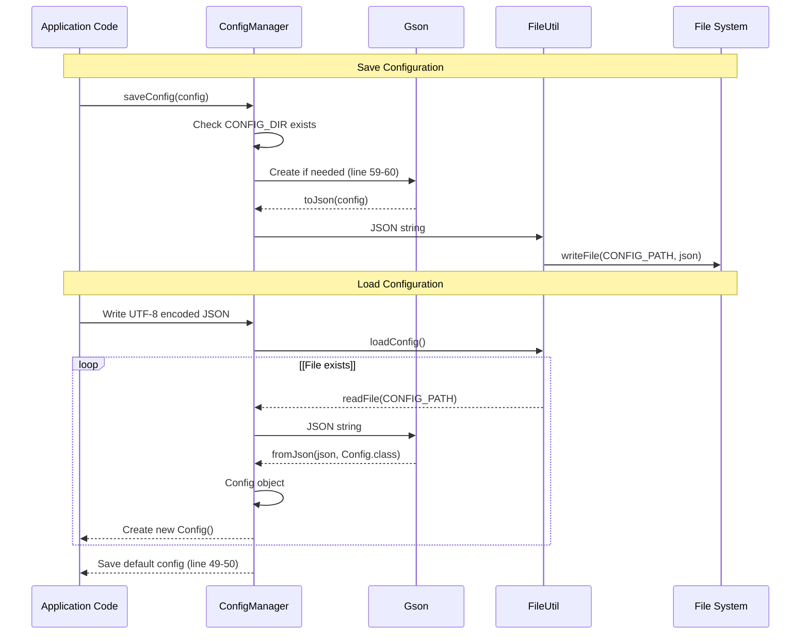
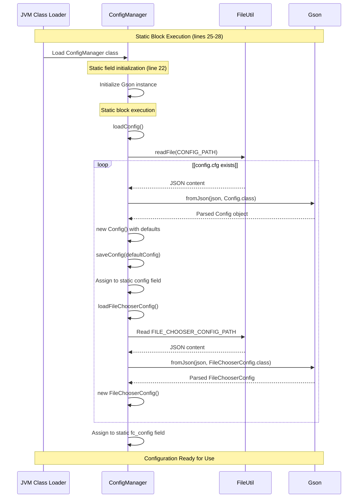
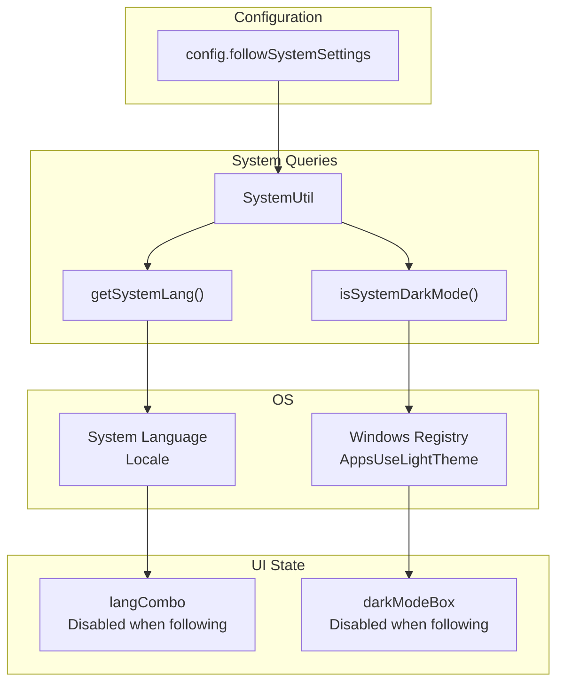
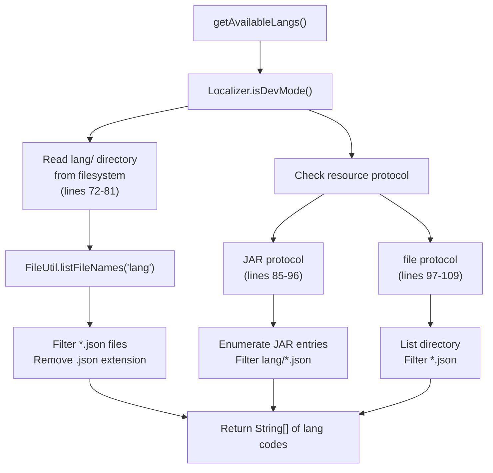

# Configuration System

> **Relevant source files**
> * [src/io/github/samera2022/mouse_macros/constant/FileConsts.java](https://github.com/Samera2022/MouseMacros/blob/6b37ce1e/src/io/github/samera2022/mouse_macros/constant/FileConsts.java)
> * [src/io/github/samera2022/mouse_macros/constant/OtherConsts.java](https://github.com/Samera2022/MouseMacros/blob/6b37ce1e/src/io/github/samera2022/mouse_macros/constant/OtherConsts.java)
> * [src/io/github/samera2022/mouse_macros/manager/ConfigManager.java](https://github.com/Samera2022/MouseMacros/blob/6b37ce1e/src/io/github/samera2022/mouse_macros/manager/ConfigManager.java)
> * [src/io/github/samera2022/mouse_macros/manager/config/FileChooserConfig.java](https://github.com/Samera2022/MouseMacros/blob/6b37ce1e/src/io/github/samera2022/mouse_macros/manager/config/FileChooserConfig.java)
> * [src/io/github/samera2022/mouse_macros/ui/frame/SettingsDialog.java](https://github.com/Samera2022/MouseMacros/blob/6b37ce1e/src/io/github/samera2022/mouse_macros/ui/frame/SettingsDialog.java)

## Purpose and Scope

The Configuration System manages application settings, user preferences, and UI state persistence across sessions. This system provides a centralized mechanism for loading, storing, and accessing configuration data through the `ConfigManager` class and associated configuration objects.

This page covers the overall architecture and integration of the configuration subsystem. For detailed information about specific components, see:

* [ConfigManager](/Samera2022/MouseMacros/5.1-configmanager) - Configuration loading, saving, and static initialization
* [Configuration Files](/Samera2022/MouseMacros/5.2-configuration-files) - config.cfg structure and Config class fields
* [File Chooser Configuration](/Samera2022/MouseMacros/5.3-file-chooser-configuration) - FileChooserConfig and cache.json for UI state

For information about how configuration integrates with the UI, see [Settings Dialog](/Samera2022/MouseMacros/7.1-settings-dialog).

**Sources:** [src/io/github/samera2022/mouse_macros/manager/ConfigManager.java L1-L146](https://github.com/Samera2022/MouseMacros/blob/6b37ce1e/src/io/github/samera2022/mouse_macros/manager/ConfigManager.java#L1-L146)

---

## Architecture Overview

The configuration system employs a two-tier architecture separating application-level settings from UI-specific state:

### Component Architecture Diagram



**Sources:**

* [src/io/github/samera2022/mouse_macros/manager/ConfigManager.java L18-L28](https://github.com/Samera2022/MouseMacros/blob/6b37ce1e/src/io/github/samera2022/mouse_macros/manager/ConfigManager.java#L18-L28)
* [src/io/github/samera2022/mouse_macros/manager/config/FileChooserConfig.java L1-L28](https://github.com/Samera2022/MouseMacros/blob/6b37ce1e/src/io/github/samera2022/mouse_macros/manager/config/FileChooserConfig.java#L1-L28)

---

## Configuration Components

The system consists of three primary classes that work together to manage configuration state:

### ConfigManager

`ConfigManager` is a static utility class that provides centralized access to configuration data. It exposes two public static fields:

| Field | Type | Purpose |
| --- | --- | --- |
| `config` | `Config` | Application-level settings (language, theme, hotkeys, macro settings) |
| `fc_config` | `FileChooserConfig` | UI state for file dialogs (last used directories) |

Both fields are initialized in a static block [ConfigManager.java L25-L28](https://github.com/Samera2022/MouseMacros/blob/6b37ce1e/ConfigManager.java#L25-L28)

 ensuring configuration is loaded before any other application code executes.

**Sources:** [src/io/github/samera2022/mouse_macros/manager/ConfigManager.java L18-L28](https://github.com/Samera2022/MouseMacros/blob/6b37ce1e/src/io/github/samera2022/mouse_macros/manager/ConfigManager.java#L18-L28)

### Config Inner Class

The `Config` inner class [ConfigManager.java L30-L38](https://github.com/Samera2022/MouseMacros/blob/6b37ce1e/ConfigManager.java#L30-L38)

 defines the structure of application settings:



**Sources:**

* [src/io/github/samera2022/mouse_macros/manager/ConfigManager.java L30-L38](https://github.com/Samera2022/MouseMacros/blob/6b37ce1e/src/io/github/samera2022/mouse_macros/manager/ConfigManager.java#L30-L38)
* [src/io/github/samera2022/mouse_macros/manager/config/FileChooserConfig.java L6-L27](https://github.com/Samera2022/MouseMacros/blob/6b37ce1e/src/io/github/samera2022/mouse_macros/manager/config/FileChooserConfig.java#L6-L27)

### Configuration Fields Reference

| Field Name | Type | Default Value | Purpose |
| --- | --- | --- | --- |
| `followSystemSettings` | `boolean` | `true` | When enabled, synchronizes `lang` and `enableDarkMode` with OS settings |
| `lang` | `String` | `"zh_cn"` | Current language code (e.g., "en_us", "zh_cn") |
| `enableDarkMode` | `boolean` | `false` | Dark theme enabled state |
| `defaultMmcStoragePath` | `String` | `""` (empty) | Default directory for saving/loading .mmc macro files |
| `keyMap` | `Map<String,String>` | `new HashMap<>()` | Custom hotkey assignments (e.g., "record" → "F2") |
| `enableCustomMacroSettings` | `boolean` | `false` | Enables per-macro custom settings |
| `repeatTime` | `int` | `1` | Number of times to repeat macro playback |

**Sources:** [src/io/github/samera2022/mouse_macros/manager/ConfigManager.java L30-L38](https://github.com/Samera2022/MouseMacros/blob/6b37ce1e/src/io/github/samera2022/mouse_macros/manager/ConfigManager.java#L30-L38)

---

## Persistence Strategy

The configuration system persists data to two separate JSON files in the `AppData/MouseMacros/` directory:

### File Locations

The storage directory is constructed at [ConfigManager.java L19](https://github.com/Samera2022/MouseMacros/blob/6b37ce1e/ConfigManager.java#L19-L19)

:

```
CONFIG_DIR = "D" + System.getProperty("user.home").substring(1).replace('\\','/') + "/AppData/MouseMacros/"
```

This resolves to:

* **Windows:** `D:/Users/<username>/AppData/MouseMacros/`

The two configuration files are:

| File | Constant | Content |
| --- | --- | --- |
| `config.cfg` | `CONFIG_PATH` | Application settings (`Config` object serialized as JSON) |
| `cache.json` | `FILE_CHOOSER_CONFIG_PATH` | File chooser UI state (`FileChooserConfig` object serialized as JSON) |

**Sources:** [src/io/github/samera2022/mouse_macros/manager/ConfigManager.java L19-L21](https://github.com/Samera2022/MouseMacros/blob/6b37ce1e/src/io/github/samera2022/mouse_macros/manager/ConfigManager.java#L19-L21)

### Serialization Flow



**Sources:**

* [src/io/github/samera2022/mouse_macros/manager/ConfigManager.java L43-L66](https://github.com/Samera2022/MouseMacros/blob/6b37ce1e/src/io/github/samera2022/mouse_macros/manager/ConfigManager.java#L43-L66)
* [src/io/github/samera2022/mouse_macros/manager/ConfigManager.java L117-L145](https://github.com/Samera2022/MouseMacros/blob/6b37ce1e/src/io/github/samera2022/mouse_macros/manager/ConfigManager.java#L117-L145)

### Directory Creation

The `saveConfig` method ensures the parent directory exists before writing [ConfigManager.java L59-L60](https://github.com/Samera2022/MouseMacros/blob/6b37ce1e/ConfigManager.java#L59-L60)

:

```
java.io.File dir = new java.io.File(CONFIG_DIR);
if (!dir.exists()) dir.mkdirs();
```

This guarantees that configuration can be saved on first run, even when the `AppData/MouseMacros/` directory doesn't exist.

**Sources:** [src/io/github/samera2022/mouse_macros/manager/ConfigManager.java L56-L66](https://github.com/Samera2022/MouseMacros/blob/6b37ce1e/src/io/github/samera2022/mouse_macros/manager/ConfigManager.java#L56-L66)

---

## Static Initialization

Configuration loading occurs during class initialization, before any application code executes. This is achieved through a static initialization block:

### Initialization Sequence Diagram



**Sources:** [src/io/github/samera2022/mouse_macros/manager/ConfigManager.java L22-L28](https://github.com/Samera2022/MouseMacros/blob/6b37ce1e/src/io/github/samera2022/mouse_macros/manager/ConfigManager.java#L22-L28)

### Access Pattern

Once initialized, configuration is accessed statically throughout the application:

```
// Direct field access
String language = ConfigManager.config.lang;
boolean darkMode = ConfigManager.config.enableDarkMode;

// File chooser state
File lastDir = ConfigManager.fc_config.getLastLoadDirectory();
```

This pattern appears in [SettingsDialog.java L18](https://github.com/Samera2022/MouseMacros/blob/6b37ce1e/SettingsDialog.java#L18-L18)

 [MainFrame.java](https://github.com/Samera2022/MouseMacros/blob/6b37ce1e/MainFrame.java)

 and other UI components.

**Sources:** [src/io/github/samera2022/mouse_macros/ui/frame/SettingsDialog.java L18](https://github.com/Samera2022/MouseMacros/blob/6b37ce1e/src/io/github/samera2022/mouse_macros/ui/frame/SettingsDialog.java#L18-L18)

---

## System Integration

The configuration system integrates with the operating system through the `followSystemSettings` flag, enabling automatic synchronization with OS preferences.

### System Settings Synchronization

When `config.followSystemSettings` is `true`, the application queries the OS for:

1. **System Language:** Via `SystemUtil.getSystemLang(availableLangs)`
2. **Dark Mode Preference:** Via `SystemUtil.isSystemDarkMode()`

This synchronization occurs in the `SettingsDialog` [SettingsDialog.java L154-L168](https://github.com/Samera2022/MouseMacros/blob/6b37ce1e/SettingsDialog.java#L154-L168)

:



**Sources:** [src/io/github/samera2022/mouse_macros/ui/frame/SettingsDialog.java L154-L168](https://github.com/Samera2022/MouseMacros/blob/6b37ce1e/src/io/github/samera2022/mouse_macros/ui/frame/SettingsDialog.java#L154-L168)

### ItemListener Implementation

The synchronization logic is implemented through an `ItemListener` attached to the "Follow System Settings" checkbox:

**Key behaviors:**

* When checked: Disables manual controls and queries system settings
* When unchecked: Re-enables manual controls, preserving last user selections
* Initial load: Executes once during dialog construction [SettingsDialog.java L168](https://github.com/Samera2022/MouseMacros/blob/6b37ce1e/SettingsDialog.java#L168-L168)

**Sources:** [src/io/github/samera2022/mouse_macros/ui/frame/SettingsDialog.java L154-L168](https://github.com/Samera2022/MouseMacros/blob/6b37ce1e/src/io/github/samera2022/mouse_macros/ui/frame/SettingsDialog.java#L154-L168)

---

## Language Discovery

The `ConfigManager.getAvailableLangs()` method [ConfigManager.java L69-L114](https://github.com/Samera2022/MouseMacros/blob/6b37ce1e/ConfigManager.java#L69-L114)

 detects available language files for the language selector in `SettingsDialog`. It handles two runtime environments:

### Environment Detection Flow



**Sources:** [src/io/github/samera2022/mouse_macros/manager/ConfigManager.java L69-L114](https://github.com/Samera2022/MouseMacros/blob/6b37ce1e/src/io/github/samera2022/mouse_macros/manager/ConfigManager.java#L69-L114)

### Discovery Scenarios

| Scenario | Detection Method | Implementation |
| --- | --- | --- |
| Development mode | File system access to `lang/` directory | `FileUtil.listFileNames("lang")` [line 73](https://github.com/Samera2022/MouseMacros/blob/6b37ce1e/line 73) |
| JAR deployment | Enumerate JAR entries matching `lang/*.json` | `JarFile.entries()` iteration [lines 86-96](https://github.com/Samera2022/MouseMacros/blob/6b37ce1e/lines 86-96) |
| file:// protocol | URI-based file listing | `File.listFiles()` with filter [lines 99-109](https://github.com/Samera2022/MouseMacros/blob/6b37ce1e/lines 99-109) |

All methods strip the `.json` extension to return language codes (e.g., `"en_us"`, `"zh_cn"`).

**Sources:** [src/io/github/samera2022/mouse_macros/manager/ConfigManager.java L69-L114](https://github.com/Samera2022/MouseMacros/blob/6b37ce1e/src/io/github/samera2022/mouse_macros/manager/ConfigManager.java#L69-L114)

---

## Configuration Access Patterns

The configuration system is accessed through static fields, enabling simple usage throughout the application:

### Read Pattern

```javascript
// In any class
import static io.github.samera2022.mouse_macros.manager.ConfigManager.config;

// Access settings
String lang = config.lang;
int repeatCount = config.repeatTime;
boolean isDark = config.enableDarkMode;
```

This pattern is used in [SettingsDialog.java L18](https://github.com/Samera2022/MouseMacros/blob/6b37ce1e/SettingsDialog.java#L18-L18)

 [MainFrame.java](https://github.com/Samera2022/MouseMacros/blob/6b37ce1e/MainFrame.java)

 and throughout the UI layer.

### Write Pattern

```python
// Modify in-memory config
config.lang = "en_us";
config.enableDarkMode = true;

// Persist changes
ConfigManager.saveConfig(config);

// Reload from disk (if needed)
ConfigManager.reloadConfig();
```

Example implementation in [SettingsDialog.java L131-L148](https://github.com/Samera2022/MouseMacros/blob/6b37ce1e/SettingsDialog.java#L131-L148)

 shows the complete save flow including UI updates.

**Sources:**

* [src/io/github/samera2022/mouse_macros/ui/frame/SettingsDialog.java L18](https://github.com/Samera2022/MouseMacros/blob/6b37ce1e/src/io/github/samera2022/mouse_macros/ui/frame/SettingsDialog.java#L18-L18)
* [src/io/github/samera2022/mouse_macros/ui/frame/SettingsDialog.java L131-L148](https://github.com/Samera2022/MouseMacros/blob/6b37ce1e/src/io/github/samera2022/mouse_macros/ui/frame/SettingsDialog.java#L131-L148)

---

## Constants Integration

Configuration integrates with application constants defined in `OtherConsts`:

| Constant | Value | Usage in Configuration |
| --- | --- | --- |
| `OtherConsts.DARK_MODE` | `0` | Passed to `ComponentUtil.setMode()` when `config.enableDarkMode` is true |
| `OtherConsts.LIGHT_MODE` | `1` | Passed to `ComponentUtil.setMode()` when `config.enableDarkMode` is false |

These constants are used in theming operations [SettingsDialog.java L144-L145](https://github.com/Samera2022/MouseMacros/blob/6b37ce1e/SettingsDialog.java#L144-L145)

:

```
ComponentUtil.setMode(getContentPane(), 
    config.enableDarkMode ? OtherConsts.DARK_MODE : OtherConsts.LIGHT_MODE);
```

**Sources:**

* [src/io/github/samera2022/mouse_macros/constant/OtherConsts.java L6-L7](https://github.com/Samera2022/MouseMacros/blob/6b37ce1e/src/io/github/samera2022/mouse_macros/constant/OtherConsts.java#L6-L7)
* [src/io/github/samera2022/mouse_macros/ui/frame/SettingsDialog.java L144-L145](https://github.com/Samera2022/MouseMacros/blob/6b37ce1e/src/io/github/samera2022/mouse_macros/ui/frame/SettingsDialog.java#L144-L145)

---

## Summary

The Configuration System provides:

1. **Static Initialization:** Configuration loaded before application code executes
2. **Two-Tier Persistence:** Separate files for application settings (`config.cfg`) and UI state (`cache.json`)
3. **System Integration:** Optional synchronization with OS language and dark mode settings
4. **Environment Awareness:** Supports both development and JAR-packaged execution
5. **Simple Access:** Static fields enable straightforward configuration access throughout the codebase
6. **Automatic Defaults:** Missing configuration files trigger creation of defaults with sensible values

For implementation details, see the child pages:

* [ConfigManager](/Samera2022/MouseMacros/5.1-configmanager) - Core configuration management logic
* [Configuration Files](/Samera2022/MouseMacros/5.2-configuration-files) - File structure and field specifications
* [File Chooser Configuration](/Samera2022/MouseMacros/5.3-file-chooser-configuration) - UI state persistence mechanism

**Sources:**

* [src/io/github/samera2022/mouse_macros/manager/ConfigManager.java L1-L146](https://github.com/Samera2022/MouseMacros/blob/6b37ce1e/src/io/github/samera2022/mouse_macros/manager/ConfigManager.java#L1-L146)
* [src/io/github/samera2022/mouse_macros/manager/config/FileChooserConfig.java L1-L28](https://github.com/Samera2022/MouseMacros/blob/6b37ce1e/src/io/github/samera2022/mouse_macros/manager/config/FileChooserConfig.java#L1-L28)
* [src/io/github/samera2022/mouse_macros/ui/frame/SettingsDialog.java L1-L180](https://github.com/Samera2022/MouseMacros/blob/6b37ce1e/src/io/github/samera2022/mouse_macros/ui/frame/SettingsDialog.java#L1-L180)