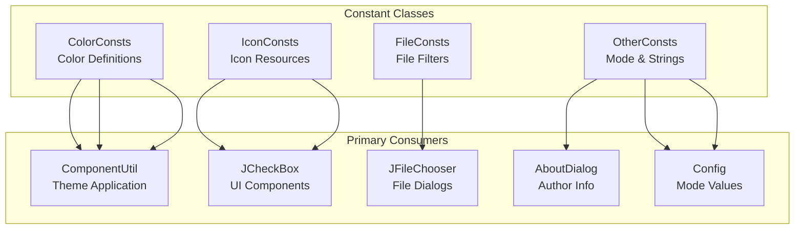
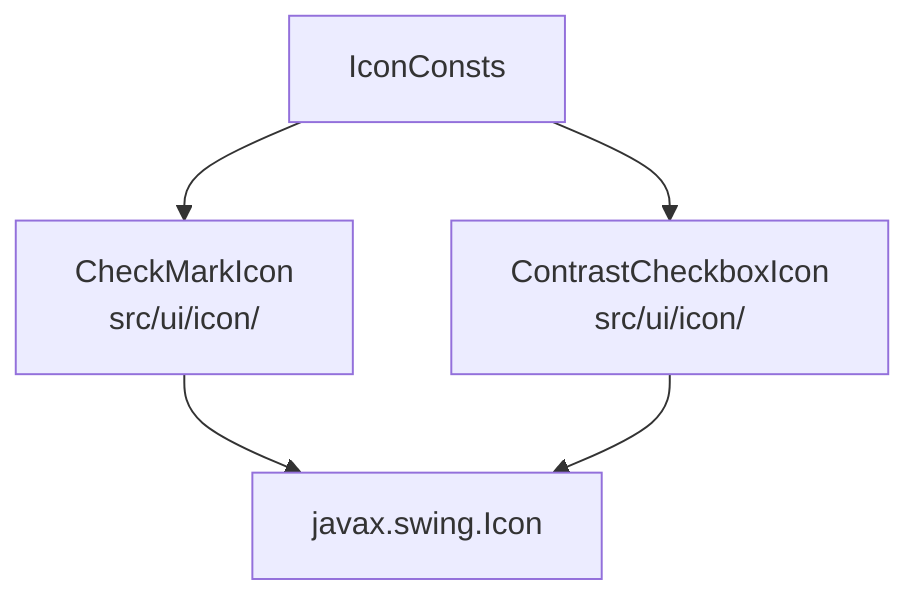
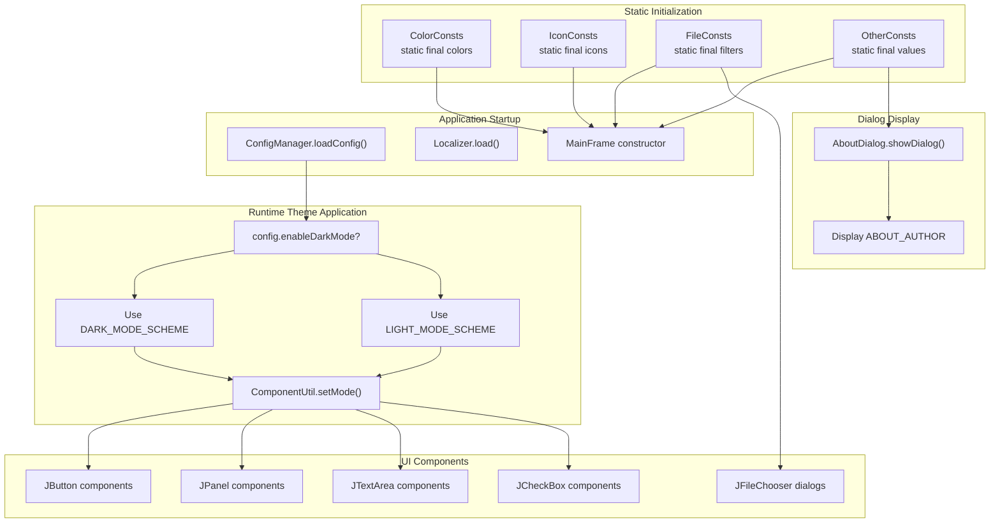

# Constants and Resources

> **Relevant source files**
> * [src/io/github/samera2022/mouse_macros/constant/ColorConsts.java](https://github.com/Samera2022/MouseMacros/blob/6b37ce1e/src/io/github/samera2022/mouse_macros/constant/ColorConsts.java)
> * [src/io/github/samera2022/mouse_macros/constant/FileConsts.java](https://github.com/Samera2022/MouseMacros/blob/6b37ce1e/src/io/github/samera2022/mouse_macros/constant/FileConsts.java)
> * [src/io/github/samera2022/mouse_macros/constant/IconConsts.java](https://github.com/Samera2022/MouseMacros/blob/6b37ce1e/src/io/github/samera2022/mouse_macros/constant/IconConsts.java)
> * [src/io/github/samera2022/mouse_macros/constant/OtherConsts.java](https://github.com/Samera2022/MouseMacros/blob/6b37ce1e/src/io/github/samera2022/mouse_macros/constant/OtherConsts.java)
> * [src/io/github/samera2022/mouse_macros/manager/config/FileChooserConfig.java](https://github.com/Samera2022/MouseMacros/blob/6b37ce1e/src/io/github/samera2022/mouse_macros/manager/config/FileChooserConfig.java)

## Purpose and Scope

This page documents the application-wide constants and resource definitions used throughout the MouseMacros codebase. These constants provide centralized definitions for UI colors, icons, file filters, mode identifiers, and other invariant values. By consolidating these values in dedicated constant classes, the application maintains consistency and simplifies maintenance.

For configuration persistence and user settings, see [Configuration System](/Samera2022/MouseMacros/5-configuration-system). For the theming system that consumes color constants, see [Theming System](/Samera2022/MouseMacros/7.4-theming-system). For localized string resources, see [Language Files](/Samera2022/MouseMacros/6.2-language-files).

## Constant Class Architecture

The application organizes constants into four dedicated classes within the `io.github.samera2022.mouse_macros.constant` package:



**Sources:** [src/io/github/samera2022/mouse_macros/constant/ColorConsts.java L1-L45](https://github.com/Samera2022/MouseMacros/blob/6b37ce1e/src/io/github/samera2022/mouse_macros/constant/ColorConsts.java#L1-L45)

 [src/io/github/samera2022/mouse_macros/constant/IconConsts.java L1-L15](https://github.com/Samera2022/MouseMacros/blob/6b37ce1e/src/io/github/samera2022/mouse_macros/constant/IconConsts.java#L1-L15)

 [src/io/github/samera2022/mouse_macros/constant/FileConsts.java L1-L10](https://github.com/Samera2022/MouseMacros/blob/6b37ce1e/src/io/github/samera2022/mouse_macros/constant/FileConsts.java#L1-L10)

 [src/io/github/samera2022/mouse_macros/constant/OtherConsts.java L1-L16](https://github.com/Samera2022/MouseMacros/blob/6b37ce1e/src/io/github/samera2022/mouse_macros/constant/OtherConsts.java#L1-L16)

## Color Constants (ColorConsts)

The `ColorConsts` class [src/io/github/samera2022/mouse_macros/constant/ColorConsts.java L1-L45](https://github.com/Samera2022/MouseMacros/blob/6b37ce1e/src/io/github/samera2022/mouse_macros/constant/ColorConsts.java#L1-L45)

 defines all color values used by the theming system. It provides parallel color schemes for dark and light modes, ensuring visual consistency across the application.

### Dark Mode Colors

| Constant | RGB Value | Usage |
| --- | --- | --- |
| `DARK_MODE_BACKGROUND` | `(40, 40, 40)` | Main window background |
| `DARK_MODE_FOREGROUND` | `(220, 220, 220)` | Primary text color |
| `DARK_MODE_PANEL_BACKGROUND` | `(55, 55, 55)` | Panel and container backgrounds |
| `DARK_MODE_PANEL_FOREGROUND` | `(220, 220, 220)` | Panel text color |
| `DARK_MODE_BUTTON_BACKGROUND` | `(60, 60, 60)` | Button backgrounds |
| `DARK_MODE_BUTTON_FOREGROUND` | `(220, 220, 220)` | Button text color |
| `DARK_MODE_CARET` | `(180, 180, 180)` | Text cursor color |
| `DARK_MODE_SCROLLBAR_BACKGROUND` | `(55, 55, 55)` | Scrollbar track |
| `DARK_MODE_SCROLLBAR_FOREGROUND` | `BLACK` | Scrollbar thumb |
| `DARK_MODE_LIST_BACKGROUND` | `(45, 45, 45)` | List component background |
| `DARK_MODE_LIST_FOREGROUND` | `(220, 220, 220)` | List item text |
| `DARK_MODE_LIST_SELECTION_BG` | `(80, 80, 80)` | Selected list item background |
| `DARK_MODE_LIST_SELECTION_FG` | `(240, 240, 240)` | Selected list item text |
| `DARK_MODE_PANEL_BORDER` | `(80, 80, 80)` | Panel border color |
| `DARK_MODE_DISABLED_BACKGROUND` | `(109, 109, 109, 255)` | Disabled component background |
| `DARK_MODE_DISABLED_FOREGROUND` | `(146, 146, 146, 255)` | Disabled component text |

### Light Mode Colors

| Constant | RGB Value | Usage |
| --- | --- | --- |
| `LIGHT_MODE_BACKGROUND` | `WHITE` | Main window background |
| `LIGHT_MODE_FOREGROUND` | `BLACK` | Primary text color |
| `LIGHT_MODE_PANEL_BACKGROUND` | `(245, 245, 245)` | Panel and container backgrounds |
| `LIGHT_MODE_PANEL_FOREGROUND` | `BLACK` | Panel text color |
| `LIGHT_MODE_BUTTON_BACKGROUND` | `(240, 240, 240)` | Button backgrounds |
| `LIGHT_MODE_BUTTON_FOREGROUND` | `BLACK` | Button text color |
| `LIGHT_MODE_CARET` | `BLACK` | Text cursor color |
| `LIGHT_MODE_SCROLLBAR_BACKGROUND` | `(245, 245, 245)` | Scrollbar track |
| `LIGHT_MODE_SCROLLBAR_FOREGROUND` | `LIGHT_GRAY` | Scrollbar thumb |
| `LIGHT_MODE_LIST_BACKGROUND` | `(250, 250, 250)` | List component background |
| `LIGHT_MODE_LIST_FOREGROUND` | `(50, 50, 50)` | List item text |
| `LIGHT_MODE_LIST_SELECTION_BG` | `(200, 200, 200)` | Selected list item background |
| `LIGHT_MODE_LIST_SELECTION_FG` | `(30, 30, 30)` | Selected list item text |
| `LIGHT_MODE_PANEL_BORDER` | `(180, 180, 180)` | Panel border color |
| `LIGHT_MODE_DISABLED_BACKGROUND` | `(238, 238, 238, 255)` | Disabled component background |
| `LIGHT_MODE_DISABLED_FOREGROUND` | `(184, 207, 229, 255)` | Disabled component text |

### Color Scheme Arrays

Two convenience arrays aggregate the most commonly used colors for easy iteration:

* `DARK_MODE_SCHEME` [src/io/github/samera2022/mouse_macros/constant/ColorConsts.java L21-L22](https://github.com/Samera2022/MouseMacros/blob/6b37ce1e/src/io/github/samera2022/mouse_macros/constant/ColorConsts.java#L21-L22) : Array of 9 colors containing background, foreground, panel background/foreground, button background/foreground, list background/foreground, and caret color
* `LIGHT_MODE_SCHEME` [src/io/github/samera2022/mouse_macros/constant/ColorConsts.java L41-L42](https://github.com/Samera2022/MouseMacros/blob/6b37ce1e/src/io/github/samera2022/mouse_macros/constant/ColorConsts.java#L41-L42) : Parallel array with light mode equivalents

These arrays are used by `ComponentUtil.setMode()` for batch color application to component trees.

**Sources:** [src/io/github/samera2022/mouse_macros/constant/ColorConsts.java L1-L45](https://github.com/Samera2022/MouseMacros/blob/6b37ce1e/src/io/github/samera2022/mouse_macros/constant/ColorConsts.java#L1-L45)

## Icon Constants (IconConsts)

The `IconConsts` class [src/io/github/samera2022/mouse_macros/constant/IconConsts.java L1-L15](https://github.com/Samera2022/MouseMacros/blob/6b37ce1e/src/io/github/samera2022/mouse_macros/constant/IconConsts.java#L1-L15)

 defines custom icons for checkboxes and selection indicators, providing visual consistency beyond standard Swing UI elements.

### Icon Definitions

| Constant | Type | Size | Color | Usage |
| --- | --- | --- | --- | --- |
| `UNSELECTED_ICON` | `CheckMarkIcon` | 13px | `Color.BLUE` | Unselected checkbox state |
| `SELECTED_ICON` | `CheckMarkIcon` | 13px | `Color.BLUE` | Selected checkbox state |
| `CHECK_BOX` | `ContrastCheckboxIcon` | 15px | `Color.BLUE` | Checkbox border/outline |

### Icon Implementation Classes



These custom icon implementations are instantiated with specific size and color parameters and stored as static final fields. The `ComponentUtil` class uses these icons when applying themes to checkbox components.

**Sources:** [src/io/github/samera2022/mouse_macros/constant/IconConsts.java L1-L15](https://github.com/Samera2022/MouseMacros/blob/6b37ce1e/src/io/github/samera2022/mouse_macros/constant/IconConsts.java#L1-L15)

## File Constants (FileConsts)

The `FileConsts` class [src/io/github/samera2022/mouse_macros/constant/FileConsts.java L1-L10](https://github.com/Samera2022/MouseMacros/blob/6b37ce1e/src/io/github/samera2022/mouse_macros/constant/FileConsts.java#L1-L10)

 defines file filters for `JFileChooser` dialogs, ensuring consistent file type restrictions across the application.

### File Filter Definitions

| Constant | Type | Description | Extensions |
| --- | --- | --- | --- |
| `MMC_FILTER` | `FileNameExtensionFilter` | "Mouse Macro Files (*.mmc)" | `.mmc` |

The `MMC_FILTER` is used by:

* `MacroManager.saveToFile()` - when saving recorded macros
* `MacroManager.loadFromFile()` - when loading macro files
* File chooser dialogs in `MainFrame` - for consistent file selection UI

This filter restricts file dialogs to only display `.mmc` (Mouse Macro) files, the proprietary format used for macro persistence. See [Macro File Format (.mmc)](/Samera2022/MouseMacros/4.4-macro-file-format-(.mmc)) for details on the file structure.

**Sources:** [src/io/github/samera2022/mouse_macros/constant/FileConsts.java L1-L10](https://github.com/Samera2022/MouseMacros/blob/6b37ce1e/src/io/github/samera2022/mouse_macros/constant/FileConsts.java#L1-L10)

## Other Constants (OtherConsts)

The `OtherConsts` class [src/io/github/samera2022/mouse_macros/constant/OtherConsts.java L1-L16](https://github.com/Samera2022/MouseMacros/blob/6b37ce1e/src/io/github/samera2022/mouse_macros/constant/OtherConsts.java#L1-L16)

 contains miscellaneous constants including theme mode identifiers and static text content.

### Mode Constants

| Constant | Value | Usage |
| --- | --- | --- |
| `DARK_MODE` | `0` | Integer identifier for dark theme mode |
| `LIGHT_MODE` | `1` | Integer identifier for light theme mode |

These integer constants are used throughout the application to represent theme modes:

* Stored in `Config.enableDarkMode` as boolean (true = dark, false = light)
* Passed to `ComponentUtil.setMode(Container, int)` for theme application
* Used in conditional logic to determine which color scheme to apply

### Static Text Content

```
public static final String ABOUT_AUTHOR = "    你好，我是MouseMacros的作者Samera2022。首先非常感谢能够使用本程序，谨在此致以最为诚挚的欢迎。\n" +
        "    你可以通过B站UID: 583460263 / QQ: 3517085924来找到我来反馈各类使用问题，当然闲聊之类的也是肯定可以的！不过反馈使用问题还是建议在Github提交Issues，这样我能更及时看得到。\n" +
        "    噢，还没有介绍这个项目的Github地址！但是想必聪明的你已经猜出来这个项目应该就是Samera2022/MouseMacros了。没错！本项目的地址为https://github.com/Samera2022/MouseMacros，如果帮到你的话还请不要吝啬你的star啦！\n";
```

The `ABOUT_AUTHOR` constant [src/io/github/samera2022/mouse_macros/constant/OtherConsts.java L9-L11](https://github.com/Samera2022/MouseMacros/blob/6b37ce1e/src/io/github/samera2022/mouse_macros/constant/OtherConsts.java#L9-L11)

 contains the author's introduction text in Chinese, displayed in the `AboutDialog`. It includes:

* Author greeting and acknowledgment
* Contact information (Bilibili UID: 583460263, QQ: 3517085924)
* GitHub repository URL: [https://github.com/Samera2022/MouseMacros](https://github.com/Samera2022/MouseMacros)
* Request for issue reporting and repository stars

This text is hardcoded rather than localized because it contains specific URLs and contact details that should remain constant regardless of language settings.

**Sources:** [src/io/github/samera2022/mouse_macros/constant/OtherConsts.java L1-L16](https://github.com/Samera2022/MouseMacros/blob/6b37ce1e/src/io/github/samera2022/mouse_macros/constant/OtherConsts.java#L1-L16)

## Constant Usage Flow

The following diagram illustrates how constants flow from definition to consumption throughout the application lifecycle:



**Sources:** [src/io/github/samera2022/mouse_macros/constant/ColorConsts.java L1-L45](https://github.com/Samera2022/MouseMacros/blob/6b37ce1e/src/io/github/samera2022/mouse_macros/constant/ColorConsts.java#L1-L45)

 [src/io/github/samera2022/mouse_macros/constant/IconConsts.java L1-L15](https://github.com/Samera2022/MouseMacros/blob/6b37ce1e/src/io/github/samera2022/mouse_macros/constant/IconConsts.java#L1-L15)

 [src/io/github/samera2022/mouse_macros/constant/FileConsts.java L1-L10](https://github.com/Samera2022/MouseMacros/blob/6b37ce1e/src/io/github/samera2022/mouse_macros/constant/FileConsts.java#L1-L10)

 [src/io/github/samera2022/mouse_macros/constant/OtherConsts.java L1-L16](https://github.com/Samera2022/MouseMacros/blob/6b37ce1e/src/io/github/samera2022/mouse_macros/constant/OtherConsts.java#L1-L16)

## Design Rationale

### Centralization Benefits

Consolidating constants into dedicated classes provides several advantages:

1. **Single Source of Truth**: Each constant value is defined once, eliminating duplication and inconsistencies
2. **Easy Maintenance**: Changing a color or mode value requires editing a single location
3. **Type Safety**: Using `Color` objects and `FileNameExtensionFilter` instead of raw strings prevents type errors
4. **Discovery**: Developers can quickly find all available constants by browsing the `constant` package

### Static Final Pattern

All constants use the `public static final` pattern [src/io/github/samera2022/mouse_macros/constant/ColorConsts.java L7-L44](https://github.com/Samera2022/MouseMacros/blob/6b37ce1e/src/io/github/samera2022/mouse_macros/constant/ColorConsts.java#L7-L44)

 which:

* Loads values at class initialization time (no runtime overhead)
* Prevents modification after initialization (immutability guarantee)
* Allows direct access without instantiation (e.g., `ColorConsts.DARK_MODE_BACKGROUND`)
* Enables compile-time constant folding for performance optimization

### Parallel Scheme Organization

The dark and light mode color schemes maintain parallel structure with identical constant names differentiated only by prefix (`DARK_MODE_*` vs `LIGHT_MODE_*`). This design:

* Makes it trivial to switch between schemes via prefix substitution
* Ensures feature parity between themes (no missing colors)
* Simplifies maintenance by keeping related constants adjacent
* Enables automated scheme switching in `ComponentUtil.setMode()`

### Immutable Resource Objects

Icon constants instantiate their objects at class initialization [src/io/github/samera2022/mouse_macros/constant/IconConsts.java L10-L13](https://github.com/Samera2022/MouseMacros/blob/6b37ce1e/src/io/github/samera2022/mouse_macros/constant/IconConsts.java#L10-L13)

 rather than lazily. This approach:

* Guarantees icon objects are ready when UI components are constructed
* Avoids null pointer exceptions from uninitialized icons
* Provides consistent instances across the application (shared references)
* Fails fast during application startup if icon classes are unavailable

**Sources:** [src/io/github/samera2022/mouse_macros/constant/ColorConsts.java L1-L45](https://github.com/Samera2022/MouseMacros/blob/6b37ce1e/src/io/github/samera2022/mouse_macros/constant/ColorConsts.java#L1-L45)

 [src/io/github/samera2022/mouse_macros/constant/IconConsts.java L1-L15](https://github.com/Samera2022/MouseMacros/blob/6b37ce1e/src/io/github/samera2022/mouse_macros/constant/IconConsts.java#L1-L15)

 [src/io/github/samera2022/mouse_macros/constant/FileConsts.java L1-L10](https://github.com/Samera2022/MouseMacros/blob/6b37ce1e/src/io/github/samera2022/mouse_macros/constant/FileConsts.java#L1-L10)

 [src/io/github/samera2022/mouse_macros/constant/OtherConsts.java L1-L16](https://github.com/Samera2022/MouseMacros/blob/6b37ce1e/src/io/github/samera2022/mouse_macros/constant/OtherConsts.java#L1-L16)