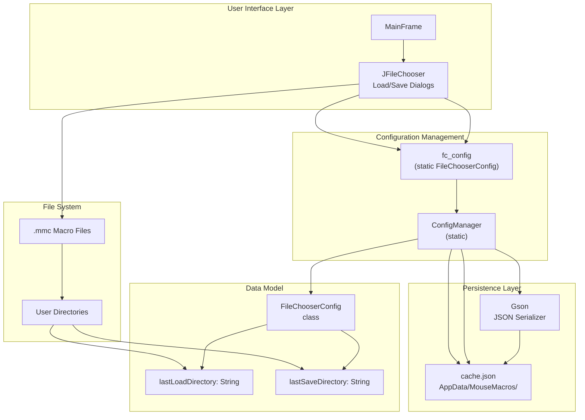
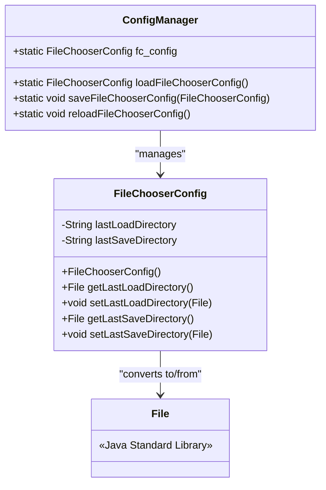
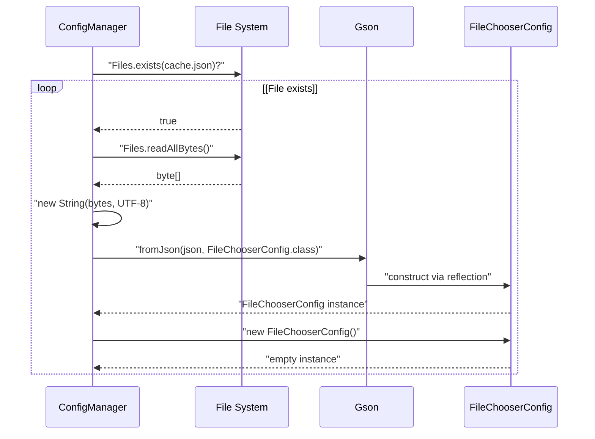
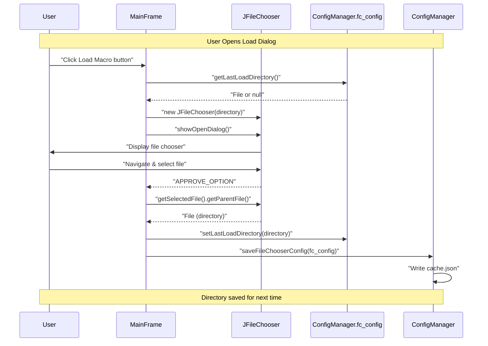

# File Chooser Configuration

> **Relevant source files**
> * [src/io/github/samera2022/mouse_macros/constant/FileConsts.java](https://github.com/Samera2022/MouseMacros/blob/6b37ce1e/src/io/github/samera2022/mouse_macros/constant/FileConsts.java)
> * [src/io/github/samera2022/mouse_macros/constant/OtherConsts.java](https://github.com/Samera2022/MouseMacros/blob/6b37ce1e/src/io/github/samera2022/mouse_macros/constant/OtherConsts.java)
> * [src/io/github/samera2022/mouse_macros/manager/ConfigManager.java](https://github.com/Samera2022/MouseMacros/blob/6b37ce1e/src/io/github/samera2022/mouse_macros/manager/ConfigManager.java)
> * [src/io/github/samera2022/mouse_macros/manager/config/FileChooserConfig.java](https://github.com/Samera2022/MouseMacros/blob/6b37ce1e/src/io/github/samera2022/mouse_macros/manager/config/FileChooserConfig.java)

## Purpose and Scope

This document describes the `FileChooserConfig` system, which persists the last-used directories for file open and save dialogs. This configuration is separate from the main application settings and stored in a dedicated cache file to remember user preferences for file browsing across application sessions.

For general application configuration settings, see [Configuration Files](/Samera2022/MouseMacros/5.2-configuration-files). For the overall configuration architecture, see [ConfigManager](/Samera2022/MouseMacros/5.1-configmanager).

---

## Overview

The `FileChooserConfig` class provides a simple persistence mechanism for remembering file dialog paths. When users open or save `.mmc` macro files through the application's file choosers, the system records the directory paths and restores them on the next file operation. This improves user experience by eliminating repetitive navigation to frequently-used directories.

| Aspect | Details |
| --- | --- |
| **Class** | `FileChooserConfig` |
| **Package** | `io.github.samera2022.mouse_macros.manager.config` |
| **Persistence File** | `cache.json` |
| **Storage Location** | `{user.home}/AppData/MouseMacros/cache.json` |
| **Format** | JSON (via Gson) |
| **Managed By** | `ConfigManager` |

**Sources:** [src/io/github/samera2022/mouse_macros/manager/config/FileChooserConfig.java L1-L28](https://github.com/Samera2022/MouseMacros/blob/6b37ce1e/src/io/github/samera2022/mouse_macros/manager/config/FileChooserConfig.java#L1-L28)

 [src/io/github/samera2022/mouse_macros/manager/ConfigManager.java L19-L28](https://github.com/Samera2022/MouseMacros/blob/6b37ce1e/src/io/github/samera2022/mouse_macros/manager/ConfigManager.java#L19-L28)

---

## Architecture



**Diagram: FileChooserConfig System Architecture**

This diagram illustrates the relationship between the file chooser UI, the static configuration instance, the persistence layer, and the file system. The `ConfigManager.fc_config` static field provides global access to the current configuration state.

**Sources:** [src/io/github/samera2022/mouse_macros/manager/ConfigManager.java L18-L28](https://github.com/Samera2022/MouseMacros/blob/6b37ce1e/src/io/github/samera2022/mouse_macros/manager/ConfigManager.java#L18-L28)

 [src/io/github/samera2022/mouse_macros/manager/config/FileChooserConfig.java L1-L28](https://github.com/Samera2022/MouseMacros/blob/6b37ce1e/src/io/github/samera2022/mouse_macros/manager/config/FileChooserConfig.java#L1-L28)

---

## FileChooserConfig Class Structure

The `FileChooserConfig` class is a simple POJO (Plain Old Java Object) designed for JSON serialization via Gson.



**Diagram: FileChooserConfig Class Structure**

**Sources:** [src/io/github/samera2022/mouse_macros/manager/config/FileChooserConfig.java L6-L28](https://github.com/Samera2022/MouseMacros/blob/6b37ce1e/src/io/github/samera2022/mouse_macros/manager/config/FileChooserConfig.java#L6-L28)

 [src/io/github/samera2022/mouse_macros/manager/ConfigManager.java L24-L145](https://github.com/Samera2022/MouseMacros/blob/6b37ce1e/src/io/github/samera2022/mouse_macros/manager/ConfigManager.java#L24-L145)

---

## Configuration Fields

The `FileChooserConfig` class stores two private string fields:

| Field | Type | Purpose | Stored As |
| --- | --- | --- | --- |
| `lastLoadDirectory` | `String` | Path of the last directory used when loading `.mmc` files | Absolute path string |
| `lastSaveDirectory` | `String` | Path of the last directory used when saving `.mmc` files | Absolute path string |

### Field Access Pattern

The class provides getter and setter methods that convert between `String` (for JSON serialization) and `File` objects (for JFileChooser API compatibility):

* **Getters**: Convert the stored string path to a `File` object, returning `null` if the path is not set [src/io/github/samera2022/mouse_macros/manager/config/FileChooserConfig.java L13-L15](https://github.com/Samera2022/MouseMacros/blob/6b37ce1e/src/io/github/samera2022/mouse_macros/manager/config/FileChooserConfig.java#L13-L15)  [src/io/github/samera2022/mouse_macros/manager/config/FileChooserConfig.java L21-L23](https://github.com/Samera2022/MouseMacros/blob/6b37ce1e/src/io/github/samera2022/mouse_macros/manager/config/FileChooserConfig.java#L21-L23)
* **Setters**: Convert the `File` directory to an absolute path string using `getAbsolutePath()`, storing `null` if the input is `null` [src/io/github/samera2022/mouse_macros/manager/config/FileChooserConfig.java L17-L19](https://github.com/Samera2022/MouseMacros/blob/6b37ce1e/src/io/github/samera2022/mouse_macros/manager/config/FileChooserConfig.java#L17-L19)  [src/io/github/samera2022/mouse_macros/manager/config/FileChooserConfig.java L25-L27](https://github.com/Samera2022/MouseMacros/blob/6b37ce1e/src/io/github/samera2022/mouse_macros/manager/config/FileChooserConfig.java#L25-L27)

### Constructor

The class includes a no-argument constructor required by Gson for JSON deserialization [src/io/github/samera2022/mouse_macros/manager/config/FileChooserConfig.java L10-L11](https://github.com/Samera2022/MouseMacros/blob/6b37ce1e/src/io/github/samera2022/mouse_macros/manager/config/FileChooserConfig.java#L10-L11)

**Sources:** [src/io/github/samera2022/mouse_macros/manager/config/FileChooserConfig.java L6-L28](https://github.com/Samera2022/MouseMacros/blob/6b37ce1e/src/io/github/samera2022/mouse_macros/manager/config/FileChooserConfig.java#L6-L28)

---

## Persistence Mechanism

### File Location

The configuration persists to `cache.json` in the application data directory:

```
{user.home}/AppData/MouseMacros/cache.json
```

The path is constructed using the pattern defined in `ConfigManager.FILE_CHOOSER_CONFIG_PATH` [src/io/github/samera2022/mouse_macros/manager/ConfigManager.java L21](https://github.com/Samera2022/MouseMacros/blob/6b37ce1e/src/io/github/samera2022/mouse_macros/manager/ConfigManager.java#L21-L21)

### JSON Format

The file uses standard JSON serialization via Gson. Example structure:

```json
{
  "lastLoadDirectory": "C:/Users/Username/Documents/Macros",
  "lastSaveDirectory": "C:/Users/Username/Documents/Macros/Exports"
}
```

If no directories have been saved, the file contains an empty object:

```json
{
  "lastLoadDirectory": null,
  "lastSaveDirectory": null
}
```

**Sources:** [src/io/github/samera2022/mouse_macros/manager/ConfigManager.java L117-L145](https://github.com/Samera2022/MouseMacros/blob/6b37ce1e/src/io/github/samera2022/mouse_macros/manager/ConfigManager.java#L117-L145)

---

## ConfigManager Integration

### Static Initialization

The `FileChooserConfig` is loaded during `ConfigManager` static initialization:

```
static {
    config = loadConfig();
    fc_config = loadFileChooserConfig();
}
```

This ensures the configuration is available immediately when the application starts [src/io/github/samera2022/mouse_macros/manager/ConfigManager.java L25-L28](https://github.com/Samera2022/MouseMacros/blob/6b37ce1e/src/io/github/samera2022/mouse_macros/manager/ConfigManager.java#L25-L28)

### Load Operation

The `loadFileChooserConfig()` method reads `cache.json` and deserializes it:



**Diagram: FileChooserConfig Load Sequence**

The method handles errors gracefully by returning an empty `FileChooserConfig` instance if the file doesn't exist or deserialization fails [src/io/github/samera2022/mouse_macros/manager/ConfigManager.java L117-L128](https://github.com/Samera2022/MouseMacros/blob/6b37ce1e/src/io/github/samera2022/mouse_macros/manager/ConfigManager.java#L117-L128)

**Sources:** [src/io/github/samera2022/mouse_macros/manager/ConfigManager.java L117-L128](https://github.com/Samera2022/MouseMacros/blob/6b37ce1e/src/io/github/samera2022/mouse_macros/manager/ConfigManager.java#L117-L128)

### Save Operation

The `saveFileChooserConfig(FileChooserConfig config)` method serializes and writes the configuration:

1. **Ensure directory exists**: `Files.createDirectories(configPath.getParent())` creates `AppData/MouseMacros/` if needed [src/io/github/samera2022/mouse_macros/manager/ConfigManager.java L138](https://github.com/Samera2022/MouseMacros/blob/6b37ce1e/src/io/github/samera2022/mouse_macros/manager/ConfigManager.java#L138-L138)
2. **Serialize to JSON**: `gson.toJson(config)` converts the object to a JSON string [src/io/github/samera2022/mouse_macros/manager/ConfigManager.java L140](https://github.com/Samera2022/MouseMacros/blob/6b37ce1e/src/io/github/samera2022/mouse_macros/manager/ConfigManager.java#L140-L140)
3. **Write to file**: `Files.write()` writes the JSON bytes with UTF-8 encoding [src/io/github/samera2022/mouse_macros/manager/ConfigManager.java L141](https://github.com/Samera2022/MouseMacros/blob/6b37ce1e/src/io/github/samera2022/mouse_macros/manager/ConfigManager.java#L141-L141)

Errors during save operations are caught and printed to `System.err` [src/io/github/samera2022/mouse_macros/manager/ConfigManager.java L142-L144](https://github.com/Samera2022/MouseMacros/blob/6b37ce1e/src/io/github/samera2022/mouse_macros/manager/ConfigManager.java#L142-L144)

**Sources:** [src/io/github/samera2022/mouse_macros/manager/ConfigManager.java L135-L145](https://github.com/Samera2022/MouseMacros/blob/6b37ce1e/src/io/github/samera2022/mouse_macros/manager/ConfigManager.java#L135-L145)

### Reload Operation

The `reloadFileChooserConfig()` method forces a reload from disk, replacing the static `fc_config` instance [src/io/github/samera2022/mouse_macros/manager/ConfigManager.java L130-L132](https://github.com/Samera2022/MouseMacros/blob/6b37ce1e/src/io/github/samera2022/mouse_macros/manager/ConfigManager.java#L130-L132)

:

```
public static void reloadFileChooserConfig(){
    fc_config = loadFileChooserConfig();
}
```

This is useful when the configuration file is modified externally or when resetting to disk state.

**Sources:** [src/io/github/samera2022/mouse_macros/manager/ConfigManager.java L130-L132](https://github.com/Samera2022/MouseMacros/blob/6b37ce1e/src/io/github/samera2022/mouse_macros/manager/ConfigManager.java#L130-L132)

---

## Usage Pattern

### Typical Workflow



**Diagram: File Chooser Configuration Lifecycle**

The workflow demonstrates how the application:

1. Retrieves the last-used directory before showing the dialog
2. Updates the configuration after the user selects a file
3. Persists the new directory to disk immediately

**Sources:** [src/io/github/samera2022/mouse_macros/manager/config/FileChooserConfig.java L13-L27](https://github.com/Samera2022/MouseMacros/blob/6b37ce1e/src/io/github/samera2022/mouse_macros/manager/config/FileChooserConfig.java#L13-L27)

 [src/io/github/samera2022/mouse_macros/manager/ConfigManager.java L135-L145](https://github.com/Samera2022/MouseMacros/blob/6b37ce1e/src/io/github/samera2022/mouse_macros/manager/ConfigManager.java#L135-L145)

---

## Separation of Load and Save Directories

The system maintains **separate** directory paths for load and save operations. This design accommodates workflows where users:

* Load macros from a shared/read-only directory
* Save macros to a different personal/writable directory
* Organize source macros separately from exported macros

### Example Scenario

| Operation | Directory Used | Updated Field |
| --- | --- | --- |
| Load macro | `C:/SharedMacros/` | `lastLoadDirectory` |
| Save macro | `C:/MyDocuments/Exports/` | `lastSaveDirectory` |
| Load macro again | `C:/SharedMacros/` (remembered) | - |
| Save macro again | `C:/MyDocuments/Exports/` (remembered) | - |

Each file chooser operation only updates its corresponding field, preserving the other directory path.

**Sources:** [src/io/github/samera2022/mouse_macros/manager/config/FileChooserConfig.java L7-L8](https://github.com/Samera2022/MouseMacros/blob/6b37ce1e/src/io/github/samera2022/mouse_macros/manager/config/FileChooserConfig.java#L7-L8)

---

## File Filter Integration

While `FileChooserConfig` handles directory memory, the file choosers use `FileConsts.MMC_FILTER` to restrict visible files:

```
public static final FileNameExtensionFilter MMC_FILTER = 
    new FileNameExtensionFilter(
        "Mouse Macro Files (*.mmc)",  // Description
        "mmc"                         // Extension
    );
```

This filter displays only `.mmc` files in the file chooser dialogs, preventing users from accidentally loading invalid file types [src/io/github/samera2022/mouse_macros/constant/FileConsts.java L6-L9](https://github.com/Samera2022/MouseMacros/blob/6b37ce1e/src/io/github/samera2022/mouse_macros/constant/FileConsts.java#L6-L9)

**Sources:** [src/io/github/samera2022/mouse_macros/constant/FileConsts.java L1-L11](https://github.com/Samera2022/MouseMacros/blob/6b37ce1e/src/io/github/samera2022/mouse_macros/constant/FileConsts.java#L1-L11)

---

## Configuration Lifecycle Summary

| Event | Action | Trigger |
| --- | --- | --- |
| **Application Start** | `loadFileChooserConfig()` called in static initializer | JVM loads `ConfigManager` class |
| **First File Operation** | Returns `null` from getters (no cached paths) | User opens file dialog for first time |
| **File Selected** | `setLastLoadDirectory()` or `setLastSaveDirectory()` called | User approves file selection |
| **Immediate Persistence** | `saveFileChooserConfig()` writes to disk | After directory path is updated |
| **Subsequent Operations** | Getters return previously-used directories | User opens file dialog again |
| **Application Exit** | No special action (already persisted) | JVM shutdown |

The configuration persists immediately after each file chooser operation rather than waiting for application exit. This ensures directory preferences are never lost, even if the application crashes.

**Sources:** [src/io/github/samera2022/mouse_macros/manager/ConfigManager.java L25-L28](https://github.com/Samera2022/MouseMacros/blob/6b37ce1e/src/io/github/samera2022/mouse_macros/manager/ConfigManager.java#L25-L28)

 [src/io/github/samera2022/mouse_macros/manager/ConfigManager.java L135-L145](https://github.com/Samera2022/MouseMacros/blob/6b37ce1e/src/io/github/samera2022/mouse_macros/manager/ConfigManager.java#L135-L145)

---

## Error Handling

### Load Failures

The `loadFileChooserConfig()` method catches all exceptions and returns an empty `FileChooserConfig` instance [src/io/github/samera2022/mouse_macros/manager/ConfigManager.java L124-L127](https://github.com/Samera2022/MouseMacros/blob/6b37ce1e/src/io/github/samera2022/mouse_macros/manager/ConfigManager.java#L124-L127)

:

```
} catch (Exception e) {
    System.err.println("Failed to load config: " + e.getMessage());
}
return new FileChooserConfig(); // Return empty config
```

This ensures the application continues functioning even if `cache.json` is corrupted or inaccessible.

### Save Failures

The `saveFileChooserConfig()` method similarly catches exceptions and prints error messages [src/io/github/samera2022/mouse_macros/manager/ConfigManager.java L142-L144](https://github.com/Samera2022/MouseMacros/blob/6b37ce1e/src/io/github/samera2022/mouse_macros/manager/ConfigManager.java#L142-L144)

:

```
} catch (Exception e) {
    System.err.println("Failed to save config: " + e.getMessage());
}
```

Failed saves do not crash the application but result in directory preferences not being persisted.

### Path Validation

The class does **not** validate that stored paths:

* Still exist on the file system
* Are accessible with current permissions
* Point to directories (not files)

Path validation occurs in the UI layer when `JFileChooser` attempts to use the returned `File` object. Invalid paths cause the file chooser to fall back to its default directory.

**Sources:** [src/io/github/samera2022/mouse_macros/manager/ConfigManager.java L117-L145](https://github.com/Samera2022/MouseMacros/blob/6b37ce1e/src/io/github/samera2022/mouse_macros/manager/ConfigManager.java#L117-L145)

---

## Relationship to Main Configuration

The `FileChooserConfig` system operates independently from the main `Config` object:

| Aspect | Main Config (`config.cfg`) | File Chooser Config (`cache.json`) |
| --- | --- | --- |
| **Scope** | Application-wide settings | UI state only |
| **Persistence Trigger** | Manual save via SettingsDialog | Automatic on file selection |
| **User Visibility** | User-editable via Settings UI | Transparent (no UI controls) |
| **Fields** | 7 settings (language, hotkeys, etc.) | 2 paths (load/save directories) |
| **Static Field** | `ConfigManager.config` | `ConfigManager.fc_config` |

Both configurations are managed by `ConfigManager` but serve different purposes. The separation keeps volatile UI state (file dialog paths) separate from stable application configuration.

**Sources:** [src/io/github/samera2022/mouse_macros/manager/ConfigManager.java L19-L28](https://github.com/Samera2022/MouseMacros/blob/6b37ce1e/src/io/github/samera2022/mouse_macros/manager/ConfigManager.java#L19-L28)

 [src/io/github/samera2022/mouse_macros/manager/ConfigManager.java L30-L38](https://github.com/Samera2022/MouseMacros/blob/6b37ce1e/src/io/github/samera2022/mouse_macros/manager/ConfigManager.java#L30-L38)