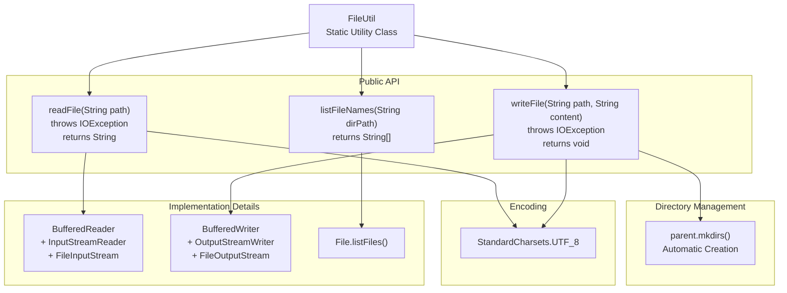
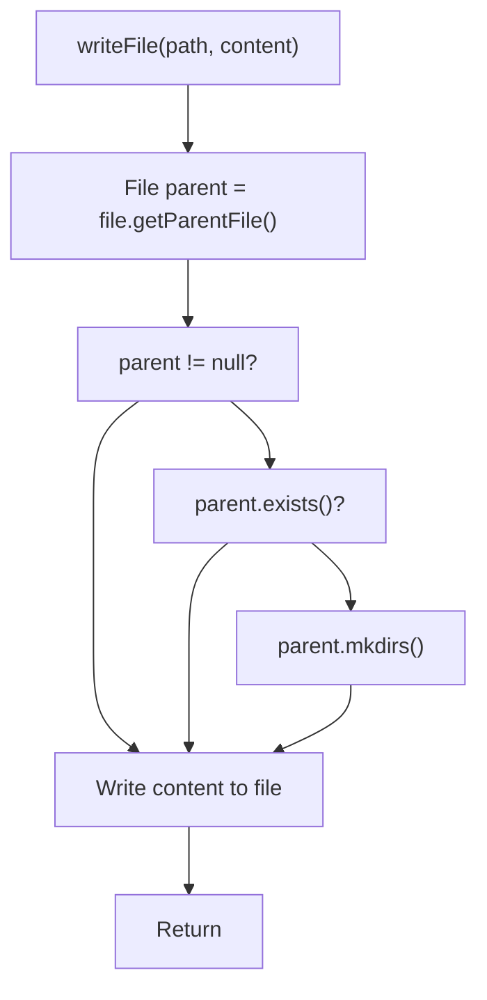
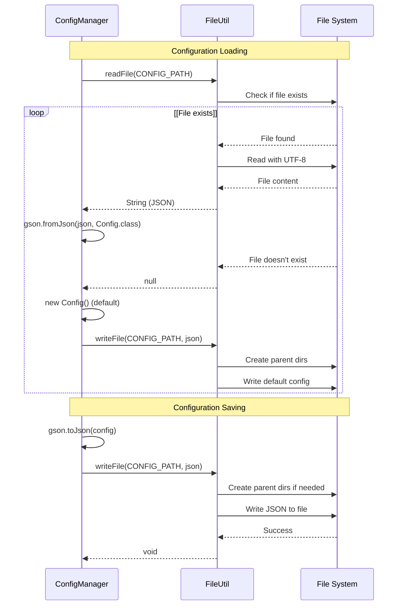
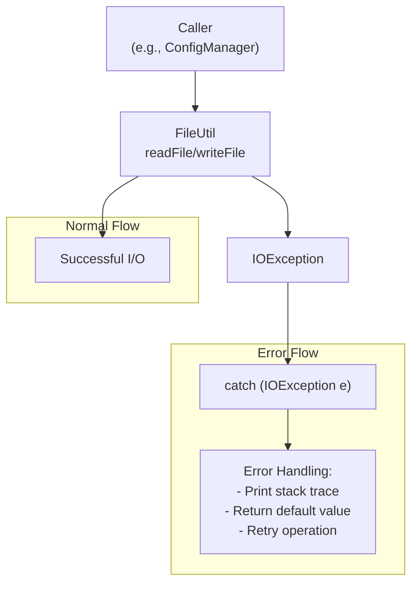
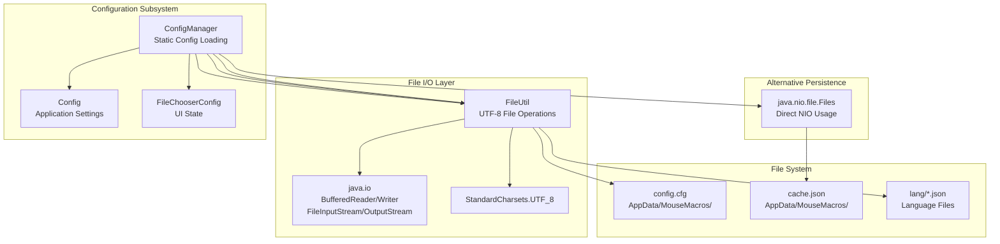

# File Utilities

> **Relevant source files**
> * [src/io/github/samera2022/mouse_macros/manager/ConfigManager.java](https://github.com/Samera2022/MouseMacros/blob/6b37ce1e/src/io/github/samera2022/mouse_macros/manager/ConfigManager.java)
> * [src/io/github/samera2022/mouse_macros/util/FileUtil.java](https://github.com/Samera2022/MouseMacros/blob/6b37ce1e/src/io/github/samera2022/mouse_macros/util/FileUtil.java)

## Purpose and Scope

This document covers the `FileUtil` class, which provides a simple file I/O abstraction layer for the MouseMacros application. `FileUtil` standardizes file operations across the codebase by enforcing UTF-8 encoding, automatic directory creation, and consistent error handling through `IOException` propagation.

For configuration file management that uses `FileUtil`, see [ConfigManager](/Samera2022/MouseMacros/5.1-configmanager). For other utility classes, see [System Utilities](/Samera2022/MouseMacros/8.2-system-utilities), [Screen Utilities](/Samera2022/MouseMacros/8.1-screen-utilities), and [Component Utilities](/Samera2022/MouseMacros/8.4-component-utilities).

**Sources:** [src/io/github/samera2022/mouse_macros/util/FileUtil.java L1-L43](https://github.com/Samera2022/MouseMacros/blob/6b37ce1e/src/io/github/samera2022/mouse_macros/util/FileUtil.java#L1-L43)

---

## Overview

The `FileUtil` class [src/io/github/samera2022/mouse_macros/util/FileUtil.java L6](https://github.com/Samera2022/MouseMacros/blob/6b37ce1e/src/io/github/samera2022/mouse_macros/util/FileUtil.java#L6-L6)

 is a static utility class located in the `util` package. It provides three core file operations:

1. **Reading file content** as a UTF-8 string
2. **Writing string content** to a file with UTF-8 encoding
3. **Listing file names** in a directory

All file operations explicitly use `StandardCharsets.UTF_8` to ensure consistent character encoding across different operating systems and locales. This is critical for handling localized text in configuration files and language resources.

**Sources:** [src/io/github/samera2022/mouse_macros/util/FileUtil.java L1-L43](https://github.com/Samera2022/MouseMacros/blob/6b37ce1e/src/io/github/samera2022/mouse_macros/util/FileUtil.java#L1-L43)

---

## FileUtil API Structure

The following diagram maps the public API surface of `FileUtil` to its implementation details:



**Sources:** [src/io/github/samera2022/mouse_macros/util/FileUtil.java L8-L42](https://github.com/Samera2022/MouseMacros/blob/6b37ce1e/src/io/github/samera2022/mouse_macros/util/FileUtil.java#L8-L42)

---

## Core Operations

### Read File

The `readFile(String path)` method [src/io/github/samera2022/mouse_macros/util/FileUtil.java L8-L19](https://github.com/Samera2022/MouseMacros/blob/6b37ce1e/src/io/github/samera2022/mouse_macros/util/FileUtil.java#L8-L19)

 reads a file's entire content into a `String`:

| Aspect | Behavior |
| --- | --- |
| **Return Value** | File content as UTF-8 string, or `null` if file doesn't exist |
| **Encoding** | `StandardCharsets.UTF_8` via `InputStreamReader` |
| **Line Handling** | Appends `\n` after each line, including the last line |
| **Exception** | Throws `IOException` for I/O errors (not file-not-found) |
| **Resource Management** | Uses try-with-resources for automatic stream closure |

**Implementation Note:** The method checks `file.exists()` before attempting to read, returning `null` for non-existent files rather than throwing an exception. This allows callers to distinguish between "file not found" and "I/O error during read".

**Sources:** [src/io/github/samera2022/mouse_macros/util/FileUtil.java L8-L19](https://github.com/Samera2022/MouseMacros/blob/6b37ce1e/src/io/github/samera2022/mouse_macros/util/FileUtil.java#L8-L19)

### Write File

The `writeFile(String path, String content)` method [src/io/github/samera2022/mouse_macros/util/FileUtil.java L22-L29](https://github.com/Samera2022/MouseMacros/blob/6b37ce1e/src/io/github/samera2022/mouse_macros/util/FileUtil.java#L22-L29)

 writes string content to a file with automatic directory creation:

| Aspect | Behavior |
| --- | --- |
| **Directory Creation** | Calls `parent.mkdirs()` if parent directory doesn't exist |
| **Encoding** | `StandardCharsets.UTF_8` via `OutputStreamWriter` |
| **Overwrite Behavior** | Overwrites existing files completely (no append mode) |
| **Exception** | Throws `IOException` for any I/O errors |
| **Resource Management** | Uses try-with-resources for automatic stream closure |

**Implementation Details:**

* Line 23-25: Extracts parent directory and creates it if necessary
* Line 26-28: Opens `FileOutputStream` (which truncates existing files) and writes content

**Sources:** [src/io/github/samera2022/mouse_macros/util/FileUtil.java L22-L29](https://github.com/Samera2022/MouseMacros/blob/6b37ce1e/src/io/github/samera2022/mouse_macros/util/FileUtil.java#L22-L29)

### List File Names

The `listFileNames(String dirPath)` method [src/io/github/samera2022/mouse_macros/util/FileUtil.java L32-L42](https://github.com/Samera2022/MouseMacros/blob/6b37ce1e/src/io/github/samera2022/mouse_macros/util/FileUtil.java#L32-L42)

 returns an array of file names (without paths) in a directory:

| Aspect | Behavior |
| --- | --- |
| **Return Value** | `String[]` containing only file names (e.g., `"config.cfg"`), not full paths |
| **Non-Existent Directory** | Returns empty array `new String[0]` |
| **Non-Directory Path** | Returns empty array `new String[0]` |
| **Null List** | Returns empty array if `listFiles()` returns `null` |
| **Exception** | Does not throw exceptions; returns empty array for any error condition |

**Usage Pattern:** This method is used by `ConfigManager.getAvailableLangs()` [src/io/github/samera2022/mouse_macros/manager/ConfigManager.java L73](https://github.com/Samera2022/MouseMacros/blob/6b37ce1e/src/io/github/samera2022/mouse_macros/manager/ConfigManager.java#L73-L73)

 to enumerate language files in the `lang/` directory during development mode.

**Sources:** [src/io/github/samera2022/mouse_macros/util/FileUtil.java L32-L42](https://github.com/Samera2022/MouseMacros/blob/6b37ce1e/src/io/github/samera2022/mouse_macros/util/FileUtil.java#L32-L42)

---

## UTF-8 Encoding Enforcement

`FileUtil` enforces UTF-8 encoding for all file I/O operations to ensure proper handling of international characters:

```mermaid
flowchart TD

StringData["String Data"]
BufferedWriter1["BufferedWriter"]
OutputStreamWriter1["OutputStreamWriter<br>StandardCharsets.UTF_8"]
FileOutputStream1["FileOutputStream"]
FileInputStream1["FileInputStream"]
InputStreamReader1["InputStreamReader<br>StandardCharsets.UTF_8"]
BufferedReader1["BufferedReader"]
StringContent["String Content"]

subgraph subGraph1 ["Write Path"]
    StringData
    BufferedWriter1
    OutputStreamWriter1
    FileOutputStream1
    StringData --> BufferedWriter1
    BufferedWriter1 --> OutputStreamWriter1
    OutputStreamWriter1 --> FileOutputStream1
end

subgraph subGraph0 ["Read Path"]
    FileInputStream1
    InputStreamReader1
    BufferedReader1
    StringContent
    FileInputStream1 --> InputStreamReader1
    InputStreamReader1 --> BufferedReader1
    BufferedReader1 --> StringContent
end
```



Both read and write operations explicitly specify `StandardCharsets.UTF_8` when constructing their respective stream wrappers:

* **Read:** [src/io/github/samera2022/mouse_macros/util/FileUtil.java L11](https://github.com/Samera2022/MouseMacros/blob/6b37ce1e/src/io/github/samera2022/mouse_macros/util/FileUtil.java#L11-L11)  - `new InputStreamReader(new FileInputStream(file), StandardCharsets.UTF_8)`
* **Write:** [src/io/github/samera2022/mouse_macros/util/FileUtil.java L26](https://github.com/Samera2022/MouseMacros/blob/6b37ce1e/src/io/github/samera2022/mouse_macros/util/FileUtil.java#L26-L26)  - `new OutputStreamWriter(new FileOutputStream(file), StandardCharsets.UTF_8)`

This is essential for:

* Configuration files containing user-defined paths with non-ASCII characters
* Language files (`en_us.json`, `zh_cn.json`) containing localized strings
* Macro file metadata that may include Unicode descriptions

**Sources:** [src/io/github/samera2022/mouse_macros/util/FileUtil.java L11](https://github.com/Samera2022/MouseMacros/blob/6b37ce1e/src/io/github/samera2022/mouse_macros/util/FileUtil.java#L11-L11)

 [src/io/github/samera2022/mouse_macros/util/FileUtil.java L26](https://github.com/Samera2022/MouseMacros/blob/6b37ce1e/src/io/github/samera2022/mouse_macros/util/FileUtil.java#L26-L26)

---

## Directory Management

The `writeFile` method automatically creates parent directories if they don't exist [src/io/github/samera2022/mouse_macros/util/FileUtil.java L24-L25](https://github.com/Samera2022/MouseMacros/blob/6b37ce1e/src/io/github/samera2022/mouse_macros/util/FileUtil.java#L24-L25)

:



**Behavior:**

* Extracts parent directory using `file.getParentFile()`
* Checks if parent is non-null and doesn't exist
* Calls `parent.mkdirs()` to create the entire directory hierarchy
* Proceeds with file write operation

**Example:** Writing to `D:/Users/User/AppData/MouseMacros/config.cfg` automatically creates `D:/Users/User/AppData/MouseMacros/` if it doesn't exist.

This eliminates the need for callers to manually ensure directory existence before writing files.

**Sources:** [src/io/github/samera2022/mouse_macros/util/FileUtil.java L22-L29](https://github.com/Samera2022/MouseMacros/blob/6b37ce1e/src/io/github/samera2022/mouse_macros/util/FileUtil.java#L22-L29)

---

## Usage in ConfigManager

`ConfigManager` is the primary consumer of `FileUtil`, using it for configuration persistence:



### ConfigManager Usage Patterns

| Operation | FileUtil Method | File Path | Purpose |
| --- | --- | --- | --- |
| Load config | `readFile()` [line 45](https://github.com/Samera2022/MouseMacros/blob/6b37ce1e/line 45) | `CONFIG_PATH` | Read `config.cfg` as JSON string |
| Save config | `writeFile()` [line 62](https://github.com/Samera2022/MouseMacros/blob/6b37ce1e/line 62) | `CONFIG_PATH` | Write JSON-serialized config |
| List languages | `listFileNames()` [line 73](https://github.com/Samera2022/MouseMacros/blob/6b37ce1e/line 73) | `"lang"` | Enumerate available `.json` language files |

**Implementation Details:**

1. **Load Config** [src/io/github/samera2022/mouse_macros/manager/ConfigManager.java L43-L53](https://github.com/Samera2022/MouseMacros/blob/6b37ce1e/src/io/github/samera2022/mouse_macros/manager/ConfigManager.java#L43-L53) : * Calls `FileUtil.readFile(CONFIG_PATH)` to read JSON string * If result is `null` or empty, returns new default `Config` instance * Catches `IOException` and creates/saves default config on error * Uses Gson to deserialize JSON to `Config` object
2. **Save Config** [src/io/github/samera2022/mouse_macros/manager/ConfigManager.java L56-L66](https://github.com/Samera2022/MouseMacros/blob/6b37ce1e/src/io/github/samera2022/mouse_macros/manager/ConfigManager.java#L56-L66) : * Serializes `Config` object to JSON using Gson * Calls `FileUtil.writeFile(CONFIG_PATH, json)` to persist * Prints stack trace if `IOException` occurs (non-fatal)
3. **Get Available Languages** [src/io/github/samera2022/mouse_macros/manager/ConfigManager.java L69-L114](https://github.com/Samera2022/MouseMacros/blob/6b37ce1e/src/io/github/samera2022/mouse_macros/manager/ConfigManager.java#L69-L114) : * In development mode, calls `FileUtil.listFileNames("lang")` to list language files * Strips `.json` extensions to get language codes (e.g., `"en_us"`, `"zh_cn"`)

**Sources:** [src/io/github/samera2022/mouse_macros/manager/ConfigManager.java L43-L66](https://github.com/Samera2022/MouseMacros/blob/6b37ce1e/src/io/github/samera2022/mouse_macros/manager/ConfigManager.java#L43-L66)

 [src/io/github/samera2022/mouse_macros/manager/ConfigManager.java L69-L114](https://github.com/Samera2022/MouseMacros/blob/6b37ce1e/src/io/github/samera2022/mouse_macros/manager/ConfigManager.java#L69-L114)

---

## Error Handling Strategy

`FileUtil` employs a dual error handling strategy based on operation semantics:

| Method | Error Handling | Rationale |
| --- | --- | --- |
| `readFile()` | Returns `null` for non-existent files; throws `IOException` for I/O errors | Distinguishes between "file not found" (expected) and "I/O failure" (unexpected) |
| `writeFile()` | Throws `IOException` for any error | Write failures are always unexpected and should be handled by caller |
| `listFileNames()` | Returns empty array for any error | Non-existent or inaccessible directories should not crash the application |

### IOException Propagation

Both `readFile` and `writeFile` declare `throws IOException` in their signatures, allowing callers to handle errors appropriately:



**ConfigManager Example** [src/io/github/samera2022/mouse_macros/manager/ConfigManager.java L48-L52](https://github.com/Samera2022/MouseMacros/blob/6b37ce1e/src/io/github/samera2022/mouse_macros/manager/ConfigManager.java#L48-L52)

:

```
try {
    String json = FileUtil.readFile(CONFIG_PATH);
    // ... parse JSON ...
} catch (IOException e) {
    Config _config = new Config();
    saveConfig(_config);  // Write default config
    return _config;
}
```

This pattern ensures that configuration loading failures result in default settings rather than application crashes.

**Sources:** [src/io/github/samera2022/mouse_macros/util/FileUtil.java L8](https://github.com/Samera2022/MouseMacros/blob/6b37ce1e/src/io/github/samera2022/mouse_macros/util/FileUtil.java#L8-L8)

 [src/io/github/samera2022/mouse_macros/util/FileUtil.java L22](https://github.com/Samera2022/MouseMacros/blob/6b37ce1e/src/io/github/samera2022/mouse_macros/util/FileUtil.java#L22-L22)

 [src/io/github/samera2022/mouse_macros/manager/ConfigManager.java L43-L53](https://github.com/Samera2022/MouseMacros/blob/6b37ce1e/src/io/github/samera2022/mouse_macros/manager/ConfigManager.java#L43-L53)

---

## FileUtil Dependency Graph

The following diagram shows how `FileUtil` fits into the larger codebase architecture:



**Notable Architecture Decision:** `ConfigManager` uses `FileUtil` for `config.cfg` operations but uses `java.nio.file.Files` directly for `cache.json` [src/io/github/samera2022/mouse_macros/manager/ConfigManager.java L117-L145](https://github.com/Samera2022/MouseMacros/blob/6b37ce1e/src/io/github/samera2022/mouse_macros/manager/ConfigManager.java#L117-L145)

 This inconsistency suggests that `FileUtil` was added later and not retrofitted to all file operations.

**Sources:** [src/io/github/samera2022/mouse_macros/util/FileUtil.java L1-L43](https://github.com/Samera2022/MouseMacros/blob/6b37ce1e/src/io/github/samera2022/mouse_macros/util/FileUtil.java#L1-L43)

 [src/io/github/samera2022/mouse_macros/manager/ConfigManager.java L1-L146](https://github.com/Samera2022/MouseMacros/blob/6b37ce1e/src/io/github/samera2022/mouse_macros/manager/ConfigManager.java#L1-L146)

---

## Summary

`FileUtil` provides a minimal, UTF-8-enforced file I/O abstraction used primarily by `ConfigManager` for configuration persistence. Its design prioritizes:

1. **Encoding Consistency:** All operations use UTF-8 explicitly
2. **Caller Convenience:** Automatic directory creation on write
3. **Error Transparency:** `IOException` propagation for unexpected errors, `null`/empty-array returns for expected conditions
4. **Resource Safety:** Try-with-resources ensures stream closure

The class serves as a thin wrapper over Java's standard I/O classes, eliminating boilerplate while enforcing best practices.

**Sources:** [src/io/github/samera2022/mouse_macros/util/FileUtil.java L1-L43](https://github.com/Samera2022/MouseMacros/blob/6b37ce1e/src/io/github/samera2022/mouse_macros/util/FileUtil.java#L1-L43)

 [src/io/github/samera2022/mouse_macros/manager/ConfigManager.java L1-L146](https://github.com/Samera2022/MouseMacros/blob/6b37ce1e/src/io/github/samera2022/mouse_macros/manager/ConfigManager.java#L1-L146)