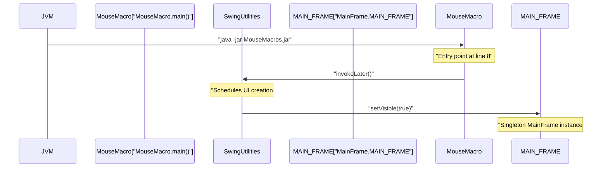
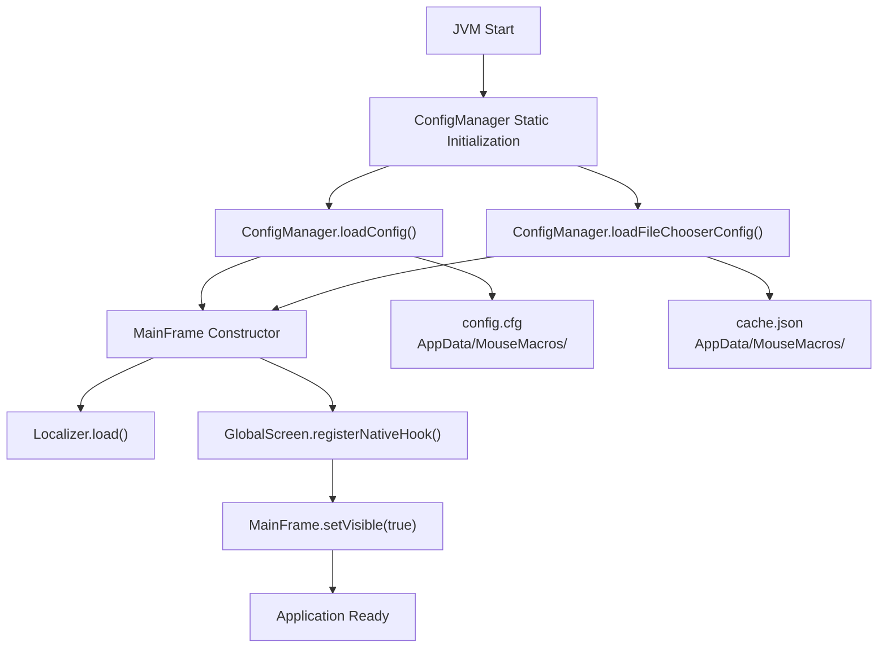
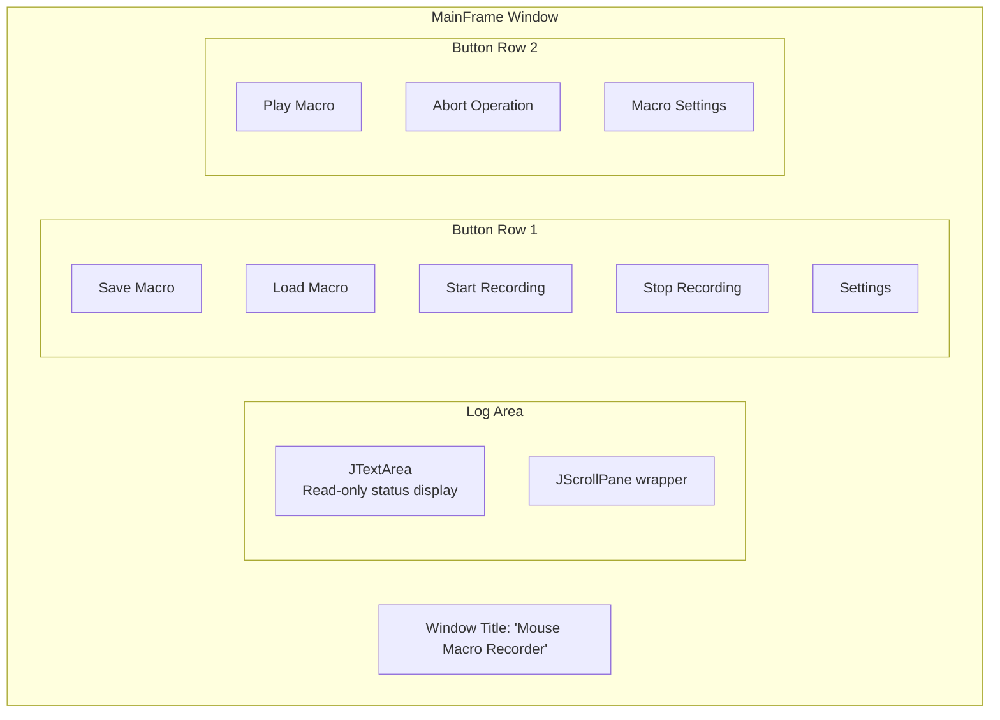
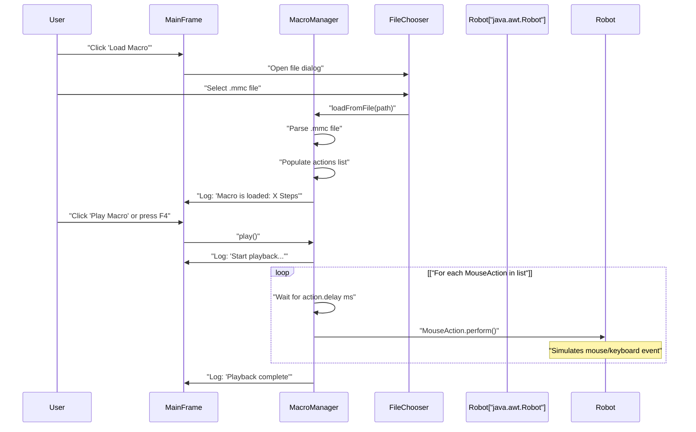
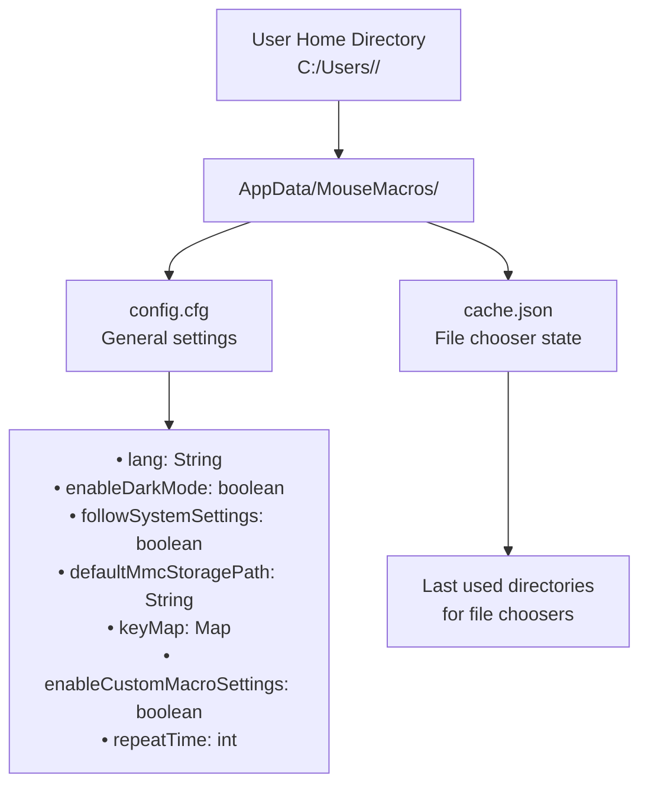

# Getting Started

> **Relevant source files**
> * [lang/en_us.json](https://github.com/Samera2022/MouseMacros/blob/6b37ce1e/lang/en_us.json)
> * [src/META-INF/MANIFEST.MF](https://github.com/Samera2022/MouseMacros/blob/6b37ce1e/src/META-INF/MANIFEST.MF)
> * [src/io/github/samera2022/mouse_macros/MouseMacro.java](https://github.com/Samera2022/MouseMacros/blob/6b37ce1e/src/io/github/samera2022/mouse_macros/MouseMacro.java)
> * [src/io/github/samera2022/mouse_macros/manager/ConfigManager.java](https://github.com/Samera2022/MouseMacros/blob/6b37ce1e/src/io/github/samera2022/mouse_macros/manager/ConfigManager.java)

## Purpose and Scope

This document provides a quick start guide for launching and using the MouseMacros application. It covers application initialization, basic macro recording and playback operations, and initial configuration. For detailed information about the macro automation system, see [Macro Recording and Playback System](/Samera2022/MouseMacros/4-macro-recording-and-playback-system). For comprehensive configuration options, see [Configuration System](/Samera2022/MouseMacros/5-configuration-system). For UI customization and theming, see [User Interface Components](/Samera2022/MouseMacros/7-user-interface-components).

---

## System Requirements

The MouseMacros application requires:

* **Java Runtime Environment (JRE)** version 8 or higher
* **Operating System**: Windows (primary support), with partial Linux/macOS compatibility
* **Permissions**: Ability to register global keyboard and mouse hooks via JNativeHook library

---

## Launching the Application

### Entry Point

The application launches through the `main()` method in [src/io/github/samera2022/mouse_macros/MouseMacro.java L8-L9](https://github.com/Samera2022/MouseMacros/blob/6b37ce1e/src/io/github/samera2022/mouse_macros/MouseMacro.java#L8-L9)

:



**Launch Methods:**

| Method | Command | Notes |
| --- | --- | --- |
| JAR Execution | `java -jar MouseMacros.jar` | Requires manifest with Main-Class attribute |
| IDE Execution | Run `MouseMacro` class | For development |
| Double-click | Execute `.jar` file | Windows with Java file associations |

The JAR manifest [src/META-INF/MANIFEST.MF L2](https://github.com/Samera2022/MouseMacros/blob/6b37ce1e/src/META-INF/MANIFEST.MF#L2-L2)

 specifies `Main-Class: io.github.samera2022.mouse_macros.MouseMacro`, enabling direct JAR execution.

**Sources:** [src/io/github/samera2022/mouse_macros/MouseMacro.java L1-L11](https://github.com/Samera2022/MouseMacros/blob/6b37ce1e/src/io/github/samera2022/mouse_macros/MouseMacro.java#L1-L11)

 [src/META-INF/MANIFEST.MF L1-L3](https://github.com/Samera2022/MouseMacros/blob/6b37ce1e/src/META-INF/MANIFEST.MF#L1-L3)

---

## Application Initialization Sequence

The startup process follows a specific initialization order:



### Initialization Steps

1. **Static Configuration Loading** [src/io/github/samera2022/mouse_macros/manager/ConfigManager.java L25-L28](https://github.com/Samera2022/MouseMacros/blob/6b37ce1e/src/io/github/samera2022/mouse_macros/manager/ConfigManager.java#L25-L28) * `ConfigManager.config` initialized from `config.cfg` * `ConfigManager.fc_config` initialized from `cache.json` * Files created with defaults if missing
2. **MainFrame Construction** (referenced in [src/io/github/samera2022/mouse_macros/MouseMacro.java L5](https://github.com/Samera2022/MouseMacros/blob/6b37ce1e/src/io/github/samera2022/mouse_macros/MouseMacro.java#L5-L5) ) * Singleton instance `MAIN_FRAME` constructed * UI components initialized * Event listeners attached
3. **Localization Setup** * Language loaded based on `config.lang` [src/io/github/samera2022/mouse_macros/manager/ConfigManager.java L32](https://github.com/Samera2022/MouseMacros/blob/6b37ce1e/src/io/github/samera2022/mouse_macros/manager/ConfigManager.java#L32-L32) * Translations loaded from `lang/*.json` files * See [Localization System](/Samera2022/MouseMacros/6-localization-system) for details
4. **Global Hook Registration** * JNativeHook's `GlobalScreen` registers native listeners * Enables OS-level keyboard and mouse event capture * See [Global Input Capture](/Samera2022/MouseMacros/4.2-global-input-capture) for details

**Sources:** [src/io/github/samera2022/mouse_macros/MouseMacro.java L1-L11](https://github.com/Samera2022/MouseMacros/blob/6b37ce1e/src/io/github/samera2022/mouse_macros/MouseMacro.java#L1-L11)

 [src/io/github/samera2022/mouse_macros/manager/ConfigManager.java L18-L53](https://github.com/Samera2022/MouseMacros/blob/6b37ce1e/src/io/github/samera2022/mouse_macros/manager/ConfigManager.java#L18-L53)

---

## Main Window Overview

The `MainFrame` window displays upon successful initialization:



### UI Component Mapping

| UI Element | Translation Key | Default Hotkey | Function |
| --- | --- | --- | --- |
| Save Macro | `save_macro` | None | Exports recorded macro to `.mmc` file |
| Load Macro | `load_macro` | None | Imports macro from `.mmc` file |
| Start Recording | `start_record` | F2 | Begins capturing mouse/keyboard events |
| Stop Recording | `stop_record` | F3 | Ends recording and saves to memory |
| Play Macro | `play_macro` | F4 | Executes loaded macro |
| Abort Operation | `abort_macro_operation` | F5 | Stops currently running operation |
| Macro Settings | `macro_settings` | None | Opens macro-specific configuration |
| Settings | `settings` | None | Opens general application settings |

Translation keys map to entries in [lang/en_us.json L3-L11](https://github.com/Samera2022/MouseMacros/blob/6b37ce1e/lang/en_us.json#L3-L11)

### Default Hotkey Configuration

The application includes global hotkeys that work even when the window is not focused:

| Key | Action | Configuration |
| --- | --- | --- |
| F2 | Start Recording | Stored in `config.keyMap` with key `"Start Recording"` |
| F3 | Stop Recording | Stored in `config.keyMap` with key `"Stop Recording"` |
| F4 | Play Macro | Stored in `config.keyMap` with key `"Play Macro"` |
| F5 | Abort Operation | Stored in `config.keyMap` with key `"Abort Operation"` |

Hotkeys can be customized via Settings → Custom Hotkey. See [Hotkey Dialog](/Samera2022/MouseMacros/7.2-hotkey-dialog) for details.

**Sources:** [lang/en_us.json L1-L53](https://github.com/Samera2022/MouseMacros/blob/6b37ce1e/lang/en_us.json#L1-L53)

 [src/io/github/samera2022/mouse_macros/manager/ConfigManager.java L30-L38](https://github.com/Samera2022/MouseMacros/blob/6b37ce1e/src/io/github/samera2022/mouse_macros/manager/ConfigManager.java#L30-L38)

---

## Basic Workflow: Recording and Playing Macros

### Recording a Macro

```

```

**Recording Process:**

1. **Initiate Recording**: Click "Start Recording" button or press F2
2. **Status Update**: Log area displays `"Start recording..."` [lang/en_us.json L28](https://github.com/Samera2022/MouseMacros/blob/6b37ce1e/lang/en_us.json#L28-L28)
3. **Perform Actions**: All mouse clicks, movements, scrolls, and keyboard events are captured
4. **Action Logging**: Each captured event logs to the text area: * Mouse clicks: `"Recording: Mouse Pressed Left/Middle/Right"` [lang/en_us.json L29-L33](https://github.com/Samera2022/MouseMacros/blob/6b37ce1e/lang/en_us.json#L29-L33) * Scroll events: `"Recording: Wheel Scrolled Wheel: <value>"` [lang/en_us.json L34-L35](https://github.com/Samera2022/MouseMacros/blob/6b37ce1e/lang/en_us.json#L34-L35)
5. **Stop Recording**: Click "Stop Recording" or press F3
6. **Completion**: Log displays `"Recording stopped, total X actions recorded"` [lang/en_us.json L36-L37](https://github.com/Samera2022/MouseMacros/blob/6b37ce1e/lang/en_us.json#L36-L37)

### Saving a Macro

After recording:

1. Click "Save Macro" button
2. File chooser dialog opens (defaults to `config.defaultMmcStoragePath`)
3. Choose location and filename
4. Macro saved with `.mmc` extension
5. Success message: `"Macro is saved as <filename>"` [lang/en_us.json L42](https://github.com/Samera2022/MouseMacros/blob/6b37ce1e/lang/en_us.json#L42-L42)

The `.mmc` file format is documented in [Macro File Format (.mmc)](/Samera2022/MouseMacros/4.4-macro-file-format-(.mmc)).

### Loading and Playing a Macro



**Playback Process:**

1. **Load Macro**: Click "Load Macro" and select `.mmc` file
2. **Validation**: System verifies file format and displays step count
3. **Start Playback**: Click "Play Macro" or press F4
4. **Execution**: Each action executes with original timing delays
5. **Abort Option**: Press F5 anytime to stop playback immediately
6. **Completion**: Log displays `"Playback complete"` [lang/en_us.json L40](https://github.com/Samera2022/MouseMacros/blob/6b37ce1e/lang/en_us.json#L40-L40)

**Repeat Execution**: If "Enable Custom Macro Settings" is active, the macro repeats `config.repeatTime` times. See [Macro Settings Dialog](/Samera2022/MouseMacros/7.1-settings-dialog) for configuration.

**Sources:** [lang/en_us.json L28-L50](https://github.com/Samera2022/MouseMacros/blob/6b37ce1e/lang/en_us.json#L28-L50)

---

## Configuration File Locations

The application stores persistent configuration in the user's AppData directory:



### Configuration Directory Path

The directory path is constructed as [src/io/github/samera2022/mouse_macros/manager/ConfigManager.java L19](https://github.com/Samera2022/MouseMacros/blob/6b37ce1e/src/io/github/samera2022/mouse_macros/manager/ConfigManager.java#L19-L19)

:

```
D<user.home without first char>/AppData/MouseMacros/
```

Example on Windows: `D:/Users/username/AppData/MouseMacros/`

### config.cfg Structure

The `config.cfg` file uses JSON format [src/io/github/samera2022/mouse_macros/manager/ConfigManager.java L30-L38](https://github.com/Samera2022/MouseMacros/blob/6b37ce1e/src/io/github/samera2022/mouse_macros/manager/ConfigManager.java#L30-L38)

:

```json
{
  "followSystemSettings": true,
  "lang": "zh_cn",
  "enableDarkMode": false,
  "defaultMmcStoragePath": "",
  "keyMap": {
    "Start Recording": "F2",
    "Stop Recording": "F3",
    "Play Macro": "F4",
    "Abort Operation": "F5"
  },
  "enableCustomMacroSettings": false,
  "repeatTime": 1
}
```

### First Launch Behavior

On first launch when `config.cfg` does not exist:

1. `ConfigManager.loadConfig()` catches `IOException` [src/io/github/samera2022/mouse_macros/manager/ConfigManager.java L48-L51](https://github.com/Samera2022/MouseMacros/blob/6b37ce1e/src/io/github/samera2022/mouse_macros/manager/ConfigManager.java#L48-L51)
2. Creates new `Config` object with defaults
3. Calls `saveConfig()` to persist defaults
4. Returns default configuration

**Sources:** [src/io/github/samera2022/mouse_macros/manager/ConfigManager.java L18-L66](https://github.com/Samera2022/MouseMacros/blob/6b37ce1e/src/io/github/samera2022/mouse_macros/manager/ConfigManager.java#L18-L66)

---

## Initial Configuration

### Changing Language

The application defaults to Chinese (`zh_cn`). To switch to English:

1. Click "Settings" button
2. Locate "Switch Language" dropdown [lang/en_us.json L13](https://github.com/Samera2022/MouseMacros/blob/6b37ce1e/lang/en_us.json#L13-L13)
3. Select desired language (e.g., `en_us`)
4. Click "Save and Apply All Settings"
5. Application immediately updates all UI text

**Available Languages**: Retrieved dynamically from `lang/` directory. The system scans for `*.json` files and populates the dropdown. See [Language Files](/Samera2022/MouseMacros/6.2-language-files) for supported languages.

### Enabling Dark Mode

1. Open Settings dialog
2. Check "Enable Dark Mode" [lang/en_us.json L14](https://github.com/Samera2022/MouseMacros/blob/6b37ce1e/lang/en_us.json#L14-L14)
3. Click "Save and Apply All Settings"
4. UI immediately applies dark theme via `ComponentUtil.setMode()`

### Following System Settings

When "Follow System Settings" is enabled [lang/en_us.json L12](https://github.com/Samera2022/MouseMacros/blob/6b37ce1e/lang/en_us.json#L12-L12)

:

* Language automatically syncs with OS language (if available)
* Dark mode syncs with Windows dark mode setting
* Queries Windows Registry: `HKEY_CURRENT_USER\Software\Microsoft\Windows\CurrentVersion\Themes\Personalize`

See [System Utilities](/Samera2022/MouseMacros/8.2-system-utilities) for implementation details.

**Sources:** [lang/en_us.json L11-L22](https://github.com/Samera2022/MouseMacros/blob/6b37ce1e/lang/en_us.json#L11-L22)

 [src/io/github/samera2022/mouse_macros/manager/ConfigManager.java L30-L38](https://github.com/Samera2022/MouseMacros/blob/6b37ce1e/src/io/github/samera2022/mouse_macros/manager/ConfigManager.java#L30-L38)

---

## Troubleshooting Common Issues

### Hook Registration Failed

**Symptom**: Log displays `"Global hook registration failed: <error>"` [lang/en_us.json L52](https://github.com/Samera2022/MouseMacros/blob/6b37ce1e/lang/en_us.json#L52-L52)

**Causes**:

* JNativeHook library not included in classpath
* Insufficient permissions for global hook registration
* Conflicting software blocking hook registration

**Solutions**:

* Ensure JNativeHook JAR is packaged with application
* Run with administrator privileges (Windows)
* Disable security software temporarily

### No Recorded Actions

**Symptom**: After stopping recording, log shows `"No recorded actions"` [lang/en_us.json L38](https://github.com/Samera2022/MouseMacros/blob/6b37ce1e/lang/en_us.json#L38-L38)

**Causes**:

* Global hooks not registered successfully
* Recording state not properly set
* Events filtered out by listener

**Solutions**:

* Restart application and verify hook registration
* Check console for initialization errors
* Ensure mouse/keyboard events occur while recording

### Macro Not Running

**Symptom**: Log displays `"Macro is not running currently"` [lang/en_us.json L49](https://github.com/Samera2022/MouseMacros/blob/6b37ce1e/lang/en_us.json#L49-L49)

 when attempting to abort

**Cause**: No macro playback is currently in progress

**Solution**: This is informational, not an error. Only abort during active playback.

### Configuration File Corruption

**Symptom**: Application fails to load configuration or displays default settings

**Solution**:

1. Close application
2. Navigate to `AppData/MouseMacros/`
3. Delete `config.cfg`
4. Restart application
5. Configuration regenerates with defaults [src/io/github/samera2022/mouse_macros/manager/ConfigManager.java L49-L51](https://github.com/Samera2022/MouseMacros/blob/6b37ce1e/src/io/github/samera2022/mouse_macros/manager/ConfigManager.java#L49-L51)

**Sources:** [lang/en_us.json L38-L52](https://github.com/Samera2022/MouseMacros/blob/6b37ce1e/lang/en_us.json#L38-L52)

 [src/io/github/samera2022/mouse_macros/manager/ConfigManager.java L43-L66](https://github.com/Samera2022/MouseMacros/blob/6b37ce1e/src/io/github/samera2022/mouse_macros/manager/ConfigManager.java#L43-L66)

---

## Next Steps

After familiarizing yourself with basic operations:

* **Explore Macro Settings**: Configure repeat times and custom macro behavior. See [Macro Settings Dialog](/Samera2022/MouseMacros/7.1-settings-dialog)
* **Customize Hotkeys**: Rebind default hotkeys to your preferences. See [Hotkey Dialog](/Samera2022/MouseMacros/7.2-hotkey-dialog)
* **Learn File Format**: Understand `.mmc` file structure for advanced usage. See [Macro File Format (.mmc)](/Samera2022/MouseMacros/4.4-macro-file-format-(.mmc))
* **Advanced Configuration**: Explore all configuration options. See [Configuration System](/Samera2022/MouseMacros/5-configuration-system)
* **UI Customization**: Customize appearance and theming. See [Theming System](/Samera2022/MouseMacros/7.4-theming-system)

**Sources:** [lang/en_us.json L1-L53](https://github.com/Samera2022/MouseMacros/blob/6b37ce1e/lang/en_us.json#L1-L53)