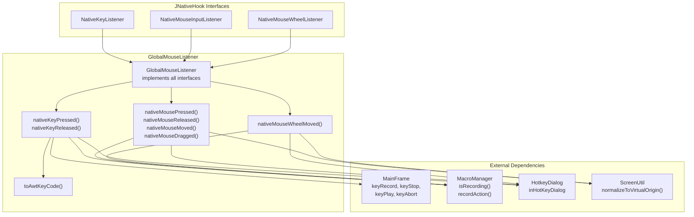
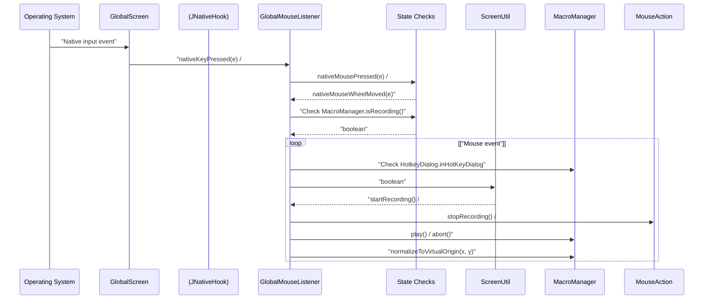
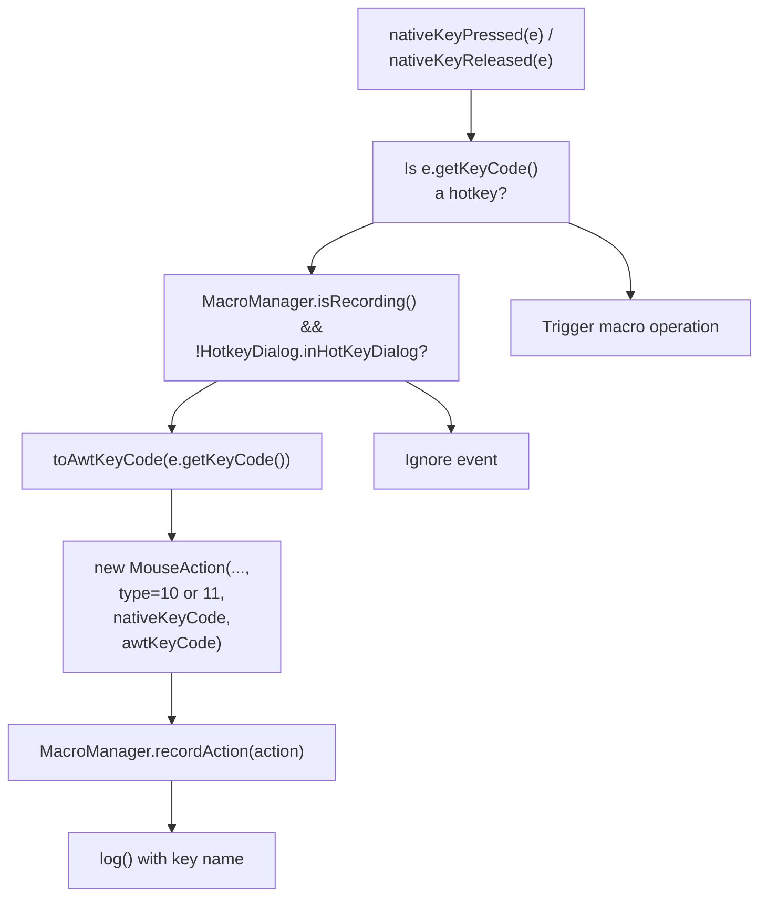
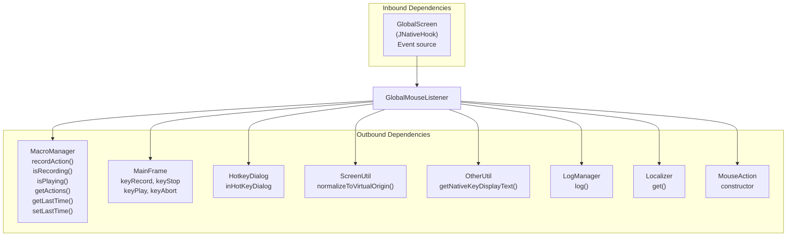

# Global Input Capture

> **Relevant source files**
> * [src/io/github/samera2022/mouse_macros/listener/GlobalMouseListener.java](https://github.com/Samera2022/MouseMacros/blob/6b37ce1e/src/io/github/samera2022/mouse_macros/listener/GlobalMouseListener.java)
> * [src/io/github/samera2022/mouse_macros/ui/frame/MainFrame.java](https://github.com/Samera2022/MouseMacros/blob/6b37ce1e/src/io/github/samera2022/mouse_macros/ui/frame/MainFrame.java)

## Purpose and Scope

This document describes the **Global Input Capture** subsystem, which provides OS-level keyboard and mouse event monitoring through the JNativeHook library. This system enables the application to capture user input events regardless of which window has focus, allowing hotkey-based control and macro recording of all user actions.

The GlobalMouseListener class serves as the primary adapter between native OS events and the application's macro recording system. For information about how recorded events are stored and played back, see [MouseAction](/Samera2022/MouseMacros/4.3-mouseaction). For information about the macro state machine and playback control, see [MacroManager](/Samera2022/MouseMacros/4.1-macromanager).

**Sources:** [src/io/github/samera2022/mouse_macros/listener/GlobalMouseListener.java L1-L196](https://github.com/Samera2022/MouseMacros/blob/6b37ce1e/src/io/github/samera2022/mouse_macros/listener/GlobalMouseListener.java#L1-L196)

---

## JNativeHook Library Integration

The application uses the **JNativeHook** library (com.github.kwhat.jnativehook) to register native OS-level input hooks. This library provides low-level event capture across all operating systems by installing system-wide hooks that intercept input before it reaches application windows.

### GlobalScreen Registration

The `GlobalScreen` class from JNativeHook manages the native hook lifecycle. Registration occurs during `MainFrame` initialization:

```
GlobalScreen.registerNativeHook()
GlobalScreen.addNativeKeyListener(GML)
GlobalScreen.addNativeMouseListener(GML)
GlobalScreen.addNativeMouseWheelListener(GML)
GlobalScreen.addNativeMouseMotionListener(GML)
```

The single `GlobalMouseListener` instance (`GML`) is registered for all four listener types, providing unified event handling. Logger output from JNativeHook is disabled to prevent console spam [src/io/github/samera2022/mouse_macros/ui/frame/MainFrame.java L138-L140](https://github.com/Samera2022/MouseMacros/blob/6b37ce1e/src/io/github/samera2022/mouse_macros/ui/frame/MainFrame.java#L138-L140)

**Failure Handling:** If hook registration fails (typically due to insufficient permissions), an error message is logged using `Localizer.get("hook_registration_failed")` [src/io/github/samera2022/mouse_macros/ui/frame/MainFrame.java L142-L146](https://github.com/Samera2022/MouseMacros/blob/6b37ce1e/src/io/github/samera2022/mouse_macros/ui/frame/MainFrame.java#L142-L146)

**Sources:** [src/io/github/samera2022/mouse_macros/ui/frame/MainFrame.java L137-L150](https://github.com/Samera2022/MouseMacros/blob/6b37ce1e/src/io/github/samera2022/mouse_macros/ui/frame/MainFrame.java#L137-L150)

---

## GlobalMouseListener Architecture

**GlobalMouseListener Architecture**



**Sources:** [src/io/github/samera2022/mouse_macros/listener/GlobalMouseListener.java L21-L129](https://github.com/Samera2022/MouseMacros/blob/6b37ce1e/src/io/github/samera2022/mouse_macros/listener/GlobalMouseListener.java#L21-L129)

 [src/io/github/samera2022/mouse_macros/ui/frame/MainFrame.java L32-L37](https://github.com/Samera2022/MouseMacros/blob/6b37ce1e/src/io/github/samera2022/mouse_macros/ui/frame/MainFrame.java#L32-L37)

The `GlobalMouseListener` class implements three native listener interfaces:

| Interface | Methods Implemented | Purpose |
| --- | --- | --- |
| `NativeKeyListener` | `nativeKeyPressed()`, `nativeKeyReleased()`, `nativeKeyTyped()` | Captures keyboard events including hotkeys and recorded keys |
| `NativeMouseInputListener` | `nativeMousePressed()`, `nativeMouseReleased()`, `nativeMouseMoved()`, `nativeMouseDragged()` | Captures mouse button and movement events |
| `NativeMouseWheelListener` | `nativeMouseWheelMoved()` | Captures scroll wheel events |

The class acts as an **adapter** that converts native events from JNativeHook's event model into the application's `MouseAction` representation, filtering based on current application state before forwarding to `MacroManager.recordAction()`.

**Sources:** [src/io/github/samera2022/mouse_macros/listener/GlobalMouseListener.java L21-L27](https://github.com/Samera2022/MouseMacros/blob/6b37ce1e/src/io/github/samera2022/mouse_macros/listener/GlobalMouseListener.java#L21-L27)

---

## Event Capture Flow

**Event Capture and Recording Flow**



**Sources:** [src/io/github/samera2022/mouse_macros/listener/GlobalMouseListener.java L32-L129](https://github.com/Samera2022/MouseMacros/blob/6b37ce1e/src/io/github/samera2022/mouse_macros/listener/GlobalMouseListener.java#L32-L129)

 [src/io/github/samera2022/mouse_macros/util/ScreenUtil.java L70-L86](https://github.com/Samera2022/MouseMacros/blob/6b37ce1e/src/io/github/samera2022/mouse_macros/util/ScreenUtil.java#L70-L86)

### State Filtering Logic

All event handlers perform dual state checks before processing:

1. **Recording State Check:** `MacroManager.isRecording()` determines if macro recording is active
2. **Dialog State Check:** `HotkeyDialog.inHotKeyDialog` determines if the hotkey configuration dialog is capturing input

These checks prevent:

* Recording events when not in recording mode
* Recording hotkey configuration inputs as macro actions
* Hotkey triggers from interfering with hotkey configuration

The combined check pattern appears consistently: `if (MacroManager.isRecording() && (!HotkeyDialog.inHotKeyDialog))` [src/io/github/samera2022/mouse_macros/listener/GlobalMouseListener.java L69](https://github.com/Samera2022/MouseMacros/blob/6b37ce1e/src/io/github/samera2022/mouse_macros/listener/GlobalMouseListener.java#L69-L69)

 [src/io/github/samera2022/mouse_macros/listener/GlobalMouseListener.java L84](https://github.com/Samera2022/MouseMacros/blob/6b37ce1e/src/io/github/samera2022/mouse_macros/listener/GlobalMouseListener.java#L84-L84)

 [src/io/github/samera2022/mouse_macros/listener/GlobalMouseListener.java L99](https://github.com/Samera2022/MouseMacros/blob/6b37ce1e/src/io/github/samera2022/mouse_macros/listener/GlobalMouseListener.java#L99-L99)

**Sources:** [src/io/github/samera2022/mouse_macros/listener/GlobalMouseListener.java L32-L129](https://github.com/Samera2022/MouseMacros/blob/6b37ce1e/src/io/github/samera2022/mouse_macros/listener/GlobalMouseListener.java#L32-L129)

---

## Hotkey Detection System

**Hotkey Detection Architecture**

```mermaid
flowchart TD

KR["keyRecord<br>(default: VC_F2)"]
KS["keyStop<br>(default: VC_F3)"]
KP["keyPlay<br>(default: VC_F4)"]
KA["keyAbort<br>(default: VC_F5)"]
KM["config.keyMap<br>Map<String, String>"]
Check1["e.getKeyCode() == keyRecord"]
Check2["e.getKeyCode() == keyStop"]
Check3["e.getKeyCode() == keyPlay"]
Check4["e.getKeyCode() == keyAbort"]
Start["startRecording()"]
Stop["stopRecording()"]
Play["play()"]
Abort["abort()"]

KM --> KR
KM --> KS
KM --> KP
KM --> KA
KR --> Check1
KS --> Check2
KP --> Check3
KA --> Check4
Check1 --> Start
Check2 --> Stop
Check3 --> Play
Check4 --> Abort

subgraph subGraph3 ["MacroManager Actions"]
    Start
    Stop
    Play
    Abort
end

subgraph GlobalMouseListener.nativeKeyPressed() ["GlobalMouseListener.nativeKeyPressed()"]
    Check1
    Check2
    Check3
    Check4
end

subgraph ConfigManager ["ConfigManager"]
    KM
end

subgraph subGraph0 ["MainFrame Static Fields"]
    KR
    KS
    KP
    KA
end
```

**Sources:** [src/io/github/samera2022/mouse_macros/ui/frame/MainFrame.java L32-L35](https://github.com/Samera2022/MouseMacros/blob/6b37ce1e/src/io/github/samera2022/mouse_macros/ui/frame/MainFrame.java#L32-L35)

 [src/io/github/samera2022/mouse_macros/ui/frame/MainFrame.java L62-L71](https://github.com/Samera2022/MouseMacros/blob/6b37ce1e/src/io/github/samera2022/mouse_macros/ui/frame/MainFrame.java#L62-L71)

 [src/io/github/samera2022/mouse_macros/listener/GlobalMouseListener.java L32-L40](https://github.com/Samera2022/MouseMacros/blob/6b37ce1e/src/io/github/samera2022/mouse_macros/listener/GlobalMouseListener.java#L32-L40)

### Hotkey Configuration

Hotkey codes are stored as static integer fields in `MainFrame`:

| Field | Default Value | Purpose | Config Key |
| --- | --- | --- | --- |
| `keyRecord` | `NativeKeyEvent.VC_F2` | Start macro recording | `"start_macro"` |
| `keyStop` | `NativeKeyEvent.VC_F3` | Stop macro recording | `"stop_record"` |
| `keyPlay` | `NativeKeyEvent.VC_F4` | Play/execute macro | `"play_macro"` |
| `keyAbort` | `NativeKeyEvent.VC_F5` | Abort running macro | `"abort_macro_operation"` |

During `MainFrame` initialization, these fields are overridden with values from `config.keyMap` if present [src/io/github/samera2022/mouse_macros/ui/frame/MainFrame.java L62-L71](https://github.com/Samera2022/MouseMacros/blob/6b37ce1e/src/io/github/samera2022/mouse_macros/ui/frame/MainFrame.java#L62-L71)

 The map stores key codes as strings which are parsed to integers.

### Hotkey Detection Logic

The `nativeKeyPressed()` method checks incoming key codes against these static fields before processing keyboard recording:

```
if (e.getKeyCode() == keyRecord && (!MacroManager.isRecording()) && (!HotkeyDialog.inHotKeyDialog)) {
    MacroManager.startRecording();
} else if (e.getKeyCode() == keyStop && MacroManager.isRecording() && (!HotkeyDialog.inHotKeyDialog)) {
    MacroManager.stopRecording();
} else if (e.getKeyCode() == keyPlay && (!MacroManager.isRecording()) && (!HotkeyDialog.inHotKeyDialog)) {
    MacroManager.play();
} else if (e.getKeyCode() == keyAbort && MacroManager.isPlaying() && (!HotkeyDialog.inHotKeyDialog)) {
    MacroManager.abort();
}
```

This cascading if-else structure ensures hotkey actions take precedence over recording. If no hotkey matches and recording is active, the key is recorded as a normal keyboard event [src/io/github/samera2022/mouse_macros/listener/GlobalMouseListener.java L32-L50](https://github.com/Samera2022/MouseMacros/blob/6b37ce1e/src/io/github/samera2022/mouse_macros/listener/GlobalMouseListener.java#L32-L50)

**Sources:** [src/io/github/samera2022/mouse_macros/listener/GlobalMouseListener.java L32-L50](https://github.com/Samera2022/MouseMacros/blob/6b37ce1e/src/io/github/samera2022/mouse_macros/listener/GlobalMouseListener.java#L32-L50)

 [src/io/github/samera2022/mouse_macros/ui/frame/MainFrame.java L32-L71](https://github.com/Samera2022/MouseMacros/blob/6b37ce1e/src/io/github/samera2022/mouse_macros/ui/frame/MainFrame.java#L32-L71)

---

## Mouse Event Recording

### Mouse Button Events

**Mouse Press/Release Recording:**

```
public void nativeMousePressed(NativeMouseEvent e) {
    if (MacroManager.isRecording() && (!HotkeyDialog.inHotKeyDialog)) {
        Point p = ScreenUtil.normalizeToVirtualOrigin(e.getX(), e.getY());
        long now = System.currentTimeMillis();
        int btn = e.getButton();
        int macroBtn = btn == 2 ? 3 : btn == 3 ? 2 : btn;
        MacroManager.recordAction(new MouseAction(p.x, p.y, 1, macroBtn, now - MacroManager.getLastTime()));
        MacroManager.setLastTime(now);
    }
}
```

**Key Processing Steps:**

1. **Coordinate Normalization:** `ScreenUtil.normalizeToVirtualOrigin()` transforms screen coordinates to virtual screen space, handling multi-monitor setups [src/io/github/samera2022/mouse_macros/listener/GlobalMouseListener.java L70](https://github.com/Samera2022/MouseMacros/blob/6b37ce1e/src/io/github/samera2022/mouse_macros/listener/GlobalMouseListener.java#L70-L70)
2. **Timestamp Calculation:** `now - MacroManager.getLastTime()` computes the delay since the previous action
3. **Button Mapping:** JNativeHook uses button codes (1=left, 2=right, 3=middle), which are remapped to AWT standard (1=left, 2=middle, 3=right) [src/io/github/samera2022/mouse_macros/listener/GlobalMouseListener.java L74](https://github.com/Samera2022/MouseMacros/blob/6b37ce1e/src/io/github/samera2022/mouse_macros/listener/GlobalMouseListener.java#L74-L74)
4. **Action Creation:** A new `MouseAction` with type `1` (press) or `2` (release) is created
5. **Recording:** The action is passed to `MacroManager.recordAction()`

**Sources:** [src/io/github/samera2022/mouse_macros/listener/GlobalMouseListener.java L68-L95](https://github.com/Samera2022/MouseMacros/blob/6b37ce1e/src/io/github/samera2022/mouse_macros/listener/GlobalMouseListener.java#L68-L95)

### Mouse Movement Events

Mouse movement recording includes throttling to prevent excessive data:

```javascript
public void nativeMouseMoved(NativeMouseEvent e) {
    if (MacroManager.isRecording() && (!HotkeyDialog.inHotKeyDialog)) {
        Point p = ScreenUtil.normalizeToVirtualOrigin(e.getX(), e.getY());
        long now = System.currentTimeMillis();
        var actions = MacroManager.getActions();
        if (actions.isEmpty() || p.distance(actions.get(actions.size()-1).x, actions.get(actions.size()-1).y) > 5) {
            long delay = Math.min(now - MacroManager.getLastTime(), 100);
            MacroManager.recordAction(new MouseAction(p.x, p.y, 0, 0, delay));
            MacroManager.setLastTime(now);
        }
    }
}
```

**Throttling Mechanisms:**

* **Distance Threshold:** Movement is only recorded if the distance from the last recorded position exceeds 5 pixels [src/io/github/samera2022/mouse_macros/listener/GlobalMouseListener.java L104](https://github.com/Samera2022/MouseMacros/blob/6b37ce1e/src/io/github/samera2022/mouse_macros/listener/GlobalMouseListener.java#L104-L104)
* **Time Capping:** Delay is capped at 100ms to prevent long pauses between movements [src/io/github/samera2022/mouse_macros/listener/GlobalMouseListener.java L105](https://github.com/Samera2022/MouseMacros/blob/6b37ce1e/src/io/github/samera2022/mouse_macros/listener/GlobalMouseListener.java#L105-L105)

Mouse drag events delegate to `nativeMouseMoved()` [src/io/github/samera2022/mouse_macros/listener/GlobalMouseListener.java L113-L115](https://github.com/Samera2022/MouseMacros/blob/6b37ce1e/src/io/github/samera2022/mouse_macros/listener/GlobalMouseListener.java#L113-L115)

**Sources:** [src/io/github/samera2022/mouse_macros/listener/GlobalMouseListener.java L98-L115](https://github.com/Samera2022/MouseMacros/blob/6b37ce1e/src/io/github/samera2022/mouse_macros/listener/GlobalMouseListener.java#L98-L115)

### Mouse Wheel Events

Scroll wheel events record the rotation amount:

```
public void nativeMouseWheelMoved(NativeMouseWheelEvent e) {
    if (MacroManager.isRecording() && (!HotkeyDialog.inHotKeyDialog)) {
        Point p = ScreenUtil.normalizeToVirtualOrigin(e.getX(), e.getY());
        long now = System.currentTimeMillis();
        int wheelAmount = e.getWheelRotation();
        long delay = now - MacroManager.getLastTime();
        MacroManager.recordAction(new MouseAction(p.x, p.y, 3, 0, delay, wheelAmount));
        MacroManager.setLastTime(now);
    }
}
```

The `wheelAmount` parameter (from `getWheelRotation()`) indicates scroll direction and magnitude: negative values for scrolling up/forward, positive for down/backward. This value becomes the 6th field in the `MouseAction` constructor [src/io/github/samera2022/mouse_macros/listener/GlobalMouseListener.java L119-L129](https://github.com/Samera2022/MouseMacros/blob/6b37ce1e/src/io/github/samera2022/mouse_macros/listener/GlobalMouseListener.java#L119-L129)

**Sources:** [src/io/github/samera2022/mouse_macros/listener/GlobalMouseListener.java L119-L129](https://github.com/Samera2022/MouseMacros/blob/6b37ce1e/src/io/github/samera2022/mouse_macros/listener/GlobalMouseListener.java#L119-L129)

---

## Keyboard Event Recording

### Key Press and Release

**Keyboard Event Recording Pattern**



**Sources:** [src/io/github/samera2022/mouse_macros/listener/GlobalMouseListener.java L32-L62](https://github.com/Samera2022/MouseMacros/blob/6b37ce1e/src/io/github/samera2022/mouse_macros/listener/GlobalMouseListener.java#L32-L62)

When recording is active and no hotkey matches, keyboard events are recorded:

```
public void nativeKeyPressed(NativeKeyEvent e) {
    // ... hotkey checks ...
    else if (MacroManager.isRecording() && (!HotkeyDialog.inHotKeyDialog)) {
        long now = System.currentTimeMillis();
        int awtKeyCode = toAwtKeyCode(e.getKeyCode());
        MacroManager.recordAction(new MouseAction(0, 0, 10, 0, now - MacroManager.getLastTime(), 0, e.getKeyCode(), awtKeyCode));
        MacroManager.setLastTime(now);
    }
}
```

Keyboard actions use:

* **Type 10:** Key press [src/io/github/samera2022/mouse_macros/listener/GlobalMouseListener.java L45](https://github.com/Samera2022/MouseMacros/blob/6b37ce1e/src/io/github/samera2022/mouse_macros/listener/GlobalMouseListener.java#L45-L45)
* **Type 11:** Key release [src/io/github/samera2022/mouse_macros/listener/GlobalMouseListener.java L57](https://github.com/Samera2022/MouseMacros/blob/6b37ce1e/src/io/github/samera2022/mouse_macros/listener/GlobalMouseListener.java#L57-L57)
* **Coordinates (0, 0):** Keyboard events have no spatial component
* **Native Key Code:** The JNativeHook key code (7th field)
* **AWT Key Code:** The mapped AWT key code (8th field)

**Sources:** [src/io/github/samera2022/mouse_macros/listener/GlobalMouseListener.java L41-L62](https://github.com/Samera2022/MouseMacros/blob/6b37ce1e/src/io/github/samera2022/mouse_macros/listener/GlobalMouseListener.java#L41-L62)

### Key Code Mapping

The `toAwtKeyCode()` method maps JNativeHook virtual key codes to AWT `KeyEvent` codes required by `java.awt.Robot` during playback:

| JNativeHook Code | AWT Code | Key |
| --- | --- | --- |
| `VC_A` through `VC_Z` | `VK_A` through `VK_Z` | Alphabetic keys |
| `VC_0` through `VC_9` | `VK_0` through `VK_9` | Numeric keys |
| `VC_F1` through `VC_F12` | `VK_F1` through `VK_F12` | Function keys |
| `VC_ENTER` | `VK_ENTER` | Enter |
| `VC_SPACE` | `VK_SPACE` | Spacebar |
| `VC_TAB` | `VK_TAB` | Tab |
| `VC_ESCAPE` | `VK_ESCAPE` | Escape |
| `VC_SHIFT`, `VC_CONTROL`, `VC_ALT`, `VC_META` | `VK_SHIFT`, `VK_CONTROL`, `VK_ALT`, `VK_META` | Modifier keys |

The method includes mappings for 50+ common keys [src/io/github/samera2022/mouse_macros/listener/GlobalMouseListener.java L131-L195](https://github.com/Samera2022/MouseMacros/blob/6b37ce1e/src/io/github/samera2022/mouse_macros/listener/GlobalMouseListener.java#L131-L195)

 If no mapping exists, the native key code is returned unchanged as a fallback.

**Sources:** [src/io/github/samera2022/mouse_macros/listener/GlobalMouseListener.java L131-L195](https://github.com/Samera2022/MouseMacros/blob/6b37ce1e/src/io/github/samera2022/mouse_macros/listener/GlobalMouseListener.java#L131-L195)

---

## Event Logging

All recorded events trigger localized log messages displayed in the `MainFrame.logArea`:

| Event Type | Log Key | Example Output |
| --- | --- | --- |
| Mouse Press | `"recording_mouse_pressed"` | "Recording mouse press [Left] (1920,1080)" |
| Mouse Release | `"recording_mouse_released"` | "Recording mouse release [Right] (100,200)" |
| Mouse Wheel | `"recording_scroll_msg1"` + `"recording_scroll_msg2"` | "Recording scroll (amount: -3)" |
| Key Press | `"recording_key_pressed"` | "Recording key press: F2" |
| Key Release | `"recording_key_released"` | "Recording key release: A" |

Button names are also localized using keys `"mouse_left"`, `"mouse_middle"`, and `"mouse_right"` [src/io/github/samera2022/mouse_macros/listener/GlobalMouseListener.java L75-L76](https://github.com/Samera2022/MouseMacros/blob/6b37ce1e/src/io/github/samera2022/mouse_macros/listener/GlobalMouseListener.java#L75-L76)

Key names are retrieved via `OtherUtil.getNativeKeyDisplayText()` which provides human-readable key names [src/io/github/samera2022/mouse_macros/listener/GlobalMouseListener.java L47](https://github.com/Samera2022/MouseMacros/blob/6b37ce1e/src/io/github/samera2022/mouse_macros/listener/GlobalMouseListener.java#L47-L47)

**Sources:** [src/io/github/samera2022/mouse_macros/listener/GlobalMouseListener.java L47-L127](https://github.com/Samera2022/MouseMacros/blob/6b37ce1e/src/io/github/samera2022/mouse_macros/listener/GlobalMouseListener.java#L47-L127)

 [src/io/github/samera2022/mouse_macros/manager/LogManager.java L18-L22](https://github.com/Samera2022/MouseMacros/blob/6b37ce1e/src/io/github/samera2022/mouse_macros/manager/LogManager.java#L18-L22)

---

## Integration Points

**GlobalMouseListener Dependencies**



**Sources:** [src/io/github/samera2022/mouse_macros/listener/GlobalMouseListener.java L1-L196](https://github.com/Samera2022/MouseMacros/blob/6b37ce1e/src/io/github/samera2022/mouse_macros/listener/GlobalMouseListener.java#L1-L196)

The `GlobalMouseListener` serves as the integration point between:

1. **Input Source:** JNativeHook's `GlobalScreen` provides native events
2. **Recording System:** `MacroManager` receives and stores `MouseAction` objects
3. **State Management:** `MainFrame` static fields and `HotkeyDialog` control event filtering
4. **Coordinate System:** `ScreenUtil` handles multi-monitor coordinate transformation (see [Screen Utilities](/Samera2022/MouseMacros/8.1-screen-utilities))
5. **Logging System:** `LogManager` displays status messages to the user (see [Logging System](/Samera2022/MouseMacros/8.5-logging-system))
6. **Localization:** `Localizer` provides translated strings for all log messages (see [Localization System](/Samera2022/MouseMacros/6-localization-system))

This architecture maintains separation of concerns while enabling the global input capture functionality that powers the macro recording system.

**Sources:** [src/io/github/samera2022/mouse_macros/listener/GlobalMouseListener.java L1-L20](https://github.com/Samera2022/MouseMacros/blob/6b37ce1e/src/io/github/samera2022/mouse_macros/listener/GlobalMouseListener.java#L1-L20)