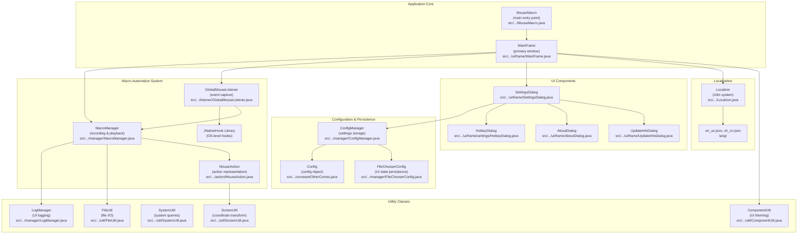
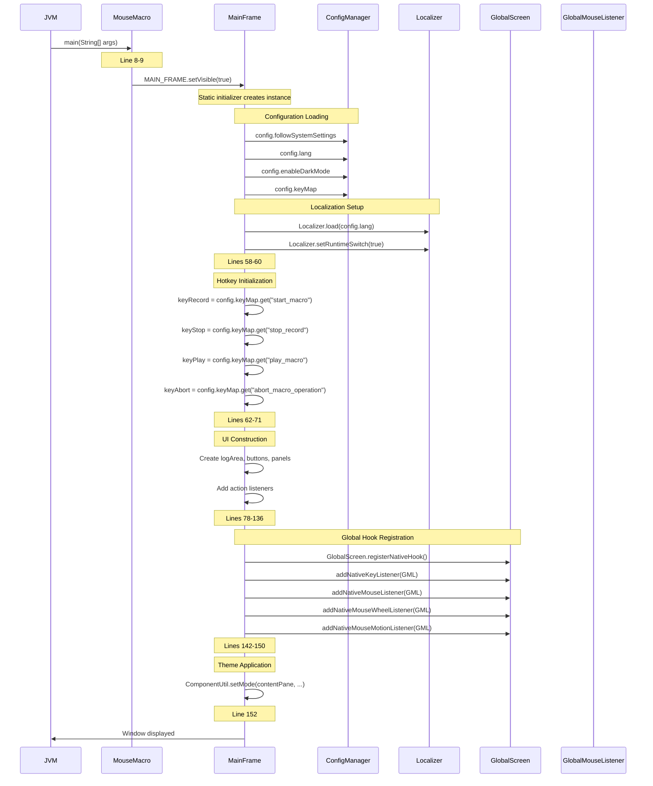
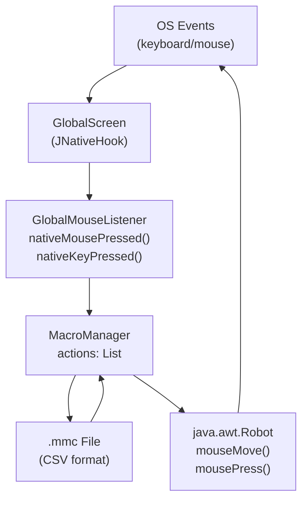

# Home

> **Relevant source files**
> * [LICENSE](https://github.com/Samera2022/MouseMacros/blob/6b37ce1e/LICENSE)
> * [README.md](https://github.com/Samera2022/MouseMacros/blob/6b37ce1e/README.md)
> * [src/io/github/samera2022/mouse_macros/MouseMacro.java](https://github.com/Samera2022/MouseMacros/blob/6b37ce1e/src/io/github/samera2022/mouse_macros/MouseMacro.java)
> * [src/io/github/samera2022/mouse_macros/UpdateInfo.java](https://github.com/Samera2022/MouseMacros/blob/6b37ce1e/src/io/github/samera2022/mouse_macros/UpdateInfo.java)
> * [src/io/github/samera2022/mouse_macros/ui/frame/MainFrame.java](https://github.com/Samera2022/MouseMacros/blob/6b37ce1e/src/io/github/samera2022/mouse_macros/ui/frame/MainFrame.java)

## Purpose and Scope

This wiki documents the **MouseMacros** codebase, a Java-based desktop application for recording and playing back mouse and keyboard macros. The documentation covers system architecture, component interactions, configuration management, and implementation details.

For step-by-step usage instructions, see [Getting Started](/Samera2022/MouseMacros/2-getting-started). For deep dives into specific subsystems, refer to the relevant architecture pages: [Macro Recording and Playback System](/Samera2022/MouseMacros/4-macro-recording-and-playback-system), [Configuration System](/Samera2022/MouseMacros/5-configuration-system), [Localization System](/Samera2022/MouseMacros/6-localization-system), or [User Interface Components](/Samera2022/MouseMacros/7-user-interface-components).

**Sources:** [README.md L1-L2](https://github.com/Samera2022/MouseMacros/blob/6b37ce1e/README.md#L1-L2)

---

## What is MouseMacros?

MouseMacros is a desktop automation tool that captures mouse movements, clicks, keyboard input, and mouse wheel actions, then plays them back on demand. The application uses OS-level hooks via the JNativeHook library to monitor global input events, storing them as sequences that can be saved to disk and replayed with precise timing.

### Key Capabilities

| Feature | Description | Primary Component |
| --- | --- | --- |
| **Input Recording** | Capture mouse position, button presses (left/middle/right), mouse wheel events, and keyboard input | `GlobalMouseListener`, `MacroManager` |
| **Macro Playback** | Execute recorded actions with original timing using `java.awt.Robot` | `MacroManager`, `MouseAction` |
| **Hotkey Control** | Global hotkeys (default: F2-F5) for start/stop/play/abort operations | `MainFrame`, `GlobalMouseListener` |
| **File Persistence** | Save/load macros to `.mmc` files in CSV format | `MacroManager`, `FileUtil` |
| **Multi-Monitor Support** | Coordinate transformation for virtual screen configurations | `ScreenUtil` |
| **Localization** | Multi-language support (English, Chinese) with runtime switching | `Localizer`, language JSON files |
| **Dark Mode** | Theme system with dark/light mode and system synchronization | `ComponentUtil`, `ColorConsts` |
| **Custom Configuration** | Persistent settings for hotkeys, language, storage paths, repeat count | `ConfigManager`, `Config` |

**Sources:** [src/io/github/samera2022/mouse_macros/UpdateInfo.java L6-L41](https://github.com/Samera2022/MouseMacros/blob/6b37ce1e/src/io/github/samera2022/mouse_macros/UpdateInfo.java#L6-L41)

 [src/io/github/samera2022/mouse_macros/ui/frame/MainFrame.java L1-L194](https://github.com/Samera2022/MouseMacros/blob/6b37ce1e/src/io/github/samera2022/mouse_macros/ui/frame/MainFrame.java#L1-L194)

---

## System Architecture Overview

The following diagram maps the major subsystems to their implementing classes and file locations:



**Sources:** All source files listed in diagram, [src/io/github/samera2022/mouse_macros/MouseMacro.java L1-L11](https://github.com/Samera2022/MouseMacros/blob/6b37ce1e/src/io/github/samera2022/mouse_macros/MouseMacro.java#L1-L11)

 [src/io/github/samera2022/mouse_macros/ui/frame/MainFrame.java L1-L194](https://github.com/Samera2022/MouseMacros/blob/6b37ce1e/src/io/github/samera2022/mouse_macros/ui/frame/MainFrame.java#L1-L194)

---

## Application Initialization Sequence

The following sequence diagram shows how the application bootstraps from JVM entry to ready state, with actual method names and class references:



**Sources:** [src/io/github/samera2022/mouse_macros/MouseMacro.java L8-L9](https://github.com/Samera2022/MouseMacros/blob/6b37ce1e/src/io/github/samera2022/mouse_macros/MouseMacro.java#L8-L9)

 [src/io/github/samera2022/mouse_macros/ui/frame/MainFrame.java L50-L162](https://github.com/Samera2022/MouseMacros/blob/6b37ce1e/src/io/github/samera2022/mouse_macros/ui/frame/MainFrame.java#L50-L162)

---

## Core Component Reference

The following table provides a quick reference to the main classes and their locations:

| Component | Class Name | File Path | Purpose |
| --- | --- | --- | --- |
| **Application Entry** | `MouseMacro` | [src/io/github/samera2022/mouse_macros/MouseMacro.java](https://github.com/Samera2022/MouseMacros/blob/6b37ce1e/src/io/github/samera2022/mouse_macros/MouseMacro.java) | Main entry point with `main()` method |
| **Main Window** | `MainFrame` | [src/io/github/samera2022/mouse_macros/ui/frame/MainFrame.java](https://github.com/Samera2022/MouseMacros/blob/6b37ce1e/src/io/github/samera2022/mouse_macros/ui/frame/MainFrame.java) | Primary UI window, event handler orchestration |
| **Macro Recording** | `MacroManager` | [src/io/github/samera2022/mouse_macros/manager/MacroManager.java](https://github.com/Samera2022/MouseMacros/blob/6b37ce1e/src/io/github/samera2022/mouse_macros/manager/MacroManager.java) | State management, recording/playback control |
| **Input Capture** | `GlobalMouseListener` | [src/io/github/samera2022/mouse_macros/listener/GlobalMouseListener.java](https://github.com/Samera2022/MouseMacros/blob/6b37ce1e/src/io/github/samera2022/mouse_macros/listener/GlobalMouseListener.java) | JNativeHook event adapter |
| **Action Representation** | `MouseAction` | [src/io/github/samera2022/mouse_macros/action/MouseAction.java](https://github.com/Samera2022/MouseMacros/blob/6b37ce1e/src/io/github/samera2022/mouse_macros/action/MouseAction.java) | Event data structure and playback executor |
| **Configuration** | `ConfigManager` | [src/io/github/samera2022/mouse_macros/manager/ConfigManager.java](https://github.com/Samera2022/MouseMacros/blob/6b37ce1e/src/io/github/samera2022/mouse_macros/manager/ConfigManager.java) | Settings loading/saving to `config.cfg` |
| **Config Data** | `Config` | [src/io/github/samera2022/mouse_macros/constant/OtherConsts.java](https://github.com/Samera2022/MouseMacros/blob/6b37ce1e/src/io/github/samera2022/mouse_macros/constant/OtherConsts.java) | Configuration object (nested class) |
| **Localization** | `Localizer` | [src/io/github/samera2022/mouse_macros/Localizer.java](https://github.com/Samera2022/MouseMacros/blob/6b37ce1e/src/io/github/samera2022/mouse_macros/Localizer.java) | Translation loading and key lookup |
| **Settings UI** | `SettingsDialog` | [src/io/github/samera2022/mouse_macros/ui/frame/SettingsDialog.java](https://github.com/Samera2022/MouseMacros/blob/6b37ce1e/src/io/github/samera2022/mouse_macros/ui/frame/SettingsDialog.java) | Configuration UI dialog |
| **Hotkey Config UI** | `HotkeyDialog` | [src/io/github/samera2022/mouse_macros/ui/frame/settings/HotkeyDialog.java](https://github.com/Samera2022/MouseMacros/blob/6b37ce1e/src/io/github/samera2022/mouse_macros/ui/frame/settings/HotkeyDialog.java) | Custom hotkey configuration dialog |
| **Theme System** | `ComponentUtil` | [src/io/github/samera2022/mouse_macros/util/ComponentUtil.java](https://github.com/Samera2022/MouseMacros/blob/6b37ce1e/src/io/github/samera2022/mouse_macros/util/ComponentUtil.java) | Dark/light mode application |
| **Coordinate Transform** | `ScreenUtil` | [src/io/github/samera2022/mouse_macros/util/ScreenUtil.java](https://github.com/Samera2022/MouseMacros/blob/6b37ce1e/src/io/github/samera2022/mouse_macros/util/ScreenUtil.java) | Multi-monitor coordinate handling |
| **System Integration** | `SystemUtil` | [src/io/github/samera2022/mouse_macros/util/SystemUtil.java](https://github.com/Samera2022/MouseMacros/blob/6b37ce1e/src/io/github/samera2022/mouse_macros/util/SystemUtil.java) | OS language/theme detection |
| **Version History** | `UpdateInfo` | [src/io/github/samera2022/mouse_macros/UpdateInfo.java](https://github.com/Samera2022/MouseMacros/blob/6b37ce1e/src/io/github/samera2022/mouse_macros/UpdateInfo.java) | Changelog enum (versions 0.0.1 to 1.0.0) |

For detailed documentation of each component, refer to the corresponding architecture pages listed in the table of contents.

**Sources:** All files listed in table

---

## Technology Stack

| Technology | Purpose | Version/Details |
| --- | --- | --- |
| **Java** | Application runtime | Java SE (Swing GUI framework) |
| **JNativeHook** | OS-level input hooks | Global keyboard/mouse event capture |
| **java.awt.Robot** | Input simulation | Playback of recorded actions |
| **Swing** | UI framework | `JFrame`, `JDialog`, `JButton`, etc. |
| **JSON** | Localization files | `en_us.json`, `zh_cn.json` format |
| **CSV** | Macro file format | `.mmc` files with comma-separated values |

### External Dependencies

* **JNativeHook library**: Provides `GlobalScreen`, `NativeKeyEvent`, `NativeMouseEvent`, and listener interfaces
* **java.awt.Robot**: Used by `MouseAction.perform()` for simulating keyboard/mouse events
* **java.util.logging**: JNativeHook logging (disabled by `MainFrame` constructor at lines 138-140)

**Sources:** [src/io/github/samera2022/mouse_macros/ui/frame/MainFrame.java L3-L6](https://github.com/Samera2022/MouseMacros/blob/6b37ce1e/src/io/github/samera2022/mouse_macros/ui/frame/MainFrame.java#L3-L6)

 [src/io/github/samera2022/mouse_macros/ui/frame/MainFrame.java L138-L150](https://github.com/Samera2022/MouseMacros/blob/6b37ce1e/src/io/github/samera2022/mouse_macros/ui/frame/MainFrame.java#L138-L150)

---

## Project File Structure

```markdown
MouseMacros/
├── src/io/github/samera2022/mouse_macros/
│   ├── MouseMacro.java                    # Entry point
│   ├── Localizer.java                     # Localization system
│   ├── UpdateInfo.java                    # Version history enum
│   ├── action/
│   │   └── MouseAction.java               # Event representation
│   ├── constant/
│   │   ├── ColorConsts.java               # Dark/light color schemes
│   │   ├── IconConsts.java                # Custom UI icons
│   │   └── OtherConsts.java               # Config class, constants
│   ├── listener/
│   │   └── GlobalMouseListener.java       # JNativeHook adapter
│   ├── manager/
│   │   ├── ConfigManager.java             # Configuration I/O
│   │   ├── FileChooserConfig.java         # File dialog state
│   │   ├── LogManager.java                # UI logging
│   │   └── MacroManager.java              # Recording/playback
│   ├── ui/
│   │   ├── component/
│   │   │   └── CustomScrollBarUI.java     # Custom scrollbar
│   │   └── frame/
│   │       ├── AboutDialog.java           # About dialog
│   │       ├── MainFrame.java             # Main window
│   │       ├── SettingsDialog.java        # Settings dialog
│   │       ├── UpdateInfoDialog.java      # Version history dialog
│   │       └── settings/
│   │           ├── HotkeyDialog.java      # Hotkey config
│   │           └── MacroSettingsDialogTest.java
│   └── util/
│       ├── ComponentUtil.java             # UI utilities
│       ├── FileUtil.java                  # File I/O
│       ├── OtherUtil.java                 # Miscellaneous
│       ├── ScreenUtil.java                # Coordinate transform
│       └── SystemUtil.java                # System queries
├── lang/
│   ├── en_us.json                         # English translations
│   └── zh_cn.json                         # Chinese translations
├── LICENSE                                 # GNU GPLv3
└── README.md
```

**Sources:** All source files

---

## Data Flow: Recording to Playback

The following diagram illustrates how data flows through the system during a complete record-save-load-play cycle:



**Sources:** [src/io/github/samera2022/mouse_macros/manager/MacroManager.java](https://github.com/Samera2022/MouseMacros/blob/6b37ce1e/src/io/github/samera2022/mouse_macros/manager/MacroManager.java)

 [src/io/github/samera2022/mouse_macros/listener/GlobalMouseListener.java](https://github.com/Samera2022/MouseMacros/blob/6b37ce1e/src/io/github/samera2022/mouse_macros/listener/GlobalMouseListener.java)

 [src/io/github/samera2022/mouse_macros/action/MouseAction.java](https://github.com/Samera2022/MouseMacros/blob/6b37ce1e/src/io/github/samera2022/mouse_macros/action/MouseAction.java)

---

## Version History

MouseMacros has evolved through four major versions, documented in the `UpdateInfo` enum:

| Version | Release Date | Key Features |
| --- | --- | --- |
| **0.0.1** | 2025-07-05 | Initial release: recording, saving, loading, custom hotkeys, localization |
| **0.0.2** | 2025-07-06 | Configuration files, settings UI, about/update dialogs |
| **0.1.0** | 2025-07-08 | Implemented `keyMap` in configuration, refactored architecture |
| **1.0.0** | 2025-07-09 | Added middle mouse button, mouse wheel, keyboard support, abort functionality, file path caching |

For complete changelog details, see [Version History](/Samera2022/MouseMacros/10-version-history).

**Sources:** [src/io/github/samera2022/mouse_macros/UpdateInfo.java L6-L41](https://github.com/Samera2022/MouseMacros/blob/6b37ce1e/src/io/github/samera2022/mouse_macros/UpdateInfo.java#L6-L41)

---

## License

MouseMacros is licensed under the **GNU General Public License v3.0 (GPLv3)**. This is a free, copyleft license that guarantees end users the freedom to run, study, share, and modify the software.

Key points:

* Source code must be made available when distributing the software
* Modifications must be released under the same license
* No warranty is provided

For complete license terms, see [License and Legal](/Samera2022/MouseMacros/11-license-and-legal) or the [LICENSE](https://github.com/Samera2022/MouseMacros/blob/6b37ce1e/LICENSE)

 file.

**Sources:** [LICENSE L1-L674](https://github.com/Samera2022/MouseMacros/blob/6b37ce1e/LICENSE#L1-L674)

---

## Next Steps

* **New Users**: Start with [Getting Started](/Samera2022/MouseMacros/2-getting-started) for installation and basic usage instructions
* **Developers**: Review [Architecture Overview](/Samera2022/MouseMacros/3-architecture-overview) to understand system design
* **Macro System Deep Dive**: See [Macro Recording and Playback System](/Samera2022/MouseMacros/4-macro-recording-and-playback-system)
* **Configuration Reference**: See [Configuration System](/Samera2022/MouseMacros/5-configuration-system) for all available settings
* **UI Customization**: See [User Interface Components](/Samera2022/MouseMacros/7-user-interface-components) for theming and localization