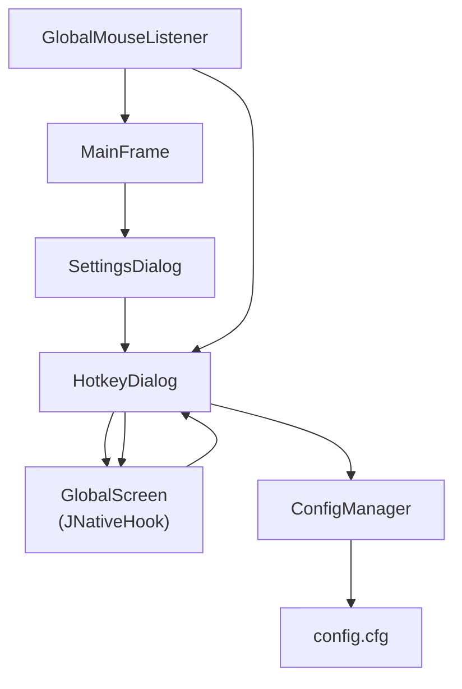
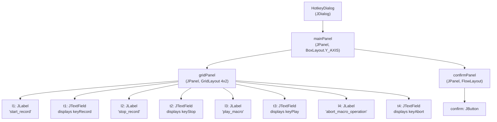
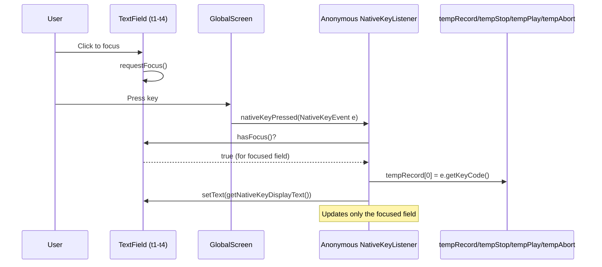

# Hotkey Dialog

> **Relevant source files**
> * [src/io/github/samera2022/mouse_macros/listener/GlobalMouseListener.java](https://github.com/Samera2022/MouseMacros/blob/6b37ce1e/src/io/github/samera2022/mouse_macros/listener/GlobalMouseListener.java)
> * [src/io/github/samera2022/mouse_macros/ui/frame/settings/HotkeyDialog.java](https://github.com/Samera2022/MouseMacros/blob/6b37ce1e/src/io/github/samera2022/mouse_macros/ui/frame/settings/HotkeyDialog.java)

## Purpose and Scope

This document describes the **HotkeyDialog** class, which provides a user interface for customizing the four global hotkeys used to control macro operations. The dialog captures native keyboard input using JNativeHook and persists hotkey assignments to the configuration system.

For information about how hotkeys are processed during macro operations, see [Global Input Capture](/Samera2022/MouseMacros/4.2-global-input-capture). For general settings configuration, see [Settings Dialog](/Samera2022/MouseMacros/7.1-settings-dialog). For the underlying configuration persistence mechanism, see [ConfigManager](/Samera2022/MouseMacros/5.1-configmanager).

**Sources:**

* [src/io/github/samera2022/mouse_macros/ui/frame/settings/HotkeyDialog.java L1-L134](https://github.com/Samera2022/MouseMacros/blob/6b37ce1e/src/io/github/samera2022/mouse_macros/ui/frame/settings/HotkeyDialog.java#L1-L134)

---

## System Overview

The hotkey configuration system consists of three primary components: the **HotkeyDialog** UI for capturing user input, the **GlobalMouseListener** which processes hotkey presses during normal operation, and the **ConfigManager** which persists hotkey assignments. The dialog temporarily registers a dedicated `NativeKeyListener` to capture key presses while the user configures hotkeys.



**Diagram: Hotkey Configuration System Architecture**

The diagram shows how `HotkeyDialog` integrates with the global input system. During configuration, the dialog sets `inHotKeyDialog = true` to prevent `GlobalMouseListener` from triggering macro operations while the user is assigning new keys.

**Sources:**

* [src/io/github/samera2022/mouse_macros/ui/frame/settings/HotkeyDialog.java L20-L22](https://github.com/Samera2022/MouseMacros/blob/6b37ce1e/src/io/github/samera2022/mouse_macros/ui/frame/settings/HotkeyDialog.java#L20-L22)
* [src/io/github/samera2022/mouse_macros/listener/GlobalMouseListener.java L33-L41](https://github.com/Samera2022/MouseMacros/blob/6b37ce1e/src/io/github/samera2022/mouse_macros/listener/GlobalMouseListener.java#L33-L41)

---

## Dialog Architecture

### UI Layout

The `HotkeyDialog` uses a `GridLayout` structure with four rows and two columns, displaying labels and text fields for each of the four configurable hotkeys:

| Hotkey Function | Configuration Field | Static Reference |
| --- | --- | --- |
| Start Recording | `t1: JTextField` | `MainFrame.keyRecord` |
| Stop Recording | `t2: JTextField` | `MainFrame.keyStop` |
| Play Macro | `t3: JTextField` | `MainFrame.keyPlay` |
| Abort Playback | `t4: JTextField` | `MainFrame.keyAbort` |

The text fields are set to non-editable (`setEditable(false)`) because hotkey input is captured via native key events rather than standard text input. The dialog displays human-readable key names using `OtherUtil.getNativeKeyDisplayText()`.

**Sources:**

* [src/io/github/samera2022/mouse_macros/ui/frame/settings/HotkeyDialog.java L26-L44](https://github.com/Samera2022/MouseMacros/blob/6b37ce1e/src/io/github/samera2022/mouse_macros/ui/frame/settings/HotkeyDialog.java#L26-L44)
* [src/io/github/samera2022/mouse_macros/ui/frame/settings/HotkeyDialog.java L35-L39](https://github.com/Samera2022/MouseMacros/blob/6b37ce1e/src/io/github/samera2022/mouse_macros/ui/frame/settings/HotkeyDialog.java#L35-L39)

### Component Hierarchy



**Diagram: HotkeyDialog Component Tree**

The layout uses a vertical `BoxLayout` for the main panel, containing a `GridLayout` for the label-field pairs and a `FlowLayout` for the confirmation button.

**Sources:**

* [src/io/github/samera2022/mouse_macros/ui/frame/settings/HotkeyDialog.java L48-L65](https://github.com/Samera2022/MouseMacros/blob/6b37ce1e/src/io/github/samera2022/mouse_macros/ui/frame/settings/HotkeyDialog.java#L48-L65)

---

## Native Key Capture Mechanism

### Temporary Listener Registration

When the `HotkeyDialog` is constructed, it registers a temporary `NativeKeyListener` with `GlobalScreen` to capture key presses for hotkey assignment. This listener operates independently from the main `GlobalMouseListener`.



**Diagram: Native Key Capture Flow**

The anonymous `NativeKeyListener` created at [HotkeyDialog.java L73-L92](https://github.com/Samera2022/MouseMacros/blob/6b37ce1e/HotkeyDialog.java#L73-L92)

 checks which text field has focus and updates the corresponding temporary array element.

**Sources:**

* [src/io/github/samera2022/mouse_macros/ui/frame/settings/HotkeyDialog.java L73-L92](https://github.com/Samera2022/MouseMacros/blob/6b37ce1e/src/io/github/samera2022/mouse_macros/ui/frame/settings/HotkeyDialog.java#L73-L92)
* [src/io/github/samera2022/mouse_macros/ui/frame/settings/HotkeyDialog.java L93-L105](https://github.com/Samera2022/MouseMacros/blob/6b37ce1e/src/io/github/samera2022/mouse_macros/ui/frame/settings/HotkeyDialog.java#L93-L105)

### Focus Management

Each text field has a `MouseAdapter` attached that requests focus when clicked. This design pattern allows users to simply click a field and press the desired key:

```
// Pattern applied to all four text fields
t1.addMouseListener(new java.awt.event.MouseAdapter() {
    public void mouseClicked(java.awt.event.MouseEvent e) { 
        t1.requestFocus(); 
    }
});
```

The focus check in the key listener ensures that key presses only affect the currently selected field.

**Sources:**

* [src/io/github/samera2022/mouse_macros/ui/frame/settings/HotkeyDialog.java L94-L105](https://github.com/Samera2022/MouseMacros/blob/6b37ce1e/src/io/github/samera2022/mouse_macros/ui/frame/settings/HotkeyDialog.java#L94-L105)

---

## Configuration Persistence

### Confirmation Flow

When the user clicks the confirm button, the dialog executes a multi-step process to persist and activate the new hotkey assignments:

```mermaid
sequenceDiagram
  participant User
  participant confirm: JButton
  participant MainFrame
  participant ConfigManager
  participant config.cfg
  participant GlobalScreen
  participant GlobalMouseListener
  participant KeyListener

  User->>confirm: JButton: Click confirm
  confirm: JButton->>MainFrame: keyRecord = tempRecord[0]
  confirm: JButton->>MainFrame: keyStop = tempStop[0]
  confirm: JButton->>MainFrame: keyPlay = tempPlay[0]
  confirm: JButton->>MainFrame: keyAbort = tempAbort[0]
  confirm: JButton->>ConfigManager: config.keyMap.put("start_record", String.valueOf(keyRecord))
  confirm: JButton->>ConfigManager: config.keyMap.put("stop_record", String.valueOf(keyStop))
  confirm: JButton->>ConfigManager: config.keyMap.put("play_macro", String.valueOf(keyPlay))
  confirm: JButton->>ConfigManager: config.keyMap.put("abort_macro_operation", String.valueOf(keyAbort))
  confirm: JButton->>ConfigManager: saveConfig(config)
  ConfigManager->>config.cfg: Write keyMap to disk
  confirm: JButton->>ConfigManager: reloadConfig()
  confirm: JButton->>GlobalScreen: removeNativeKeyListener(GML)
  confirm: JButton->>GlobalScreen: addNativeKeyListener(GML)
  note over GlobalScreen,GlobalMouseListener: Refreshes hotkey bindings
  confirm: JButton->>GlobalScreen: removeNativeKeyListener(keyListener)
  confirm: JButton->>confirm: JButton: inHotKeyDialog = false
  confirm: JButton->>confirm: JButton: dispose()
```

**Diagram: Hotkey Configuration Persistence Sequence**

The confirmation handler updates static fields in `MainFrame` and persists to `config.keyMap`, then refreshes the `GlobalMouseListener` registration to ensure the new hotkeys take effect immediately.

**Sources:**

* [src/io/github/samera2022/mouse_macros/ui/frame/settings/HotkeyDialog.java L106-L128](https://github.com/Samera2022/MouseMacros/blob/6b37ce1e/src/io/github/samera2022/mouse_macros/ui/frame/settings/HotkeyDialog.java#L106-L128)

### Configuration Storage Format

Hotkey assignments are stored in `config.keyMap` using localized string keys that match translation keys:

| Map Key | Description | Example Value |
| --- | --- | --- |
| `"start_record"` | Start recording hotkey | `"3666"` (F2) |
| `"stop_record"` | Stop recording hotkey | `"3667"` (F3) |
| `"play_macro"` | Play macro hotkey | `"3668"` (F4) |
| `"abort_macro_operation"` | Abort playback hotkey | `"3669"` (F5) |

The values are stored as string representations of JNativeHook key codes (e.g., `NativeKeyEvent.VC_F2` = `3666`).

**Sources:**

* [src/io/github/samera2022/mouse_macros/ui/frame/settings/HotkeyDialog.java L112-L115](https://github.com/Samera2022/MouseMacros/blob/6b37ce1e/src/io/github/samera2022/mouse_macros/ui/frame/settings/HotkeyDialog.java#L112-L115)

---

## Integration with Global Mouse Listener

### State Flag: inHotKeyDialog

The `HotkeyDialog` class maintains a public static boolean flag `inHotKeyDialog` that signals to the `GlobalMouseListener` whether hotkey configuration is in progress. This prevents unintended macro operations during configuration:

```
// HotkeyDialog.java
public static boolean inHotKeyDialog = false;

public HotkeyDialog(){
    inHotKeyDialog = true;
    // ... dialog setup ...
}

// On confirm:
inHotKeyDialog = false;
dispose();
```

The `GlobalMouseListener` checks this flag before processing any hotkey or macro recording events:

```
// GlobalMouseListener.java
if (e.getKeyCode() == keyRecord && (!MacroManager.isRecording()) && (!HotkeyDialog.inHotKeyDialog)) {
    MacroManager.startRecording();
}
```

This pattern appears in all hotkey checks (lines 33, 35, 37, 39) and all recording event handlers (lines 41, 54, 69, 84, 99, 120).

**Sources:**

* [src/io/github/samera2022/mouse_macros/ui/frame/settings/HotkeyDialog.java L20-L22](https://github.com/Samera2022/MouseMacros/blob/6b37ce1e/src/io/github/samera2022/mouse_macros/ui/frame/settings/HotkeyDialog.java#L20-L22)
* [src/io/github/samera2022/mouse_macros/ui/frame/settings/HotkeyDialog.java L126-L127](https://github.com/Samera2022/MouseMacros/blob/6b37ce1e/src/io/github/samera2022/mouse_macros/ui/frame/settings/HotkeyDialog.java#L126-L127)
* [src/io/github/samera2022/mouse_macros/listener/GlobalMouseListener.java L33-L50](https://github.com/Samera2022/MouseMacros/blob/6b37ce1e/src/io/github/samera2022/mouse_macros/listener/GlobalMouseListener.java#L33-L50)

### Listener Refresh Mechanism

After saving new hotkey assignments, the dialog refreshes the `GlobalMouseListener` registration to ensure changes take effect immediately without requiring an application restart:

```
// Refresh GlobalMouseListener registration
GlobalScreen.removeNativeKeyListener(GML);  // Unregister old bindings
GlobalScreen.addNativeKeyListener(GML);     // Re-register with new bindings
```

This pattern leverages the fact that `MainFrame.keyRecord`, `MainFrame.keyStop`, `MainFrame.keyPlay`, and `MainFrame.keyAbort` are public static fields that the `GlobalMouseListener` references directly.

**Sources:**

* [src/io/github/samera2022/mouse_macros/ui/frame/settings/HotkeyDialog.java L119-L120](https://github.com/Samera2022/MouseMacros/blob/6b37ce1e/src/io/github/samera2022/mouse_macros/ui/frame/settings/HotkeyDialog.java#L119-L120)
* [src/io/github/samera2022/mouse_macros/listener/GlobalMouseListener.java L16](https://github.com/Samera2022/MouseMacros/blob/6b37ce1e/src/io/github/samera2022/mouse_macros/listener/GlobalMouseListener.java#L16-L16)

---

## Theming and Localization

### Dark Mode Support

The dialog applies the current theme using `ComponentUtil.setMode()` on the content pane, respecting the `config.enableDarkMode` setting:

```
ComponentUtil.setMode(getContentPane(), 
    config.enableDarkMode ? OtherConsts.DARK_MODE : OtherConsts.LIGHT_MODE);
```

This ensures the hotkey dialog matches the application's overall appearance. For more details on the theming system, see [Theming System](/Samera2022/MouseMacros/7.4-theming-system).

**Sources:**

* [src/io/github/samera2022/mouse_macros/ui/frame/settings/HotkeyDialog.java L66](https://github.com/Samera2022/MouseMacros/blob/6b37ce1e/src/io/github/samera2022/mouse_macros/ui/frame/settings/HotkeyDialog.java#L66-L66)

### Localized Labels

All text displayed in the dialog is localized using `Localizer.get()`:

| Translation Key | Purpose |
| --- | --- |
| `"settings.custom_hotkey"` | Dialog title |
| `"start_record"` | Label for start recording hotkey |
| `"stop_record"` | Label for stop recording hotkey |
| `"play_macro"` | Label for play macro hotkey |
| `"abort_macro_operation"` | Label for abort hotkey |
| `"settings.custom_hotkey.confirm"` | Confirm button text |

Key display text is generated by `OtherUtil.getNativeKeyDisplayText()`, which converts JNativeHook key codes to human-readable strings like "F2", "Ctrl", "Space", etc.

**Sources:**

* [src/io/github/samera2022/mouse_macros/ui/frame/settings/HotkeyDialog.java L24-L40](https://github.com/Samera2022/MouseMacros/blob/6b37ce1e/src/io/github/samera2022/mouse_macros/ui/frame/settings/HotkeyDialog.java#L24-L40)
* [src/io/github/samera2022/mouse_macros/ui/frame/settings/HotkeyDialog.java L17](https://github.com/Samera2022/MouseMacros/blob/6b37ce1e/src/io/github/samera2022/mouse_macros/ui/frame/settings/HotkeyDialog.java#L17-L17)

---

## Key Code Translation

### JNativeHook to Display Text

The `OtherUtil.getNativeKeyDisplayText()` method provides user-friendly key names for display in the text fields. This utility handles special cases like function keys (F1-F12), modifier keys (Ctrl, Shift, Alt), and alphanumeric keys.

The `GlobalMouseListener` also maintains a `toAwtKeyCode()` method at [GlobalMouseListener.java L131-L195](https://github.com/Samera2022/MouseMacros/blob/6b37ce1e/GlobalMouseListener.java#L131-L195)

 for converting JNativeHook key codes to AWT key codes during macro recording, though this is not directly used by `HotkeyDialog`.

**Sources:**

* [src/io/github/samera2022/mouse_macros/ui/frame/settings/HotkeyDialog.java L35-L38](https://github.com/Samera2022/MouseMacros/blob/6b37ce1e/src/io/github/samera2022/mouse_macros/ui/frame/settings/HotkeyDialog.java#L35-L38)
* [src/io/github/samera2022/mouse_macros/listener/GlobalMouseListener.java L131-L195](https://github.com/Samera2022/MouseMacros/blob/6b37ce1e/src/io/github/samera2022/mouse_macros/listener/GlobalMouseListener.java#L131-L195)

---

## Dialog Lifecycle

### Construction and Display

The dialog is constructed and displayed from the `SettingsDialog` when the user requests hotkey customization. The constructor performs all initialization, including:

1. Setting `inHotKeyDialog = true`
2. Creating and laying out UI components
3. Registering the temporary `NativeKeyListener`
4. Setting up focus and action listeners
5. Applying theme and sizing

The dialog is modal, blocking interaction with parent windows until dismissed.

**Sources:**

* [src/io/github/samera2022/mouse_macros/ui/frame/settings/HotkeyDialog.java L21-L132](https://github.com/Samera2022/MouseMacros/blob/6b37ce1e/src/io/github/samera2022/mouse_macros/ui/frame/settings/HotkeyDialog.java#L21-L132)

### Cleanup on Close

When the user confirms or dismisses the dialog, cleanup occurs in this order:

1. Update static hotkey fields in `MainFrame`
2. Persist to `config.keyMap`
3. Refresh `GlobalMouseListener` registration
4. Remove temporary `NativeKeyListener` from `GlobalScreen`
5. Set `inHotKeyDialog = false`
6. Call `dispose()` to release window resources

The `setDefaultCloseOperation(DISPOSE_ON_CLOSE)` ensures proper cleanup if the user closes the window via the X button.

**Sources:**

* [src/io/github/samera2022/mouse_macros/ui/frame/settings/HotkeyDialog.java L106-L132](https://github.com/Samera2022/MouseMacros/blob/6b37ce1e/src/io/github/samera2022/mouse_macros/ui/frame/settings/HotkeyDialog.java#L106-L132)