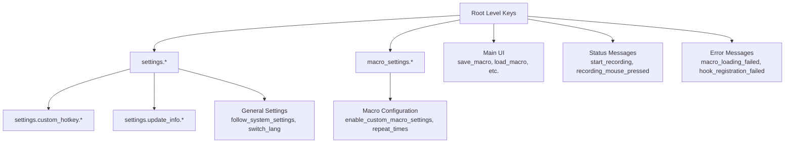
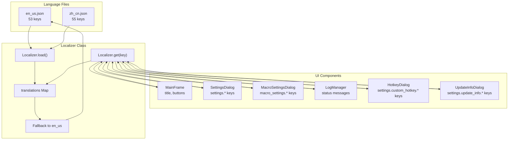
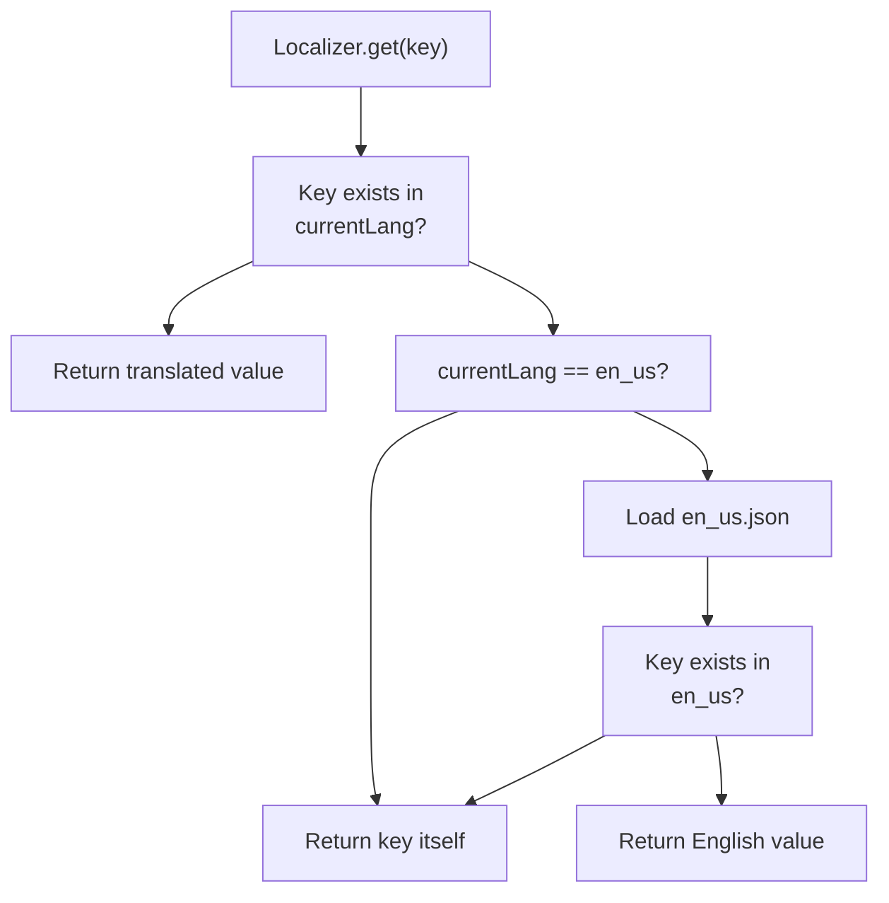

# Language Files

> **Relevant source files**
> * [lang/en_us.json](https://github.com/Samera2022/MouseMacros/blob/6b37ce1e/lang/en_us.json)
> * [lang/zh_cn.json](https://github.com/Samera2022/MouseMacros/blob/6b37ce1e/lang/zh_cn.json)
> * [src/io/github/samera2022/mouse_macros/Localizer.java](https://github.com/Samera2022/MouseMacros/blob/6b37ce1e/src/io/github/samera2022/mouse_macros/Localizer.java)

## Purpose and Scope

This document describes the JSON language files that provide localized text for the MouseMacros application interface. It covers the file structure, supported languages, translation key organization, and the complete key reference for all UI text elements.

For information about the `Localizer` class that loads and manages these language files, see [Localizer](/Samera2022/MouseMacros/6.1-localizer).

## File Structure and Location

Language files are stored in the `lang/` directory and follow a standardized JSON format:

```
lang/
├── en_us.json
└── zh_cn.json
```

Each language file is a flat JSON object where keys represent translation identifiers and values contain the localized text. All files must be encoded in UTF-8 to support international characters.

**Basic Structure:**

```json
{
  "key": "Localized Text",
  "section.key": "Scoped Localized Text"
}
```

The files are loaded by the `Localizer` class [src/io/github/samera2022/mouse_macros/Localizer.java L46-L64](https://github.com/Samera2022/MouseMacros/blob/6b37ce1e/src/io/github/samera2022/mouse_macros/Localizer.java#L46-L64)

 which reads from the file system in development mode or from JAR resources in production.

**Sources:** [lang/en_us.json L1-L54](https://github.com/Samera2022/MouseMacros/blob/6b37ce1e/lang/en_us.json#L1-L54)

 [lang/zh_cn.json L1-L56](https://github.com/Samera2022/MouseMacros/blob/6b37ce1e/lang/zh_cn.json#L1-L56)

 [src/io/github/samera2022/mouse_macros/Localizer.java L14-L32](https://github.com/Samera2022/MouseMacros/blob/6b37ce1e/src/io/github/samera2022/mouse_macros/Localizer.java#L14-L32)

## Supported Languages

Currently, the application supports two languages:

| Language | File Name | Locale Code | Character Set |
| --- | --- | --- | --- |
| English (US) | `en_us.json` | en_us | UTF-8 |
| Simplified Chinese | `zh_cn.json` | zh_cn | UTF-8 |

The `en_us.json` file serves as the fallback language when a translation key is missing in the currently selected language [src/io/github/samera2022/mouse_macros/Localizer.java L66-L92](https://github.com/Samera2022/MouseMacros/blob/6b37ce1e/src/io/github/samera2022/mouse_macros/Localizer.java#L66-L92)

 This ensures the UI never displays empty strings or untranslated keys.

**File Naming Convention:**

* Format: `<language>_<region>.json`
* Lowercase with underscore separator
* Examples: `en_us.json`, `zh_cn.json`, `es_es.json`, `fr_fr.json`

**Sources:** [lang/en_us.json L1](https://github.com/Samera2022/MouseMacros/blob/6b37ce1e/lang/en_us.json#L1-L1)

 [lang/zh_cn.json L1](https://github.com/Samera2022/MouseMacros/blob/6b37ce1e/lang/zh_cn.json#L1-L1)

 [src/io/github/samera2022/mouse_macros/Localizer.java L19-L31](https://github.com/Samera2022/MouseMacros/blob/6b37ce1e/src/io/github/samera2022/mouse_macros/Localizer.java#L19-L31)

## Translation Key Organization

Translation keys follow a hierarchical naming convention using dot notation to group related UI elements:



**Key Categories:**

1. **Main UI Elements** - Top-level keys for window title and primary buttons
2. **Settings Section** - Prefixed with `settings.` for SettingsDialog
3. **Macro Settings Section** - Prefixed with `macro_settings.` for MacroSettingsDialog
4. **Runtime Messages** - Recording and playback status messages
5. **Error Messages** - Failure notifications and warnings

**Sources:** [lang/en_us.json L1-L53](https://github.com/Samera2022/MouseMacros/blob/6b37ce1e/lang/en_us.json#L1-L53)

 [lang/zh_cn.json L1-L55](https://github.com/Samera2022/MouseMacros/blob/6b37ce1e/lang/zh_cn.json#L1-L55)

## Key Reference

### Main UI Elements

These keys define the primary window components displayed in `MainFrame`:

| Key | English (en_us) | Chinese (zh_cn) | Usage |
| --- | --- | --- | --- |
| `title` | Mouse Macro Recorder | 鼠标宏录制器 | Window title |
| `save_macro` | Save Macro | 保存宏 | Save button |
| `load_macro` | Load Macro | 加载宏 | Load button |
| `start_record` | Start Recording | 开始录制 | Start recording button |
| `stop_record` | Stop Recording | 停止录制 | Stop recording button |
| `play_macro` | Play Macro | 执行宏 | Play button |
| `abort_macro_operation` | Abort Operation | 中止宏 | Abort button |
| `macro_settings` | Macro Settings | 宏设置 | Macro settings button |
| `settings` | Settings | 设置 | Settings button |

**Sources:** [lang/en_us.json L2-L11](https://github.com/Samera2022/MouseMacros/blob/6b37ce1e/lang/en_us.json#L2-L11)

 [lang/zh_cn.json L2-L11](https://github.com/Samera2022/MouseMacros/blob/6b37ce1e/lang/zh_cn.json#L2-L11)

### Settings Dialog Keys

These keys are used in `SettingsDialog` and its sub-dialogs:

| Key | English (en_us) | Chinese (zh_cn) | Context |
| --- | --- | --- | --- |
| `settings.follow_system_settings` | Follow System Settings | 跟随系统设置 | Checkbox option |
| `settings.switch_lang` | Switch Language | 切换语言 | Language dropdown label |
| `settings.enable_dark_mode` | Enable Dark Mode | 启用深色模式 | Dark mode toggle |
| `settings.default_mmc_storage_path` | Default Mouse Macros Storage Path | 默认鼠标宏存储文件夹 | Path selector label |
| `settings.browse` | Browse | 浏览 | Browse button |
| `settings.about_author` | About Author | 关于作者 | About button |
| `settings.custom_hotkey` | Custom Hotkey | 自定义热键 | Hotkey button |
| `settings.custom_hotkey.confirm` | Confirm | 确定 | Hotkey dialog confirm |
| `settings.update_info` | Update Info | 更新日志 | Update info button |
| `settings.update_info.select_version` | Select Version | 选择版本 | Version dropdown |
| `settings.save_settings` | Save and Apply All Settings | 保存并应用所有配置 | Save button |

**Sources:** [lang/en_us.json L12-L22](https://github.com/Samera2022/MouseMacros/blob/6b37ce1e/lang/en_us.json#L12-L22)

 [lang/zh_cn.json L11-L22](https://github.com/Samera2022/MouseMacros/blob/6b37ce1e/lang/zh_cn.json#L11-L22)

### Macro Settings Keys

These keys are used in `MacroSettingsDialog`:

| Key | English (en_us) | Chinese (zh_cn) | Context |
| --- | --- | --- | --- |
| `macro_settings.enable_custom_macro_settings` | Enable Custom Macro Settings | 启用自定义宏 | Enable checkbox |
| `macro_settings.repeat_times` | Execution Repeat Times: | 执行重复次数： | Repeat count label |
| `macro_settings.save_settings` | Save and Apply All Macro Settings | 保存并应用所有宏配置 | Save button |

**Sources:** [lang/en_us.json L24-L26](https://github.com/Samera2022/MouseMacros/blob/6b37ce1e/lang/en_us.json#L24-L26)

 [lang/zh_cn.json L24-L26](https://github.com/Samera2022/MouseMacros/blob/6b37ce1e/lang/zh_cn.json#L24-L26)

### Runtime Status Messages

These keys are displayed in the `LogManager` output area during macro operations:

| Key | English (en_us) | Chinese (zh_cn) | When Displayed |
| --- | --- | --- | --- |
| `start_recording` | Start recording... | 开始录制... | Recording starts |
| `recording_mouse_pressed` | Recording: Mouse Pressed | 记录：鼠标按下 | Mouse button press detected |
| `recording_mouse_released` | Recording: Mouse Released | 记录：鼠标松开 | Mouse button release detected |
| `mouse_left` | Left | 左键 | Left mouse button |
| `mouse_middle` | Middle | 中键 | Middle mouse button |
| `mouse_right` | Right | 右键 | Right mouse button |
| `recording_scroll_msg1` | Recording: Wheel Scrolled | 记录：滚轮滚动 | Mouse wheel scrolled |
| `recording_scroll_msg2` | Wheel: | 滚轮偏移量： | Wheel offset prefix |
| `recording_key_pressed` | (not in en_us) | 记录：按下 | Key press detected |
| `recording_key_released` | (not in en_us) | 记录：松开 | Key release detected |
| `stop_recording_msg1` | Recording stopped, total | 录制结束，共记录 | Recording stops (part 1) |
| `stop_recording_msg2` | actions recorded | 个操作 | Recording stops (part 2) |
| `no_recorded_actions` | No recorded actions | 没有录制内容 | Recording has no actions |
| `start_playback` | Start playback... | 开始回放... | Playback starts |
| `playback_complete` | Playback complete | 回放结束 | Playback finishes |
| `playback_error` | Playback error: | 回放异常: | Playback fails |
| `macro_saved` | Macro is saved as | 宏已保存： | Save succeeds |
| `macro_saving_failed` | Macro saving failed: | 保存失败： | Save fails |
| `macro_loaded_msg1` | Macro is loaded: | 宏已加载 | Load succeeds (part 1) |
| `macro_loaded_msg2` | Steps | 步 | Load succeeds (part 2) |
| `macro_loading_failed` | Macro loading failed: | 加载失败： | Load fails |
| `macro_loading_line_error` | Error Occurred in line: | 报错行数： | Line number with error |
| `macro_aborted` | Macro Aborted | 宏已被中止 | Abort succeeds |
| `macro_not_running` | Macro is not running currently | 宏未被执行 | Abort when not running |
| `macro_not_recording` | Macro is not being recorded currently | 宏未被录制 | Stop when not recording |

**Note:** The `recording_key_pressed` and `recording_key_released` keys exist only in `zh_cn.json` [lang/zh_cn.json L36-L37](https://github.com/Samera2022/MouseMacros/blob/6b37ce1e/lang/zh_cn.json#L36-L37)

 If these keys are used with English selected, the fallback mechanism will return the key name itself.

**Sources:** [lang/en_us.json L28-L51](https://github.com/Samera2022/MouseMacros/blob/6b37ce1e/lang/en_us.json#L28-L51)

 [lang/zh_cn.json L28-L52](https://github.com/Samera2022/MouseMacros/blob/6b37ce1e/lang/zh_cn.json#L28-L52)

### Error Messages

| Key | English (en_us) | Chinese (zh_cn) | Context |
| --- | --- | --- | --- |
| `hook_registration_failed` | Global hook registration failed: | 全局钩子注册失败： | JNativeHook registration fails |

**Sources:** [lang/en_us.json L52](https://github.com/Samera2022/MouseMacros/blob/6b37ce1e/lang/en_us.json#L52-L52)

 [lang/zh_cn.json L54](https://github.com/Samera2022/MouseMacros/blob/6b37ce1e/lang/zh_cn.json#L54-L54)

## Translation Key Usage Pattern

The diagram below shows how translation keys flow from the language files through the `Localizer` to various UI components:



**Sources:** [src/io/github/samera2022/mouse_macros/Localizer.java L46-L92](https://github.com/Samera2022/MouseMacros/blob/6b37ce1e/src/io/github/samera2022/mouse_macros/Localizer.java#L46-L92)

 [lang/en_us.json L1-L53](https://github.com/Samera2022/MouseMacros/blob/6b37ce1e/lang/en_us.json#L1-L53)

 [lang/zh_cn.json L1-L55](https://github.com/Samera2022/MouseMacros/blob/6b37ce1e/lang/zh_cn.json#L1-L55)

## Adding New Languages

To add a new language to the application:

### Step 1: Create the Language File

Create a new JSON file in the `lang/` directory following the naming convention:

```
lang/<language>_<region>.json
```

Examples:

* Spanish (Spain): `es_es.json`
* French (France): `fr_fr.json`
* German (Germany): `de_de.json`
* Japanese (Japan): `ja_jp.json`

### Step 2: Copy the Template

Copy all keys from [lang/en_us.json L1-L53](https://github.com/Samera2022/MouseMacros/blob/6b37ce1e/lang/en_us.json#L1-L53)

 to maintain consistency:

```
{
  "title": "",
  "save_macro": "",
  "load_macro": "",
  ...
}
```

### Step 3: Translate All Values

Translate each English value to the target language, ensuring:

* UTF-8 encoding is preserved
* Special characters are properly escaped in JSON
* Button text is concise (fits in UI layout)
* Error messages are clear and actionable

### Step 4: Update ConfigManager

The new language will be automatically detected by `ConfigManager.getAvailableLanguages()` [src/io/github/samera2022/mouse_macros/manager/ConfigManager.java](https://github.com/Samera2022/MouseMacros/blob/6b37ce1e/src/io/github/samera2022/mouse_macros/manager/ConfigManager.java)

 which scans the `lang/` directory for `*.json` files.

### Step 5: Test the Language

1. Set the language in `config.cfg`: `lang=<language>_<region>`
2. Launch the application
3. Verify all UI elements display correctly
4. Test with long translations to ensure layout compatibility
5. Verify the fallback mechanism works for any missing keys

**Key Considerations:**

* **Missing Keys:** If any key is missing, the `Localizer` will fall back to `en_us.json` [src/io/github/samera2022/mouse_macros/Localizer.java L66-L92](https://github.com/Samera2022/MouseMacros/blob/6b37ce1e/src/io/github/samera2022/mouse_macros/Localizer.java#L66-L92)  If the key is also missing in English, the key name itself is returned.
* **Text Length:** Some languages require more space than English. Test button widths and dialog layouts with longer translations.
* **Right-to-Left Languages:** The current implementation does not support RTL languages (Arabic, Hebrew). Adding RTL support would require UI component modifications.
* **Character Encoding:** Always save language files with UTF-8 encoding to ensure special characters display correctly.

**Sources:** [lang/en_us.json L1-L53](https://github.com/Samera2022/MouseMacros/blob/6b37ce1e/lang/en_us.json#L1-L53)

 [src/io/github/samera2022/mouse_macros/Localizer.java L46-L64](https://github.com/Samera2022/MouseMacros/blob/6b37ce1e/src/io/github/samera2022/mouse_macros/Localizer.java#L46-L64)

## Fallback Mechanism

The `Localizer` implements a two-tier fallback strategy to ensure robust text display:



**Fallback Logic:**

1. **Primary Lookup:** Search for the key in the current language's translations map [src/io/github/samera2022/mouse_macros/Localizer.java L67](https://github.com/Samera2022/MouseMacros/blob/6b37ce1e/src/io/github/samera2022/mouse_macros/Localizer.java#L67-L67)
2. **English Fallback:** If not found and current language is not `en_us`, load the English file and search again [src/io/github/samera2022/mouse_macros/Localizer.java L70-L88](https://github.com/Samera2022/MouseMacros/blob/6b37ce1e/src/io/github/samera2022/mouse_macros/Localizer.java#L70-L88)
3. **Key Return:** If still not found, return the key name itself [src/io/github/samera2022/mouse_macros/Localizer.java L91](https://github.com/Samera2022/MouseMacros/blob/6b37ce1e/src/io/github/samera2022/mouse_macros/Localizer.java#L91-L91)

This ensures the UI is never blank, even with incomplete translations or missing keys.

**Sources:** [src/io/github/samera2022/mouse_macros/Localizer.java L66-L92](https://github.com/Samera2022/MouseMacros/blob/6b37ce1e/src/io/github/samera2022/mouse_macros/Localizer.java#L66-L92)

## Character Encoding

All language files must use **UTF-8 encoding** to support international characters. This is critical for languages like Chinese, Japanese, Arabic, and those using accented characters.

The `Localizer` explicitly specifies UTF-8 when reading files:

* From file system: `new FileReader(file)` with default encoding [src/io/github/samera2022/mouse_macros/Localizer.java L51](https://github.com/Samera2022/MouseMacros/blob/6b37ce1e/src/io/github/samera2022/mouse_macros/Localizer.java#L51-L51)
* From JAR resources: `new InputStreamReader(in, "UTF-8")` [src/io/github/samera2022/mouse_macros/Localizer.java L56](https://github.com/Samera2022/MouseMacros/blob/6b37ce1e/src/io/github/samera2022/mouse_macros/Localizer.java#L56-L56)

**Best Practices:**

* Configure your text editor to save with UTF-8 encoding
* Verify encoding using file inspection tools
* Test non-ASCII characters after editing
* Avoid BOM (Byte Order Mark) which can cause parsing issues

**Sources:** [src/io/github/samera2022/mouse_macros/Localizer.java L51-L59](https://github.com/Samera2022/MouseMacros/blob/6b37ce1e/src/io/github/samera2022/mouse_macros/Localizer.java#L51-L59)

 [lang/zh_cn.json L1-L55](https://github.com/Samera2022/MouseMacros/blob/6b37ce1e/lang/zh_cn.json#L1-L55)