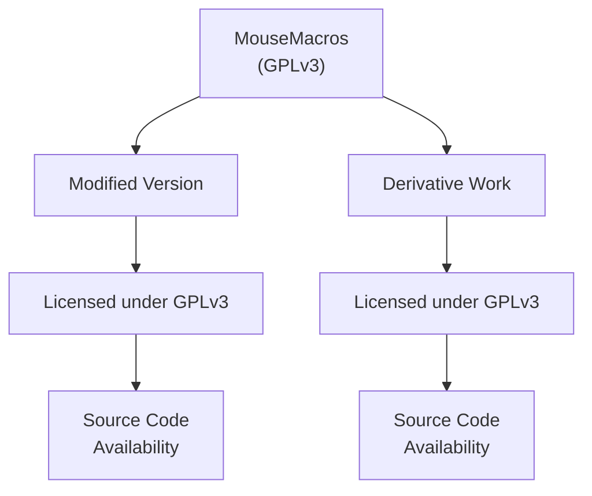
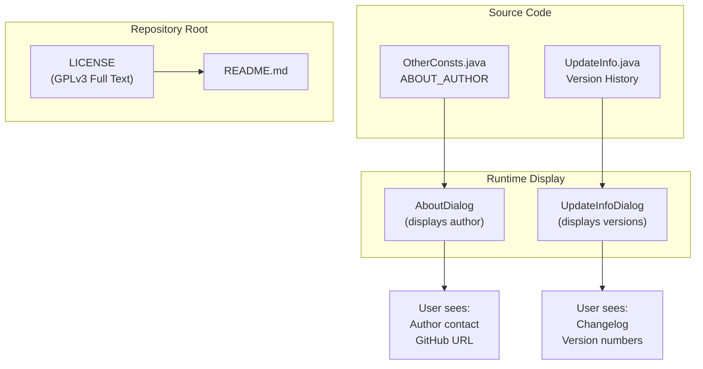

# License and Legal

> **Relevant source files**
> * [LICENSE](https://github.com/Samera2022/MouseMacros/blob/6b37ce1e/LICENSE)
> * [README.md](https://github.com/Samera2022/MouseMacros/blob/6b37ce1e/README.md)
> * [src/io/github/samera2022/mouse_macros/constant/FileConsts.java](https://github.com/Samera2022/MouseMacros/blob/6b37ce1e/src/io/github/samera2022/mouse_macros/constant/FileConsts.java)
> * [src/io/github/samera2022/mouse_macros/constant/OtherConsts.java](https://github.com/Samera2022/MouseMacros/blob/6b37ce1e/src/io/github/samera2022/mouse_macros/constant/OtherConsts.java)
> * [src/io/github/samera2022/mouse_macros/manager/config/FileChooserConfig.java](https://github.com/Samera2022/MouseMacros/blob/6b37ce1e/src/io/github/samera2022/mouse_macros/manager/config/FileChooserConfig.java)

This document specifies the licensing terms, copyright information, and legal framework governing the MouseMacros application. It covers distribution rights, warranty disclaimers, and compliance requirements for users and developers.

For information about the author and project version history, see [Version History](/Samera2022/MouseMacros/10-version-history).

---

## License Overview

MouseMacros is free and open-source software distributed under the **GNU General Public License version 3.0 (GPLv3)**. The complete license text is located in [LICENSE L1-L675](https://github.com/Samera2022/MouseMacros/blob/6b37ce1e/LICENSE#L1-L675)

### License Type and Implications

| Aspect | Details |
| --- | --- |
| **License** | GNU General Public License v3.0 |
| **License Type** | Copyleft |
| **Source Availability** | Required for distribution |
| **Modification Rights** | Permitted with attribution |
| **Commercial Use** | Permitted |
| **Patent Grant** | Included (GPLv3 §11) |
| **Sublicensing** | Not allowed (GPLv3 §10) |

**Sources:** [LICENSE L1-L10](https://github.com/Samera2022/MouseMacros/blob/6b37ce1e/LICENSE#L1-L10)

---

## Copyright Information

### Primary Copyright Holder

The application is authored and copyrighted by **Samera2022**. Author contact information is embedded in [src/io/github/samera2022/mouse_macros/constant/OtherConsts.java L9-L11](https://github.com/Samera2022/MouseMacros/blob/6b37ce1e/src/io/github/samera2022/mouse_macros/constant/OtherConsts.java#L9-L11)

:

```
ABOUT_AUTHOR = "你好，我是MouseMacros的作者Samera2022..."
```

### Contact Channels

| Platform | Identifier |
| --- | --- |
| **GitHub** | [https://github.com/Samera2022/MouseMacros](https://github.com/Samera2022/MouseMacros) |
| **Bilibili** | UID: 583460263 |
| **QQ** | 3517085924 |

The author prefers issue reports via GitHub Issues for better tracking and visibility.

**Sources:** [src/io/github/samera2022/mouse_macros/constant/OtherConsts.java L9-L11](https://github.com/Samera2022/MouseMacros/blob/6b37ce1e/src/io/github/samera2022/mouse_macros/constant/OtherConsts.java#L9-L11)

 [README.md L1-L2](https://github.com/Samera2022/MouseMacros/blob/6b37ce1e/README.md#L1-L2)

---

## Key License Terms

### Distribution Rights

The GPLv3 grants users four essential freedoms:

1. **Freedom to Run**: Execute the program for any purpose ([LICENSE L159-L162](https://github.com/Samera2022/MouseMacros/blob/6b37ce1e/LICENSE#L159-L162) )
2. **Freedom to Study**: Access and examine source code ([LICENSE L114-L116](https://github.com/Samera2022/MouseMacros/blob/6b37ce1e/LICENSE#L114-L116) )
3. **Freedom to Redistribute**: Share copies with others ([LICENSE L197-L206](https://github.com/Samera2022/MouseMacros/blob/6b37ce1e/LICENSE#L197-L206) )
4. **Freedom to Modify**: Create and distribute modified versions ([LICENSE L208-L233](https://github.com/Samera2022/MouseMacros/blob/6b37ce1e/LICENSE#L208-L233) )

### Source Code Requirements

When distributing MouseMacros (modified or unmodified), you must:

1. **Include License Text**: Provide a copy of the GPLv3 ([LICENSE L200-L203](https://github.com/Samera2022/MouseMacros/blob/6b37ce1e/LICENSE#L200-L203) )
2. **Provide Source Code**: Make source available under GPLv3 terms ([LICENSE L247-L250](https://github.com/Samera2022/MouseMacros/blob/6b37ce1e/LICENSE#L247-L250) )
3. **Preserve Copyright Notices**: Keep all existing copyright and license notices intact ([LICENSE L200-L201](https://github.com/Samera2022/MouseMacros/blob/6b37ce1e/LICENSE#L200-L201) )
4. **Document Changes**: Mark modified versions as changed ([LICENSE L214-L216](https://github.com/Samera2022/MouseMacros/blob/6b37ce1e/LICENSE#L214-L216) )

### Copyleft Effect



**Copyleft Mechanism**: Any work based on or incorporating MouseMacros must be licensed under GPLv3 ([LICENSE L222-L228](https://github.com/Samera2022/MouseMacros/blob/6b37ce1e/LICENSE#L222-L228)

), ensuring the four freedoms propagate to all recipients.

**Sources:** [LICENSE L154-L178](https://github.com/Samera2022/MouseMacros/blob/6b37ce1e/LICENSE#L154-L178)

 [LICENSE L208-L233](https://github.com/Samera2022/MouseMacros/blob/6b37ce1e/LICENSE#L208-L233)

---

## Warranty and Liability Disclaimers

### No Warranty

The GPLv3 explicitly disclaims all warranties ([LICENSE L589-L598](https://github.com/Samera2022/MouseMacros/blob/6b37ce1e/LICENSE#L589-L598)

):

```
THERE IS NO WARRANTY FOR THE PROGRAM, TO THE EXTENT PERMITTED BY
APPLICABLE LAW... THE ENTIRE RISK AS TO THE QUALITY AND PERFORMANCE
OF THE PROGRAM IS WITH YOU.
```

| Warranty Type | Status |
| --- | --- |
| **Merchantability** | Disclaimed |
| **Fitness for Purpose** | Disclaimed |
| **Quality Guarantee** | None |
| **Performance Guarantee** | None |

**Sources:** [LICENSE L589-L598](https://github.com/Samera2022/MouseMacros/blob/6b37ce1e/LICENSE#L589-L598)

### Limitation of Liability

Copyright holders and contributors are not liable for damages arising from the program's use ([LICENSE L600-L610](https://github.com/Samera2022/MouseMacros/blob/6b37ce1e/LICENSE#L600-L610)

):

* **No liability for data loss**
* **No liability for program defects**
* **No liability for consequential damages**
* **No liability for third-party failures**

This applies even if the copyright holder was advised of the possibility of such damages.

**Sources:** [LICENSE L600-L610](https://github.com/Samera2022/MouseMacros/blob/6b37ce1e/LICENSE#L600-L610)

---

## Legal Framework in Codebase

### License Reference Structure



The codebase embeds author and licensing information that surfaces in the UI:

1. **OtherConsts.ABOUT_AUTHOR**: Contains author contact details in Chinese ([src/io/github/samera2022/mouse_macros/constant/OtherConsts.java L9-L11](https://github.com/Samera2022/MouseMacros/blob/6b37ce1e/src/io/github/samera2022/mouse_macros/constant/OtherConsts.java#L9-L11) )
2. **UpdateInfo enum**: Documents version history referenced in copyright claims ([src/io/github/samera2022/mouse_macros/UpdateInfo.java](https://github.com/Samera2022/MouseMacros/blob/6b37ce1e/src/io/github/samera2022/mouse_macros/UpdateInfo.java) )
3. **AboutDialog**: Displays author information to end users (see [About and Update Dialogs](/Samera2022/MouseMacros/7.3-about-and-update-dialogs))

**Sources:** [src/io/github/samera2022/mouse_macros/constant/OtherConsts.java L9-L11](https://github.com/Samera2022/MouseMacros/blob/6b37ce1e/src/io/github/samera2022/mouse_macros/constant/OtherConsts.java#L9-L11)

 [LICENSE L1-L675](https://github.com/Samera2022/MouseMacros/blob/6b37ce1e/LICENSE#L1-L675)

---

## Compliance Requirements

### For Users

| Activity | Requirements |
| --- | --- |
| **Running the program** | No restrictions |
| **Personal modifications** | No distribution obligations |
| **Sharing original** | Must include LICENSE file |
| **Sharing modifications** | Must license under GPLv3 and provide source |

### For Developers

When modifying or distributing MouseMacros:

1. **Retain Copyright Notices**: Do not remove existing copyright statements from [src/io/github/samera2022/mouse_macros/constant/OtherConsts.java L9-L11](https://github.com/Samera2022/MouseMacros/blob/6b37ce1e/src/io/github/samera2022/mouse_macros/constant/OtherConsts.java#L9-L11)
2. **Add Your Copyright**: Add your own copyright line for significant contributions
3. **Document Changes**: Update version history in UpdateInfo enum (see [Version History](/Samera2022/MouseMacros/10-version-history))
4. **Provide Source**: Make modified source code available under GPLv3
5. **Include License**: Distribute the LICENSE file with all copies

### For Redistributors

When packaging MouseMacros for distribution:

```

```

**Sources:** [LICENSE L195-L206](https://github.com/Samera2022/MouseMacros/blob/6b37ce1e/LICENSE#L195-L206)

 [LICENSE L208-L233](https://github.com/Samera2022/MouseMacros/blob/6b37ce1e/LICENSE#L208-L233)

---

## Patent Provisions

The GPLv3 includes explicit patent protection provisions ([LICENSE L471-L538](https://github.com/Samera2022/MouseMacros/blob/6b37ce1e/LICENSE#L471-L538)

):

### Patent License Grant

Each contributor grants a **non-exclusive, worldwide, royalty-free patent license** covering:

* Making the software
* Using the software
* Selling the software
* Offering for sale
* Importing
* Running, modifying, and propagating

### Patent Retaliation

If you initiate patent litigation alleging the program infringes, your license terminates automatically ([LICENSE L408-L413](https://github.com/Samera2022/MouseMacros/blob/6b37ce1e/LICENSE#L408-L413)

).

**Sources:** [LICENSE L471-L538](https://github.com/Samera2022/MouseMacros/blob/6b37ce1e/LICENSE#L471-L538)

---

## Third-Party Dependencies

MouseMacros relies on the **JNativeHook library** for OS-level input capture (see [Global Input Capture](/Samera2022/MouseMacros/4.2-global-input-capture)). Users and redistributors must comply with JNativeHook's licensing terms in addition to MouseMacros' GPLv3 license.

### Dependency License Compatibility

| Dependency | License | GPLv3 Compatible |
| --- | --- | --- |
| **JNativeHook** | LGPL v3 or GPLv3 | ✅ Yes |
| **Java Runtime** | GPL v2 + Classpath Exception | ✅ Yes |
| **Gson** (for JSON) | Apache 2.0 | ✅ Yes |

The GPLv3 explicitly allows combining with AGPL v3 works ([LICENSE L552-L561](https://github.com/Samera2022/MouseMacros/blob/6b37ce1e/LICENSE#L552-L561)

) and other compatible licenses.

**Sources:** [LICENSE L552-L561](https://github.com/Samera2022/MouseMacros/blob/6b37ce1e/LICENSE#L552-L561)

---

## File Format Licensing

### .mmc Macro Files

The `.mmc` file format (see [Macro File Format](/Samera2022/MouseMacros/4.4-macro-file-format-(.mmc))) stores recorded mouse actions. These files are:

1. **Not Program Code**: They are data files, not executable software
2. **User-Created Content**: Generated by users during program operation
3. **No License Restriction**: The GPLv3 does not impose restrictions on output generated by the program ([LICENSE L159-L162](https://github.com/Samera2022/MouseMacros/blob/6b37ce1e/LICENSE#L159-L162) )

Users retain full rights to their recorded macro files and may use them without GPLv3 obligations.

**Sources:** [LICENSE L159-L162](https://github.com/Samera2022/MouseMacros/blob/6b37ce1e/LICENSE#L159-L162)

 [src/io/github/samera2022/mouse_macros/constant/FileConsts.java L6-L9](https://github.com/Samera2022/MouseMacros/blob/6b37ce1e/src/io/github/samera2022/mouse_macros/constant/FileConsts.java#L6-L9)

### Configuration Files

Similarly, configuration files created by MouseMacros are user data:

| File | Location | Legal Status |
| --- | --- | --- |
| **config.cfg** | AppData/MouseMacros/ | User data (see [Configuration Files](/Samera2022/MouseMacros/5.2-configuration-files)) |
| **cache.json** | AppData/MouseMacros/ | User data (see [File Chooser Configuration](/Samera2022/MouseMacros/5.3-file-chooser-configuration)) |
| ***.mmc files** | User-specified | User data |

These files are not subject to GPLv3 distribution requirements.

**Sources:** [src/io/github/samera2022/mouse_macros/manager/config/FileChooserConfig.java L1-L28](https://github.com/Samera2022/MouseMacros/blob/6b37ce1e/src/io/github/samera2022/mouse_macros/manager/config/FileChooserConfig.java#L1-L28)

 [src/io/github/samera2022/mouse_macros/constant/FileConsts.java L6-L9](https://github.com/Samera2022/MouseMacros/blob/6b37ce1e/src/io/github/samera2022/mouse_macros/constant/FileConsts.java#L6-L9)

---

## License Modification and Updates

### Version Compatibility

The MouseMacros LICENSE file specifies GPLv3 without the "or any later version" clause. This means:

* The software is licensed specifically under **GPLv3 only**
* It does not automatically adopt future GPL versions
* Users may not unilaterally relicense under GPLv4 or later (if released)

### Requesting License Changes

Copyright holder Samera2022 may change the license for future versions. To request a license change:

1. Open a GitHub Issue at [https://github.com/Samera2022/MouseMacros](https://github.com/Samera2022/MouseMacros)
2. Explain your use case and license requirements
3. Await author's decision

Previous versions remain under their original GPLv3 license regardless of future changes.

**Sources:** [LICENSE L564-L587](https://github.com/Samera2022/MouseMacros/blob/6b37ce1e/LICENSE#L564-L587)

---

## Summary of Key Points

| Topic | Key Information |
| --- | --- |
| **License** | GNU General Public License v3.0 |
| **Copyright** | Samera2022 |
| **Repository** | [https://github.com/Samera2022/MouseMacros](https://github.com/Samera2022/MouseMacros) |
| **Warranty** | None (AS-IS) |
| **Liability** | Disclaimed |
| **Source Code** | Must be provided with distributions |
| **Modifications** | Allowed, must be marked and licensed under GPLv3 |
| **User Data** | .mmc files and config files not subject to GPLv3 |
| **Contact** | GitHub Issues (preferred), Bilibili, QQ |

**Sources:** [LICENSE L1-L675](https://github.com/Samera2022/MouseMacros/blob/6b37ce1e/LICENSE#L1-L675)

 [src/io/github/samera2022/mouse_macros/constant/OtherConsts.java L9-L11](https://github.com/Samera2022/MouseMacros/blob/6b37ce1e/src/io/github/samera2022/mouse_macros/constant/OtherConsts.java#L9-L11)

 [README.md L1-L2](https://github.com/Samera2022/MouseMacros/blob/6b37ce1e/README.md#L1-L2)