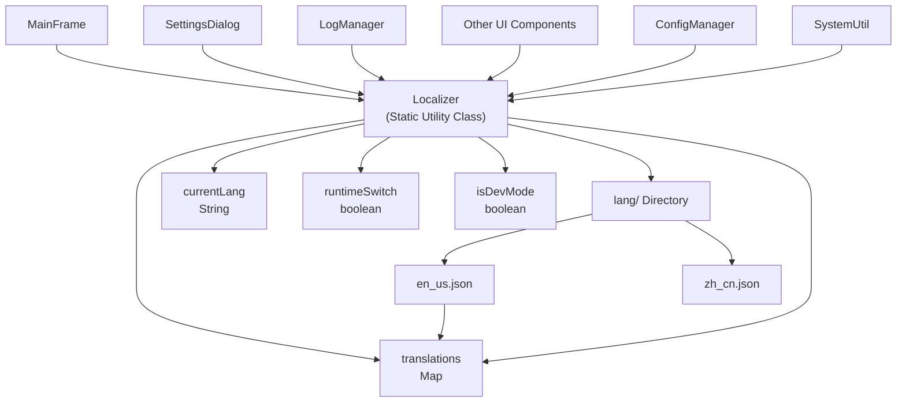
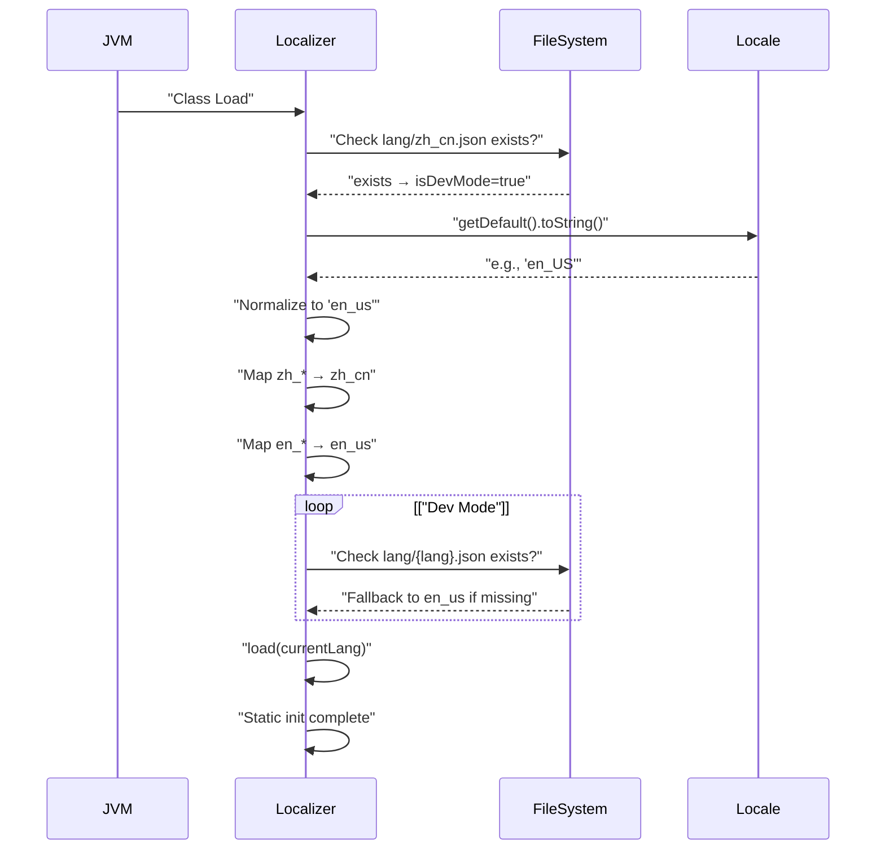
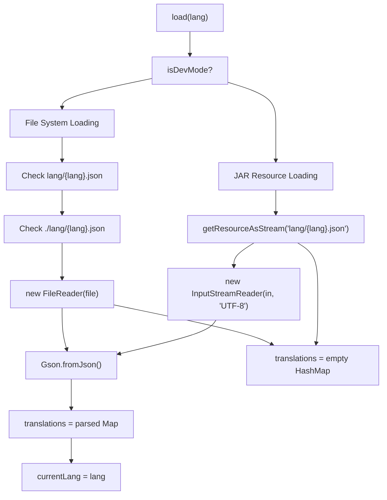
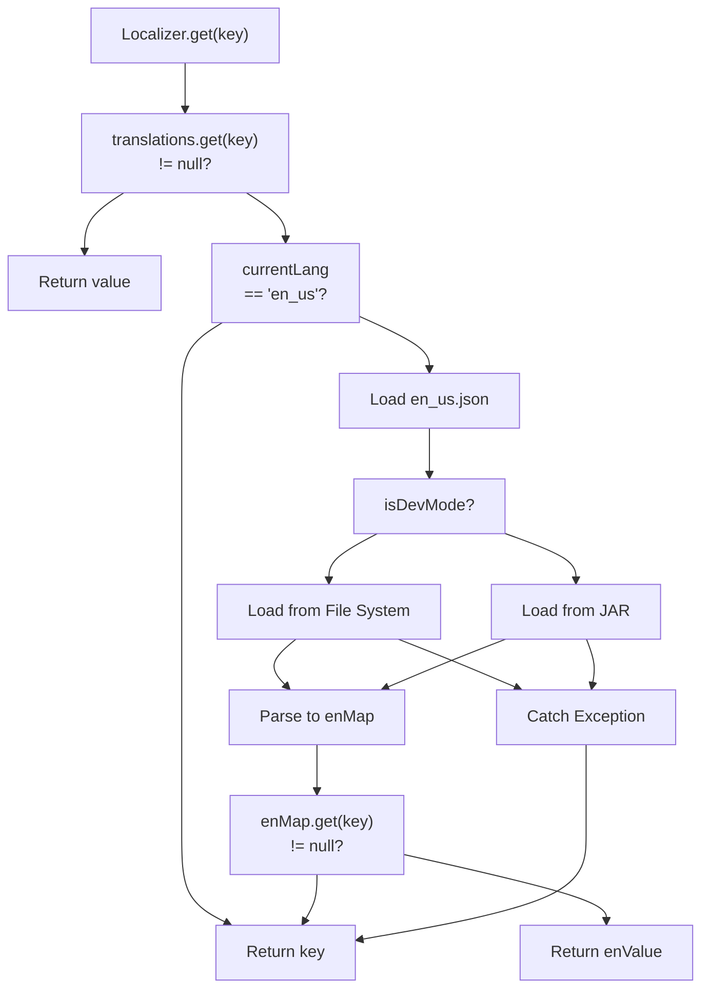

# Localization System

> **Relevant source files**
> * [lang/en_us.json](https://github.com/Samera2022/MouseMacros/blob/6b37ce1e/lang/en_us.json)
> * [lang/zh_cn.json](https://github.com/Samera2022/MouseMacros/blob/6b37ce1e/lang/zh_cn.json)
> * [src/io/github/samera2022/mouse_macros/Localizer.java](https://github.com/Samera2022/MouseMacros/blob/6b37ce1e/src/io/github/samera2022/mouse_macros/Localizer.java)

## Purpose and Scope

This document describes the internationalization (i18n) architecture of the MouseMacros application. The localization system provides multi-language support for all user-facing text, including UI labels, status messages, and error notifications. It implements a static utility pattern with fallback mechanisms and runtime language switching capabilities.

For configuration of language preferences, see [Configuration System](/Samera2022/MouseMacros/5-configuration-system). For UI components that consume localized strings, see [User Interface Components](/Samera2022/MouseMacros/7-user-interface-components).

**Sources:** [src/io/github/samera2022/mouse_macros/Localizer.java L1-L97](https://github.com/Samera2022/MouseMacros/blob/6b37ce1e/src/io/github/samera2022/mouse_macros/Localizer.java#L1-L97)

 [lang/en_us.json L1-L54](https://github.com/Samera2022/MouseMacros/blob/6b37ce1e/lang/en_us.json#L1-L54)

 [lang/zh_cn.json L1-L56](https://github.com/Samera2022/MouseMacros/blob/6b37ce1e/lang/zh_cn.json#L1-L56)

---

## Architecture Overview

The localization system consists of three primary components: the `Localizer` static utility class, JSON language files in the `lang/` directory, and consuming UI components that request translations.



**Diagram: Core Localization Architecture**

The `Localizer` class maintains a `translations` map containing key-value pairs loaded from JSON files. All UI components access localized strings through the static `Localizer.get(String key)` method. The system automatically detects the environment (development vs production) and loads resources accordingly.

**Sources:** [src/io/github/samera2022/mouse_macros/Localizer.java L8-L97](https://github.com/Samera2022/MouseMacros/blob/6b37ce1e/src/io/github/samera2022/mouse_macros/Localizer.java#L8-L97)

---

## Localizer Class

### Static Initialization

The `Localizer` class initializes automatically when first accessed through a static initializer block:



**Diagram: Static Initialization Sequence**

The initialization process [src/io/github/samera2022/mouse_macros/Localizer.java L14-L32](https://github.com/Samera2022/MouseMacros/blob/6b37ce1e/src/io/github/samera2022/mouse_macros/Localizer.java#L14-L32)

:

1. **Environment Detection**: Checks if `lang/zh_cn.json` exists in the file system to determine if running in development mode [src/io/github/samera2022/mouse_macros/Localizer.java L16-L17](https://github.com/Samera2022/MouseMacros/blob/6b37ce1e/src/io/github/samera2022/mouse_macros/Localizer.java#L16-L17)
2. **System Language Detection**: Retrieves the system locale via `java.util.Locale.getDefault()` [src/io/github/samera2022/mouse_macros/Localizer.java L20](https://github.com/Samera2022/MouseMacros/blob/6b37ce1e/src/io/github/samera2022/mouse_macros/Localizer.java#L20-L20)
3. **Language Normalization**: Converts locale strings to the internal format (e.g., `en_US` → `en_us`) and maps language families (e.g., `zh_*` → `zh_cn`) [src/io/github/samera2022/mouse_macros/Localizer.java L21-L23](https://github.com/Samera2022/MouseMacros/blob/6b37ce1e/src/io/github/samera2022/mouse_macros/Localizer.java#L21-L23)
4. **File Existence Check**: In development mode, verifies the language file exists; falls back to `en_us` if not found [src/io/github/samera2022/mouse_macros/Localizer.java L25-L28](https://github.com/Samera2022/MouseMacros/blob/6b37ce1e/src/io/github/samera2022/mouse_macros/Localizer.java#L25-L28)
5. **Initial Load**: Calls `load(currentLang)` to populate the `translations` map [src/io/github/samera2022/mouse_macros/Localizer.java L31](https://github.com/Samera2022/MouseMacros/blob/6b37ce1e/src/io/github/samera2022/mouse_macros/Localizer.java#L31-L31)

**Sources:** [src/io/github/samera2022/mouse_macros/Localizer.java L14-L32](https://github.com/Samera2022/MouseMacros/blob/6b37ce1e/src/io/github/samera2022/mouse_macros/Localizer.java#L14-L32)

### Key Methods

| Method | Signature | Purpose |
| --- | --- | --- |
| `load(String lang)` | `public static void load(String)` | Loads translations from the specified language file into the `translations` map |
| `get(String key)` | `public static String get(String)` | Retrieves a localized string for the given key, with fallback logic |
| `getCurrentLang()` | `public static String getCurrentLang()` | Returns the currently loaded language code (e.g., `en_us`) |
| `setRuntimeSwitch(boolean)` | `public static void setRuntimeSwitch(boolean)` | Enables or disables runtime language switching |
| `isRuntimeSwitch()` | `public static boolean isRuntimeSwitch()` | Returns whether runtime switching is enabled |
| `isDevMode()` | `public static boolean isDevMode()` | Returns whether running in development mode |

**Sources:** [src/io/github/samera2022/mouse_macros/Localizer.java L34-L96](https://github.com/Samera2022/MouseMacros/blob/6b37ce1e/src/io/github/samera2022/mouse_macros/Localizer.java#L34-L96)

### State Variables

The `Localizer` maintains four static state variables:

* **`translations`** (`Map<String, String>`): The key-value store for all localized strings in the current language [src/io/github/samera2022/mouse_macros/Localizer.java L9](https://github.com/Samera2022/MouseMacros/blob/6b37ce1e/src/io/github/samera2022/mouse_macros/Localizer.java#L9-L9)
* **`currentLang`** (`String`): The language code currently loaded (e.g., `en_us`, `zh_cn`) [src/io/github/samera2022/mouse_macros/Localizer.java L10](https://github.com/Samera2022/MouseMacros/blob/6b37ce1e/src/io/github/samera2022/mouse_macros/Localizer.java#L10-L10)
* **`runtimeSwitch`** (`boolean`): Flag indicating whether runtime language switching is allowed; set to `true` by `MainFrame` during initialization [src/io/github/samera2022/mouse_macros/Localizer.java L11](https://github.com/Samera2022/MouseMacros/blob/6b37ce1e/src/io/github/samera2022/mouse_macros/Localizer.java#L11-L11)
* **`isDevMode`** (`boolean`): Flag indicating whether the application is running in development mode (file system access) vs production mode (JAR resources) [src/io/github/samera2022/mouse_macros/Localizer.java L12](https://github.com/Samera2022/MouseMacros/blob/6b37ce1e/src/io/github/samera2022/mouse_macros/Localizer.java#L12-L12)

**Sources:** [src/io/github/samera2022/mouse_macros/Localizer.java L9-L12](https://github.com/Samera2022/MouseMacros/blob/6b37ce1e/src/io/github/samera2022/mouse_macros/Localizer.java#L9-L12)

---

## Language Files

### File Structure

Language files are JSON documents stored in the `lang/` directory. Each file contains a flat key-value structure where keys are dot-separated identifiers and values are localized strings.

**Example Structure:**

```json
{
  "title": "Mouse Macro Recorder",
  "save_macro": "Save Macro",
  "settings.switch_lang": "Switch Language",
  "start_recording": "Start recording..."
}
```

**Sources:** [lang/en_us.json L1-L54](https://github.com/Samera2022/MouseMacros/blob/6b37ce1e/lang/en_us.json#L1-L54)

 [lang/zh_cn.json L1-L56](https://github.com/Samera2022/MouseMacros/blob/6b37ce1e/lang/zh_cn.json#L1-L56)

### Supported Languages

| Language Code | File | Description | Coverage |
| --- | --- | --- | --- |
| `en_us` | `lang/en_us.json` | English (US) - Fallback language | 52 keys |
| `zh_cn` | `lang/zh_cn.json` | Simplified Chinese | 54 keys |

The Chinese translation includes two additional keys (`recording_key_pressed` and `recording_key_released`) not present in the English version, demonstrating partial language-specific extensions [lang/zh_cn.json L36-L37](https://github.com/Samera2022/MouseMacros/blob/6b37ce1e/lang/zh_cn.json#L36-L37)

**Sources:** [lang/en_us.json L1-L54](https://github.com/Samera2022/MouseMacros/blob/6b37ce1e/lang/en_us.json#L1-L54)

 [lang/zh_cn.json L1-L56](https://github.com/Samera2022/MouseMacros/blob/6b37ce1e/lang/zh_cn.json#L1-L56)

### Translation Key Categories

The translation keys are organized into the following categories:

#### Main Window Controls

```
title, save_macro, load_macro, start_record, stop_record, 
play_macro, abort_macro_operation, macro_settings
```

#### Settings Dialog

```
settings, settings.follow_system_settings, settings.switch_lang,
settings.enable_dark_mode, settings.default_mmc_storage_path,
settings.browse, settings.about_author, settings.custom_hotkey,
settings.custom_hotkey.confirm, settings.update_info,
settings.update_info.select_version, settings.save_settings
```

#### Macro Settings Dialog

```
macro_settings.enable_custom_macro_settings,
macro_settings.repeat_times, macro_settings.save_settings
```

#### Status Messages

```
start_recording, recording_mouse_pressed, recording_mouse_released,
recording_scroll_msg1, recording_scroll_msg2, stop_recording_msg1,
stop_recording_msg2, no_recorded_actions, start_playback,
playback_complete, playback_error, macro_saved, macro_saving_failed,
macro_loaded_msg1, macro_loaded_msg2, macro_loading_failed,
macro_loading_line_error, macro_aborted, macro_not_running,
macro_not_recording
```

#### Mouse Button Labels

```
mouse_left, mouse_middle, mouse_right
```

#### Error Messages

```
hook_registration_failed
```

**Sources:** [lang/en_us.json L1-L54](https://github.com/Samera2022/MouseMacros/blob/6b37ce1e/lang/en_us.json#L1-L54)

 [lang/zh_cn.json L1-L56](https://github.com/Samera2022/MouseMacros/blob/6b37ce1e/lang/zh_cn.json#L1-L56)

---

## Translation Loading Mechanism

### Dual-Mode Resource Loading

The `load(String lang)` method implements environment-aware resource loading:



**Diagram: Translation Loading Process**

#### Development Mode

When `isDevMode` is `true` [src/io/github/samera2022/mouse_macros/Localizer.java L48-L51](https://github.com/Samera2022/MouseMacros/blob/6b37ce1e/src/io/github/samera2022/mouse_macros/Localizer.java#L48-L51)

:

1. Attempts to load from `lang/{lang}.json`
2. Falls back to `./lang/{lang}.json` if first path fails
3. Reads file using `FileReader` with system default encoding
4. Parses JSON using `Gson.fromJson(reader, Map.class)`

#### Production Mode

When `isDevMode` is `false` [src/io/github/samera2022/mouse_macros/Localizer.java L52-L59](https://github.com/Samera2022/MouseMacros/blob/6b37ce1e/src/io/github/samera2022/mouse_macros/Localizer.java#L52-L59)

:

1. Loads resource from classpath using `getResourceAsStream("lang/{lang}.json")`
2. Wraps stream in `InputStreamReader` with explicit UTF-8 encoding
3. Parses JSON using `Gson.fromJson(reader, Map.class)`
4. Properly closes the `InputStream` using try-with-resources

#### Error Handling

If any exception occurs during loading, the `translations` map is set to an empty `HashMap`, preventing null pointer exceptions [src/io/github/samera2022/mouse_macros/Localizer.java L61-L63](https://github.com/Samera2022/MouseMacros/blob/6b37ce1e/src/io/github/samera2022/mouse_macros/Localizer.java#L61-L63)

**Sources:** [src/io/github/samera2022/mouse_macros/Localizer.java L46-L64](https://github.com/Samera2022/MouseMacros/blob/6b37ce1e/src/io/github/samera2022/mouse_macros/Localizer.java#L46-L64)

---

## Fallback Strategy

The `get(String key)` method implements a three-tier fallback mechanism:



**Diagram: Translation Fallback Logic**

### Fallback Tiers

1. **Current Language Lookup** [src/io/github/samera2022/mouse_macros/Localizer.java L67-L68](https://github.com/Samera2022/MouseMacros/blob/6b37ce1e/src/io/github/samera2022/mouse_macros/Localizer.java#L67-L68) : * Retrieves value from `translations.get(key)` * If found, returns immediately
2. **English Fallback** [src/io/github/samera2022/mouse_macros/Localizer.java L70-L88](https://github.com/Samera2022/MouseMacros/blob/6b37ce1e/src/io/github/samera2022/mouse_macros/Localizer.java#L70-L88) : * If current language is not `en_us`, loads `en_us.json` * Parses the English file and retrieves the key * If found in English, returns the English value
3. **Key Echo** [src/io/github/samera2022/mouse_macros/Localizer.java L91](https://github.com/Samera2022/MouseMacros/blob/6b37ce1e/src/io/github/samera2022/mouse_macros/Localizer.java#L91-L91) : * If key not found in either language, returns the key itself * Ensures UI never displays empty strings

### Implementation Details

The English fallback logic is executed on-demand each time a missing key is requested, not cached. This approach:

* Minimizes memory overhead (no duplicate map storage)
* Ensures consistency if language files change during development
* May impact performance for frequently missing keys (acceptable trade-off for typical usage)

The fallback ignores all exceptions during English file loading [src/io/github/samera2022/mouse_macros/Localizer.java L89](https://github.com/Samera2022/MouseMacros/blob/6b37ce1e/src/io/github/samera2022/mouse_macros/Localizer.java#L89-L89)

 preventing cascading failures from blocking UI rendering.

**Sources:** [src/io/github/samera2022/mouse_macros/Localizer.java L66-L92](https://github.com/Samera2022/MouseMacros/blob/6b37ce1e/src/io/github/samera2022/mouse_macros/Localizer.java#L66-L92)

---

## Runtime Language Switching

Runtime language switching allows changing the application language without restarting. This feature is controlled by the `runtimeSwitch` flag.

### Enabling Runtime Switching

The `MainFrame` class enables runtime switching during initialization by calling `Localizer.setRuntimeSwitch(true)` after loading the initial language from configuration. This permits language changes through the `SettingsDialog`.

### Switching Process

When a user changes the language in `SettingsDialog`:

1. `SettingsDialog` calls `Localizer.load(newLang)` with the new language code
2. The `Localizer` reloads the `translations` map from the new language file
3. `SettingsDialog` updates `ConfigManager.config.lang` to persist the choice
4. UI components must manually refresh their text by re-calling `Localizer.get()` for each string

### Limitations

Runtime switching does **not** automatically update displayed text in existing windows. Each UI component must implement its own refresh logic to re-fetch localized strings after a language change. The current implementation does not provide a global refresh mechanism or observer pattern for language change notifications.

**Sources:** [src/io/github/samera2022/mouse_macros/Localizer.java L34-L40](https://github.com/Samera2022/MouseMacros/blob/6b37ce1e/src/io/github/samera2022/mouse_macros/Localizer.java#L34-L40)

---

## System Language Detection

The static initializer detects the system language during class loading to provide appropriate defaults.

### Detection Algorithm

The detection process [src/io/github/samera2022/mouse_macros/Localizer.java L19-L30](https://github.com/Samera2022/MouseMacros/blob/6b37ce1e/src/io/github/samera2022/mouse_macros/Localizer.java#L19-L30)

:

1. **Retrieve System Locale**: Calls `java.util.Locale.getDefault().toString()` which returns a string like `en_US`, `zh_CN`, `ja_JP`
2. **Normalize Format**: Converts to lowercase and replaces hyphens with underscores (e.g., `en-US` → `en_us`)
3. **Map Language Families**: * Any locale starting with `zh` → `zh_cn` * Any locale starting with `en` → `en_us`
4. **Verify File Existence** (dev mode only): Checks if the mapped language file exists
5. **Fallback to English**: If the file doesn't exist in dev mode, uses `en_us`

### Locale Mapping Table

| System Locale Examples | Normalized | Mapped To |
| --- | --- | --- |
| `en_US`, `en_GB`, `en_AU` | `en_us`, `en_gb`, `en_au` | `en_us` |
| `zh_CN`, `zh_TW`, `zh_HK` | `zh_cn`, `zh_tw`, `zh_hk` | `zh_cn` |
| `ja_JP` | `ja_jp` | `ja_jp` (no mapping) |
| `fr_FR` | `fr_fr` | `fr_fr` (no mapping) |

For unmapped locales (e.g., `ja_jp`, `fr_fr`), the system attempts to load a corresponding file. If it doesn't exist in dev mode, it falls back to `en_us`. In production mode, the fallback occurs at runtime when the resource cannot be found.

**Sources:** [src/io/github/samera2022/mouse_macros/Localizer.java L19-L30](https://github.com/Samera2022/MouseMacros/blob/6b37ce1e/src/io/github/samera2022/mouse_macros/Localizer.java#L19-L30)

---

## Usage by UI Components

### Standard Access Pattern

All UI components follow a consistent pattern for accessing localized strings:

```python
// Example from MainFrame
String buttonText = Localizer.get("save_macro");
JButton saveButton = new JButton(buttonText);

// Example from LogManager
String message = Localizer.get("start_recording");
logArea.append(message + "\n");
```

### Components Using Localization

| Component | Usage Context | Example Keys |
| --- | --- | --- |
| `MainFrame` | Window title, button labels | `title`, `save_macro`, `start_record` |
| `SettingsDialog` | Settings labels, section headers | `settings`, `settings.switch_lang` |
| `HotkeyDialog` | Key descriptions, confirmation | `settings.custom_hotkey`, `settings.custom_hotkey.confirm` |
| `AboutDialog` | Dialog title | `settings.about_author` |
| `UpdateInfoDialog` | Version selector label | `settings.update_info.select_version` |
| `LogManager` | Status and error messages | `start_recording`, `macro_saved`, `playback_error` |
| `MacroManager` | Recording/playback status | `recording_mouse_pressed`, `playback_complete` |

**Sources:** [src/io/github/samera2022/mouse_macros/Localizer.java L66-L92](https://github.com/Samera2022/MouseMacros/blob/6b37ce1e/src/io/github/samera2022/mouse_macros/Localizer.java#L66-L92)

### Message Composition

Some status messages require composition with dynamic data:

```
// Compound message with two parts
String msg1 = Localizer.get("stop_recording_msg1");  // "Recording stopped, total "
String msg2 = Localizer.get("stop_recording_msg2");  // " actions recorded"
String fullMessage = msg1 + actionCount + msg2;

// Error message with exception details
String prefix = Localizer.get("playback_error");  // "Playback error: "
String fullError = prefix + exception.getMessage();
```

This pattern appears in keys like:

* `stop_recording_msg1` / `stop_recording_msg2`
* `macro_loaded_msg1` / `macro_loaded_msg2`
* `recording_scroll_msg1` / `recording_scroll_msg2`

**Sources:** [lang/en_us.json L36-L46](https://github.com/Samera2022/MouseMacros/blob/6b37ce1e/lang/en_us.json#L36-L46)

 [lang/zh_cn.json L38-L49](https://github.com/Samera2022/MouseMacros/blob/6b37ce1e/lang/zh_cn.json#L38-L49)

---

## Translation Key Reference

Complete listing of all translation keys with their English and Chinese translations:

| Key | English (en_us) | Chinese (zh_cn) | Component |
| --- | --- | --- | --- |
| `title` | Mouse Macro Recorder | 鼠标宏录制器 | MainFrame |
| `save_macro` | Save Macro | 保存宏 | MainFrame |
| `load_macro` | Load Macro | 加载宏 | MainFrame |
| `start_record` | Start Recording | 开始录制 | MainFrame |
| `stop_record` | Stop Recording | 停止录制 | MainFrame |
| `play_macro` | Play Macro | 执行宏 | MainFrame |
| `abort_macro_operation` | Abort Operation | 中止宏 | MainFrame |
| `macro_settings` | Macro Settings | 宏设置 | MainFrame |
| `settings` | Settings | 设置 | SettingsDialog |
| `settings.follow_system_settings` | Follow System Settings | 跟随系统设置 | SettingsDialog |
| `settings.switch_lang` | Switch Language | 切换语言 | SettingsDialog |
| `settings.enable_dark_mode` | Enable Dark Mode | 启用深色模式 | SettingsDialog |
| `settings.default_mmc_storage_path` | Default Mouse Macros Storage Path | 默认鼠标宏存储文件夹 | SettingsDialog |
| `settings.browse` | Browse | 浏览 | SettingsDialog |
| `settings.about_author` | About Author | 关于作者 | SettingsDialog |
| `settings.custom_hotkey` | Custom Hotkey | 自定义热键 | SettingsDialog |
| `settings.custom_hotkey.confirm` | Confirm | 确定 | HotkeyDialog |
| `settings.update_info` | Update Info | 更新日志 | SettingsDialog |
| `settings.update_info.select_version` | Select Version | 选择版本 | UpdateInfoDialog |
| `settings.save_settings` | Save and Apply All Settings | 保存并应用所有配置 | SettingsDialog |
| `macro_settings.enable_custom_macro_settings` | Enable Custom Macro Settings | 启用自定义宏 | MacroSettingsDialog |
| `macro_settings.repeat_times` | Execution Repeat Times: | 执行重复次数： | MacroSettingsDialog |
| `macro_settings.save_settings` | Save and Apply All Macro Settings | 保存并应用所有宏配置 | MacroSettingsDialog |
| `start_recording` | Start recording... | 开始录制... | LogManager |
| `recording_mouse_pressed` | Recording: Mouse Pressed | 记录：鼠标按下 | LogManager |
| `recording_mouse_released` | Recording: Mouse Released | 记录：鼠标松开 | LogManager |
| `mouse_left` | Left | 左键 | LogManager |
| `mouse_middle` | Middle | 中键 | LogManager |
| `mouse_right` | Right | 右键 | LogManager |
| `recording_scroll_msg1` | Recording: Wheel Scrolled | 记录：滚轮滚动 | LogManager |
| `recording_scroll_msg2` | Wheel: | 滚轮偏移量： | LogManager |
| `recording_key_pressed` | *(not in en_us)* | 记录：按下 | LogManager |
| `recording_key_released` | *(not in en_us)* | 记录：松开 | LogManager |
| `stop_recording_msg1` | Recording stopped, total | 录制结束，共记录 | LogManager |
| `stop_recording_msg2` | actions recorded | 个操作 | LogManager |
| `no_recorded_actions` | No recorded actions | 没有录制内容 | LogManager |
| `start_playback` | Start playback... | 开始回放... | LogManager |
| `playback_complete` | Playback complete | 回放结束 | LogManager |
| `playback_error` | Playback error: | 回放异常: | LogManager |
| `macro_saved` | Macro is saved as | 宏已保存： | LogManager |
| `macro_saving_failed` | Macro saving failed: | 保存失败： | LogManager |
| `macro_loaded_msg1` | Macro is loaded: | 宏已加载 | LogManager |
| `macro_loaded_msg2` | Steps | 步 | LogManager |
| `macro_loading_failed` | Macro loading failed: | 加载失败： | LogManager |
| `macro_loading_line_error` | Error Occurred in line: | 报错行数： | LogManager |
| `macro_aborted` | Macro Aborted | 宏已被中止 | LogManager |
| `macro_not_running` | Macro is not running currently | 宏未被执行 | LogManager |
| `macro_not_recording` | Macro is not being recorded currently | 宏未被录制 | LogManager |
| `hook_registration_failed` | Global hook registration failed: | 全局钩子注册失败： | MainFrame |

**Note**: The Chinese language file contains two additional keys (`recording_key_pressed` and `recording_key_released`) that are not present in the English version. These will fall back to displaying the key name itself when requested in English mode.

**Sources:** [lang/en_us.json L1-L54](https://github.com/Samera2022/MouseMacros/blob/6b37ce1e/lang/en_us.json#L1-L54)

 [lang/zh_cn.json L1-L56](https://github.com/Samera2022/MouseMacros/blob/6b37ce1e/lang/zh_cn.json#L1-L56)