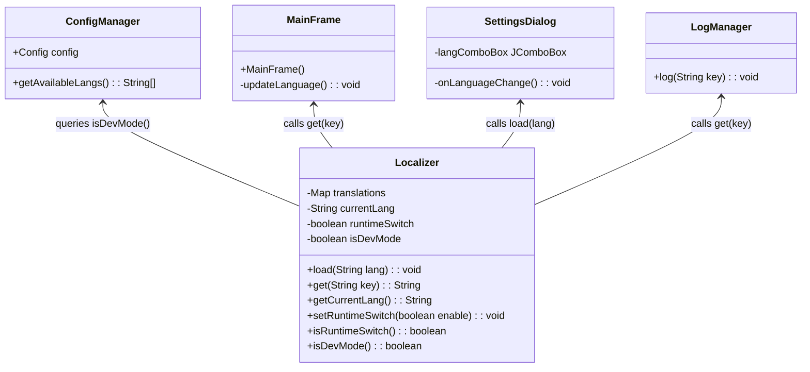
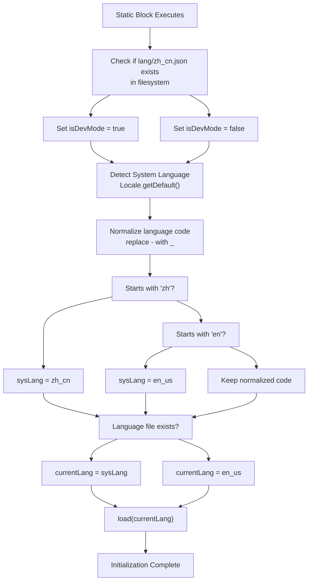
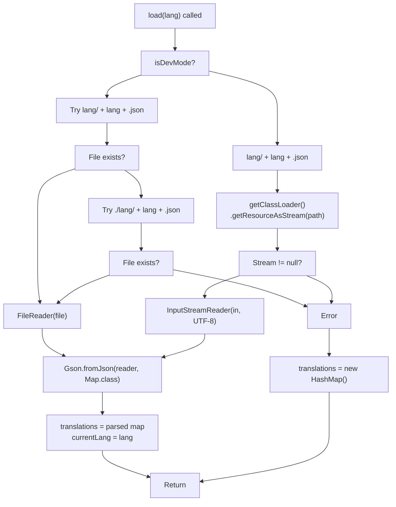
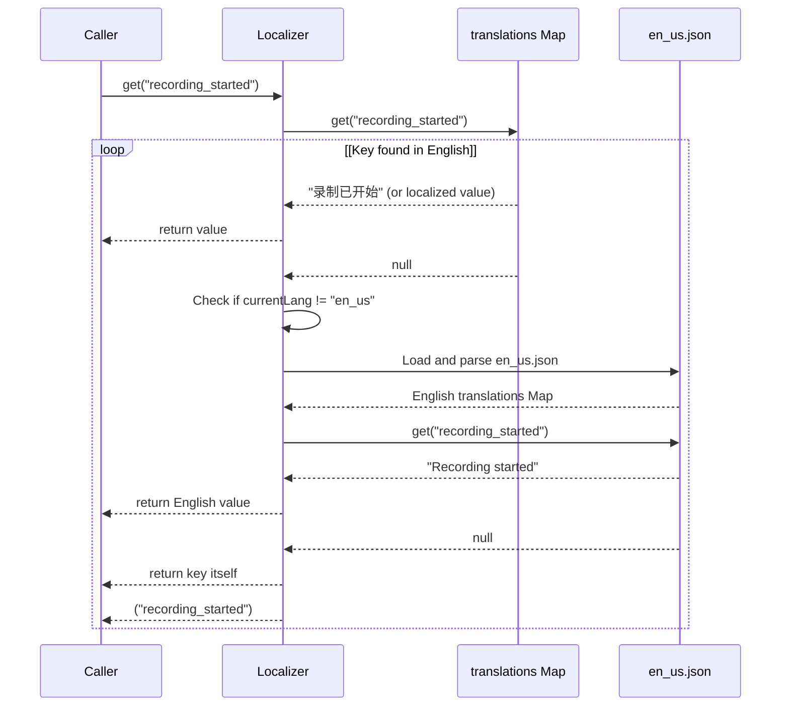
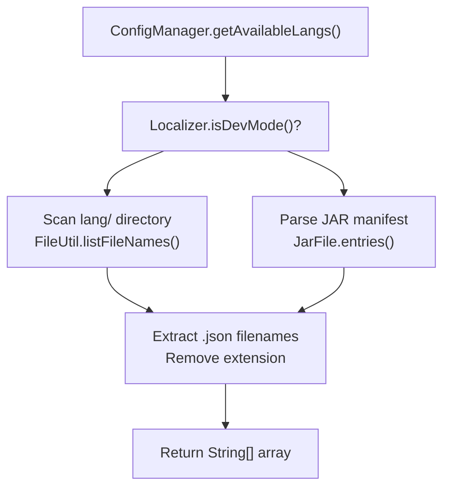
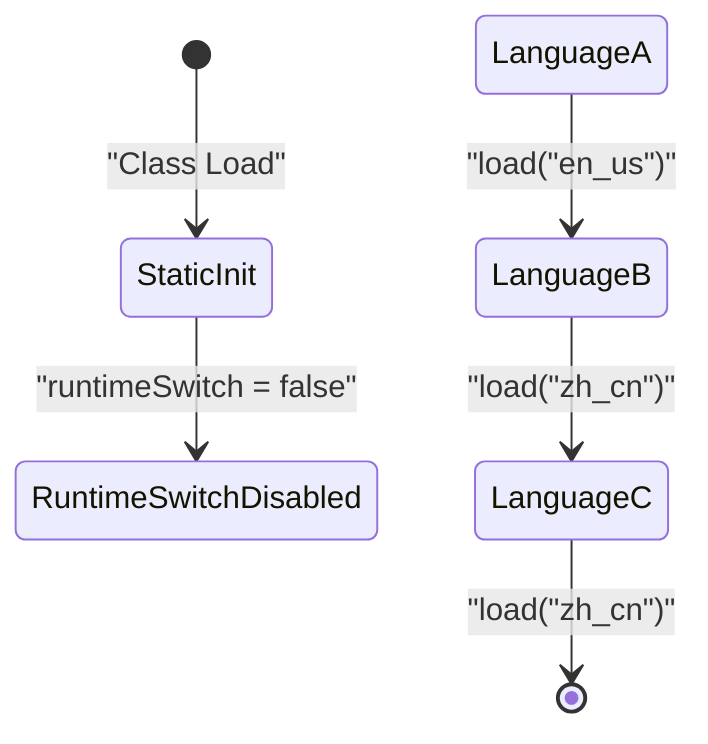
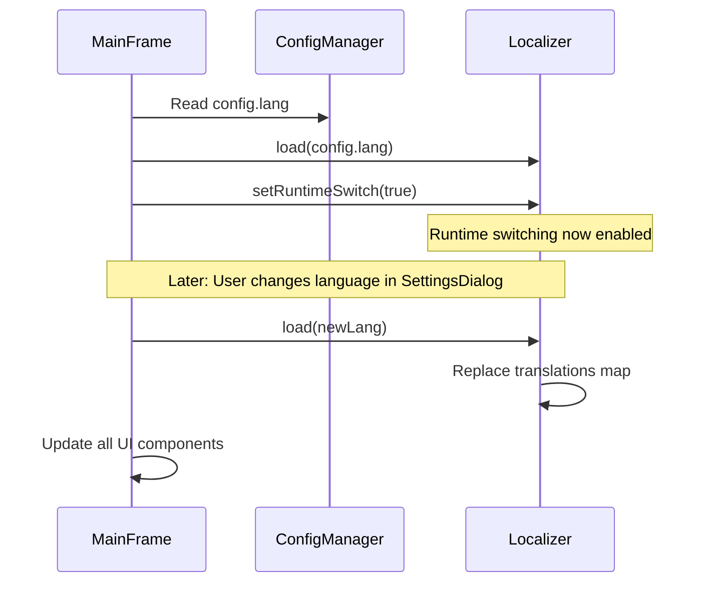
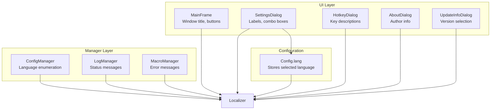

# Localizer

> **Relevant source files**
> * [src/io/github/samera2022/mouse_macros/Localizer.java](https://github.com/Samera2022/MouseMacros/blob/6b37ce1e/src/io/github/samera2022/mouse_macros/Localizer.java)
> * [src/io/github/samera2022/mouse_macros/manager/ConfigManager.java](https://github.com/Samera2022/MouseMacros/blob/6b37ce1e/src/io/github/samera2022/mouse_macros/manager/ConfigManager.java)

## Overview

The `Localizer` class is the centralized internationalization (i18n) system for the MouseMacros application. It provides a static utility API for loading, managing, and retrieving localized text strings from JSON language files. The class implements a sophisticated fallback mechanism, environment-aware resource loading, and support for runtime language switching without application restart.

For information about the structure of language files themselves, see [Language Files](/Samera2022/MouseMacros/6.2-language-files). For configuration of the active language, see [ConfigManager](/Samera2022/MouseMacros/5.1-configmanager).

**Sources:** [src/io/github/samera2022/mouse_macros/Localizer.java L1-L97](https://github.com/Samera2022/MouseMacros/blob/6b37ce1e/src/io/github/samera2022/mouse_macros/Localizer.java#L1-L97)

---

## Class Architecture



**Diagram: Localizer Class Structure and Dependencies**

The `Localizer` class is a static utility with no instance methods. All state is stored in static fields, and all operations are performed through static methods. The class maintains four key pieces of state:

| Field | Type | Purpose |
| --- | --- | --- |
| `translations` | `Map<String, String>` | Stores key-value pairs for the currently loaded language |
| `currentLang` | `String` | Tracks the active language code (e.g., "zh_cn", "en_us") |
| `runtimeSwitch` | `boolean` | Flag enabling dynamic language switching after initialization |
| `isDevMode` | `boolean` | Determines whether to load files from filesystem or JAR resources |

**Sources:** [src/io/github/samera2022/mouse_macros/Localizer.java L8-L12](https://github.com/Samera2022/MouseMacros/blob/6b37ce1e/src/io/github/samera2022/mouse_macros/Localizer.java#L8-L12)

---

## Static Initialization

The `Localizer` class performs automatic initialization in its static initializer block, which executes when the class is first loaded by the JVM:



**Diagram: Static Initialization Flow**

The initialization sequence performs three key operations:

1. **Development Mode Detection**: Checks for the existence of `lang/zh_cn.json` in the filesystem. If found, the application is running in development mode [src/io/github/samera2022/mouse_macros/Localizer.java L14-L17](https://github.com/Samera2022/MouseMacros/blob/6b37ce1e/src/io/github/samera2022/mouse_macros/Localizer.java#L14-L17)  This file is chosen as the detection marker because it's one of the primary language files.
2. **System Language Detection**: Retrieves the system locale via `Locale.getDefault()` and normalizes it by replacing hyphens with underscores. The code specifically handles Chinese and English locales, mapping any Chinese variant to `zh_cn` and any English variant to `en_us` [src/io/github/samera2022/mouse_macros/Localizer.java L19-L23](https://github.com/Samera2022/MouseMacros/blob/6b37ce1e/src/io/github/samera2022/mouse_macros/Localizer.java#L19-L23)
3. **File Existence Validation**: In development mode, verifies that the detected language file exists before using it. If the file is missing, falls back to `en_us` [src/io/github/samera2022/mouse_macros/Localizer.java L25-L29](https://github.com/Samera2022/MouseMacros/blob/6b37ce1e/src/io/github/samera2022/mouse_macros/Localizer.java#L25-L29)
4. **Initial Translation Load**: Calls `load(currentLang)` to populate the `translations` map [src/io/github/samera2022/mouse_macros/Localizer.java L31](https://github.com/Samera2022/MouseMacros/blob/6b37ce1e/src/io/github/samera2022/mouse_macros/Localizer.java#L31-L31)

**Sources:** [src/io/github/samera2022/mouse_macros/Localizer.java L14-L32](https://github.com/Samera2022/MouseMacros/blob/6b37ce1e/src/io/github/samera2022/mouse_macros/Localizer.java#L14-L32)

---

## Translation Loading Mechanism

The `load(String lang)` method is responsible for reading JSON language files and populating the `translations` map. It implements dual loading strategies based on the runtime environment:



**Diagram: Translation File Loading Process**

### Development Mode Loading

In development mode (`isDevMode == true`), the method attempts to load language files from the filesystem using two possible paths [src/io/github/samera2022/mouse_macros/Localizer.java L48-L51](https://github.com/Samera2022/MouseMacros/blob/6b37ce1e/src/io/github/samera2022/mouse_macros/Localizer.java#L48-L51)

:

1. `lang/<lang>.json` - relative to current working directory
2. `./lang/<lang>.json` - explicit current directory reference

The method uses `FileReader` to read the JSON file and passes it to Gson for deserialization.

### Production Mode Loading

In production mode (`isDevMode == false`), the method loads language files from JAR resources [src/io/github/samera2022/mouse_macros/Localizer.java L52-L58](https://github.com/Samera2022/MouseMacros/blob/6b37ce1e/src/io/github/samera2022/mouse_macros/Localizer.java#L52-L58)

:

1. Constructs resource path: `lang/<lang>.json`
2. Retrieves `InputStream` via `ClassLoader.getResourceAsStream()`
3. Wraps stream in `InputStreamReader` with UTF-8 encoding
4. Deserializes JSON using Gson

The explicit UTF-8 encoding specification ensures consistent character handling across platforms [src/io/github/samera2022/mouse_macros/Localizer.java L56](https://github.com/Samera2022/MouseMacros/blob/6b37ce1e/src/io/github/samera2022/mouse_macros/Localizer.java#L56-L56)

### Error Handling

If any exception occurs during loading (file not found, invalid JSON, I/O error), the method silently catches the exception and initializes `translations` to an empty `HashMap` [src/io/github/samera2022/mouse_macros/Localizer.java L61-L63](https://github.com/Samera2022/MouseMacros/blob/6b37ce1e/src/io/github/samera2022/mouse_macros/Localizer.java#L61-L63)

 This ensures the application continues running even if a language file is corrupted or missing.

**Sources:** [src/io/github/samera2022/mouse_macros/Localizer.java L46-L64](https://github.com/Samera2022/MouseMacros/blob/6b37ce1e/src/io/github/samera2022/mouse_macros/Localizer.java#L46-L64)

---

## Fallback Strategy

The `get(String key)` method implements a three-tier fallback strategy to ensure localized text is always available:



**Diagram: Translation Resolution with Fallback**

The fallback strategy operates in the following order:

### Tier 1: Current Language

The method first attempts to retrieve the value from the currently loaded `translations` map [src/io/github/samera2022/mouse_macros/Localizer.java L67-L68](https://github.com/Samera2022/MouseMacros/blob/6b37ce1e/src/io/github/samera2022/mouse_macros/Localizer.java#L67-L68)

:

```
String value = translations.get(key);
if (value != null) return value;
```

### Tier 2: English Fallback

If the key is not found in the current language **and** the current language is not English, the method loads `en_us.json` on-the-fly and searches for the key [src/io/github/samera2022/mouse_macros/Localizer.java L70-L88](https://github.com/Samera2022/MouseMacros/blob/6b37ce1e/src/io/github/samera2022/mouse_macros/Localizer.java#L70-L88)

:

* Development mode: Reads `lang/en_us.json` or `./lang/en_us.json` from filesystem
* Production mode: Loads `lang/en_us.json` from JAR resources

This tier prevents displaying untranslated keys when a language file is incomplete. English serves as the fallback because it is the most complete language file (combined importance: 6.05, as noted in Diagram 5 of the system overview).

### Tier 3: Key Echo

If the key is not found in either the current language or English (or if any exception occurs during English loading), the method returns the key itself [src/io/github/samera2022/mouse_macros/Localizer.java L91](https://github.com/Samera2022/MouseMacros/blob/6b37ce1e/src/io/github/samera2022/mouse_macros/Localizer.java#L91-L91)

 This ensures the UI never displays empty text, and developers can immediately identify missing translations during testing.

**Sources:** [src/io/github/samera2022/mouse_macros/Localizer.java L66-L92](https://github.com/Samera2022/MouseMacros/blob/6b37ce1e/src/io/github/samera2022/mouse_macros/Localizer.java#L66-L92)

---

## Environment Awareness

The `isDevMode` flag controls resource loading strategy and is critical for supporting both development and production deployments:

| Environment | `isDevMode` Value | File Source | Detection Method |
| --- | --- | --- | --- |
| Development | `true` | Filesystem (`lang/` directory) | `File("lang/zh_cn.json").exists()` |
| Production | `false` | JAR resources | File does not exist in filesystem |

### Development Mode Benefits

When `isDevMode == true`, the system loads language files directly from the filesystem [src/io/github/samera2022/mouse_macros/Localizer.java L48-L51](https://github.com/Samera2022/MouseMacros/blob/6b37ce1e/src/io/github/samera2022/mouse_macros/Localizer.java#L48-L51)

 This provides several advantages during development:

1. **Hot Reloading**: Language files can be edited and reloaded without recompiling the JAR
2. **Rapid Iteration**: Translators can test changes by simply calling `load(lang)` again
3. **Direct Access**: Files are accessible with standard file system tools

### Production Mode Characteristics

When `isDevMode == false`, the system loads language files from JAR resources [src/io/github/samera2022/mouse_macros/Localizer.java L52-L58](https://github.com/Samera2022/MouseMacros/blob/6b37ce1e/src/io/github/samera2022/mouse_macros/Localizer.java#L52-L58)

 This ensures:

1. **Portability**: Language files are packaged within the JAR
2. **Security**: Files cannot be modified by end users
3. **Reliability**: No dependency on external file system structure

### Integration with ConfigManager

The `ConfigManager` class also relies on `isDevMode` to determine how to enumerate available languages. The `getAvailableLangs()` method uses `Localizer.isDevMode()` to decide whether to scan the filesystem or inspect JAR contents [src/io/github/samera2022/mouse_macros/manager/ConfigManager.java L71](https://github.com/Samera2022/MouseMacros/blob/6b37ce1e/src/io/github/samera2022/mouse_macros/manager/ConfigManager.java#L71-L71)

:



**Diagram: Language File Discovery**

**Sources:** [src/io/github/samera2022/mouse_macros/Localizer.java L14-L17](https://github.com/Samera2022/MouseMacros/blob/6b37ce1e/src/io/github/samera2022/mouse_macros/Localizer.java#L14-L17)

 [src/io/github/samera2022/mouse_macros/Localizer.java L42-L44](https://github.com/Samera2022/MouseMacros/blob/6b37ce1e/src/io/github/samera2022/mouse_macros/Localizer.java#L42-L44)

 [src/io/github/samera2022/mouse_macros/manager/ConfigManager.java L69-L114](https://github.com/Samera2022/MouseMacros/blob/6b37ce1e/src/io/github/samera2022/mouse_macros/manager/ConfigManager.java#L69-L114)

---

## Runtime Language Switching

The `runtimeSwitch` flag controls whether the localization system allows language changes after initial application startup:



**Diagram: Runtime Switch State Machine**

### Initialization State

By default, `runtimeSwitch` is initialized to `false` [src/io/github/samera2022/mouse_macros/Localizer.java L11](https://github.com/Samera2022/MouseMacros/blob/6b37ce1e/src/io/github/samera2022/mouse_macros/Localizer.java#L11-L11)

 During static initialization, the class automatically loads a language based on system settings, but further changes are disabled.

### Enabling Runtime Switching

Applications enable dynamic language switching by calling `setRuntimeSwitch(true)` [src/io/github/samera2022/mouse_macros/Localizer.java L34-L36](https://github.com/Samera2022/MouseMacros/blob/6b37ce1e/src/io/github/samera2022/mouse_macros/Localizer.java#L34-L36)

 In MouseMacros, this is called from `MainFrame` constructor after configuration is loaded <FileRef file-url="[https://github.com/Samera2022/MouseMacros/blob/6b37ce1e/see](https://github.com/Samera2022/MouseMacros/blob/6b37ce1e/see) Diagram 2 in system overview, "Configuration & Localization Setup" phase" undefined  file-path="see Diagram 2 in system overview, "Configuration & Localization Setup" phase">Hii:



**Diagram: Runtime Switch Activation**

### Use Cases

The runtime switch capability supports:

1. **User Preferences**: Users can change language via `SettingsDialog` without restarting
2. **Testing**: Developers can quickly test different languages during development
3. **Dynamic Localization**: The UI can respond to language changes immediately

The flag itself doesn't enforce any restrictions; it serves as a status indicator that can be queried via `isRuntimeSwitch()` [src/io/github/samera2022/mouse_macros/Localizer.java L38-L40](https://github.com/Samera2022/MouseMacros/blob/6b37ce1e/src/io/github/samera2022/mouse_macros/Localizer.java#L38-L40)

**Sources:** [src/io/github/samera2022/mouse_macros/Localizer.java L11](https://github.com/Samera2022/MouseMacros/blob/6b37ce1e/src/io/github/samera2022/mouse_macros/Localizer.java#L11-L11)

 [src/io/github/samera2022/mouse_macros/Localizer.java L34-L40](https://github.com/Samera2022/MouseMacros/blob/6b37ce1e/src/io/github/samera2022/mouse_macros/Localizer.java#L34-L40)

---

## Public API Reference

The `Localizer` class exposes six static methods for external use:

| Method | Return Type | Parameters | Description |
| --- | --- | --- | --- |
| `load(String lang)` | `void` | `lang` - Language code (e.g., "zh_cn") | Loads translations from specified language file, replacing current translations |
| `get(String key)` | `String` | `key` - Translation key | Retrieves localized string with fallback strategy |
| `getCurrentLang()` | `String` | None | Returns the currently loaded language code |
| `setRuntimeSwitch(boolean enable)` | `void` | `enable` - Enable/disable flag | Controls runtime language switching capability |
| `isRuntimeSwitch()` | `boolean` | None | Returns whether runtime switching is enabled |
| `isDevMode()` | `boolean` | None | Returns whether application is in development mode |

### Method Usage Examples

**Loading a Language:**

```python
// Called from MainFrame constructor
Localizer.load(ConfigManager.config.lang);
```

**Retrieving Localized Text:**

```python
// Called from UI components to get button labels
String saveText = Localizer.get("save_macro");
String loadText = Localizer.get("load_macro");

// Called from LogManager for status messages
LogManager.log(Localizer.get("recording_started"));
```

**Checking Environment:**

```python
// Called from ConfigManager to determine file enumeration strategy
String[] langs = Localizer.isDevMode() 
    ? FileUtil.listFileNames("lang")
    : enumerateJarResources();
```

**Enabling Runtime Switching:**

```python
// Called from MainFrame after configuration loaded
Localizer.setRuntimeSwitch(true);
```

**Sources:** [src/io/github/samera2022/mouse_macros/Localizer.java L34-L96](https://github.com/Samera2022/MouseMacros/blob/6b37ce1e/src/io/github/samera2022/mouse_macros/Localizer.java#L34-L96)

---

## Integration with Application Components

The `Localizer` class serves as a central dependency for numerous application components:



**Diagram: Localizer Integration Points**

### UI Components

All major UI components query `Localizer.get()` to retrieve localized strings for display:

* **MainFrame**: Window title, button labels (Save Macro, Load Macro, Start Record, etc.)
* **SettingsDialog**: Settings labels, language selection dropdown, dialog titles
* **HotkeyDialog**: Key configuration instructions, button labels
* **AboutDialog**: Author information section title
* **UpdateInfoDialog**: Version selection labels

UI components typically call `Localizer.get()` during initialization and may call it again during `updateLanguage()` methods when runtime switching occurs.

### Manager Components

Manager classes use `Localizer` primarily for user-facing messages:

* **ConfigManager**: Calls `Localizer.isDevMode()` to determine language file enumeration strategy [src/io/github/samera2022/mouse_macros/manager/ConfigManager.java L71](https://github.com/Samera2022/MouseMacros/blob/6b37ce1e/src/io/github/samera2022/mouse_macros/manager/ConfigManager.java#L71-L71)
* **LogManager**: Translates all status message keys before displaying in the log area
* **MacroManager**: Localizes error messages and playback status updates

### Configuration Flow

The interaction between `Localizer` and configuration system follows this pattern:

1. **Startup**: `MainFrame` reads `ConfigManager.config.lang` and calls `Localizer.load(lang)`
2. **Runtime Change**: User modifies language in `SettingsDialog`, which calls `Localizer.load(newLang)` and updates `ConfigManager.config.lang`
3. **Persistence**: `SettingsDialog` saves configuration via `ConfigManager.saveConfig()`, persisting the language choice

**Sources:** [src/io/github/samera2022/mouse_macros/Localizer.java L1-L97](https://github.com/Samera2022/MouseMacros/blob/6b37ce1e/src/io/github/samera2022/mouse_macros/Localizer.java#L1-L97)

 [src/io/github/samera2022/mouse_macros/manager/ConfigManager.java L69-L114](https://github.com/Samera2022/MouseMacros/blob/6b37ce1e/src/io/github/samera2022/mouse_macros/manager/ConfigManager.java#L69-L114)

---

## Translation Key Resolution Flow

The complete resolution process for a translation key involves multiple decision points and fallback paths:

```

```

**Diagram: Complete Translation Key Resolution Process**

### Resolution Steps

1. **Primary Lookup**: Query the currently loaded `translations` map [src/io/github/samera2022/mouse_macros/Localizer.java L67-L68](https://github.com/Samera2022/MouseMacros/blob/6b37ce1e/src/io/github/samera2022/mouse_macros/Localizer.java#L67-L68)
2. **English Check**: If key not found and current language is not English, proceed to fallback [src/io/github/samera2022/mouse_macros/Localizer.java L70](https://github.com/Samera2022/MouseMacros/blob/6b37ce1e/src/io/github/samera2022/mouse_macros/Localizer.java#L70-L70)
3. **English Load**: Dynamically load `en_us.json` using environment-appropriate method [src/io/github/samera2022/mouse_macros/Localizer.java L71-L88](https://github.com/Samera2022/MouseMacros/blob/6b37ce1e/src/io/github/samera2022/mouse_macros/Localizer.java#L71-L88)
4. **Secondary Lookup**: Search for key in English translations
5. **Key Echo**: If all else fails, return the key itself [src/io/github/samera2022/mouse_macros/Localizer.java L91](https://github.com/Samera2022/MouseMacros/blob/6b37ce1e/src/io/github/samera2022/mouse_macros/Localizer.java#L91-L91)

### Performance Considerations

The English fallback involves file I/O on every miss, which could impact performance if many keys are missing. However, this is mitigated by:

* Language files are small (typically < 50KB)
* Fallback only triggers for missing keys
* In production, JAR resources are efficiently cached by the JVM
* The exception handling prevents cascading failures

### Error Visibility

The key echo strategy (returning the key itself) provides immediate visibility for missing translations during development. If a UI component displays `"recording_started"` instead of localized text, developers can immediately identify the missing key.

**Sources:** [src/io/github/samera2022/mouse_macros/Localizer.java L66-L92](https://github.com/Samera2022/MouseMacros/blob/6b37ce1e/src/io/github/samera2022/mouse_macros/Localizer.java#L66-L92)

---

## Key Design Patterns

The `Localizer` implementation demonstrates several design patterns:

### Static Utility Pattern

All methods are static, and the class maintains no instance state. This eliminates the need for dependency injection and provides global access point for localization.

### Lazy Loading with Fallback

English translations are only loaded on-demand when a key is missing from the current language, reducing memory footprint and startup time.

### Environment Detection

The `isDevMode` flag automatically detects the runtime environment, eliminating the need for manual configuration or build flags.

### Fail-Safe Design

At every error point (file not found, parse error, missing key), the system degrades gracefully rather than crashing, ensuring application stability even with corrupted language files.

**Sources:** [src/io/github/samera2022/mouse_macros/Localizer.java L1-L97](https://github.com/Samera2022/MouseMacros/blob/6b37ce1e/src/io/github/samera2022/mouse_macros/Localizer.java#L1-L97)