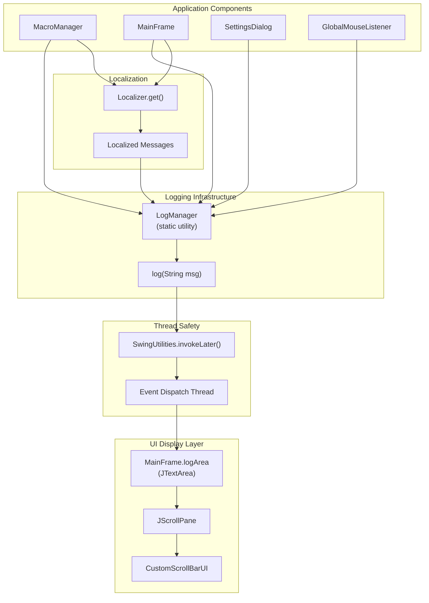
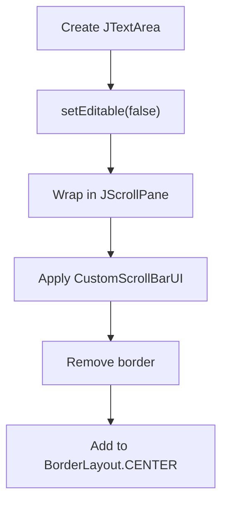
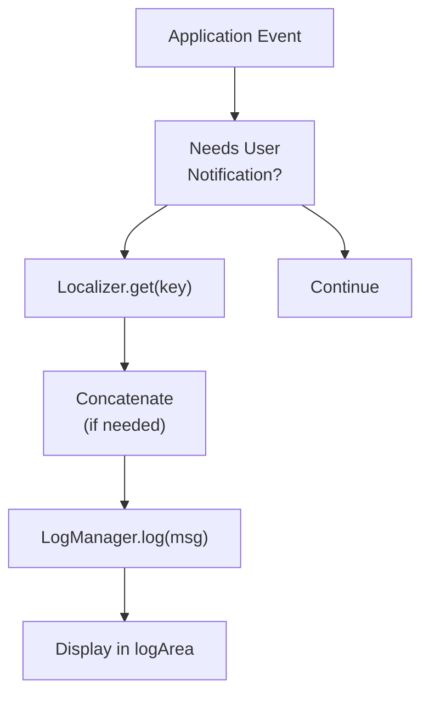
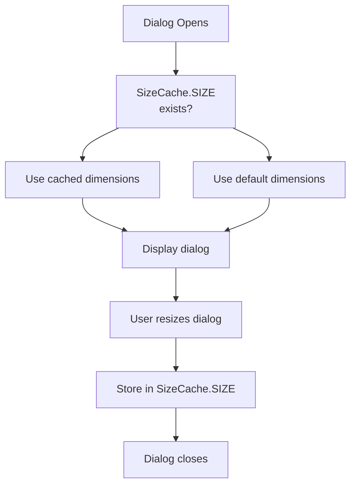

# Logging System

> **Relevant source files**
> * [src/io/github/samera2022/mouse_macros/cache/SizeCache.java](https://github.com/Samera2022/MouseMacros/blob/6b37ce1e/src/io/github/samera2022/mouse_macros/cache/SizeCache.java)
> * [src/io/github/samera2022/mouse_macros/manager/LogManager.java](https://github.com/Samera2022/MouseMacros/blob/6b37ce1e/src/io/github/samera2022/mouse_macros/manager/LogManager.java)
> * [src/io/github/samera2022/mouse_macros/ui/frame/MainFrame.java](https://github.com/Samera2022/MouseMacros/blob/6b37ce1e/src/io/github/samera2022/mouse_macros/ui/frame/MainFrame.java)

## Purpose and Scope

The Logging System provides thread-safe UI-based logging functionality for displaying status messages, errors, and operational feedback to users. It consists of two primary components: `LogManager` for message output and `SizeCache` for UI state persistence. This page documents the logging infrastructure used throughout the application to communicate application state and events to users.

For information about application-wide constants and configuration, see [Configuration System](/Samera2022/MouseMacros/5-configuration-system). For details about the main UI window that hosts the log display area, see [Main Window (MainFrame)](/Samera2022/MouseMacros/3.2-main-window-(mainframe)).

---

## System Architecture

The logging system follows a simple static utility pattern with centralized message routing to a dedicated UI component.



**Sources:**

* [src/io/github/samera2022/mouse_macros/manager/LogManager.java L1-L11](https://github.com/Samera2022/MouseMacros/blob/6b37ce1e/src/io/github/samera2022/mouse_macros/manager/LogManager.java#L1-L11)
* [src/io/github/samera2022/mouse_macros/ui/frame/MainFrame.java L19-L20](https://github.com/Samera2022/MouseMacros/blob/6b37ce1e/src/io/github/samera2022/mouse_macros/ui/frame/MainFrame.java#L19-L20)
* [src/io/github/samera2022/mouse_macros/ui/frame/MainFrame.java L28](https://github.com/Samera2022/MouseMacros/blob/6b37ce1e/src/io/github/samera2022/mouse_macros/ui/frame/MainFrame.java#L28-L28)
* [src/io/github/samera2022/mouse_macros/ui/frame/MainFrame.java L78-L85](https://github.com/Samera2022/MouseMacros/blob/6b37ce1e/src/io/github/samera2022/mouse_macros/ui/frame/MainFrame.java#L78-L85)

---

## LogManager Implementation

### Class Structure

The `LogManager` class is a minimal static utility that provides a single method for appending messages to the UI log display area. It resides in the `io.github.samera2022.mouse_macros.manager` package.

| Class | Type | Location | Visibility | Purpose |
| --- | --- | --- | --- | --- |
| `LogManager` | Static Utility | `manager/LogManager.java` | Public | Thread-safe UI logging |

### Core Method

The class provides one public static method:

```
public static void log(String msg)
```

This method:

1. Accepts a string message as input
2. Wraps the UI update in `SwingUtilities.invokeLater()`
3. Appends the message with a newline to `MainFrame.logArea`

**Implementation:** [src/io/github/samera2022/mouse_macros/manager/LogManager.java L8-L10](https://github.com/Samera2022/MouseMacros/blob/6b37ce1e/src/io/github/samera2022/mouse_macros/manager/LogManager.java#L8-L10)

### Usage Pattern

Throughout the codebase, `LogManager` is typically imported as a static method for convenient access:

```javascript
import static io.github.samera2022.mouse_macros.manager.LogManager.log;
```

This allows direct calls like:

```
log(Localizer.get("macro_not_recording"));
log(Localizer.get("hook_registration_failed") + e.getMessage());
```

**Examples:** [src/io/github/samera2022/mouse_macros/ui/frame/MainFrame.java L129-L131](https://github.com/Samera2022/MouseMacros/blob/6b37ce1e/src/io/github/samera2022/mouse_macros/ui/frame/MainFrame.java#L129-L131)

 [src/io/github/samera2022/mouse_macros/ui/frame/MainFrame.java L145](https://github.com/Samera2022/MouseMacros/blob/6b37ce1e/src/io/github/samera2022/mouse_macros/ui/frame/MainFrame.java#L145-L145)

**Sources:**

* [src/io/github/samera2022/mouse_macros/manager/LogManager.java L1-L11](https://github.com/Samera2022/MouseMacros/blob/6b37ce1e/src/io/github/samera2022/mouse_macros/manager/LogManager.java#L1-L11)
* [src/io/github/samera2022/mouse_macros/ui/frame/MainFrame.java L19](https://github.com/Samera2022/MouseMacros/blob/6b37ce1e/src/io/github/samera2022/mouse_macros/ui/frame/MainFrame.java#L19-L19)

---

## UI Integration

### Log Display Component

The log output is displayed in a non-editable `JTextArea` named `logArea`, which is declared as a public static field in `MainFrame`:

```
public static JTextArea logArea;
```

**Declaration:** [src/io/github/samera2022/mouse_macros/ui/frame/MainFrame.java L28](https://github.com/Samera2022/MouseMacros/blob/6b37ce1e/src/io/github/samera2022/mouse_macros/ui/frame/MainFrame.java#L28-L28)

### Component Initialization

During `MainFrame` construction, the log area is initialized and configured:



The initialization sequence:

1. `logArea` is instantiated as a new `JTextArea`
2. Set to non-editable to prevent user modification
3. Wrapped in a `JScrollPane` for automatic scrolling
4. Custom scrollbar UI applied based on theme (dark/light mode)
5. Border removed for cleaner appearance
6. Added to the main frame's center region

**Implementation:** [src/io/github/samera2022/mouse_macros/ui/frame/MainFrame.java L78-L85](https://github.com/Samera2022/MouseMacros/blob/6b37ce1e/src/io/github/samera2022/mouse_macros/ui/frame/MainFrame.java#L78-L85)

### Theme Integration

The scrollbars are themed using `CustomScrollBarUI` based on the current dark/light mode setting:

```
scrollPane.getVerticalScrollBar().setUI(
    new CustomScrollBarUI(
        config.enableDarkMode ? OtherConsts.DARK_MODE : OtherConsts.LIGHT_MODE
    )
);
scrollPane.getHorizontalScrollBar().setUI(
    new CustomScrollBarUI(
        config.enableDarkMode ? OtherConsts.DARK_MODE : OtherConsts.LIGHT_MODE
    )
);
```

**Implementation:** [src/io/github/samera2022/mouse_macros/ui/frame/MainFrame.java L82-L83](https://github.com/Samera2022/MouseMacros/blob/6b37ce1e/src/io/github/samera2022/mouse_macros/ui/frame/MainFrame.java#L82-L83)

**Sources:**

* [src/io/github/samera2022/mouse_macros/ui/frame/MainFrame.java L78-L85](https://github.com/Samera2022/MouseMacros/blob/6b37ce1e/src/io/github/samera2022/mouse_macros/ui/frame/MainFrame.java#L78-L85)

---

## Thread Safety

### Event Dispatch Thread Pattern

The `LogManager.log()` method ensures thread safety by using `SwingUtilities.invokeLater()` to execute all UI updates on the Event Dispatch Thread (EDT).

```mermaid
sequenceDiagram
  participant Calling Thread
  participant (e.g., MacroManager)
  participant LogManager.log()
  participant SwingUtilities
  participant Event Dispatch Thread
  participant MainFrame.logArea

  Calling Thread->>LogManager.log(): log("message")
  LogManager.log()->>SwingUtilities: invokeLater(Runnable)
  note over SwingUtilities: Queue runnable on EDT
  LogManager.log()-->>Calling Thread: return immediately
  note over Event Dispatch Thread: EDT processes queue
  SwingUtilities->>Event Dispatch Thread: execute runnable
  Event Dispatch Thread->>MainFrame.logArea: append("message
  MainFrame.logArea->>MainFrame.logArea: ")
```

### Why Thread Safety Matters

This pattern is critical because:

1. **Swing is not thread-safe**: All Swing component modifications must occur on the EDT
2. **Multiple callers**: Logging may be invoked from various threads (macro playback thread, event listeners, UI event handlers)
3. **Non-blocking**: The calling thread returns immediately without waiting for UI update completion
4. **Queue serialization**: The EDT queue ensures messages are processed in order

**Implementation:** [src/io/github/samera2022/mouse_macros/manager/LogManager.java L9](https://github.com/Samera2022/MouseMacros/blob/6b37ce1e/src/io/github/samera2022/mouse_macros/manager/LogManager.java#L9-L9)

**Sources:**

* [src/io/github/samera2022/mouse_macros/manager/LogManager.java L8-L10](https://github.com/Samera2022/MouseMacros/blob/6b37ce1e/src/io/github/samera2022/mouse_macros/manager/LogManager.java#L8-L10)

---

## Common Usage Scenarios

The following table shows typical logging scenarios found throughout the codebase:

| Scenario | Example | Source Location |
| --- | --- | --- |
| State validation | `log(Localizer.get("macro_not_recording"))` | [MainFrame.java L129](https://github.com/Samera2022/MouseMacros/blob/6b37ce1e/MainFrame.java#L129-L129) |
| Error reporting | `log(Localizer.get("hook_registration_failed") + e.getMessage())` | [MainFrame.java L145](https://github.com/Samera2022/MouseMacros/blob/6b37ce1e/MainFrame.java#L145-L145) |
| Operation confirmation | `log(Localizer.get("recording_started"))` | (MacroManager) |
| Status updates | `log(Localizer.get("playback_complete"))` | (MacroManager) |
| Warning messages | `log(Localizer.get("macro_not_running"))` | [MainFrame.java L131](https://github.com/Samera2022/MouseMacros/blob/6b37ce1e/MainFrame.java#L131-L131) |

### Message Flow Pattern



All user-facing messages are localized before being passed to `LogManager.log()`, ensuring consistent internationalization support. See [Localization System](/Samera2022/MouseMacros/6-localization-system) for details on message translation.

**Sources:**

* [src/io/github/samera2022/mouse_macros/ui/frame/MainFrame.java L129-L131](https://github.com/Samera2022/MouseMacros/blob/6b37ce1e/src/io/github/samera2022/mouse_macros/ui/frame/MainFrame.java#L129-L131)
* [src/io/github/samera2022/mouse_macros/ui/frame/MainFrame.java L145](https://github.com/Samera2022/MouseMacros/blob/6b37ce1e/src/io/github/samera2022/mouse_macros/ui/frame/MainFrame.java#L145-L145)

---

## SizeCache Utility

### Purpose

`SizeCache` is a separate utility class that provides persistent storage for dialog window dimensions. While not directly related to message logging, it is grouped under the logging system utility category.

| Field | Type | Visibility | Purpose |
| --- | --- | --- | --- |
| `SIZE` | `Dimension` | Public Static | Stores dialog dimensions |

### Implementation

```javascript
package io.github.samera2022.mouse_macros.cache;

import java.awt.*;

public class SizeCache {
    //用来存放Settings界面的Size
    public static Dimension SIZE;
}
```

**Full Implementation:** [src/io/github/samera2022/mouse_macros/cache/SizeCache.java L1-L8](https://github.com/Samera2022/MouseMacros/blob/6b37ce1e/src/io/github/samera2022/mouse_macros/cache/SizeCache.java#L1-L8)

### Usage Context

The `SizeCache.SIZE` field is used to remember user-preferred dialog sizes across application sessions. When a settings dialog or other resizable window is opened:

1. If `SizeCache.SIZE` is not null, the dialog uses the cached dimensions
2. When the dialog is resized, the new dimensions are stored in `SizeCache.SIZE`
3. This provides a better user experience by remembering window sizes



This is particularly useful for the `SettingsDialog` and `HotkeyDialog`, which may be opened multiple times during an application session. For persistent storage across application restarts, the size would need to be serialized to the configuration file (see [Configuration System](/Samera2022/MouseMacros/5-configuration-system)).

**Sources:**

* [src/io/github/samera2022/mouse_macros/cache/SizeCache.java L1-L8](https://github.com/Samera2022/MouseMacros/blob/6b37ce1e/src/io/github/samera2022/mouse_macros/cache/SizeCache.java#L1-L8)

---

## Relationship to Other Systems

The logging system integrates with multiple application subsystems:

| System | Integration Point | Purpose |
| --- | --- | --- |
| [Localization System](/Samera2022/MouseMacros/6-localization-system) | `Localizer.get()` | All log messages are localized |
| [Main Window](/Samera2022/MouseMacros/3.2-main-window-(mainframe)) | `MainFrame.logArea` | UI component hosting log display |
| [Theming System](/Samera2022/MouseMacros/7.4-theming-system) | `CustomScrollBarUI` | Scrollbar appearance matches theme |
| [Macro System](/Samera2022/MouseMacros/4-macro-recording-and-playback-system) | `MacroManager` | Logs recording/playback status |
| [Configuration System](/Samera2022/MouseMacros/5-configuration-system) | `ConfigManager` | Theme setting affects scrollbar UI |

The static nature of both `LogManager.log()` and `MainFrame.logArea` creates a singleton-like pattern where all application components share a single log output destination, simplifying the logging architecture and ensuring consistent message display.

**Sources:**

* [src/io/github/samera2022/mouse_macros/ui/frame/MainFrame.java L19-L20](https://github.com/Samera2022/MouseMacros/blob/6b37ce1e/src/io/github/samera2022/mouse_macros/ui/frame/MainFrame.java#L19-L20)
* [src/io/github/samera2022/mouse_macros/ui/frame/MainFrame.java L78-L85](https://github.com/Samera2022/MouseMacros/blob/6b37ce1e/src/io/github/samera2022/mouse_macros/ui/frame/MainFrame.java#L78-L85)
* [src/io/github/samera2022/mouse_macros/manager/LogManager.java L1-L11](https://github.com/Samera2022/MouseMacros/blob/6b37ce1e/src/io/github/samera2022/mouse_macros/manager/LogManager.java#L1-L11)