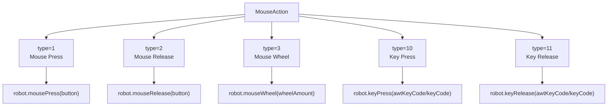
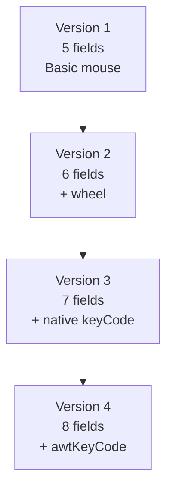
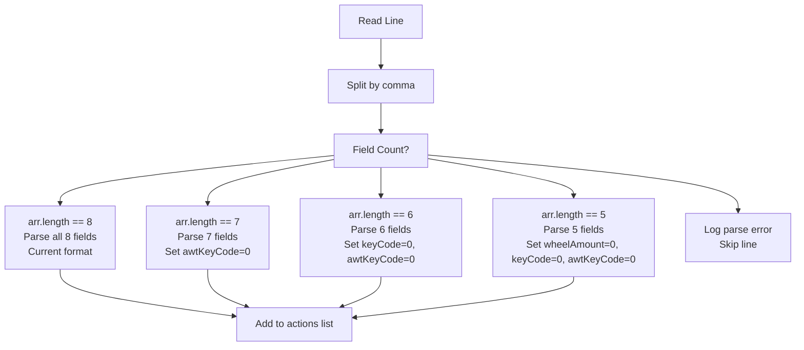
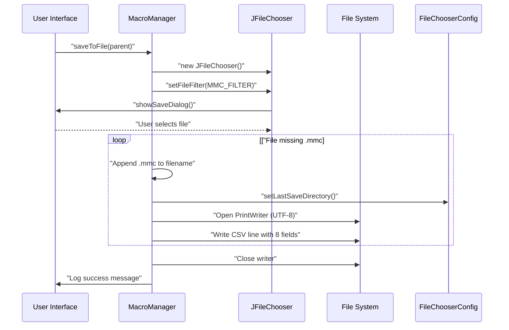
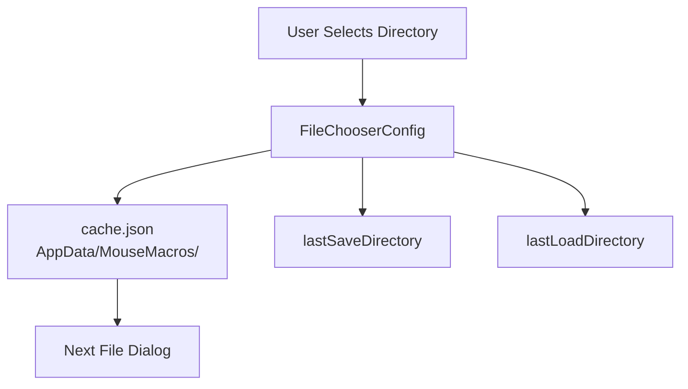
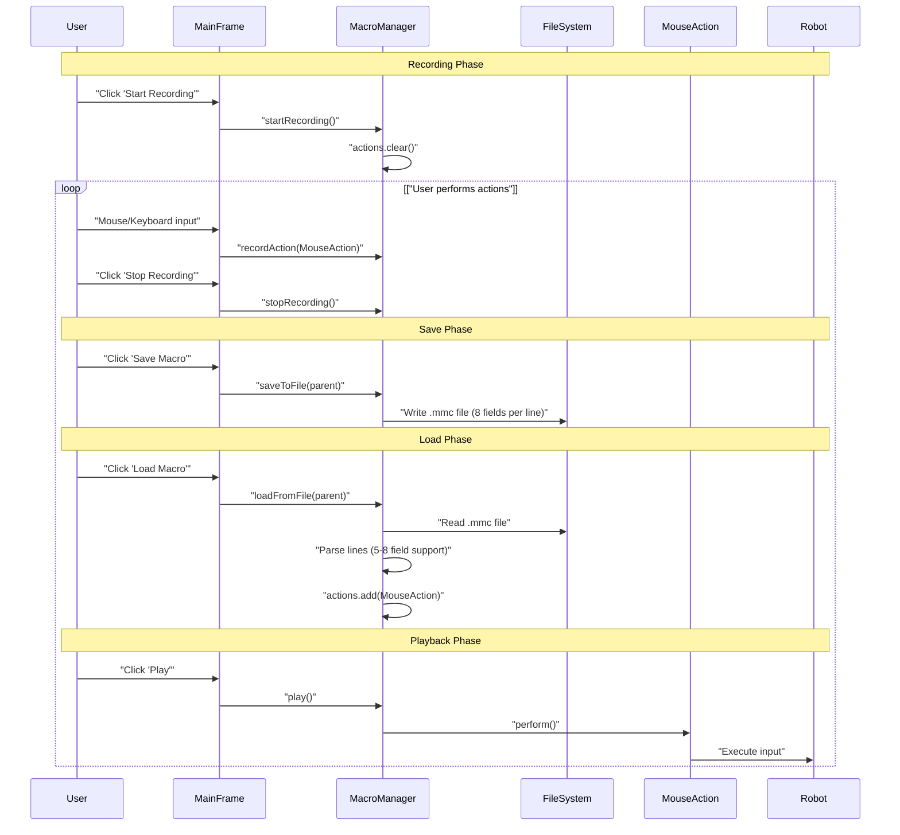

# Macro File Format (.mmc)

> **Relevant source files**
> * [src/io/github/samera2022/mouse_macros/action/MouseAction.java](https://github.com/Samera2022/MouseMacros/blob/6b37ce1e/src/io/github/samera2022/mouse_macros/action/MouseAction.java)
> * [src/io/github/samera2022/mouse_macros/constant/FileConsts.java](https://github.com/Samera2022/MouseMacros/blob/6b37ce1e/src/io/github/samera2022/mouse_macros/constant/FileConsts.java)
> * [src/io/github/samera2022/mouse_macros/constant/OtherConsts.java](https://github.com/Samera2022/MouseMacros/blob/6b37ce1e/src/io/github/samera2022/mouse_macros/constant/OtherConsts.java)
> * [src/io/github/samera2022/mouse_macros/manager/MacroManager.java](https://github.com/Samera2022/MouseMacros/blob/6b37ce1e/src/io/github/samera2022/mouse_macros/manager/MacroManager.java)
> * [src/io/github/samera2022/mouse_macros/manager/config/FileChooserConfig.java](https://github.com/Samera2022/MouseMacros/blob/6b37ce1e/src/io/github/samera2022/mouse_macros/manager/config/FileChooserConfig.java)

## Purpose and Scope

This document specifies the `.mmc` (Mouse Macro) file format used to persist recorded mouse and keyboard actions. The format is a CSV-based plain text file that stores sequences of input events captured during macro recording, enabling playback across application sessions.

For information about the runtime recording and playback mechanisms, see [MacroManager](/Samera2022/MouseMacros/4.1-macromanager). For details on the in-memory representation of actions, see [MouseAction](/Samera2022/MouseMacros/4.3-mouseaction).

---

## File Format Overview

The `.mmc` file format is a UTF-8 encoded text file where each line represents a single input action. Fields are comma-separated, following CSV conventions without header rows.

### Basic Structure

```
x,y,type,button,delay,wheelAmount,keyCode,awtKeyCode
x,y,type,button,delay,wheelAmount,keyCode,awtKeyCode
...
```

**File Properties:**

* **Extension**: `.mmc`
* **Encoding**: UTF-8 (enforced during read/write operations)
* **Line Separator**: Platform-default newline
* **Field Separator**: Comma (`,`)
* **Header**: None
* **Comments**: Not supported

**Sources:** [src/io/github/samera2022/mouse_macros/manager/MacroManager.java L122-L129](https://github.com/Samera2022/MouseMacros/blob/6b37ce1e/src/io/github/samera2022/mouse_macros/manager/MacroManager.java#L122-L129)

 [src/io/github/samera2022/mouse_macros/constant/FileConsts.java L6-L9](https://github.com/Samera2022/MouseMacros/blob/6b37ce1e/src/io/github/samera2022/mouse_macros/constant/FileConsts.java#L6-L9)

---

## Field Definitions

The current format (Version 4) contains 8 fields per action. Each field is serialized as an integer or long value.

| Field Index | Field Name | Data Type | Description | Valid Values |
| --- | --- | --- | --- | --- |
| 0 | `x` | `int` | X coordinate in virtual screen space | Integer |
| 1 | `y` | `int` | Y coordinate in virtual screen space | Integer |
| 2 | `type` | `int` | Action type identifier | 1=press, 2=release, 3=wheel, 10=keyPress, 11=keyRelease |
| 3 | `button` | `int` | Mouse button identifier | 1=left, 2=middle, 3=right, 0=N/A |
| 4 | `delay` | `long` | Milliseconds since previous action | Non-negative long |
| 5 | `wheelAmount` | `int` | Scroll wheel rotation amount | Positive=down, Negative=up, 0=N/A |
| 6 | `keyCode` | `int` | JNativeHook key code | Native key code or 0 |
| 7 | `awtKeyCode` | `int` | AWT key code for playback | AWT KeyEvent code or 0 |

### Coordinate System

The `x` and `y` fields represent coordinates in a **normalized virtual screen space** relative to the virtual origin (top-left of the leftmost monitor). During playback, these coordinates are denormalized back to global screen coordinates using `ScreenUtil.denormalizeFromVirtualOrigin()`.

**Sources:** [src/io/github/samera2022/mouse_macros/manager/MacroManager.java L124](https://github.com/Samera2022/MouseMacros/blob/6b37ce1e/src/io/github/samera2022/mouse_macros/manager/MacroManager.java#L124-L124)

 [src/io/github/samera2022/mouse_macros/action/MouseAction.java L8-L33](https://github.com/Samera2022/MouseMacros/blob/6b37ce1e/src/io/github/samera2022/mouse_macros/action/MouseAction.java#L8-L33)

---

## Action Type Enumeration

The `type` field determines how the action is interpreted during playback:



**Field Usage by Type:**

| Type | Fields Used | Fields Ignored |
| --- | --- | --- |
| 1 (press) | x, y, button, delay | wheelAmount, keyCode, awtKeyCode |
| 2 (release) | x, y, button, delay | wheelAmount, keyCode, awtKeyCode |
| 3 (wheel) | x, y, wheelAmount, delay | button, keyCode, awtKeyCode |
| 10 (keyPress) | keyCode, awtKeyCode, delay | x, y, button, wheelAmount |
| 11 (keyRelease) | keyCode, awtKeyCode, delay | x, y, button, wheelAmount |

**Sources:** [src/io/github/samera2022/mouse_macros/action/MouseAction.java L35-L67](https://github.com/Samera2022/MouseMacros/blob/6b37ce1e/src/io/github/samera2022/mouse_macros/action/MouseAction.java#L35-L67)

---

## Format Evolution and Backward Compatibility

The `.mmc` format has evolved through four versions to support additional input types. The loader implements backward compatibility by detecting the number of fields per line.



### Version History

#### Version 1 (5 Fields) - Initial Release

**Format:** `x,y,type,button,delay`

Supported mouse press and release events only. Introduced in version 0.0.1.

#### Version 2 (6 Fields) - Wheel Support

**Format:** `x,y,type,button,delay,wheelAmount`

Added `wheelAmount` field to support mouse wheel events (type=3). Introduced in version 0.0.2.

#### Version 3 (7 Fields) - Keyboard Support

**Format:** `x,y,type,button,delay,wheelAmount,keyCode`

Added `keyCode` field for keyboard events (type=10, type=11). Introduced in version 0.1.0.

#### Version 4 (8 Fields) - Current

**Format:** `x,y,type,button,delay,wheelAmount,keyCode,awtKeyCode`

Added `awtKeyCode` field to improve keyboard playback reliability by storing both JNativeHook and AWT key codes. Current version as of 1.0.0.

**Sources:** [src/io/github/samera2022/mouse_macros/manager/MacroManager.java L156-L190](https://github.com/Samera2022/MouseMacros/blob/6b37ce1e/src/io/github/samera2022/mouse_macros/manager/MacroManager.java#L156-L190)

---

## File Loading Algorithm

The loader implements a lenient parser that automatically detects the format version by counting fields:



### Parsing Implementation

The parser reads files line-by-line and constructs `MouseAction` objects using appropriate constructors:

**8-field format (current):**

```
// Line 156-165
if (arr.length == 8) {
    actions.add(new MouseAction(x, y, type, button, delay, wheelAmount, keyCode, awtKeyCode));
}
```

**7-field format (legacy):**

```
// Line 166-174
else if (arr.length == 7) {
    actions.add(new MouseAction(x, y, type, button, delay, wheelAmount, keyCode, 0));
}
```

**6-field format (legacy):**

```
// Line 175-182
else if (arr.length == 6) {
    actions.add(new MouseAction(x, y, type, button, delay, wheelAmount, 0, 0));
}
```

**5-field format (legacy):**

```
// Line 183-189
else if (arr.length == 5) {
    actions.add(new MouseAction(x, y, type, button, delay, 0, 0, 0));
}
```

**Sources:** [src/io/github/samera2022/mouse_macros/manager/MacroManager.java L152-L194](https://github.com/Samera2022/MouseMacros/blob/6b37ce1e/src/io/github/samera2022/mouse_macros/manager/MacroManager.java#L152-L194)

---

## File Save Operation

The save operation always writes the current 8-field format:



### Automatic Extension Handling

If the user-specified filename lacks the `.mmc` extension, it is automatically appended:

```
// Line 117-118
if (!selectedFile.getName().toLowerCase().endsWith(".mmc")) 
    selectedFile = new File(selectedFile.getAbsolutePath() + ".mmc");
```

### Character Encoding

Both save and load operations explicitly specify UTF-8 encoding to ensure portability across platforms:

**Save:** `PrintWriter(selectedFile, StandardCharsets.UTF_8)` [Line 122](https://github.com/Samera2022/MouseMacros/blob/6b37ce1e/Line 122)

**Load:** `InputStreamReader(new FileInputStream(selectedFile), StandardCharsets.UTF_8)` [Lines 145-148](https://github.com/Samera2022/MouseMacros/blob/6b37ce1e/Lines 145-148)

**Sources:** [src/io/github/samera2022/mouse_macros/manager/MacroManager.java L107-L131](https://github.com/Samera2022/MouseMacros/blob/6b37ce1e/src/io/github/samera2022/mouse_macros/manager/MacroManager.java#L107-L131)

---

## Example Files

### Example 1: Mouse Click Sequence

A simple macro that moves to coordinates (500, 300), presses the left button, waits 100ms, and releases:

```
500,300,1,1,0,0,0,0
500,300,2,1,100,0,0,0
```

**Field Breakdown:**

* Line 1: Move to (500, 300), type=1 (press), button=1 (left), no delay, other fields=0
* Line 2: At (500, 300), type=2 (release), button=1 (left), 100ms delay, other fields=0

### Example 2: Mouse Wheel Scroll

A macro that scrolls up at position (800, 600) with a delay of 50ms:

```
800,600,3,0,50,5,0,0
```

**Field Breakdown:**

* x=800, y=600
* type=3 (wheel event)
* button=0 (not used for wheel)
* delay=50ms
* wheelAmount=5 (scroll up by 5 units)
* keyCode=0, awtKeyCode=0 (not used)

### Example 3: Keyboard Input

A macro that presses and releases the 'A' key (native keyCode=30, awtKeyCode=65):

```
0,0,10,0,0,0,30,65
0,0,11,0,50,0,30,65
```

**Field Breakdown:**

* Line 1: type=10 (keyPress), no delay, keyCode=30 (JNativeHook), awtKeyCode=65 (AWT)
* Line 2: type=11 (keyRelease), 50ms delay, same key codes

### Example 4: Legacy Format (5 fields)

An old macro file from version 0.0.1:

```
100,200,1,1,0
100,200,2,1,50
```

This file loads successfully with `wheelAmount`, `keyCode`, and `awtKeyCode` defaulting to 0.

**Sources:** [src/io/github/samera2022/mouse_macros/manager/MacroManager.java L124](https://github.com/Samera2022/MouseMacros/blob/6b37ce1e/src/io/github/samera2022/mouse_macros/manager/MacroManager.java#L124-L124)

 [src/io/github/samera2022/mouse_macros/action/MouseAction.java L8-L34](https://github.com/Samera2022/MouseMacros/blob/6b37ce1e/src/io/github/samera2022/mouse_macros/action/MouseAction.java#L8-L34)

---

## File Location and Management

### Default Storage Location

`.mmc` files can be saved to any user-accessible directory. The application remembers the last save/load directories separately via `FileChooserConfig`:



**Persistence Mechanism:**

* `FileChooserConfig.lastSaveDirectory` stores the last directory used for saving
* `FileChooserConfig.lastLoadDirectory` stores the last directory used for loading
* Both are serialized to `cache.json` in the application data directory
* On next file dialog, `chooser.setCurrentDirectory()` restores the appropriate path

**Sources:** [src/io/github/samera2022/mouse_macros/manager/MacroManager.java L111-L144](https://github.com/Samera2022/MouseMacros/blob/6b37ce1e/src/io/github/samera2022/mouse_macros/manager/MacroManager.java#L111-L144)

 [src/io/github/samera2022/mouse_macros/manager/config/FileChooserConfig.java L1-L28](https://github.com/Samera2022/MouseMacros/blob/6b37ce1e/src/io/github/samera2022/mouse_macros/manager/config/FileChooserConfig.java#L1-L28)

---

## Error Handling

### Load-Time Error Recovery

The loader implements graceful error handling that allows partial macro loading:

**Per-Line Error Handling:**

* Invalid field count: Log error with line number, skip line, continue parsing [Lines 191-193](https://github.com/Samera2022/MouseMacros/blob/6b37ce1e/Lines 191-193)
* Parse exception (invalid integer/long): Log error with line number, skip line, continue parsing [Lines 191-193](https://github.com/Samera2022/MouseMacros/blob/6b37ce1e/Lines 191-193)
* File not found or I/O error: Log error message, abort entire load operation [Lines 196-198](https://github.com/Samera2022/MouseMacros/blob/6b37ce1e/Lines 196-198)

**Error Messages:**
All error messages are localized via `Localizer.get()`:

* `"macro_loading_line_error"`: For per-line parse failures
* `"macro_loading_failed"`: For file-level I/O errors

### Save-Time Error Handling

Save operations catch all exceptions during file writing:

**Error Conditions:**

* Permission denied
* Disk full
* I/O errors

**Error Response:**

* Log localized error message: `Localizer.get("macro_saving_failed") + ex.getMessage()`
* File may be partially written (no transaction semantics)

**Sources:** [src/io/github/samera2022/mouse_macros/manager/MacroManager.java L127-L198](https://github.com/Samera2022/MouseMacros/blob/6b37ce1e/src/io/github/samera2022/mouse_macros/manager/MacroManager.java#L127-L198)

---

## Implementation Details

### File Chooser Configuration

The `JFileChooser` is configured with a custom file filter that restricts selection to `.mmc` files:

```
// FileConsts.java:6-9
public static final FileNameExtensionFilter MMC_FILTER = new FileNameExtensionFilter(
    "Mouse Macro Files (*.mmc)",  // Display name
    "mmc"                          // Extension
);
```

This filter is applied during both save and load operations:

* `chooser.setFileFilter(FileConsts.MMC_FILTER)` [Lines 113,138](https://github.com/Samera2022/MouseMacros/blob/6b37ce1e/Lines 113,138)

### In-Memory Representation

Loaded actions are stored in `MacroManager.actions`, a static `List<MouseAction>`:

```java
// MacroManager.java:24
private static final List<MouseAction> actions = new ArrayList<>();
```

**Loading:** `actions.clear()` followed by `actions.add()` for each parsed line [Lines 149,165,174,182,189](https://github.com/Samera2022/MouseMacros/blob/6b37ce1e/Lines 149,165,174,182,189)

**Saving:** Iterate through `actions` list and write each to file [Lines 123-125](https://github.com/Samera2022/MouseMacros/blob/6b37ce1e/Lines 123-125)

**Sources:** [src/io/github/samera2022/mouse_macros/constant/FileConsts.java L6-L9](https://github.com/Samera2022/MouseMacros/blob/6b37ce1e/src/io/github/samera2022/mouse_macros/constant/FileConsts.java#L6-L9)

 [src/io/github/samera2022/mouse_macros/manager/MacroManager.java L24-L149](https://github.com/Samera2022/MouseMacros/blob/6b37ce1e/src/io/github/samera2022/mouse_macros/manager/MacroManager.java#L24-L149)

---

## Integration with Application Workflow



**Key Integration Points:**

1. **Recording**: Actions are accumulated in memory before saving
2. **Saving**: Current in-memory actions are serialized to `.mmc` format
3. **Loading**: `.mmc` file is parsed and replaces in-memory actions
4. **Playback**: In-memory actions are executed via `MouseAction.perform()`

The file format serves as the persistence layer, bridging recording sessions with playback sessions.

**Sources:** [src/io/github/samera2022/mouse_macros/manager/MacroManager.java L28-L200](https://github.com/Samera2022/MouseMacros/blob/6b37ce1e/src/io/github/samera2022/mouse_macros/manager/MacroManager.java#L28-L200)

---

## Summary

The `.mmc` file format is a simple, extensible CSV-based specification with the following characteristics:

| Property | Value |
| --- | --- |
| **Format** | CSV (comma-separated values) |
| **Encoding** | UTF-8 |
| **Current Version** | Version 4 (8 fields) |
| **Backward Compatibility** | Versions 1-4 (5-8 fields) |
| **Extension** | `.mmc` |
| **Line Format** | `x,y,type,button,delay,wheelAmount,keyCode,awtKeyCode` |
| **Supported Actions** | Mouse press/release, mouse wheel, keyboard press/release |
| **Error Handling** | Graceful line-level recovery during load |

The format's evolution demonstrates a commitment to backward compatibility while supporting expanded functionality (mouse → wheel → keyboard input). The simple CSV structure enables manual editing for advanced users while remaining robust for automated generation.

**Sources:** [src/io/github/samera2022/mouse_macros/manager/MacroManager.java L107-L200](https://github.com/Samera2022/MouseMacros/blob/6b37ce1e/src/io/github/samera2022/mouse_macros/manager/MacroManager.java#L107-L200)

 [src/io/github/samera2022/mouse_macros/action/MouseAction.java L8-L34](https://github.com/Samera2022/MouseMacros/blob/6b37ce1e/src/io/github/samera2022/mouse_macros/action/MouseAction.java#L8-L34)

 [src/io/github/samera2022/mouse_macros/constant/FileConsts.java L6-L9](https://github.com/Samera2022/MouseMacros/blob/6b37ce1e/src/io/github/samera2022/mouse_macros/constant/FileConsts.java#L6-L9)