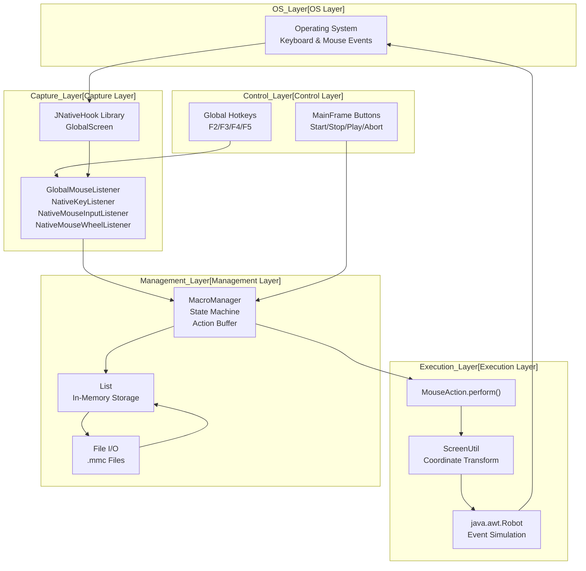
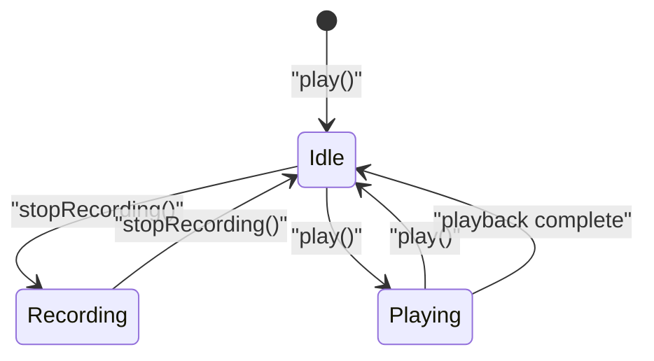
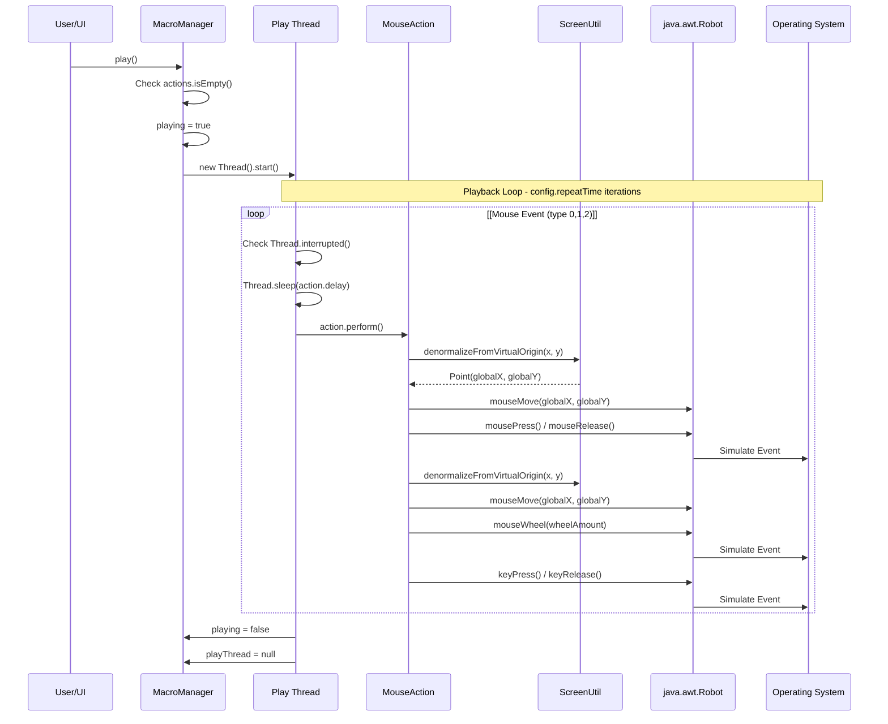
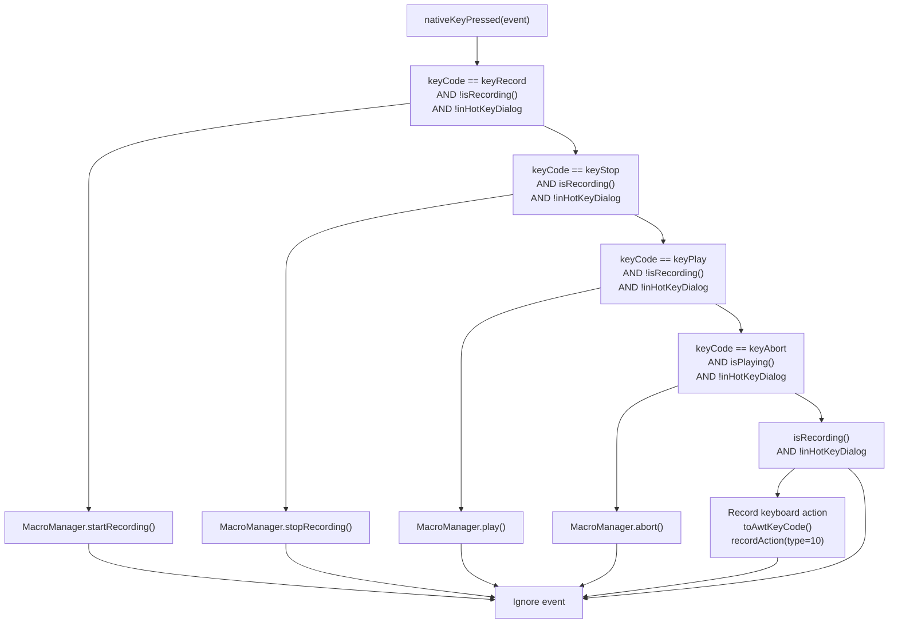
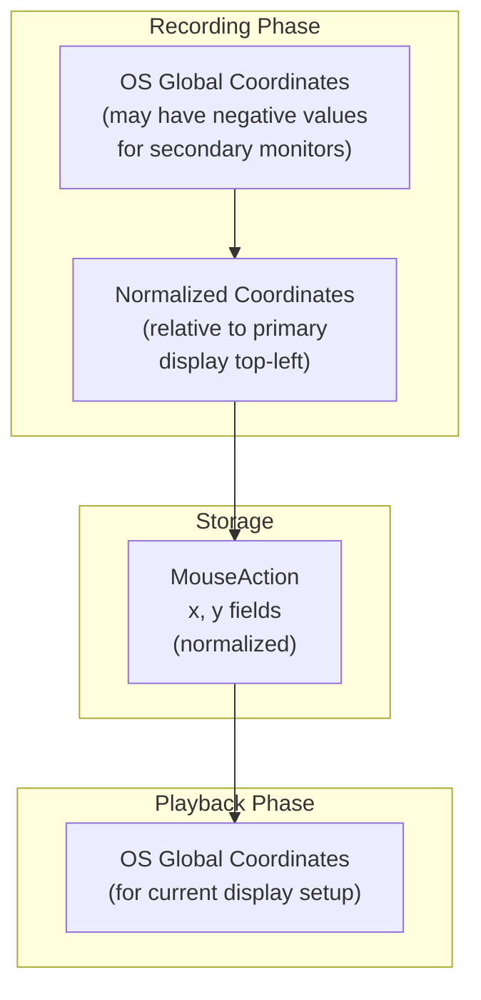

# Macro Recording and Playback System

> **Relevant source files**
> * [src/io/github/samera2022/mouse_macros/action/MouseAction.java](https://github.com/Samera2022/MouseMacros/blob/6b37ce1e/src/io/github/samera2022/mouse_macros/action/MouseAction.java)
> * [src/io/github/samera2022/mouse_macros/listener/GlobalMouseListener.java](https://github.com/Samera2022/MouseMacros/blob/6b37ce1e/src/io/github/samera2022/mouse_macros/listener/GlobalMouseListener.java)
> * [src/io/github/samera2022/mouse_macros/manager/MacroManager.java](https://github.com/Samera2022/MouseMacros/blob/6b37ce1e/src/io/github/samera2022/mouse_macros/manager/MacroManager.java)

## Purpose and Scope

This document provides a comprehensive overview of the macro recording and playback system, which constitutes the core functionality of the MouseMacros application. The system captures operating system-level keyboard and mouse events, stores them as a sequence of actions with precise timing information, and replays them with high accuracy.

This page covers the overall architecture, state management, control flow, and integration between components. For detailed implementation information about specific components:

* MacroManager implementation details: see [MacroManager](/Samera2022/MouseMacros/4.1-macromanager)
* Global input capture and JNativeHook integration: see [Global Input Capture](/Samera2022/MouseMacros/4.2-global-input-capture)
* MouseAction class and event execution: see [MouseAction](/Samera2022/MouseMacros/4.3-mouseaction)
* File format specification: see [Macro File Format (.mmc)](/Samera2022/MouseMacros/4.4-macro-file-format-(.mmc))

**Sources:** All three provided source files inform this overview.

---

## System Architecture

The macro system consists of three primary layers that work together to provide end-to-end automation:



**Architecture Diagram: Complete Macro Recording and Playback Pipeline**

The system implements a bidirectional pipeline where user input flows down through capture layers during recording, and programmatic actions flow up through execution layers during playback.

**Sources:**

* [src/io/github/samera2022/mouse_macros/manager/MacroManager.java L1-L201](https://github.com/Samera2022/MouseMacros/blob/6b37ce1e/src/io/github/samera2022/mouse_macros/manager/MacroManager.java#L1-L201)
* [src/io/github/samera2022/mouse_macros/listener/GlobalMouseListener.java L1-L197](https://github.com/Samera2022/MouseMacros/blob/6b37ce1e/src/io/github/samera2022/mouse_macros/listener/GlobalMouseListener.java#L1-L197)
* [src/io/github/samera2022/mouse_macros/action/MouseAction.java L1-L82](https://github.com/Samera2022/MouseMacros/blob/6b37ce1e/src/io/github/samera2022/mouse_macros/action/MouseAction.java#L1-L82)

---

## State Machine

The `MacroManager` maintains a simple but effective state machine with three states:

| State | Description | Active Flags | Valid Transitions |
| --- | --- | --- | --- |
| **Idle** | No operation in progress | `recording=false`, `playing=false` | → Recording, → Playing |
| **Recording** | Capturing input events | `recording=true`, `playing=false` | → Idle |
| **Playing** | Executing recorded actions | `recording=false`, `playing=true` | → Idle |



**State Transition Diagram**

State transitions are triggered by:

* **UI Buttons**: Explicit calls to `MacroManager.startRecording()`, `stopRecording()`, `play()`, `abort()` from `MainFrame`
* **Global Hotkeys**: Hotkey presses captured by `GlobalMouseListener.nativeKeyPressed()` that invoke the same methods
* **Automatic**: Playback thread completion or abortion

The state machine ensures mutual exclusion—recording and playing cannot occur simultaneously. The flags `MacroManager.recording` and `MacroManager.playing` enforce this constraint.

**Sources:**

* [src/io/github/samera2022/mouse_macros/manager/MacroManager.java L22-L26](https://github.com/Samera2022/MouseMacros/blob/6b37ce1e/src/io/github/samera2022/mouse_macros/manager/MacroManager.java#L22-L26)  (state flags)
* [src/io/github/samera2022/mouse_macros/manager/MacroManager.java L28-L86](https://github.com/Samera2022/MouseMacros/blob/6b37ce1e/src/io/github/samera2022/mouse_macros/manager/MacroManager.java#L28-L86)  (state transitions)
* [src/io/github/samera2022/mouse_macros/listener/GlobalMouseListener.java L32-L50](https://github.com/Samera2022/MouseMacros/blob/6b37ce1e/src/io/github/samera2022/mouse_macros/listener/GlobalMouseListener.java#L32-L50)  (hotkey handling)

---

## Recording Phase

### Event Capture Flow

```

```

**Recording Sequence Diagram**

### Event Types Captured

The system captures seven distinct event types, each represented by a specific `type` value in `MouseAction`:

| Type | Event | Fields Used | Source Method |
| --- | --- | --- | --- |
| `0` | Mouse Move | `x`, `y`, `delay` | `nativeMouseMoved()` |
| `1` | Mouse Press | `x`, `y`, `button`, `delay` | `nativeMousePressed()` |
| `2` | Mouse Release | `x`, `y`, `button`, `delay` | `nativeMouseReleased()` |
| `3` | Mouse Wheel | `x`, `y`, `wheelAmount`, `delay` | `nativeMouseWheelMoved()` |
| `10` | Key Press | `keyCode`, `awtKeyCode`, `delay` | `nativeKeyPressed()` |
| `11` | Key Release | `keyCode`, `awtKeyCode`, `delay` | `nativeKeyReleased()` |

### Recording Optimizations

**Mouse Movement Filtering** [src/io/github/samera2022/mouse_macros/listener/GlobalMouseListener.java L98-L110](https://github.com/Samera2022/MouseMacros/blob/6b37ce1e/src/io/github/samera2022/mouse_macros/listener/GlobalMouseListener.java#L98-L110)

:

* Only records movement if distance from last recorded point exceeds 5 pixels
* Caps delay at 100ms to prevent excessive timing gaps
* Prevents excessive action accumulation during continuous mouse movement

**Button Code Mapping** [src/io/github/samera2022/mouse_macros/listener/GlobalMouseListener.java L73-L75](https://github.com/Samera2022/MouseMacros/blob/6b37ce1e/src/io/github/samera2022/mouse_macros/listener/GlobalMouseListener.java#L73-L75)

:

* JNativeHook uses non-standard button codes (1=left, 2=right, 3=middle)
* Converted to AWT standard (1=left, 2=middle, 3=right) during recording
* Ensures compatibility with `Robot` API during playback

**Keyboard Code Dual Storage** [src/io/github/samera2022/mouse_macros/listener/GlobalMouseListener.java L44-L48](https://github.com/Samera2022/MouseMacros/blob/6b37ce1e/src/io/github/samera2022/mouse_macros/listener/GlobalMouseListener.java#L44-L48)

:

* Stores both `keyCode` (JNativeHook native code) and `awtKeyCode` (AWT code)
* `toAwtKeyCode()` performs mapping for common keys [src/io/github/samera2022/mouse_macros/listener/GlobalMouseListener.java L131-L195](https://github.com/Samera2022/MouseMacros/blob/6b37ce1e/src/io/github/samera2022/mouse_macros/listener/GlobalMouseListener.java#L131-L195)
* Fallback to native code if no mapping exists

**Sources:**

* [src/io/github/samera2022/mouse_macros/listener/GlobalMouseListener.java L68-L129](https://github.com/Samera2022/MouseMacros/blob/6b37ce1e/src/io/github/samera2022/mouse_macros/listener/GlobalMouseListener.java#L68-L129)  (event capture methods)
* [src/io/github/samera2022/mouse_macros/manager/MacroManager.java L88-L91](https://github.com/Samera2022/MouseMacros/blob/6b37ce1e/src/io/github/samera2022/mouse_macros/manager/MacroManager.java#L88-L91)  (recordAction implementation)
* [src/io/github/samera2022/mouse_macros/action/MouseAction.java L7-L34](https://github.com/Samera2022/MouseMacros/blob/6b37ce1e/src/io/github/samera2022/mouse_macros/action/MouseAction.java#L7-L34)  (MouseAction constructors)

---

## Playback Phase

### Execution Flow



**Playback Execution Sequence**

### Playback Thread Management

The playback system executes in a separate thread to prevent UI blocking:

**Thread Lifecycle** [src/io/github/samera2022/mouse_macros/manager/MacroManager.java L47-L68](https://github.com/Samera2022/MouseMacros/blob/6b37ce1e/src/io/github/samera2022/mouse_macros/manager/MacroManager.java#L47-L68)

:

```sql
1. Create new Thread with lambda
2. Set playing = true, store thread reference
3. Execute nested loops (repeatTime × actions)
4. Check Thread.interrupted() before each action
5. Sleep for action.delay milliseconds
6. Call action.perform()
7. On completion or exception: set playing = false, clear thread reference
```

**Abortion Mechanism** [src/io/github/samera2022/mouse_macros/manager/MacroManager.java L79-L86](https://github.com/Samera2022/MouseMacros/blob/6b37ce1e/src/io/github/samera2022/mouse_macros/manager/MacroManager.java#L79-L86)

:

* `abort()` sets `playing = false` and calls `playThread.interrupt()`
* Thread checks `Thread.interrupted()` in loop [line 51]
* `Thread.sleep()` throws `InterruptedException` on interruption [line 54]
* Finally block ensures cleanup occurs even on abortion

### Event Execution

Each `MouseAction.perform()` call executes the following logic [src/io/github/samera2022/mouse_macros/action/MouseAction.java L35-L67](https://github.com/Samera2022/MouseMacros/blob/6b37ce1e/src/io/github/samera2022/mouse_macros/action/MouseAction.java#L35-L67)

:

1. **Robot Initialization**: Lazy-initialize shared `Robot` instance (thread-safe due to single playback thread)
2. **Coordinate Transformation**: Call `ScreenUtil.denormalizeFromVirtualOrigin()` for mouse events
3. **Event Dispatch**: Route to appropriate `Robot` method based on `type`:

| Type | Robot Method | Parameters |
| --- | --- | --- |
| `0` (Move) | `mouseMove()` | `globalX`, `globalY` |
| `1` (Press) | `mouseMove()` + `mousePress()` | `globalX`, `globalY`, `getAWTButtonMask(button)` |
| `2` (Release) | `mouseMove()` + `mouseRelease()` | `globalX`, `globalY`, `getAWTButtonMask(button)` |
| `3` (Wheel) | `mouseMove()` + `mouseWheel()` | `globalX`, `globalY`, `wheelAmount` |
| `10` (Key Press) | `keyPress()` | `awtKeyCode` (fallback to `keyCode`) |
| `11` (Key Release) | `keyRelease()` | `awtKeyCode` (fallback to `keyCode`) |

**Button Mask Conversion** [src/io/github/samera2022/mouse_macros/action/MouseAction.java L70-L79](https://github.com/Samera2022/MouseMacros/blob/6b37ce1e/src/io/github/samera2022/mouse_macros/action/MouseAction.java#L70-L79)

:

```
button=1 → BUTTON1_DOWN_MASK (left)
button=2 → BUTTON2_DOWN_MASK (middle)
button=3 → BUTTON3_DOWN_MASK (right)
```

**Sources:**

* [src/io/github/samera2022/mouse_macros/manager/MacroManager.java L40-L68](https://github.com/Samera2022/MouseMacros/blob/6b37ce1e/src/io/github/samera2022/mouse_macros/manager/MacroManager.java#L40-L68)  (play method)
* [src/io/github/samera2022/mouse_macros/action/MouseAction.java L35-L79](https://github.com/Samera2022/MouseMacros/blob/6b37ce1e/src/io/github/samera2022/mouse_macros/action/MouseAction.java#L35-L79)  (perform method)

---

## Control Mechanisms

The system provides two parallel control interfaces:

### UI Button Control

`MainFrame` provides four buttons that directly invoke `MacroManager` methods:

| Button | Key | Method Called | State Requirement |
| --- | --- | --- | --- |
| Start Recording | `F2` | `MacroManager.startRecording()` | `!isRecording() && !isPlaying()` |
| Stop Recording | `F3` | `MacroManager.stopRecording()` | `isRecording()` |
| Play | `F4` | `MacroManager.play()` | `!isRecording() && !isPlaying()` |
| Abort | `F5` | `MacroManager.abort()` | `isPlaying()` |

### Global Hotkey Control

`GlobalMouseListener.nativeKeyPressed()` intercepts hotkey events before they reach applications [src/io/github/samera2022/mouse_macros/listener/GlobalMouseListener.java L32-L50](https://github.com/Samera2022/MouseMacros/blob/6b37ce1e/src/io/github/samera2022/mouse_macros/listener/GlobalMouseListener.java#L32-L50)

:



**Hotkey Decision Tree**

**Key Points:**

* Hotkeys are configurable via `MainFrame.keyRecord`, `keyStop`, `keyPlay`, `keyAbort` static fields
* Default mappings: `F2`/`F3`/`F4`/`F5` (can be changed in Settings → Hotkey dialog)
* `HotkeyDialog.inHotKeyDialog` flag prevents hotkey actions during hotkey configuration
* Non-hotkey key presses during recording are captured as macro actions

**Sources:**

* [src/io/github/samera2022/mouse_macros/listener/GlobalMouseListener.java L32-L62](https://github.com/Samera2022/MouseMacros/blob/6b37ce1e/src/io/github/samera2022/mouse_macros/listener/GlobalMouseListener.java#L32-L62)  (hotkey logic)

---

## Coordinate Transformation

Multi-monitor setups require coordinate normalization to ensure macros work across different display configurations.

### Virtual Origin Concept

`ScreenUtil` defines a "virtual origin" at the top-left corner of the primary display. All coordinates are stored relative to this origin:



**Coordinate Transformation Pipeline**

### Transformation Methods

The transformations account for:

* Multiple monitors with different positions
* Virtual origin that may not be at (0,0) in OS coordinates
* Display scaling factors

**Recording**: `ScreenUtil.normalizeToVirtualOrigin(globalX, globalY)` subtracts virtual origin offsets
**Playback**: `ScreenUtil.denormalizeFromVirtualOrigin(normalizedX, normalizedY)` adds virtual origin offsets

This design allows macros recorded on one monitor configuration to execute correctly on different configurations, as long as target coordinates remain within the available screen bounds.

**Sources:**

* [src/io/github/samera2022/mouse_macros/listener/GlobalMouseListener.java L70](https://github.com/Samera2022/MouseMacros/blob/6b37ce1e/src/io/github/samera2022/mouse_macros/listener/GlobalMouseListener.java#L70-L70)  (recording normalization)
* [src/io/github/samera2022/mouse_macros/action/MouseAction.java L41](https://github.com/Samera2022/MouseMacros/blob/6b37ce1e/src/io/github/samera2022/mouse_macros/action/MouseAction.java#L41-L41)  (playback denormalization)

---

## File Persistence

### Save Operation

`MacroManager.saveToFile(Component parent)` [src/io/github/samera2022/mouse_macros/manager/MacroManager.java L107-L131](https://github.com/Samera2022/MouseMacros/blob/6b37ce1e/src/io/github/samera2022/mouse_macros/manager/MacroManager.java#L107-L131)

:

1. Opens `JFileChooser` with MMC file filter
2. Restores last save directory from `FileChooserConfig`
3. Auto-appends `.mmc` extension if missing [line 117-118]
4. Writes CSV format with UTF-8 encoding
5. Each action → one line with 8 comma-separated fields: ``` x,y,type,button,delay,wheelAmount,keyCode,awtKeyCode ```
6. Updates `FileChooserConfig` with new directory
7. Logs success/failure message

### Load Operation

`MacroManager.loadFromFile(Component parent)` [src/io/github/samera2022/mouse_macros/manager/MacroManager.java L133-L200](https://github.com/Samera2022/MouseMacros/blob/6b37ce1e/src/io/github/samera2022/mouse_macros/manager/MacroManager.java#L133-L200)

:

1. Opens `JFileChooser` with MMC file filter
2. Restores last load directory from `FileChooserConfig`
3. Reads UTF-8 encoded CSV file
4. Parses each line with backward compatibility: * **8 fields** (current): All fields including `awtKeyCode` * **7 fields** (v0.1.0): No `awtKeyCode`, defaults to 0 * **6 fields** (v0.0.2): No keyboard support, `keyCode`=0, `awtKeyCode`=0 * **5 fields** (v0.0.1): No wheel or keyboard support, `wheelAmount`=0, `keyCode`=0, `awtKeyCode`=0
5. Clears existing actions and populates with loaded data
6. Logs line-by-line errors without stopping load operation
7. Updates `FileChooserConfig` with new directory

**Backward Compatibility Table**:

| Version | Fields | Missing Fields Defaulted To |
| --- | --- | --- |
| 1.0.0 (current) | 8 | — |
| 0.1.0 | 7 | `awtKeyCode=0` |
| 0.0.2 | 6 | `keyCode=0`, `awtKeyCode=0` |
| 0.0.1 | 5 | `wheelAmount=0`, `keyCode=0`, `awtKeyCode=0` |

**Sources:**

* [src/io/github/samera2022/mouse_macros/manager/MacroManager.java L107-L200](https://github.com/Samera2022/MouseMacros/blob/6b37ce1e/src/io/github/samera2022/mouse_macros/manager/MacroManager.java#L107-L200)  (save and load methods)

---

## Integration Points

### JNativeHook Integration

The system relies on JNativeHook's `GlobalScreen` for OS-level event capture:

**Registration** (performed during `MainFrame` initialization):

```
GlobalScreen.registerNativeHook()
GlobalScreen.addNativeKeyListener(GlobalMouseListener)
GlobalScreen.addNativeMouseListener(GlobalMouseListener)
GlobalScreen.addNativeMouseWheelListener(GlobalMouseListener)
GlobalScreen.addNativeMouseMotionListener(GlobalMouseListener)
```

`GlobalMouseListener` implements four JNativeHook interfaces:

* `NativeKeyListener` (keyboard events)
* `NativeMouseInputListener` (mouse clicks)
* `NativeMouseWheelListener` (wheel scrolling)
* `NativeMouseMotionListener` (mouse movement)

### Robot API Integration

`java.awt.Robot` provides low-level event simulation:

**Shared Instance** [src/io/github/samera2022/mouse_macros/action/MouseAction.java L37-L39](https://github.com/Samera2022/MouseMacros/blob/6b37ce1e/src/io/github/samera2022/mouse_macros/action/MouseAction.java#L37-L39)

:

* Single `Robot` instance stored in static field `robotInstance`
* Lazy-initialized on first `perform()` call
* Avoids overhead of repeated `Robot` construction

**Thread Safety**: Safe because only one playback thread executes at a time (enforced by `playing` flag).

### Configuration Integration

The macro system reads from `ConfigManager.config`:

* `config.repeatTime`: Number of playback repetitions [src/io/github/samera2022/mouse_macros/manager/MacroManager.java L49](https://github.com/Samera2022/MouseMacros/blob/6b37ce1e/src/io/github/samera2022/mouse_macros/manager/MacroManager.java#L49-L49)
* `config.keyMap`: Custom hotkey mappings (affects `GlobalMouseListener` conditions)

### Logging Integration

All operations log status messages via `LogManager.log()`:

* Recording start/stop with action count
* Individual event capture (mouse press/release, keys, wheel)
* Playback start/complete/abort
* File save/load success/failure
* Line-by-line load errors

**Sources:**

* [src/io/github/samera2022/mouse_macros/listener/GlobalMouseListener.java L1-L21](https://github.com/Samera2022/MouseMacros/blob/6b37ce1e/src/io/github/samera2022/mouse_macros/listener/GlobalMouseListener.java#L1-L21)  (JNativeHook imports and interface implementation)
* [src/io/github/samera2022/mouse_macros/action/MouseAction.java L37-L39](https://github.com/Samera2022/MouseMacros/blob/6b37ce1e/src/io/github/samera2022/mouse_macros/action/MouseAction.java#L37-L39)  (Robot instance)
* [src/io/github/samera2022/mouse_macros/manager/MacroManager.java L32-L83](https://github.com/Samera2022/MouseMacros/blob/6b37ce1e/src/io/github/samera2022/mouse_macros/manager/MacroManager.java#L32-L83)  (logging calls)

---

## Error Handling

The system implements defensive error handling at multiple levels:

| Component | Error Scenario | Handling Strategy |
| --- | --- | --- |
| `MacroManager.play()` | Empty action list | Early return with log message [line 41-43] |
| `MacroManager.play()` | Playback thread interrupted | Catch `InterruptedException`, log abort [line 59-60] |
| `MacroManager.play()` | Robot exception during playback | Catch generic `Exception`, log error with message [line 61-62] |
| `MacroManager.play()` | Any termination | Finally block ensures cleanup [line 63-66] |
| `MacroManager.saveToFile()` | I/O error | Catch exception, log failure message [line 127-129] |
| `MacroManager.loadFromFile()` | Line parse error | Catch per-line, log error, continue loading [line 191-193] |
| `MacroManager.loadFromFile()` | File I/O error | Catch exception, log failure message [line 196-198] |
| `MouseAction.perform()` | Robot creation or execution error | Silent catch (prevents playback abortion) [line 64-66] |

**Silent Failures**: `MouseAction.perform()` silently catches exceptions to prevent a single malformed action from aborting the entire playback sequence. This design prioritizes completion over accuracy.

**Sources:**

* [src/io/github/samera2022/mouse_macros/manager/MacroManager.java L41-L68](https://github.com/Samera2022/MouseMacros/blob/6b37ce1e/src/io/github/samera2022/mouse_macros/manager/MacroManager.java#L41-L68)  (playback error handling)
* [src/io/github/samera2022/mouse_macros/manager/MacroManager.java L127-L198](https://github.com/Samera2022/MouseMacros/blob/6b37ce1e/src/io/github/samera2022/mouse_macros/manager/MacroManager.java#L127-L198)  (file I/O error handling)
* [src/io/github/samera2022/mouse_macros/action/MouseAction.java L64-L66](https://github.com/Samera2022/MouseMacros/blob/6b37ce1e/src/io/github/samera2022/mouse_macros/action/MouseAction.java#L64-L66)  (silent exception suppression)