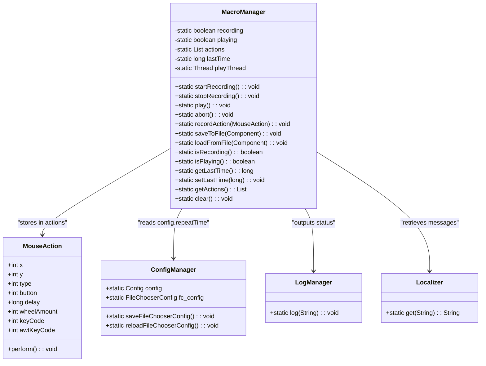
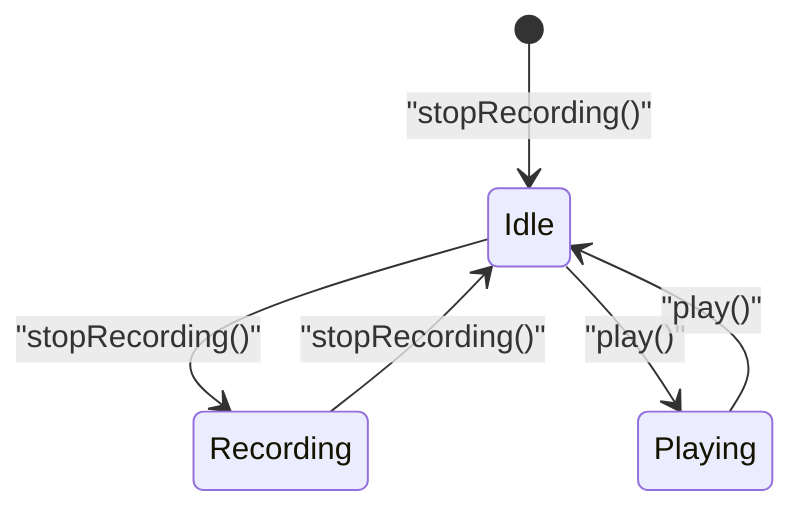
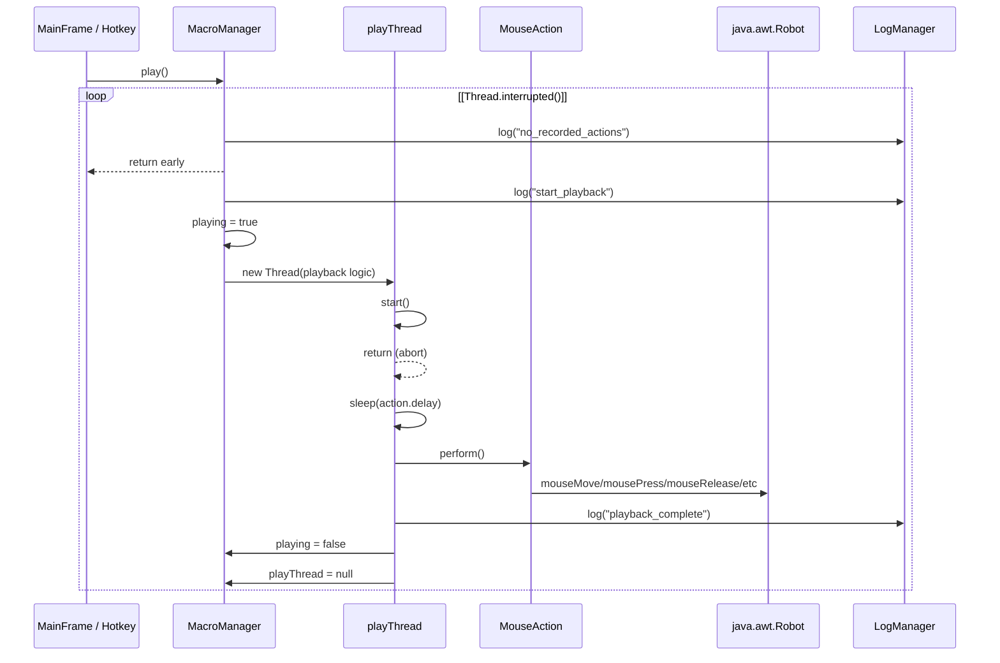
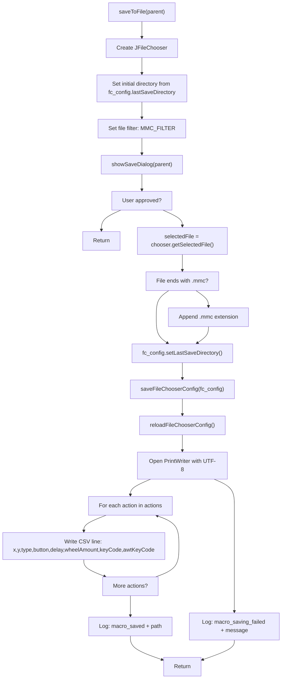
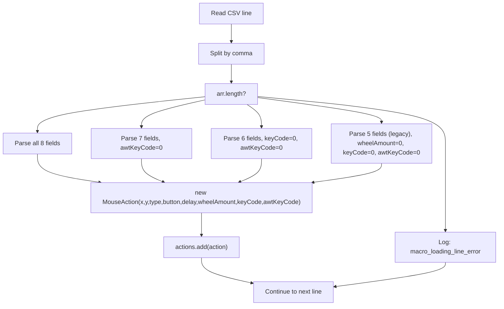
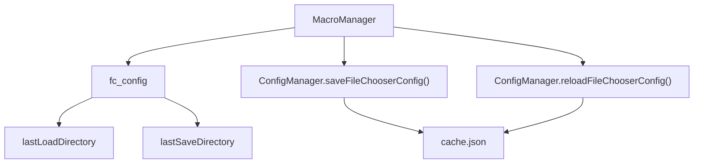

# MacroManager

> **Relevant source files**
> * [src/io/github/samera2022/mouse_macros/constant/FileConsts.java](https://github.com/Samera2022/MouseMacros/blob/6b37ce1e/src/io/github/samera2022/mouse_macros/constant/FileConsts.java)
> * [src/io/github/samera2022/mouse_macros/constant/OtherConsts.java](https://github.com/Samera2022/MouseMacros/blob/6b37ce1e/src/io/github/samera2022/mouse_macros/constant/OtherConsts.java)
> * [src/io/github/samera2022/mouse_macros/manager/MacroManager.java](https://github.com/Samera2022/MouseMacros/blob/6b37ce1e/src/io/github/samera2022/mouse_macros/manager/MacroManager.java)
> * [src/io/github/samera2022/mouse_macros/manager/config/FileChooserConfig.java](https://github.com/Samera2022/MouseMacros/blob/6b37ce1e/src/io/github/samera2022/mouse_macros/manager/config/FileChooserConfig.java)

## Overview

The `MacroManager` class provides the core orchestration layer for the macro recording and playback system. It manages the application's state machine (recording/playing/idle), maintains an in-memory buffer of recorded actions, coordinates playback execution in a separate thread, and handles serialization/deserialization of macros to `.mmc` files.

**Scope**: This page documents the `MacroManager` class architecture, state management, recording/playback control, and file operations. For details on:

* OS-level input capture that feeds recorded events to MacroManager, see [Global Input Capture](/Samera2022/MouseMacros/4.2-global-input-capture)
* Individual action representation and playback execution, see [MouseAction](/Samera2022/MouseMacros/4.3-mouseaction)
* `.mmc` file format specification and backward compatibility, see [Macro File Format](/Samera2022/MouseMacros/4.4-macro-file-format-(.mmc))

**Location**: [src/io/github/samera2022/mouse_macros/manager/MacroManager.java](https://github.com/Samera2022/MouseMacros/blob/6b37ce1e/src/io/github/samera2022/mouse_macros/manager/MacroManager.java)

---

## Architecture & Design

MacroManager implements a **static singleton pattern** with no instance creation. All methods and fields are static, making it globally accessible throughout the application as a shared macro state manager.

### Class Structure

**Sources**: [src/io/github/samera2022/mouse_macros/manager/MacroManager.java L1-L201](https://github.com/Samera2022/MouseMacros/blob/6b37ce1e/src/io/github/samera2022/mouse_macros/manager/MacroManager.java#L1-L201)

### Static Fields

| Field | Type | Purpose |
| --- | --- | --- |
| `recording` | `boolean` | Indicates whether macro recording is active |
| `playing` | `boolean` | Indicates whether macro playback is in progress |
| `actions` | `List<MouseAction>` | In-memory buffer storing recorded actions |
| `lastTime` | `long` | Timestamp (milliseconds) of the last recorded event |
| `playThread` | `Thread` | Reference to the active playback thread (null when idle) |

**Sources**: [src/io/github/samera2022/mouse_macros/manager/MacroManager.java L22-L26](https://github.com/Samera2022/MouseMacros/blob/6b37ce1e/src/io/github/samera2022/mouse_macros/manager/MacroManager.java#L22-L26)

---

## State Machine

MacroManager operates as a finite state machine with three primary states: **Idle**, **Recording**, and **Playing**. State transitions are controlled by user actions (UI buttons or hotkeys) and enforce mutual exclusion between recording and playback.

### State Diagram

**Sources**: [src/io/github/samera2022/mouse_macros/manager/MacroManager.java L22-L86](https://github.com/Samera2022/MouseMacros/blob/6b37ce1e/src/io/github/samera2022/mouse_macros/manager/MacroManager.java#L22-L86)

### State Query Methods

**isRecording()** - Returns the current value of the `recording` flag [src/io/github/samera2022/mouse_macros/manager/MacroManager.java L71-L73](https://github.com/Samera2022/MouseMacros/blob/6b37ce1e/src/io/github/samera2022/mouse_macros/manager/MacroManager.java#L71-L73)

**isPlaying()** - Returns the current value of the `playing` flag [src/io/github/samera2022/mouse_macros/manager/MacroManager.java L75-L77](https://github.com/Samera2022/MouseMacros/blob/6b37ce1e/src/io/github/samera2022/mouse_macros/manager/MacroManager.java#L75-L77)

These methods are called by `GlobalMouseListener` to filter input events and by `MainFrame` to manage button states.

---

## Recording System

### Starting Recording

**Method**: `startRecording()` [src/io/github/samera2022/mouse_macros/manager/MacroManager.java L28-L33](https://github.com/Samera2022/MouseMacros/blob/6b37ce1e/src/io/github/samera2022/mouse_macros/manager/MacroManager.java#L28-L33)

**Behavior**:

1. Clears the `actions` buffer with `actions.clear()`
2. Sets `recording = true` to enable event capture
3. Initializes `lastTime = System.currentTimeMillis()` for delay calculations
4. Logs localized message: `Localizer.get("start_recording")`

### Recording Actions

**Method**: `recordAction(MouseAction action)` [src/io/github/samera2022/mouse_macros/manager/MacroManager.java L88-L91](https://github.com/Samera2022/MouseMacros/blob/6b37ce1e/src/io/github/samera2022/mouse_macros/manager/MacroManager.java#L88-L91)

**Behavior**:

1. Appends the action to `actions` list
2. Updates `lastTime = System.currentTimeMillis()`

This method is called by `GlobalMouseListener` when:

* Mouse buttons are pressed (`nativeMousePressed`)
* Mouse wheel is scrolled (`nativeMouseWheelMoved`)
* Keyboard keys are pressed (`nativeKeyPressed`)

The `delay` field in each `MouseAction` is calculated by `GlobalMouseListener` as `currentTime - MacroManager.getLastTime()` before calling `recordAction()`.

### Stopping Recording

**Method**: `stopRecording()` [src/io/github/samera2022/mouse_macros/manager/MacroManager.java L35-L38](https://github.com/Samera2022/MouseMacros/blob/6b37ce1e/src/io/github/samera2022/mouse_macros/manager/MacroManager.java#L35-L38)

**Behavior**:

1. Sets `recording = false` to disable event capture
2. Logs summary: `"Stopped recording. Recorded {N} actions."` (localized)

The `actions` buffer is **not cleared** on stop, allowing immediate playback or file saving.

### Timestamp Management

| Method | Purpose |
| --- | --- |
| `getLastTime()` | Returns `lastTime` for delay calculation by `GlobalMouseListener` |
| `setLastTime(long t)` | Updates `lastTime` (used by `GlobalMouseListener` during recording) |

**Sources**: [src/io/github/samera2022/mouse_macros/manager/MacroManager.java L93-L99](https://github.com/Samera2022/MouseMacros/blob/6b37ce1e/src/io/github/samera2022/mouse_macros/manager/MacroManager.java#L93-L99)

---

## Playback System

### Playback Execution Flow

**Sources**: [src/io/github/samera2022/mouse_macros/manager/MacroManager.java L40-L69](https://github.com/Samera2022/MouseMacros/blob/6b37ce1e/src/io/github/samera2022/mouse_macros/manager/MacroManager.java#L40-L69)

### play() Method

**Implementation**: [src/io/github/samera2022/mouse_macros/manager/MacroManager.java L40-L69](https://github.com/Samera2022/MouseMacros/blob/6b37ce1e/src/io/github/samera2022/mouse_macros/manager/MacroManager.java#L40-L69)

**Execution Steps**:

1. **Validation**: Checks if `actions.isEmpty()`. If true, logs `"no_recorded_actions"` and returns.
2. **Initialization**: * Sets `playing = true` * Logs `"start_playback"`
3. **Thread Spawning**: Creates a new `Thread` that: * Iterates `config.repeatTime` times (outer loop) * For each iteration, loops through `actions` (inner loop) * Checks `Thread.interrupted()` before each action to support abort * Calls `Thread.sleep(action.delay)` to respect timing * Calls `action.perform()` to execute the action via `Robot`
4. **Completion Handling**: * On successful completion: logs `"playback_complete"` * On interruption: logs `"macro_aborted"` (via catch block) * On error: logs `"playback_error"` + exception message * Always sets `playing = false` and `playThread = null` in finally block

**Thread Safety**: The `playThread` reference allows external interruption via `abort()`.

### abort() Method

**Implementation**: [src/io/github/samera2022/mouse_macros/manager/MacroManager.java L79-L86](https://github.com/Samera2022/MouseMacros/blob/6b37ce1e/src/io/github/samera2022/mouse_macros/manager/MacroManager.java#L79-L86)

**Behavior**:

1. Sets `playing = false`
2. Checks if `playThread != null && playThread.isAlive()`
3. If true, calls `playThread.interrupt()` and logs `"macro_aborted"`
4. Otherwise, logs `"macro_not_running"`

The interrupt is detected by the playback loop at line 51-52, causing immediate termination.

**Sources**: [src/io/github/samera2022/mouse_macros/manager/MacroManager.java L40-L86](https://github.com/Samera2022/MouseMacros/blob/6b37ce1e/src/io/github/samera2022/mouse_macros/manager/MacroManager.java#L40-L86)

---

## File I/O Operations

MacroManager provides file save/load functionality with backward compatibility for older `.mmc` formats.

### File Format Summary

The `.mmc` file format is CSV-based with 5-8 fields per line:

| Field Count | Fields | Version |
| --- | --- | --- |
| 8 | `x,y,type,button,delay,wheelAmount,keyCode,awtKeyCode` | Current (v1.0.0+) |
| 7 | `x,y,type,button,delay,wheelAmount,keyCode` | v0.1.0 |
| 6 | `x,y,type,button,delay,wheelAmount` | v0.0.2 |
| 5 | `x,y,type,button,delay` | v0.0.1 |

For detailed format specification, see [Macro File Format](/Samera2022/MouseMacros/4.4-macro-file-format-(.mmc)).

### Save Operation

**Implementation**: [src/io/github/samera2022/mouse_macros/manager/MacroManager.java L107-L131](https://github.com/Samera2022/MouseMacros/blob/6b37ce1e/src/io/github/samera2022/mouse_macros/manager/MacroManager.java#L107-L131)

**Key Details**:

* Uses `JFileChooser` with `FileConsts.MMC_FILTER` [src/io/github/samera2022/mouse_macros/constant/FileConsts.java L6-L9](https://github.com/Samera2022/MouseMacros/blob/6b37ce1e/src/io/github/samera2022/mouse_macros/constant/FileConsts.java#L6-L9)
* Automatically appends `.mmc` extension if missing [line 117-118](https://github.com/Samera2022/MouseMacros/blob/6b37ce1e/line 117-118)
* Persists last save directory to `FileChooserConfig` [line 119-121](https://github.com/Samera2022/MouseMacros/blob/6b37ce1e/line 119-121)
* Uses `PrintWriter` with `StandardCharsets.UTF_8` for Unicode support [line 122](https://github.com/Samera2022/MouseMacros/blob/6b37ce1e/line 122)
* Writes all 8 fields per line in current format [line 124](https://github.com/Samera2022/MouseMacros/blob/6b37ce1e/line 124)

**Sources**: [src/io/github/samera2022/mouse_macros/manager/MacroManager.java L107-L131](https://github.com/Samera2022/MouseMacros/blob/6b37ce1e/src/io/github/samera2022/mouse_macros/manager/MacroManager.java#L107-L131)

 [src/io/github/samera2022/mouse_macros/constant/FileConsts.java L1-L10](https://github.com/Samera2022/MouseMacros/blob/6b37ce1e/src/io/github/samera2022/mouse_macros/constant/FileConsts.java#L1-L10)

### Load Operation

**Implementation**: [src/io/github/samera2022/mouse_macros/manager/MacroManager.java L133-L200](https://github.com/Samera2022/MouseMacros/blob/6b37ce1e/src/io/github/samera2022/mouse_macros/manager/MacroManager.java#L133-L200)

**Backward Compatibility Parser**:

The load operation supports four different formats by parsing line length:

**Parsing Logic**:

| Line Format | Code Reference | Default Values |
| --- | --- | --- |
| 8 fields | [lines 156-165](https://github.com/Samera2022/MouseMacros/blob/6b37ce1e/lines 156-165) | None (all fields present) |
| 7 fields | [lines 166-174](https://github.com/Samera2022/MouseMacros/blob/6b37ce1e/lines 166-174) | `awtKeyCode = 0` |
| 6 fields | [lines 175-182](https://github.com/Samera2022/MouseMacros/blob/6b37ce1e/lines 175-182) | `keyCode = 0, awtKeyCode = 0` |
| 5 fields | [lines 183-189](https://github.com/Samera2022/MouseMacros/blob/6b37ce1e/lines 183-189) | `wheelAmount = 0, keyCode = 0, awtKeyCode = 0` |

**Error Handling**:

* Per-line exceptions are caught and logged with line number [lines 191-193](https://github.com/Samera2022/MouseMacros/blob/6b37ce1e/lines 191-193)
* File-level exceptions are caught and logged [lines 196-198](https://github.com/Samera2022/MouseMacros/blob/6b37ce1e/lines 196-198)
* Parsing continues even if individual lines fail, maximizing data recovery

**Post-Load State**:

* `actions.clear()` is called before parsing [line 149](https://github.com/Samera2022/MouseMacros/blob/6b37ce1e/line 149)
* `fc_config.lastLoadDirectory` is persisted [lines 142-144](https://github.com/Samera2022/MouseMacros/blob/6b37ce1e/lines 142-144)
* Success message includes file path and action count [line 195](https://github.com/Samera2022/MouseMacros/blob/6b37ce1e/line 195)

**Sources**: [src/io/github/samera2022/mouse_macros/manager/MacroManager.java L133-L200](https://github.com/Samera2022/MouseMacros/blob/6b37ce1e/src/io/github/samera2022/mouse_macros/manager/MacroManager.java#L133-L200)

---

## Integration Points

### Dependencies

MacroManager integrates with multiple subsystems:

| Subsystem | Usage | Code Reference |
| --- | --- | --- |
| **ConfigManager** | Reads `config.repeatTime` for playback loops | [line 49](https://github.com/Samera2022/MouseMacros/blob/6b37ce1e/line 49) |
|  | Reads/writes `fc_config` for file chooser state | [lines 111-121, 136-144](https://github.com/Samera2022/MouseMacros/blob/6b37ce1e/lines 111-121, 136-144) |
| **LogManager** | Outputs status messages to UI log area | [lines 18, 32, 37, 42, etc.](https://github.com/Samera2022/MouseMacros/blob/6b37ce1e/lines 18, 32, 37, 42, etc.) |
| **Localizer** | Retrieves localized message strings | [lines 4, 32, 37, 42, etc.](https://github.com/Samera2022/MouseMacros/blob/6b37ce1e/lines 4, 32, 37, 42, etc.) |
| **MouseAction** | Stores recorded events in `actions` list | [line 24, 89](https://github.com/Samera2022/MouseMacros/blob/6b37ce1e/line 24, 89) |
|  | Calls `action.perform()` during playback | [line 55](https://github.com/Samera2022/MouseMacros/blob/6b37ce1e/line 55) |
| **FileConsts** | Uses `MMC_FILTER` for file chooser filter | [lines 5, 113, 138](https://github.com/Samera2022/MouseMacros/blob/6b37ce1e/lines 5, 113, 138) |
| **OtherConsts** | (Imported but unused in current version) | [line 6](https://github.com/Samera2022/MouseMacros/blob/6b37ce1e/line 6) |

**Sources**: [src/io/github/samera2022/mouse_macros/manager/MacroManager.java L1-L20](https://github.com/Samera2022/MouseMacros/blob/6b37ce1e/src/io/github/samera2022/mouse_macros/manager/MacroManager.java#L1-L20)

### External Callers

MacroManager methods are invoked by:

1. **MainFrame** - UI button handlers: * Record button → `startRecording()` / `stopRecording()` * Play button → `play()` * Abort button → `abort()` * Save/Load menu items → `saveToFile()` / `loadFromFile()`
2. **GlobalMouseListener** - Hotkey handlers and event recording: * F2 hotkey → `startRecording()` * F3 hotkey → `stopRecording()` * F4 hotkey → `play()` * F5 hotkey → `abort()` * Event capture → `recordAction(MouseAction)` * Timing queries → `getLastTime()`, `setLastTime()`

**Sources**: [src/io/github/samera2022/mouse_macros/manager/MacroManager.java L1-L201](https://github.com/Samera2022/MouseMacros/blob/6b37ce1e/src/io/github/samera2022/mouse_macros/manager/MacroManager.java#L1-L201)

### FileChooserConfig Integration

MacroManager persists file dialog state through `FileChooserConfig`:

**Workflow**:

1. On save/load dialog open: Read `fc_config.lastSaveDirectory` or `fc_config.lastLoadDirectory` [lines 111, 136](https://github.com/Samera2022/MouseMacros/blob/6b37ce1e/lines 111, 136)
2. On file selection: Update directory with `fc_config.setLastSaveDirectory()` or `setLastLoadDirectory()` [lines 119, 142](https://github.com/Samera2022/MouseMacros/blob/6b37ce1e/lines 119, 142)
3. Persist to disk: Call `saveFileChooserConfig(fc_config)` [lines 120, 143](https://github.com/Samera2022/MouseMacros/blob/6b37ce1e/lines 120, 143)
4. Reload from disk: Call `reloadFileChooserConfig()` [lines 121, 144](https://github.com/Samera2022/MouseMacros/blob/6b37ce1e/lines 121, 144)

This creates a persistent "memory" of the last directories used, improving UX for repeated save/load operations.

**Sources**: [src/io/github/samera2022/mouse_macros/manager/MacroManager.java L107-L144](https://github.com/Samera2022/MouseMacros/blob/6b37ce1e/src/io/github/samera2022/mouse_macros/manager/MacroManager.java#L107-L144)

 [src/io/github/samera2022/mouse_macros/manager/config/FileChooserConfig.java L1-L28](https://github.com/Samera2022/MouseMacros/blob/6b37ce1e/src/io/github/samera2022/mouse_macros/manager/config/FileChooserConfig.java#L1-L28)

---

## Utility Methods

### Actions Buffer Access

| Method | Return Type | Purpose |
| --- | --- | --- |
| `getActions()` | `List<MouseAction>` | Returns direct reference to `actions` list |
| `clear()` | `void` | Calls `actions.clear()` to empty buffer |

**Usage**: `getActions()` is used by `MacroSettingsDialog` to display action details for custom macro editing. The `clear()` method is primarily called internally by `startRecording()`.

**Sources**: [src/io/github/samera2022/mouse_macros/manager/MacroManager.java L101-L105](https://github.com/Samera2022/MouseMacros/blob/6b37ce1e/src/io/github/samera2022/mouse_macros/manager/MacroManager.java#L101-L105)

---

## Thread Safety Considerations

MacroManager is **not thread-safe**:

* The `actions` list can be modified during iteration if recording/loading occurs during playback
* The `playing` flag is set without synchronization
* Multiple calls to `play()` could spawn multiple `playThread` instances (though UI should prevent this)

**Current Mitigation**:

* UI buttons are disabled based on state queries (`isRecording()`, `isPlaying()`)
* GlobalMouseListener checks state before calling `recordAction()`
* Playback thread checks `Thread.interrupted()` for safe abort

**Potential Issues**:

* Concurrent `play()` calls from different threads would create race conditions
* `actions` list modifications during playback iteration could cause `ConcurrentModificationException`

In practice, these issues are avoided by the UI control flow and hotkey handling in `GlobalMouseListener`, which enforces sequential operations.

**Sources**: [src/io/github/samera2022/mouse_macros/manager/MacroManager.java L22-L69](https://github.com/Samera2022/MouseMacros/blob/6b37ce1e/src/io/github/samera2022/mouse_macros/manager/MacroManager.java#L22-L69)