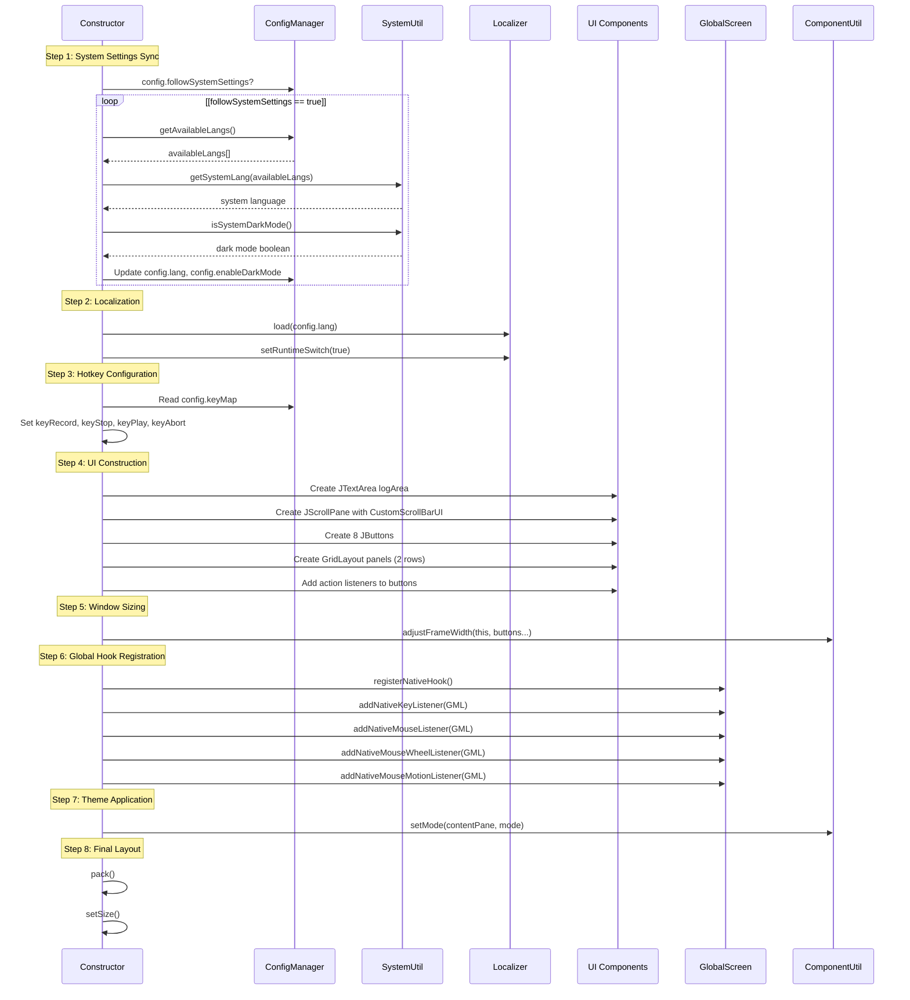
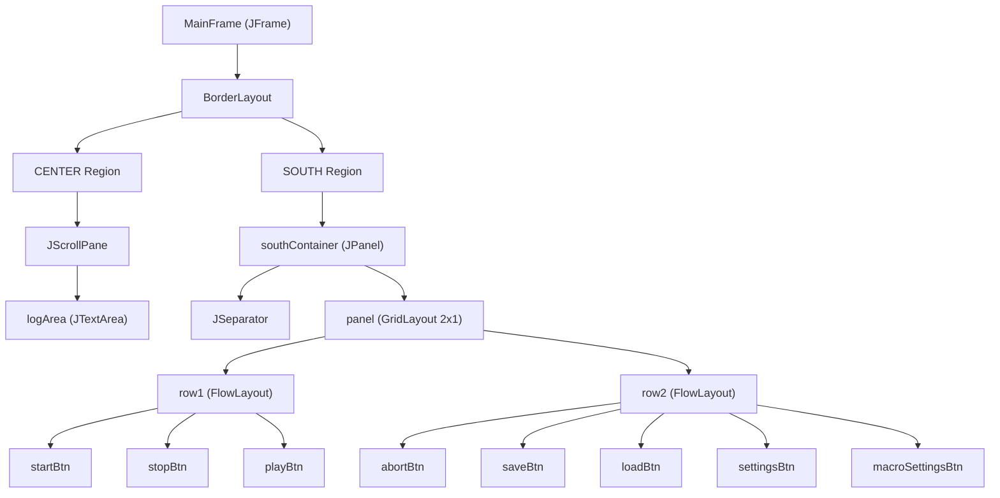
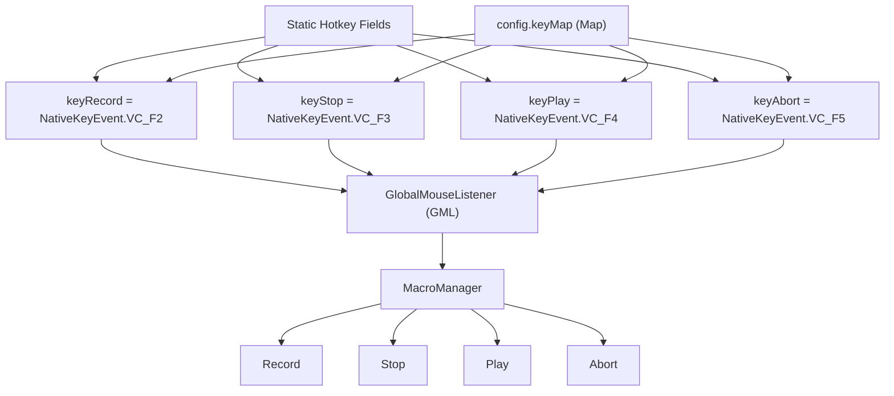
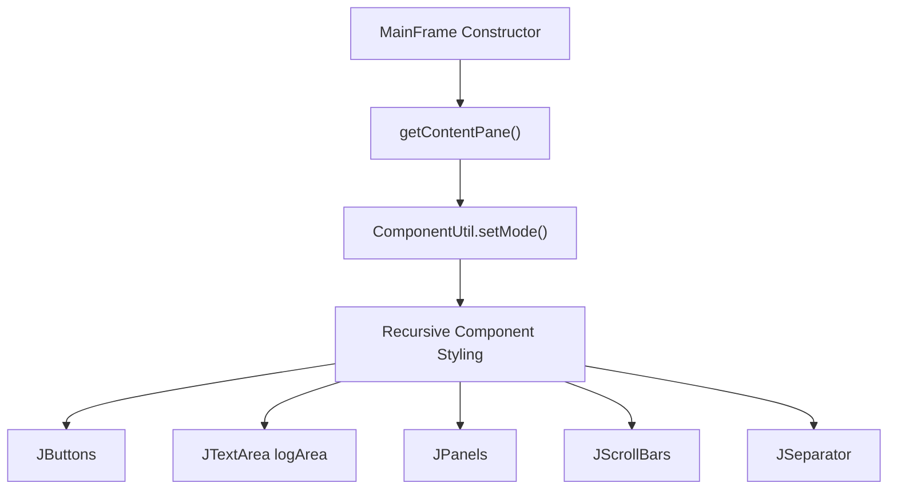
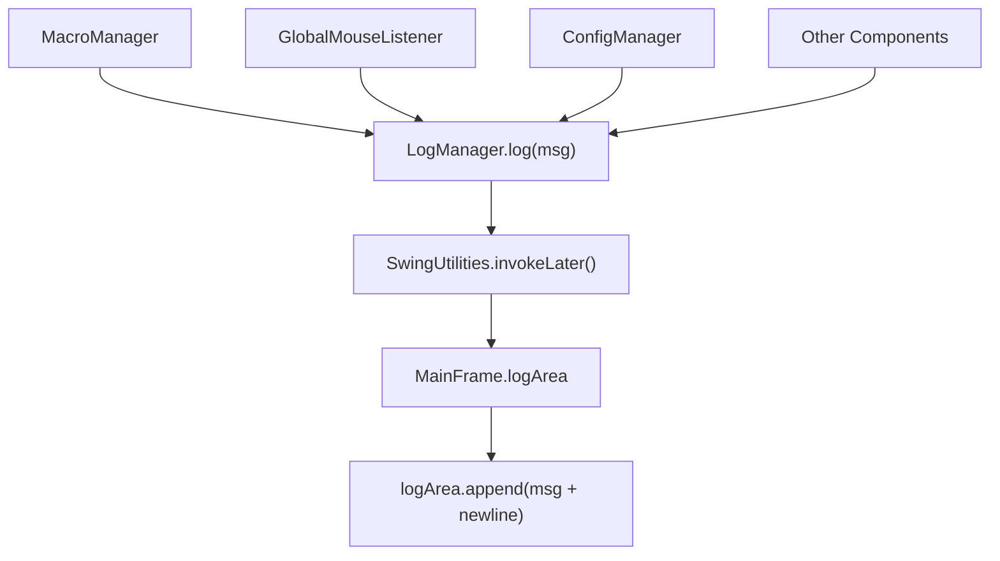
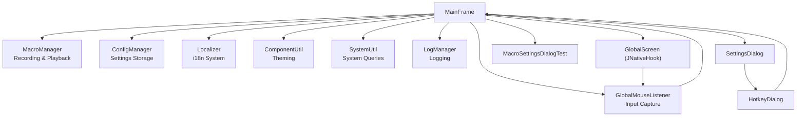

# Main Window (MainFrame)

> **Relevant source files**
> * [src/io/github/samera2022/mouse_macros/cache/SizeCache.java](https://github.com/Samera2022/MouseMacros/blob/6b37ce1e/src/io/github/samera2022/mouse_macros/cache/SizeCache.java)
> * [src/io/github/samera2022/mouse_macros/manager/LogManager.java](https://github.com/Samera2022/MouseMacros/blob/6b37ce1e/src/io/github/samera2022/mouse_macros/manager/LogManager.java)
> * [src/io/github/samera2022/mouse_macros/ui/frame/MainFrame.java](https://github.com/Samera2022/MouseMacros/blob/6b37ce1e/src/io/github/samera2022/mouse_macros/ui/frame/MainFrame.java)
> * [src/io/github/samera2022/mouse_macros/util/ComponentUtil.java](https://github.com/Samera2022/MouseMacros/blob/6b37ce1e/src/io/github/samera2022/mouse_macros/util/ComponentUtil.java)

## Purpose and Scope

This document details the `MainFrame` class, which serves as the primary application window and main orchestrator for the MouseMacros application. The `MainFrame` is responsible for:

* Constructing and managing the main UI layout with control buttons and status log area
* Initializing and registering global input hooks via JNativeHook
* Coordinating interactions between the macro system, configuration, localization, and theming subsystems
* Handling user-triggered actions and hotkey management
* Applying system-wide theme settings

For information about the macro recording and playback functionality triggered by this window, see [Macro Recording and Playback System](/Samera2022/MouseMacros/4-macro-recording-and-playback-system). For configuration management, see [ConfigManager](/Samera2022/MouseMacros/5.1-configmanager). For theming implementation details, see [Theming System](/Samera2022/MouseMacros/7.4-theming-system).

**Sources:** [src/io/github/samera2022/mouse_macros/ui/frame/MainFrame.java L1-L193](https://github.com/Samera2022/MouseMacros/blob/6b37ce1e/src/io/github/samera2022/mouse_macros/ui/frame/MainFrame.java#L1-L193)

---

## Class Structure and Singleton Pattern

The `MainFrame` class follows a singleton-like pattern with a public static instance:

```
public static final MainFrame MAIN_FRAME = new MainFrame();
```

### Key Members

| Member | Type | Purpose |
| --- | --- | --- |
| `logArea` | `static JTextArea` | Displays status messages throughout the application lifecycle |
| `startBtn` | `JButton` | Initiates macro recording |
| `stopBtn` | `JButton` | Stops macro recording |
| `playBtn` | `JButton` | Executes recorded macro |
| `abortBtn` | `JButton` | Aborts currently running macro playback |
| `saveBtn` | `JButton` | Saves recorded macro to `.mmc` file |
| `loadBtn` | `JButton` | Loads macro from `.mmc` file |
| `settingsBtn` | `JButton` | Opens settings dialog |
| `macroSettingsBtn` | `JButton` | Opens macro-specific settings dialog |
| `GML` | `static GlobalMouseListener` | Singleton listener instance for global input events |
| `keyRecord` | `static int` | Native key code for recording hotkey (default: F2) |
| `keyStop` | `static int` | Native key code for stop hotkey (default: F3) |
| `keyPlay` | `static int` | Native key code for playback hotkey (default: F4) |
| `keyAbort` | `static int` | Native key code for abort hotkey (default: F5) |

The static `logArea` and `MAIN_FRAME` allow other subsystems (particularly `LogManager`) to access the UI without complex dependency injection.

**Sources:** [src/io/github/samera2022/mouse_macros/ui/frame/MainFrame.java L28-L39](https://github.com/Samera2022/MouseMacros/blob/6b37ce1e/src/io/github/samera2022/mouse_macros/ui/frame/MainFrame.java#L28-L39)

---

## Initialization Sequence

The `MainFrame` constructor executes a specific initialization order critical for application functionality:



### Step 1: System Settings Synchronization

[Lines 51-56](https://github.com/Samera2022/MouseMacros/blob/6b37ce1e/Lines 51-56)

 check if `config.followSystemSettings` is enabled. If so, the system language and dark mode preference are automatically detected and synchronized:

* Language detection uses `SystemUtil.getSystemLang(availableLangs)` to match the OS language against available translations
* Dark mode detection uses `SystemUtil.isSystemDarkMode()` which queries Windows Registry on Windows systems

### Step 2: Localization Loading

[Lines 58-60](https://github.com/Samera2022/MouseMacros/blob/6b37ce1e/Lines 58-60)

 initialize the localization system:

```
Localizer.load(config.lang); // Load language file
Localizer.setRuntimeSwitch(enableLangSwitch); // Enable runtime language switching
```

### Step 3: Hotkey Configuration

[Lines 62-71](https://github.com/Samera2022/MouseMacros/blob/6b37ce1e/Lines 62-71)

 load custom hotkey mappings from `config.keyMap`. The default values (F2-F5) are overridden if the configuration contains:

* `"start_macro"` → `keyRecord`
* `"stop_record"` → `keyStop`
* `"play_macro"` → `keyPlay`
* `"abort_macro_operation"` → `keyAbort`

### Step 4: UI Component Construction

[Lines 78-122](https://github.com/Samera2022/MouseMacros/blob/6b37ce1e/Lines 78-122)

 construct the UI hierarchy with a `BorderLayout`:

* **CENTER**: `JScrollPane` containing `logArea` with `CustomScrollBarUI`
* **SOUTH**: Container with `JSeparator` and button panel

### Step 5: Global Hook Registration

[Lines 142-150](https://github.com/Samera2022/MouseMacros/blob/6b37ce1e/Lines 142-150)

 register the global input hook system:

```
GlobalScreen.registerNativeHook();
GlobalScreen.addNativeKeyListener(GML);
GlobalScreen.addNativeMouseListener(GML);
GlobalScreen.addNativeMouseWheelListener(GML);
GlobalScreen.addNativeMouseMotionListener(GML);
```

This critical step enables OS-level input capture for macro recording and hotkey detection. JNativeHook logging is disabled [lines 138-140](https://github.com/Samera2022/MouseMacros/blob/6b37ce1e/lines 138-140)

 to prevent console spam.

### Step 6: Theme Application

[Line 152](https://github.com/Samera2022/MouseMacros/blob/6b37ce1e/Line 152)

 applies the configured theme (dark or light mode) to the entire component tree via `ComponentUtil.setMode()`.

**Sources:** [src/io/github/samera2022/mouse_macros/ui/frame/MainFrame.java L50-L162](https://github.com/Samera2022/MouseMacros/blob/6b37ce1e/src/io/github/samera2022/mouse_macros/ui/frame/MainFrame.java#L50-L162)

---

## UI Layout Architecture

The main window uses a structured layout hierarchy:



### Layout Details

| Component | Layout Manager | Purpose |
| --- | --- | --- |
| `MainFrame` | `BorderLayout` | Root container |
| `panel` | `GridLayout(2, 1, 5, 5)` | Two-row button container with 5px gaps |
| `row1` | `FlowLayout(CENTER, 10, 0)` | First button row with 10px horizontal gap |
| `row2` | `FlowLayout(CENTER, 10, 0)` | Second button row with 10px horizontal gap |

The button panel includes 5px border padding [line 93](https://github.com/Samera2022/MouseMacros/blob/6b37ce1e/line 93)

:

```
panel.setBorder(BorderFactory.createEmptyBorder(5, 0, 5, 0)); // Top and bottom padding
```

### Dynamic Width Adjustment

[Line 125](https://github.com/Samera2022/MouseMacros/blob/6b37ce1e/Line 125)

 calls `ComponentUtil.adjustFrameWidth()` to automatically size the window based on button widths:

```
ComponentUtil.adjustFrameWidth(this, startBtn, stopBtn, playBtn, saveBtn, loadBtn, settingsBtn);
```

The utility method [src/io/github/samera2022/mouse_macros/util/ComponentUtil.java L15-L22](https://github.com/Samera2022/MouseMacros/blob/6b37ce1e/src/io/github/samera2022/mouse_macros/util/ComponentUtil.java#L15-L22)

 calculates the maximum width needed for both button rows and adds 80px padding.

**Sources:** [src/io/github/samera2022/mouse_macros/ui/frame/MainFrame.java L78-L125](https://github.com/Samera2022/MouseMacros/blob/6b37ce1e/src/io/github/samera2022/mouse_macros/ui/frame/MainFrame.java#L78-L125)

 [src/io/github/samera2022/mouse_macros/util/ComponentUtil.java L15-L22](https://github.com/Samera2022/MouseMacros/blob/6b37ce1e/src/io/github/samera2022/mouse_macros/util/ComponentUtil.java#L15-L22)

---

## Event Handling and Action Listeners

Each button connects to specific `MacroManager` operations with guard conditions:

```mermaid
flowchart TD

StartBtn["startBtn.addActionListener"]
StopBtn["stopBtn.addActionListener"]
PlayBtn["playBtn.addActionListener"]
AbortBtn["abortBtn.addActionListener"]
SaveBtn["saveBtn.addActionListener"]
LoadBtn["loadBtn.addActionListener"]
SettingsBtn["settingsBtn.addActionListener"]
MacroSettingsBtn["macroSettingsBtn.addActionListener"]
StartRecording["MacroManager.startRecording()"]
StopRecording["MacroManager.stopRecording()"]
Play["MacroManager.play()"]
Abort["MacroManager.abort()"]
SaveToFile["MacroManager.saveToFile(this)"]
LoadFromFile["MacroManager.loadFromFile(this)"]
OpenSettings["new SettingsDialog().setVisible(true)"]
OpenMacroSettings["new MacroSettingsDialogTest().setVisible(true)"]

StartBtn --> StartRecording
StopBtn --> StopRecording
PlayBtn --> Play
AbortBtn --> Abort
SaveBtn --> SaveToFile
LoadBtn --> LoadFromFile
SettingsBtn --> OpenSettings
MacroSettingsBtn --> OpenMacroSettings
```



### Action Listener Implementations

[Lines 128-135](https://github.com/Samera2022/MouseMacros/blob/6b37ce1e/Lines 128-135)

 define the action listeners:

| Button | Guard Condition | Action | Notes |
| --- | --- | --- | --- |
| `startBtn` | `!MacroManager.isRecording() && !HotkeyDialog.inHotKeyDialog` | `MacroManager.startRecording()` | Prevents starting if already recording or configuring hotkeys |
| `stopBtn` | `MacroManager.isRecording() && !HotkeyDialog.inHotKeyDialog` | `MacroManager.stopRecording()` | Logs error if not recording |
| `playBtn` | `!MacroManager.isRecording() && !HotkeyDialog.inHotKeyDialog` | `MacroManager.play()` | Prevents playback during recording |
| `abortBtn` | `MacroManager.isPlaying() && !HotkeyDialog.inHotKeyDialog` | `MacroManager.abort()` | Logs error if not playing |
| `saveBtn` | `!MacroManager.isRecording()` | `MacroManager.saveToFile(this)` | Opens file chooser dialog |
| `loadBtn` | `!MacroManager.isRecording()` | `MacroManager.loadFromFile(this)` | Opens file chooser dialog |
| `settingsBtn` | None | `new SettingsDialog().setVisible(true)` | Uses `SwingUtilities.invokeLater()` |
| `macroSettingsBtn` | None | `new MacroSettingsDialogTest().setVisible(true)` | Uses `SwingUtilities.invokeLater()` |

### HotkeyDialog Integration

The `HotkeyDialog.inHotKeyDialog` flag prevents hotkey actions during hotkey configuration, avoiding conflicts when the user presses F2-F5 to set those keys as custom hotkeys.

**Sources:** [src/io/github/samera2022/mouse_macros/ui/frame/MainFrame.java L128-L135](https://github.com/Samera2022/MouseMacros/blob/6b37ce1e/src/io/github/samera2022/mouse_macros/ui/frame/MainFrame.java#L128-L135)

---

## Global Hook and Hotkey Management

The `MainFrame` manages four customizable hotkeys through static fields:



### Hotkey Loading

[Lines 62-71](https://github.com/Samera2022/MouseMacros/blob/6b37ce1e/Lines 62-71)

 load hotkey mappings from `config.keyMap`:

```
if (config.keyMap != null) {
    if (config.keyMap.containsKey("start_macro")) {
        try { keyRecord = Integer.parseInt(config.keyMap.get("start_macro")); } catch (Exception ignored) {} }
    // ... similar for keyStop, keyPlay, keyAbort
}
```

### GlobalScreen Registration

[Lines 142-150](https://github.com/Samera2022/MouseMacros/blob/6b37ce1e/Lines 142-150)

 register the `GlobalMouseListener` instance with JNativeHook:

```
GlobalScreen.registerNativeHook();
GlobalScreen.addNativeKeyListener(GML);
GlobalScreen.addNativeMouseListener(GML);
GlobalScreen.addNativeMouseWheelListener(GML);
GlobalScreen.addNativeMouseMotionListener(GML);
```

The `GlobalMouseListener` receives native events and compares them against `MainFrame.keyRecord`, `MainFrame.keyStop`, etc., to trigger macro operations. See [Global Input Capture](/Samera2022/MouseMacros/4.2-global-input-capture) for details.

### Error Handling

Hook registration failures are logged [lines 144-146](https://github.com/Samera2022/MouseMacros/blob/6b37ce1e/lines 144-146)

:

```
try {
    GlobalScreen.registerNativeHook();
} catch (Exception e) {
    log(Localizer.get("hook_registration_failed") + e.getMessage());
}
```

**Sources:** [src/io/github/samera2022/mouse_macros/ui/frame/MainFrame.java L32-L35](https://github.com/Samera2022/MouseMacros/blob/6b37ce1e/src/io/github/samera2022/mouse_macros/ui/frame/MainFrame.java#L32-L35)

 [src/io/github/samera2022/mouse_macros/ui/frame/MainFrame.java L62-L71](https://github.com/Samera2022/MouseMacros/blob/6b37ce1e/src/io/github/samera2022/mouse_macros/ui/frame/MainFrame.java#L62-L71)

 [src/io/github/samera2022/mouse_macros/ui/frame/MainFrame.java L142-L150](https://github.com/Samera2022/MouseMacros/blob/6b37ce1e/src/io/github/samera2022/mouse_macros/ui/frame/MainFrame.java#L142-L150)

---

## Localization Integration

The `MainFrame` extensively uses `Localizer.get()` to retrieve translated strings for all UI text:

### Initial Text Assignment

[Lines 97-108](https://github.com/Samera2022/MouseMacros/blob/6b37ce1e/Lines 97-108)

 create buttons with localized text:

```
startBtn = new JButton(getStartBtnText());
stopBtn = new JButton(getStopBtnText());
playBtn = new JButton(getPlayBtnText());
abortBtn = new JButton(getAbortBtnText());
saveBtn = new JButton(Localizer.get("save_macro"));
loadBtn = new JButton(Localizer.get("load_macro"));
settingsBtn = new JButton(Localizer.get("settings"));
macroSettingsBtn = new JButton(Localizer.get("macro_settings"));
```

### Dynamic Button Text with Hotkeys

[Lines 184-187](https://github.com/Samera2022/MouseMacros/blob/6b37ce1e/Lines 184-187)

 define helper methods that combine localized text with hotkey display:

```java
private String getStartBtnText() {
    return Localizer.get("start_record") + " (" + OtherUtil.getNativeKeyDisplayText(keyRecord) + ")";
}
```

This produces button text like "Start Recording (F2)" with the current hotkey dynamically inserted.

### Runtime Language Switching

[Lines 165-175](https://github.com/Samera2022/MouseMacros/blob/6b37ce1e/Lines 165-175)

 implement `refreshMainFrameTexts()` to update all UI text after language changes:

```
public void refreshMainFrameTexts() {
    setTitle(Localizer.get("title"));
    refreshSpecialTexts(); // Updates buttons with hotkey text
    saveBtn.setText(Localizer.get("save_macro"));
    loadBtn.setText(Localizer.get("load_macro"));
    settingsBtn.setText(Localizer.get("settings"));
    macroSettingsBtn.setText(Localizer.get("macro_settings"));
    ComponentUtil.adjustFrameWidth(this, startBtn, stopBtn, playBtn, saveBtn, loadBtn, settingsBtn, abortBtn, macroSettingsBtn);
}
```

The final call to `adjustFrameWidth()` ensures the window resizes to accommodate the new text widths in different languages.

**Sources:** [src/io/github/samera2022/mouse_macros/ui/frame/MainFrame.java L97-L108](https://github.com/Samera2022/MouseMacros/blob/6b37ce1e/src/io/github/samera2022/mouse_macros/ui/frame/MainFrame.java#L97-L108)

 [src/io/github/samera2022/mouse_macros/ui/frame/MainFrame.java L165-L187](https://github.com/Samera2022/MouseMacros/blob/6b37ce1e/src/io/github/samera2022/mouse_macros/ui/frame/MainFrame.java#L165-L187)

---

## Theme Application

The `MainFrame` applies themes through `ComponentUtil.setMode()` which recursively styles all child components:

### Initial Theme Setup

[Lines 82-83](https://github.com/Samera2022/MouseMacros/blob/6b37ce1e/Lines 82-83)

 apply `CustomScrollBarUI` to the log area's scrollbars:

```
scrollPane.getVerticalScrollBar().setUI(new CustomScrollBarUI(config.enableDarkMode? OtherConsts.DARK_MODE:OtherConsts.LIGHT_MODE));
scrollPane.getHorizontalScrollBar().setUI(new CustomScrollBarUI(config.enableDarkMode? OtherConsts.DARK_MODE:OtherConsts.LIGHT_MODE));
```

[Line 152](https://github.com/Samera2022/MouseMacros/blob/6b37ce1e/Line 152)

 applies the theme to the entire content pane:

```
ComponentUtil.setMode(getContentPane(), config.enableDarkMode?OtherConsts.DARK_MODE:OtherConsts.LIGHT_MODE);
```

### Theme Application Flow



The `ComponentUtil.setMode()` method [src/io/github/samera2022/mouse_macros/util/ComponentUtil.java L24-L121](https://github.com/Samera2022/MouseMacros/blob/6b37ce1e/src/io/github/samera2022/mouse_macros/util/ComponentUtil.java#L24-L121)

 handles:

* Background and foreground colors for all component types
* Special handling for `JScrollPane`, `JPanel`, `JButton`, `JTextField`, `JTextArea`, `JComboBox`, etc.
* Application of `CustomScrollBarUI` to scrollbars
* Caret color for text components

### Runtime Theme Switching

When the user changes the theme in `SettingsDialog`, `ComponentUtil.setMode()` is called again on the main frame, immediately updating all colors without requiring an application restart.

**Sources:** [src/io/github/samera2022/mouse_macros/ui/frame/MainFrame.java L82-L83](https://github.com/Samera2022/MouseMacros/blob/6b37ce1e/src/io/github/samera2022/mouse_macros/ui/frame/MainFrame.java#L82-L83)

 [src/io/github/samera2022/mouse_macros/ui/frame/MainFrame.java L152](https://github.com/Samera2022/MouseMacros/blob/6b37ce1e/src/io/github/samera2022/mouse_macros/ui/frame/MainFrame.java#L152-L152)

 [src/io/github/samera2022/mouse_macros/util/ComponentUtil.java L24-L121](https://github.com/Samera2022/MouseMacros/blob/6b37ce1e/src/io/github/samera2022/mouse_macros/util/ComponentUtil.java#L24-L121)

---

## Logging System Integration

The static `logArea` field enables system-wide logging through `LogManager`:



### LogManager Implementation

[src/io/github/samera2022/mouse_macros/manager/LogManager.java L8-L10](https://github.com/Samera2022/MouseMacros/blob/6b37ce1e/src/io/github/samera2022/mouse_macros/manager/LogManager.java#L8-L10)

 provides a static logging method:

```
public static void log(String msg) {
    SwingUtilities.invokeLater(() -> MainFrame.logArea.append(msg + "\n"));
}
```

The use of `SwingUtilities.invokeLater()` ensures thread safety when non-EDT threads (like macro playback threads) write log messages.

### Usage Throughout Application

Examples of logged messages:

* `"Recording started"` when macro recording begins
* `"Macro saved successfully"` after file save
* `"Hook registration failed: ..."` on JNativeHook errors
* `"Macro not recording"` when user clicks Stop without recording

All messages are localized via `Localizer.get()` before logging.

**Sources:** [src/io/github/samera2022/mouse_macros/ui/frame/MainFrame.java L28](https://github.com/Samera2022/MouseMacros/blob/6b37ce1e/src/io/github/samera2022/mouse_macros/ui/frame/MainFrame.java#L28-L28)

 [src/io/github/samera2022/mouse_macros/manager/LogManager.java L8-L10](https://github.com/Samera2022/MouseMacros/blob/6b37ce1e/src/io/github/samera2022/mouse_macros/manager/LogManager.java#L8-L10)

---

## Window Sizing and Scaling

The `MainFrame` applies display scaling adjustments to ensure correct sizing across different DPI settings:

### Final Size Calculation

[Lines 159-161](https://github.com/Samera2022/MouseMacros/blob/6b37ce1e/Lines 159-161)

 apply scaling:

```
pack();
setSize(getWidth(), (int) (660/SystemUtil.getScale()[1]));
```

* `pack()` sizes the window to fit all components at their preferred sizes
* The height is then set to 660 logical pixels divided by the Y-axis scale factor

### Scale Factor Retrieval

`SystemUtil.getScale()` returns a `double[]` array where:

* `[0]` = X-axis scale factor
* `[1]` = Y-axis scale factor

On a 150% DPI display, `getScale()[1]` would return `1.5`, so the actual pixel height would be `660 / 1.5 = 440` screen pixels.

### Static Width Adjustment

[Lines 189-192](https://github.com/Samera2022/MouseMacros/blob/6b37ce1e/Lines 189-192)

 provide a static method for external width adjustments:

```
public static void adjustFrameWidth(){
    MAIN_FRAME.pack();
    MAIN_FRAME.setSize(MAIN_FRAME.getWidth(), (int) (660/SystemUtil.getScale()[1]));
}
```

This is called after language changes to resize the window based on new text widths.

**Sources:** [src/io/github/samera2022/mouse_macros/ui/frame/MainFrame.java L159-L161](https://github.com/Samera2022/MouseMacros/blob/6b37ce1e/src/io/github/samera2022/mouse_macros/ui/frame/MainFrame.java#L159-L161)

 [src/io/github/samera2022/mouse_macros/ui/frame/MainFrame.java L189-L192](https://github.com/Samera2022/MouseMacros/blob/6b37ce1e/src/io/github/samera2022/mouse_macros/ui/frame/MainFrame.java#L189-L192)

---

## Dependencies and Subsystem Integration

The `MainFrame` serves as the integration point for multiple subsystems:



### Import Analysis

Key imports [lines 3-20](https://github.com/Samera2022/MouseMacros/blob/6b37ce1e/lines 3-20)

:

| Import | Purpose |
| --- | --- |
| `com.github.kwhat.jnativehook.*` | JNativeHook library for global input hooks |
| `io.github.samera2022.mouse_macros.Localizer` | Translation system |
| `io.github.samera2022.mouse_macros.constant.ColorConsts` | Color scheme definitions |
| `io.github.samera2022.mouse_macros.constant.OtherConsts` | Mode constants (DARK_MODE, LIGHT_MODE) |
| `io.github.samera2022.mouse_macros.listener.GlobalMouseListener` | Global input listener |
| `io.github.samera2022.mouse_macros.manager.MacroManager` | Macro operations |
| `io.github.samera2022.mouse_macros.manager.ConfigManager` | Configuration access |
| `io.github.samera2022.mouse_macros.util.ComponentUtil` | UI theming utilities |
| `io.github.samera2022.mouse_macros.util.SystemUtil` | System property detection |
| `io.github.samera2022.mouse_macros.manager.LogManager` | Static logging via `log()` |

**Sources:** [src/io/github/samera2022/mouse_macros/ui/frame/MainFrame.java L3-L20](https://github.com/Samera2022/MouseMacros/blob/6b37ce1e/src/io/github/samera2022/mouse_macros/ui/frame/MainFrame.java#L3-L20)

---

## Key Design Patterns

### Static Singleton Access

The `MAIN_FRAME` and `logArea` static fields enable global access without dependency injection:

```
public static final MainFrame MAIN_FRAME = new MainFrame();
public static JTextArea logArea;
```

This allows `LogManager.log()` to append to the log area from any thread.

### Guard Conditions on Actions

Action listeners include state checks before executing operations:

```
startBtn.addActionListener(e -> {
    if ((!MacroManager.isRecording()) && (!HotkeyDialog.inHotKeyDialog))
        MacroManager.startRecording();
});
```

This prevents invalid state transitions and race conditions.

### Lazy Dialog Initialization

Settings dialogs are created on-demand rather than during construction:

```
settingsBtn.addActionListener(e -> 
    SwingUtilities.invokeLater(() -> new SettingsDialog().setVisible(true))
);
```

This improves startup performance and ensures fresh dialog state.

### Recursive Component Theming

The theme application uses recursive traversal of the component tree via `ComponentUtil.setMode()`, ensuring all nested components receive consistent styling.

**Sources:** [src/io/github/samera2022/mouse_macros/ui/frame/MainFrame.java L28-L39](https://github.com/Samera2022/MouseMacros/blob/6b37ce1e/src/io/github/samera2022/mouse_macros/ui/frame/MainFrame.java#L28-L39)

 [src/io/github/samera2022/mouse_macros/ui/frame/MainFrame.java L128-L135](https://github.com/Samera2022/MouseMacros/blob/6b37ce1e/src/io/github/samera2022/mouse_macros/ui/frame/MainFrame.java#L128-L135)