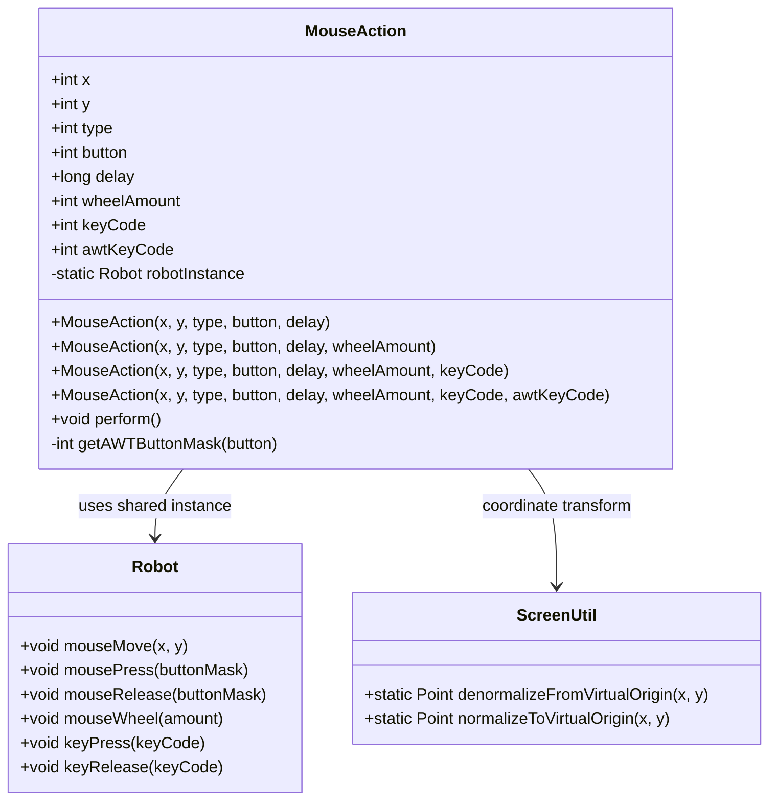
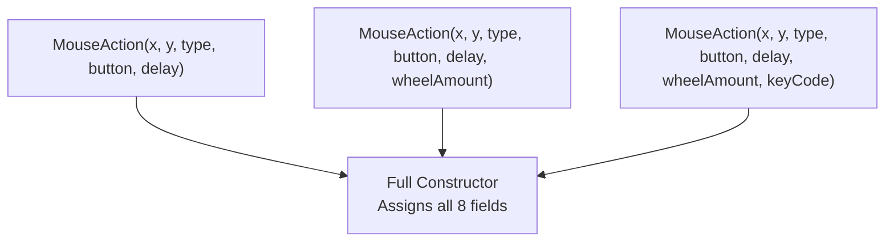
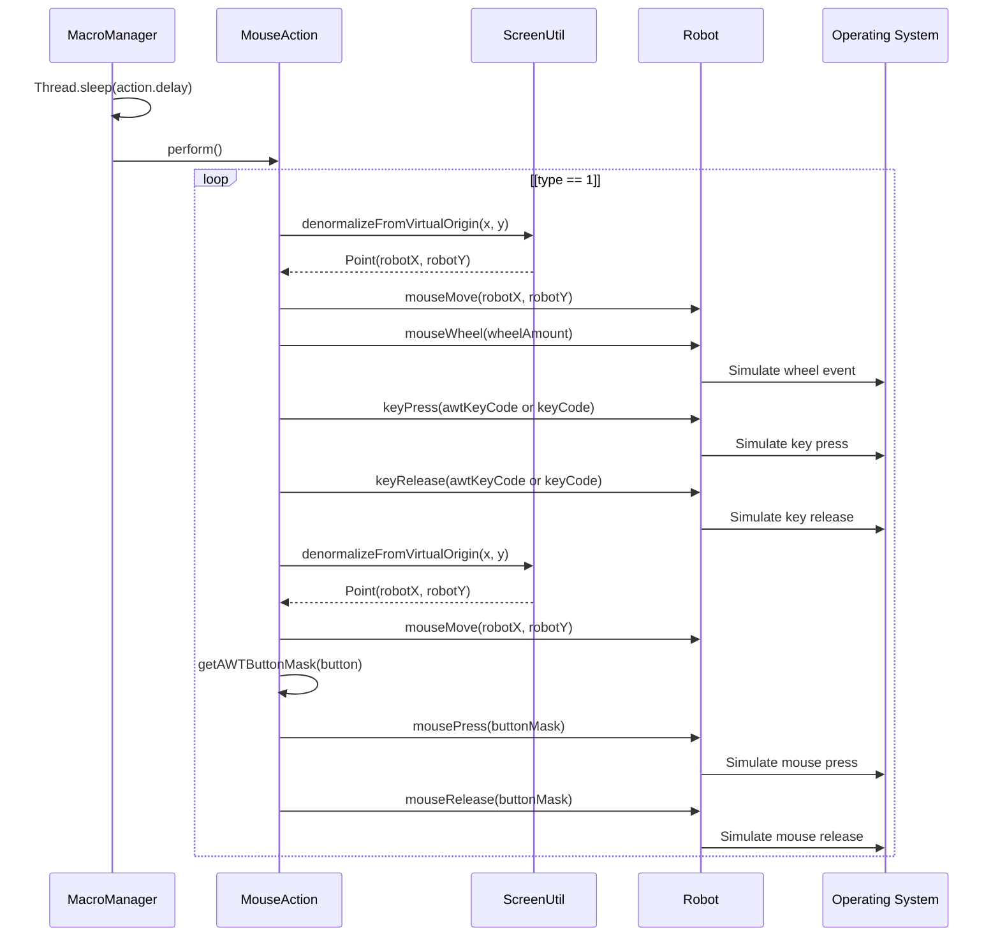
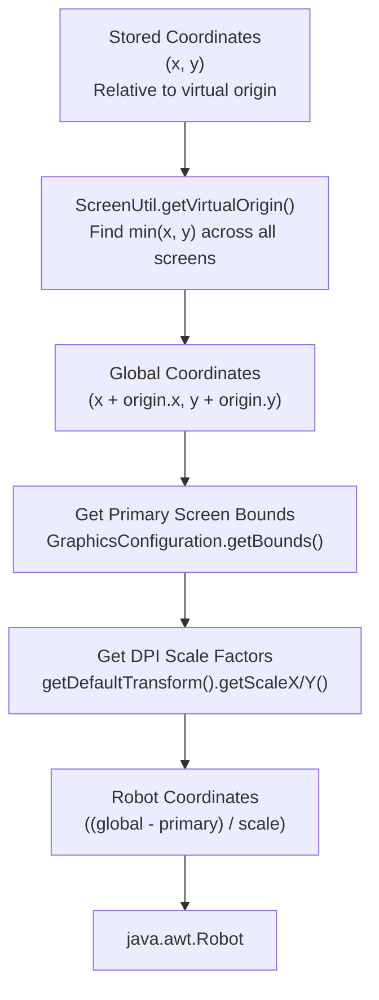
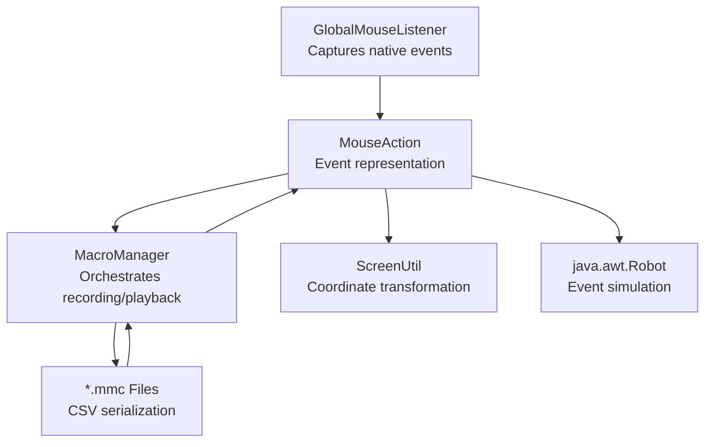

# MouseAction

> **Relevant source files**
> * [src/io/github/samera2022/mouse_macros/action/MouseAction.java](https://github.com/Samera2022/MouseMacros/blob/6b37ce1e/src/io/github/samera2022/mouse_macros/action/MouseAction.java)
> * [src/io/github/samera2022/mouse_macros/util/ScreenUtil.java](https://github.com/Samera2022/MouseMacros/blob/6b37ce1e/src/io/github/samera2022/mouse_macros/util/ScreenUtil.java)

## Purpose and Scope

This document describes the `MouseAction` class, which serves as the fundamental data structure for representing recorded input events in the macro system. `MouseAction` encapsulates all information necessary to capture and replay mouse and keyboard events, including coordinates, event types, timing, and device-specific parameters.

For information about the recording and state management of these actions, see [MacroManager](/Samera2022/MouseMacros/4.1-macromanager). For details on how input events are initially captured from the operating system, see [Global Input Capture](/Samera2022/MouseMacros/4.2-global-input-capture). For the file format used to persist `MouseAction` sequences, see [Macro File Format (.mmc)](/Samera2022/MouseMacros/4.4-macro-file-format-(.mmc)).

**Sources:** [src/io/github/samera2022/mouse_macros/action/MouseAction.java L1-L81](https://github.com/Samera2022/MouseMacros/blob/6b37ce1e/src/io/github/samera2022/mouse_macros/action/MouseAction.java#L1-L81)

---

## Class Overview

The `MouseAction` class is a simple data structure (POJO) with public fields and no encapsulation. It represents a single input event captured during macro recording, containing all information needed to reproduce that event during playback.

**Sources:** [src/io/github/samera2022/mouse_macros/action/MouseAction.java L7-L81](https://github.com/Samera2022/MouseMacros/blob/6b37ce1e/src/io/github/samera2022/mouse_macros/action/MouseAction.java#L7-L81)

---

## Field Definitions

The `MouseAction` class contains eight public fields that collectively describe an input event:

| Field | Type | Purpose | Event Types |
| --- | --- | --- | --- |
| `x` | `int` | Normalized screen X coordinate | Mouse events (1, 2, 3) |
| `y` | `int` | Normalized screen Y coordinate | Mouse events (1, 2, 3) |
| `type` | `int` | Event type identifier (see Event Types section) | All events |
| `button` | `int` | Mouse button identifier (1=left, 2=middle, 3=right) | Mouse press/release (1, 2) |
| `delay` | `long` | Milliseconds elapsed since previous action | All events |
| `wheelAmount` | `int` | Scroll wheel rotation amount (negative=up, positive=down) | Mouse wheel events (3) |
| `keyCode` | `int` | Native key code from JNativeHook | Keyboard events (10, 11) |
| `awtKeyCode` | `int` | AWT/Robot-compatible key code for playback | Keyboard events (10, 11) |

### Coordinate System

The `x` and `y` fields store coordinates normalized to a **virtual origin** that represents the top-left corner of the entire multi-monitor desktop space. This normalization is performed by `ScreenUtil.normalizeToVirtualOrigin()` during recording and reversed by `ScreenUtil.denormalizeFromVirtualOrigin()` during playback. See [Screen Utilities](/Samera2022/MouseMacros/8.1-screen-utilities) for details on multi-monitor coordinate handling.

**Sources:** [src/io/github/samera2022/mouse_macros/action/MouseAction.java L8-L15](https://github.com/Samera2022/MouseMacros/blob/6b37ce1e/src/io/github/samera2022/mouse_macros/action/MouseAction.java#L8-L15)

---

## Event Types

The `type` field uses integer constants to identify the category of input event:

| Type Code | Event Category | Description | Required Fields |
| --- | --- | --- | --- |
| `1` | Mouse Press | Mouse button pressed | `x`, `y`, `button`, `delay` |
| `2` | Mouse Release | Mouse button released | `x`, `y`, `button`, `delay` |
| `3` | Mouse Wheel | Scroll wheel rotated | `x`, `y`, `wheelAmount`, `delay` |
| `10` | Key Press | Keyboard key pressed | `keyCode`, `awtKeyCode`, `delay` |
| `11` | Key Release | Keyboard key released | `keyCode`, `awtKeyCode`, `delay` |

### Type Code Semantics

Mouse events (types 1-3) require coordinate information and are preceded by a `Robot.mouseMove()` call during playback. Keyboard events (types 10-11) do not involve cursor positioning. The `delay` field is always used to enforce timing between consecutive actions, regardless of event type.

**Sources:** [src/io/github/samera2022/mouse_macros/action/MouseAction.java L42-L63](https://github.com/Samera2022/MouseMacros/blob/6b37ce1e/src/io/github/samera2022/mouse_macros/action/MouseAction.java#L42-L63)

---

## Constructor Overloads

The class provides four constructor overloads to accommodate different event types without requiring unnecessary field assignments:

### Constructor Usage Patterns

* **Basic mouse events** (press/release): Use 5-parameter constructor [MouseAction.java L16-L18](https://github.com/Samera2022/MouseMacros/blob/6b37ce1e/MouseAction.java#L16-L18)
* **Wheel events**: Use 6-parameter constructor with `wheelAmount` [MouseAction.java L19-L21](https://github.com/Samera2022/MouseMacros/blob/6b37ce1e/MouseAction.java#L19-L21)
* **Keyboard events (legacy)**: Use 7-parameter constructor with `keyCode` [MouseAction.java L22-L24](https://github.com/Samera2022/MouseMacros/blob/6b37ce1e/MouseAction.java#L22-L24)
* **Keyboard events (current)**: Use 8-parameter constructor with both `keyCode` and `awtKeyCode` [MouseAction.java L25-L34](https://github.com/Samera2022/MouseMacros/blob/6b37ce1e/MouseAction.java#L25-L34)

All constructors delegate to the 8-parameter version, which assigns all fields directly. Default values (0) are provided for unused fields via constructor chaining.

**Sources:** [src/io/github/samera2022/mouse_macros/action/MouseAction.java L16-L34](https://github.com/Samera2022/MouseMacros/blob/6b37ce1e/src/io/github/samera2022/mouse_macros/action/MouseAction.java#L16-L34)

---

## Playback Mechanism

The `perform()` method executes the action by simulating input events through `java.awt.Robot`. This method is called by `MacroManager` during macro playback, with inter-action delays handled externally.

### Execution Flow

1. **Robot Initialization**: Lazy initialization of shared `robotInstance` on first invocation [MouseAction.java L37-L40](https://github.com/Samera2022/MouseMacros/blob/6b37ce1e/MouseAction.java#L37-L40)
2. **Event Type Dispatch**: Branching logic based on `type` field [MouseAction.java L42-L63](https://github.com/Samera2022/MouseMacros/blob/6b37ce1e/MouseAction.java#L42-L63)
3. **Coordinate Transformation**: For mouse events, coordinates are denormalized via `ScreenUtil` [MouseAction.java L41](https://github.com/Samera2022/MouseMacros/blob/6b37ce1e/MouseAction.java#L41-L41)
4. **Event Simulation**: Appropriate `Robot` method is called based on event type
5. **Exception Suppression**: All exceptions are silently caught to prevent playback interruption [MouseAction.java L64-L66](https://github.com/Samera2022/MouseMacros/blob/6b37ce1e/MouseAction.java#L64-L66)

**Sources:** [src/io/github/samera2022/mouse_macros/action/MouseAction.java L35-L67](https://github.com/Samera2022/MouseMacros/blob/6b37ce1e/src/io/github/samera2022/mouse_macros/action/MouseAction.java#L35-L67)

---

## Coordinate Transformation Integration

`MouseAction` relies on `ScreenUtil` to handle coordinate transformations required for multi-monitor setups and DPI scaling. During playback, the `denormalizeFromVirtualOrigin()` method converts stored coordinates back to robot-compatible screen positions.

### Transformation Process

This transformation ensures that macros recorded on one monitor configuration can be played back correctly on different setups, provided the same virtual coordinate space is maintained.

**Sources:**

* [src/io/github/samera2022/mouse_macros/action/MouseAction.java L41](https://github.com/Samera2022/MouseMacros/blob/6b37ce1e/src/io/github/samera2022/mouse_macros/action/MouseAction.java#L41-L41)
* [src/io/github/samera2022/mouse_macros/util/ScreenUtil.java L7-L22](https://github.com/Samera2022/MouseMacros/blob/6b37ce1e/src/io/github/samera2022/mouse_macros/util/ScreenUtil.java#L7-L22)

---

## Robot Integration

`MouseAction` uses `java.awt.Robot` for all input simulation. A single static `Robot` instance is shared across all actions to avoid the overhead of repeated instantiation.

### Shared Robot Instance

[MouseAction.java L69](https://github.com/Samera2022/MouseMacros/blob/6b37ce1e/MouseAction.java#L69-L69)

 declares a static `robotInstance` field that is lazily initialized on the first call to `perform()`. This pattern reduces initialization cost during application startup and ensures thread-safe access (assuming single-threaded playback, which is enforced by `MacroManager`).

### Button Mask Conversion

The `getAWTButtonMask()` method [MouseAction.java L70-L79](https://github.com/Samera2022/MouseMacros/blob/6b37ce1e/MouseAction.java#L70-L79)

 translates the simple button identifiers (1, 2, 3) used in recording to AWT's `InputEvent` button masks required by `Robot`:

| Button ID | Mouse Button | AWT Constant |
| --- | --- | --- |
| `1` | Left | `InputEvent.BUTTON1_DOWN_MASK` |
| `2` | Middle | `InputEvent.BUTTON2_DOWN_MASK` |
| `3` | Right | `InputEvent.BUTTON3_DOWN_MASK` |
| Default | Left (fallback) | `InputEvent.BUTTON1_DOWN_MASK` |

### Keyboard Event Handling

For keyboard events (types 10 and 11), the method prioritizes `awtKeyCode` over `keyCode` [MouseAction.java L48-L52](https://github.com/Samera2022/MouseMacros/blob/6b37ce1e/MouseAction.java#L48-L52)

 This supports backward compatibility with older macros that only stored `keyCode` (native JNativeHook codes) while newer macros include the AWT-compatible `awtKeyCode` for reliable playback.

**Sources:** [src/io/github/samera2022/mouse_macros/action/MouseAction.java L47-L79](https://github.com/Samera2022/MouseMacros/blob/6b37ce1e/src/io/github/samera2022/mouse_macros/action/MouseAction.java#L47-L79)

---

## Implementation Details

### Exception Handling

The `perform()` method wraps all `Robot` operations in a try-catch block that silently suppresses exceptions [MouseAction.java L64-L66](https://github.com/Samera2022/MouseMacros/blob/6b37ce1e/MouseAction.java#L64-L66)

 This design choice prioritizes playback continuity over error reporting. Potential exceptions include:

* `AWTException` during `Robot` instantiation (rare, indicates platform limitations)
* `IllegalArgumentException` from invalid button masks or key codes
* Platform-specific errors from native method calls in `Robot`

In practice, these exceptions are uncommon. The suppression strategy prevents a single malformed action from terminating an entire macro playback sequence.

### Thread Safety

`MouseAction` is **not thread-safe**. The shared `robotInstance` field has no synchronization, and concurrent calls to `perform()` from multiple threads would cause race conditions. However, this is acceptable because `MacroManager` enforces single-threaded playback on a dedicated playback thread.

### Memory and Performance

* **Size**: Each `MouseAction` instance consumes approximately 40 bytes (8 int fields + 1 long field + object header)
* **Initialization Cost**: Lazy `Robot` initialization (~10ms on first call, then negligible)
* **Execution Cost**: ~1-2ms per action (dominated by `Robot.mouseMove()` calls)

For typical macros with hundreds of actions, memory footprint is minimal (<10KB) and playback overhead is negligible compared to inter-action delays.

**Sources:** [src/io/github/samera2022/mouse_macros/action/MouseAction.java L35-L81](https://github.com/Samera2022/MouseMacros/blob/6b37ce1e/src/io/github/samera2022/mouse_macros/action/MouseAction.java#L35-L81)

---

## Relationship to Other Components

**Sources:**

* [src/io/github/samera2022/mouse_macros/action/MouseAction.java L1-L81](https://github.com/Samera2022/MouseMacros/blob/6b37ce1e/src/io/github/samera2022/mouse_macros/action/MouseAction.java#L1-L81)
* [src/io/github/samera2022/mouse_macros/util/ScreenUtil.java L1-L42](https://github.com/Samera2022/MouseMacros/blob/6b37ce1e/src/io/github/samera2022/mouse_macros/util/ScreenUtil.java#L1-L42)