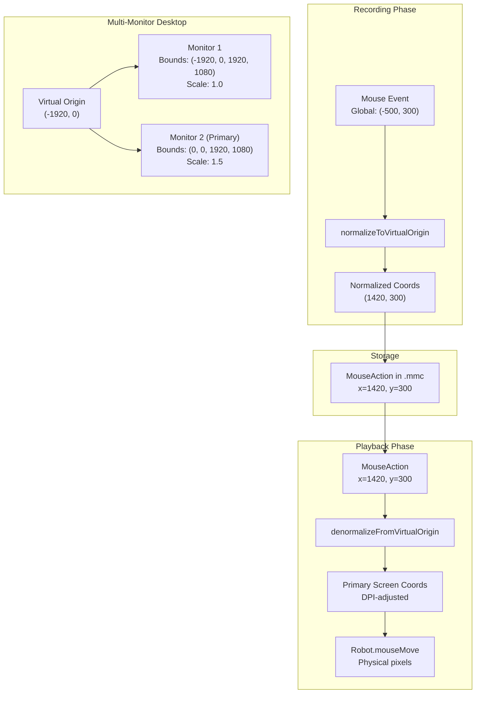
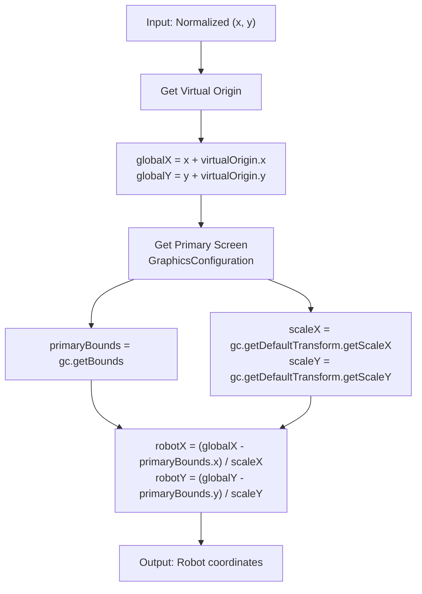

# Screen Utilities

> **Relevant source files**
> * [src/io/github/samera2022/mouse_macros/action/MouseAction.java](https://github.com/Samera2022/MouseMacros/blob/6b37ce1e/src/io/github/samera2022/mouse_macros/action/MouseAction.java)
> * [src/io/github/samera2022/mouse_macros/util/ScreenUtil.java](https://github.com/Samera2022/MouseMacros/blob/6b37ce1e/src/io/github/samera2022/mouse_macros/util/ScreenUtil.java)

## Purpose and Scope

This page documents the `ScreenUtil` class, which provides coordinate transformation utilities for multi-monitor setups. The class handles conversion between virtual screen coordinates (used for macro recording) and Robot-compatible coordinates (used for playback), accounting for DPI scaling and multi-monitor configurations.

For information about system-level utilities like language detection and dark mode queries, see [System Utilities](/Samera2022/MouseMacros/8.2-system-utilities). For macro playback execution that uses these coordinate transformations, see [MouseAction](/Samera2022/MouseMacros/4.3-mouseaction).

**Sources:** [src/io/github/samera2022/mouse_macros/util/ScreenUtil.java L1-L42](https://github.com/Samera2022/MouseMacros/blob/6b37ce1e/src/io/github/samera2022/mouse_macros/util/ScreenUtil.java#L1-L42)

---

## Overview

The `ScreenUtil` class solves a critical problem in multi-monitor environments: Java's `Robot` class expects coordinates in the primary screen's coordinate space, but recorded mouse events may occur on any screen. Additionally, DPI scaling (common on high-resolution displays) requires special handling to ensure pixel-accurate playback.

The class provides a coordinate normalization system based on a "virtual origin" - the top-left corner of the entire multi-monitor desktop space. All recorded coordinates are stored relative to this virtual origin, making macros portable across different monitor configurations.

**Key Responsibilities:**

* Calculate the virtual origin across all displays
* Transform normalized coordinates to Robot-compatible coordinates
* Handle DPI scaling transformations
* Support multi-monitor configurations with negative coordinates

**Sources:** [src/io/github/samera2022/mouse_macros/util/ScreenUtil.java L1-L42](https://github.com/Samera2022/MouseMacros/blob/6b37ce1e/src/io/github/samera2022/mouse_macros/util/ScreenUtil.java#L1-L42)

---

## Coordinate Space Architecture



**Coordinate Space Transformation Flow**

This diagram illustrates the complete coordinate transformation pipeline from mouse event capture to playback. Coordinates pass through three spaces: global screen space (with potential negative values on left/top monitors), normalized virtual space (always non-negative), and DPI-adjusted primary screen space (for Robot).

**Sources:** [src/io/github/samera2022/mouse_macros/util/ScreenUtil.java L7-L41](https://github.com/Samera2022/MouseMacros/blob/6b37ce1e/src/io/github/samera2022/mouse_macros/util/ScreenUtil.java#L7-L41)

---

## Virtual Origin Calculation

The virtual origin is the minimum X and Y coordinates across all monitors in the system. This provides a stable reference point for coordinate normalization.

### Method: getVirtualOrigin()

```java
private static Point getVirtualOrigin()
```

**Location:** [src/io/github/samera2022/mouse_macros/util/ScreenUtil.java L25-L35](https://github.com/Samera2022/MouseMacros/blob/6b37ce1e/src/io/github/samera2022/mouse_macros/util/ScreenUtil.java#L25-L35)

**Algorithm:**

1. Query `GraphicsEnvironment.getLocalGraphicsEnvironment()` for all screen devices
2. Iterate through each `GraphicsDevice` and get its bounds via `getDefaultConfiguration().getBounds()`
3. Track the minimum X and Y coordinates across all bounds
4. Return a `Point` with these minimum values

**Example Scenarios:**

| Monitor Configuration | Monitor 1 Bounds | Monitor 2 Bounds | Virtual Origin |
| --- | --- | --- | --- |
| Single monitor | (0, 0, 1920, 1080) | N/A | (0, 0) |
| Dual horizontal | (0, 0, 1920, 1080) | (1920, 0, 1920, 1080) | (0, 0) |
| Left monitor extended | (-1920, 0, 1920, 1080) | (0, 0, 1920, 1080) | (-1920, 0) |
| Stacked vertical | (0, 0, 1920, 1080) | (0, -1080, 1920, 1080) | (0, -1080) |
| Complex arrangement | (-1920, -1080, 1920, 1080) | (0, 0, 1920, 1080) | (-1920, -1080) |

The virtual origin ensures that all normalized coordinates are non-negative, regardless of monitor arrangement.

**Sources:** [src/io/github/samera2022/mouse_macros/util/ScreenUtil.java L25-L35](https://github.com/Samera2022/MouseMacros/blob/6b37ce1e/src/io/github/samera2022/mouse_macros/util/ScreenUtil.java#L25-L35)

---

## Normalization: Global to Virtual

### Method: normalizeToVirtualOrigin(int x, int y)

```
public static Point normalizeToVirtualOrigin(int x, int y)
```

**Location:** [src/io/github/samera2022/mouse_macros/util/ScreenUtil.java L38-L41](https://github.com/Samera2022/MouseMacros/blob/6b37ce1e/src/io/github/samera2022/mouse_macros/util/ScreenUtil.java#L38-L41)

**Purpose:** Converts global screen coordinates (as captured during recording) to normalized coordinates relative to the virtual origin.

**Calculation:**

```
normalizedX = globalX - virtualOrigin.x
normalizedY = globalY - virtualOrigin.y
```

**Usage Context:** This method is called during macro recording to store portable coordinates. While not explicitly shown in the provided files, it would typically be invoked by `GlobalMouseListener` when converting `NativeMouseEvent` coordinates to `MouseAction` fields.

**Example:**

* Virtual origin: (-1920, 0)
* Mouse event at global coordinates: (-500, 300)
* Normalized result: (1420, 300)

The normalized coordinates are stored in the `MouseAction.x` and `MouseAction.y` fields, then serialized to `.mmc` files.

**Sources:** [src/io/github/samera2022/mouse_macros/util/ScreenUtil.java L38-L41](https://github.com/Samera2022/MouseMacros/blob/6b37ce1e/src/io/github/samera2022/mouse_macros/util/ScreenUtil.java#L38-L41)

---

## Denormalization: Virtual to Robot Space

### Method: denormalizeFromVirtualOrigin(int x, int y)

```
public static Point denormalizeFromVirtualOrigin(int x, int y)
```

**Location:** [src/io/github/samera2022/mouse_macros/util/ScreenUtil.java L7-L22](https://github.com/Samera2022/MouseMacros/blob/6b37ce1e/src/io/github/samera2022/mouse_macros/util/ScreenUtil.java#L7-L22)

**Purpose:** Converts normalized coordinates back to Robot-compatible coordinates, handling DPI scaling and primary screen offset.

**Algorithm:**



**Denormalization Algorithm Flow**

**Sources:** [src/io/github/samera2022/mouse_macros/util/ScreenUtil.java L7-L22](https://github.com/Samera2022/MouseMacros/blob/6b37ce1e/src/io/github/samera2022/mouse_macros/util/ScreenUtil.java#L7-L22)

---

## DPI Scaling Handling

Modern displays use DPI scaling to make UI elements readable on high-resolution screens. Windows may report a scale factor of 1.25, 1.5, 2.0, or higher. The `denormalizeFromVirtualOrigin` method handles this by dividing coordinates by the scale factor.

**DPI Scaling Transformation:**

| Primary Screen DPI | Scale Factor | Global Coord | Robot Coord |
| --- | --- | --- | --- |
| 100% (96 DPI) | 1.0 | 1000 | 1000 |
| 125% (120 DPI) | 1.25 | 1000 | 800 |
| 150% (144 DPI) | 1.5 | 1000 | 667 |
| 200% (192 DPI) | 2.0 | 1000 | 500 |

Without this division, `Robot.mouseMove()` would place the cursor at the wrong physical location on scaled displays.

**Code Reference:**

```
double scaleX = gc.getDefaultTransform().getScaleX();
double scaleY = gc.getDefaultTransform().getScaleY();
int robotX = (int) Math.round((globalX - primaryBounds.x) / scaleX);
int robotY = (int) Math.round((globalY - primaryBounds.y) / scaleY);
```

**Location:** [src/io/github/samera2022/mouse_macros/util/ScreenUtil.java L16-L20](https://github.com/Samera2022/MouseMacros/blob/6b37ce1e/src/io/github/samera2022/mouse_macros/util/ScreenUtil.java#L16-L20)

The coordinates are rounded to the nearest integer because `Robot` requires integer pixel values.

**Sources:** [src/io/github/samera2022/mouse_macros/util/ScreenUtil.java L13-L20](https://github.com/Samera2022/MouseMacros/blob/6b37ce1e/src/io/github/samera2022/mouse_macros/util/ScreenUtil.java#L13-L20)

---

## Integration with MouseAction

The `MouseAction` class is the primary consumer of `ScreenUtil` functionality. During playback, every mouse movement, click, and wheel event requires coordinate transformation.

```mermaid
flowchart TD

Start["Start"]
CreateRobot["Get Robot instance"]
Denormalize["ScreenUtil.denormalizeFromVirtualOrigin<br>(this.x, this.y)"]
CheckType["Check action type"]
WheelEvent["type == 3<br>Mouse Wheel"]
KeyPress["type == 10<br>Key Press"]
KeyRelease["type == 11<br>Key Release"]
MouseMove["Other types<br>Mouse Button"]
MoveWheel["robot.mouseMove(global.x, global.y)<br>robot.mouseWheel(wheelAmount)"]
KeyPressExec["robot.keyPress(awtKeyCode)"]
KeyReleaseExec["robot.keyRelease(awtKeyCode)"]
MoveMouse["robot.mouseMove(global.x, global.y)"]
ButtonAction["robot.mousePress/Release(buttonMask)"]

subgraph MouseAction.perform() ["MouseAction.perform()"]
    Start
    CreateRobot
    Denormalize
    CheckType
    WheelEvent
    KeyPress
    KeyRelease
    MouseMove
    MoveWheel
    KeyPressExec
    KeyReleaseExec
    MoveMouse
    ButtonAction
    Start --> CreateRobot
    CreateRobot --> Denormalize
    Denormalize --> CheckType
    CheckType --> WheelEvent
    CheckType --> KeyPress
    CheckType --> KeyRelease
    CheckType --> MouseMove
    WheelEvent --> MoveWheel
    KeyPress --> KeyPressExec
    KeyRelease --> KeyReleaseExec
    MouseMove --> MoveMouse
    MoveMouse --> ButtonAction
end
```

**MouseAction Playback Flow with ScreenUtil Integration**

**Key Integration Points:**

1. **Line 41:** `Point global = ScreenUtil.denormalizeFromVirtualOrigin(x, y);` * Converts stored normalized coordinates to Robot space * This is the critical transformation that makes multi-monitor macros work
2. **Lines 43, 55:** `robot.mouseMove(global.x, global.y);` * Uses the denormalized coordinates for cursor positioning * Called before both wheel events and mouse button events

**Code Flow:**

* `MouseAction` stores normalized coordinates in its `x` and `y` fields
* During `perform()`, these are denormalized via `ScreenUtil`
* The resulting `Point` contains DPI-adjusted coordinates for the primary screen
* `Robot.mouseMove()` receives coordinates it can correctly interpret

**Sources:** [src/io/github/samera2022/mouse_macros/action/MouseAction.java L35-L66](https://github.com/Samera2022/MouseMacros/blob/6b37ce1e/src/io/github/samera2022/mouse_macros/action/MouseAction.java#L35-L66)

 [src/io/github/samera2022/mouse_macros/util/ScreenUtil.java L7-L22](https://github.com/Samera2022/MouseMacros/blob/6b37ce1e/src/io/github/samera2022/mouse_macros/util/ScreenUtil.java#L7-L22)

---

## Edge Cases and Limitations

### Primary Screen Assumption

The `denormalizeFromVirtualOrigin` method assumes all Robot operations occur in the primary screen's coordinate space. This is a limitation of Java's `Robot` class, which uses the primary screen's coordinate system.

**Code Reference:** [src/io/github/samera2022/mouse_macros/util/ScreenUtil.java L13-L14](https://github.com/Samera2022/MouseMacros/blob/6b37ce1e/src/io/github/samera2022/mouse_macros/util/ScreenUtil.java#L13-L14)

```
GraphicsConfiguration gc = GraphicsEnvironment.getLocalGraphicsEnvironment()
        .getDefaultScreenDevice().getDefaultConfiguration();
```

**Implication:** If the primary screen has different DPI scaling than the screen where the event was recorded, playback coordinates may be slightly inaccurate. This is an inherent limitation of the Java AWT Robot API.

### Rounding Behavior

Coordinates are rounded to the nearest integer after DPI division:

```
int robotX = (int) Math.round((globalX - primaryBounds.x) / scaleX);
```

**Location:** [src/io/github/samera2022/mouse_macros/util/ScreenUtil.java L19](https://github.com/Samera2022/MouseMacros/blob/6b37ce1e/src/io/github/samera2022/mouse_macros/util/ScreenUtil.java#L19-L19)

For coordinates that divide evenly, this is exact. For fractional results (e.g., 1000.3333), rounding introduces sub-pixel errors. At typical screen resolutions, this is imperceptible.

### Exception Handling

`ScreenUtil` methods do not throw exceptions. If `GraphicsEnvironment` queries fail (unlikely in normal operation), the JVM would throw a runtime exception that propagates to the caller. The `MouseAction.perform()` method catches all exceptions and silently ignores them:

```
} catch (Exception e) {
    // 忽略异常 (Ignore exception)
}
```

**Location:** [src/io/github/samera2022/mouse_macros/action/MouseAction.java L64-L66](https://github.com/Samera2022/MouseMacros/blob/6b37ce1e/src/io/github/samera2022/mouse_macros/action/MouseAction.java#L64-L66)

This means coordinate transformation failures would be silently swallowed during playback.

**Sources:** [src/io/github/samera2022/mouse_macros/util/ScreenUtil.java L13-L21](https://github.com/Samera2022/MouseMacros/blob/6b37ce1e/src/io/github/samera2022/mouse_macros/util/ScreenUtil.java#L13-L21)

 [src/io/github/samera2022/mouse_macros/action/MouseAction.java L64-L66](https://github.com/Samera2022/MouseMacros/blob/6b37ce1e/src/io/github/samera2022/mouse_macros/action/MouseAction.java#L64-L66)

---

## Method Reference

### Summary Table

| Method | Access | Return Type | Parameters | Purpose |
| --- | --- | --- | --- | --- |
| `denormalizeFromVirtualOrigin` | `public static` | `Point` | `int x, int y` | Convert normalized coordinates to Robot-compatible coordinates with DPI scaling |
| `getVirtualOrigin` | `private static` | `Point` | None | Calculate the top-left corner of the multi-monitor desktop |
| `normalizeToVirtualOrigin` | `public static` | `Point` | `int x, int y` | Convert global screen coordinates to normalized virtual coordinates |

**Sources:** [src/io/github/samera2022/mouse_macros/util/ScreenUtil.java L7-L41](https://github.com/Samera2022/MouseMacros/blob/6b37ce1e/src/io/github/samera2022/mouse_macros/util/ScreenUtil.java#L7-L41)

---

## Dependencies

### Java AWT Graphics APIs

`ScreenUtil` depends on the following Java AWT classes:

* **`java.awt.Point`**: Return type for all transformation methods
* **`java.awt.Rectangle`**: Represents screen bounds via `GraphicsConfiguration.getBounds()`
* **`java.awt.GraphicsEnvironment`**: Entry point for querying display configuration
* **`java.awt.GraphicsDevice`**: Represents individual displays
* **`java.awt.GraphicsConfiguration`**: Provides screen bounds and DPI transform

These are standard Java APIs with no external dependencies.

### Dependent Classes

The following classes directly use `ScreenUtil`:

1. **`MouseAction`** (importance: 2.33) * Uses `denormalizeFromVirtualOrigin` during playback * Location: [src/io/github/samera2022/mouse_macros/action/MouseAction.java L41](https://github.com/Samera2022/MouseMacros/blob/6b37ce1e/src/io/github/samera2022/mouse_macros/action/MouseAction.java#L41-L41)
2. **`GlobalMouseListener`** (not shown in provided files, but referenced in high-level diagrams) * Expected to use `normalizeToVirtualOrigin` during recording * Converts `NativeMouseEvent` coordinates to `MouseAction` storage format

**Sources:** [src/io/github/samera2022/mouse_macros/action/MouseAction.java L3](https://github.com/Samera2022/MouseMacros/blob/6b37ce1e/src/io/github/samera2022/mouse_macros/action/MouseAction.java#L3-L3)

 [src/io/github/samera2022/mouse_macros/util/ScreenUtil.java L1-L4](https://github.com/Samera2022/MouseMacros/blob/6b37ce1e/src/io/github/samera2022/mouse_macros/util/ScreenUtil.java#L1-L4)

---

## Usage Examples

### Example 1: Single Monitor (No Scaling)

**Configuration:**

* Monitor: 1920×1080 at (0, 0)
* DPI: 100% (scale = 1.0)

**Recording:**

* Mouse event at global (500, 300)
* Virtual origin: (0, 0)
* Normalized: `normalizeToVirtualOrigin(500, 300)` → **(500, 300)**

**Playback:**

* Loaded action: x=500, y=300
* Denormalize: `denormalizeFromVirtualOrigin(500, 300)` * Global: (500, 300) * Primary offset: (0, 0) * Scale: 1.0 * Result: **(500, 300)**

### Example 2: Dual Monitors (Left Extended, Primary Scaled)

**Configuration:**

* Monitor 1 (left): 1920×1080 at (-1920, 0), scale 1.0
* Monitor 2 (primary): 1920×1080 at (0, 0), scale 1.5

**Recording:**

* Mouse event at global (-500, 300)
* Virtual origin: (-1920, 0)
* Normalized: `normalizeToVirtualOrigin(-500, 300)` → **(1420, 300)**

**Playback:**

* Loaded action: x=1420, y=300
* Denormalize: `denormalizeFromVirtualOrigin(1420, 300)` * Global: 1420 + (-1920) = **-500**, 300 + 0 = **300** * Primary offset: (0, 0) * Global relative to primary: -500 - 0 = **-500**, 300 - 0 = **300** * Scale: 1.5 * Result: **(-333, 200)** in Robot space

**Note:** The result (-333, 200) is in the primary screen's coordinate system. Java's Robot may not support negative coordinates, which could cause issues. This highlights the limitation mentioned in "Edge Cases and Limitations" - macros recorded on non-primary screens with different DPI settings may have accuracy issues.

**Sources:** [src/io/github/samera2022/mouse_macros/util/ScreenUtil.java L7-L41](https://github.com/Samera2022/MouseMacros/blob/6b37ce1e/src/io/github/samera2022/mouse_macros/util/ScreenUtil.java#L7-L41)