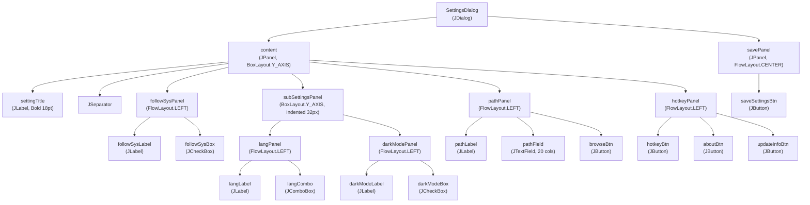
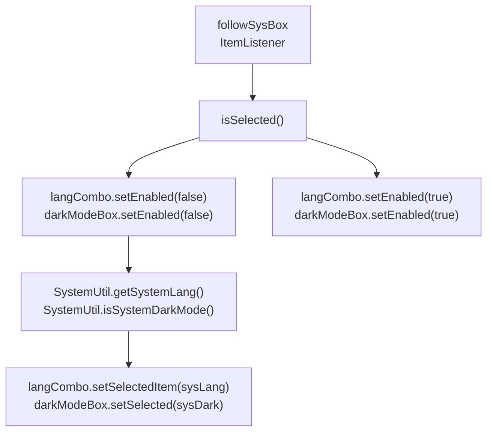
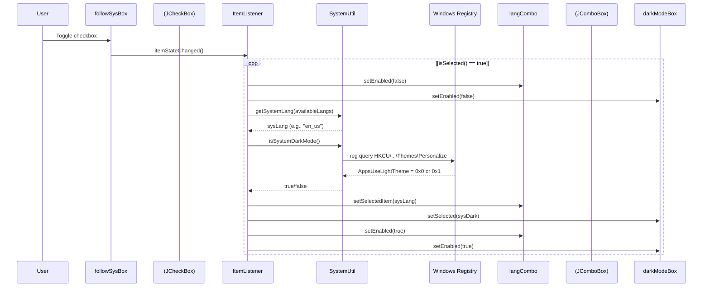
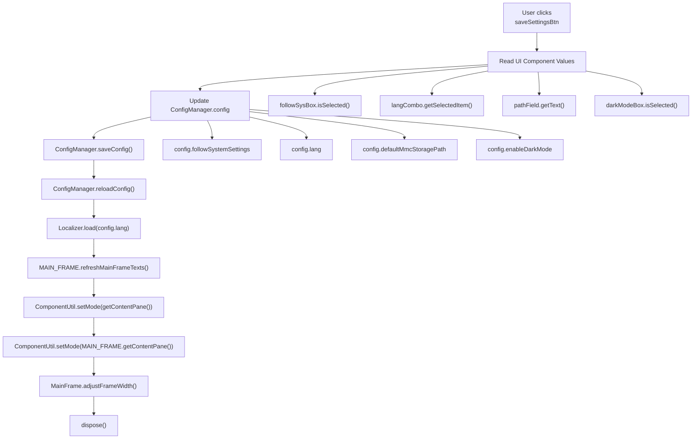
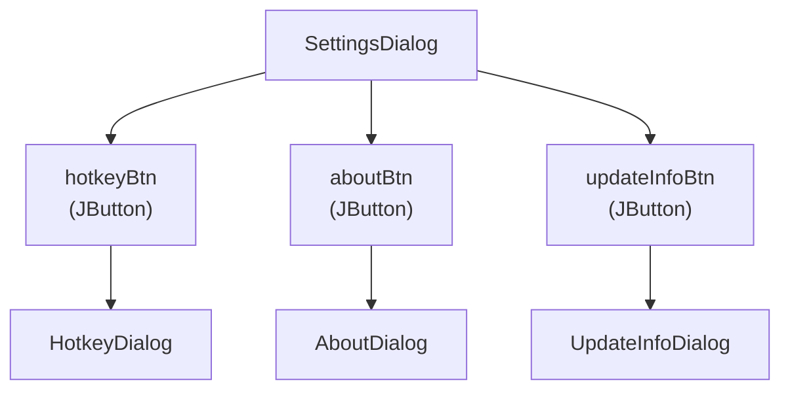
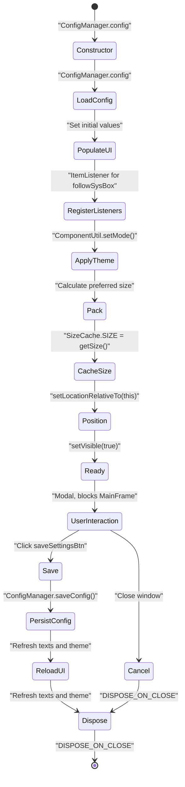

# Settings Dialog

> **Relevant source files**
> * [src/io/github/samera2022/mouse_macros/manager/ConfigManager.java](https://github.com/Samera2022/MouseMacros/blob/6b37ce1e/src/io/github/samera2022/mouse_macros/manager/ConfigManager.java)
> * [src/io/github/samera2022/mouse_macros/ui/frame/SettingsDialog.java](https://github.com/Samera2022/MouseMacros/blob/6b37ce1e/src/io/github/samera2022/mouse_macros/ui/frame/SettingsDialog.java)
> * [src/io/github/samera2022/mouse_macros/util/SystemUtil.java](https://github.com/Samera2022/MouseMacros/blob/6b37ce1e/src/io/github/samera2022/mouse_macros/util/SystemUtil.java)

## Purpose and Scope

This document describes the `SettingsDialog` class, which provides the primary user interface for configuring application-wide settings. The dialog manages general configuration options including language selection, dark mode, default file paths, and system settings synchronization.

For hotkey configuration specifically, see [Hotkey Dialog](/Samera2022/MouseMacros/7.2-hotkey-dialog). For information about configuration file structure and persistence, see [Configuration Files](/Samera2022/MouseMacros/5.2-configuration-files). For theming implementation details, see [Theming System](/Samera2022/MouseMacros/7.4-theming-system).

**Sources:** [src/io/github/samera2022/mouse_macros/ui/frame/SettingsDialog.java L1-L180](https://github.com/Samera2022/MouseMacros/blob/6b37ce1e/src/io/github/samera2022/mouse_macros/ui/frame/SettingsDialog.java#L1-L180)

---

## Class Overview

The `SettingsDialog` class extends `JDialog` and serves as the main settings interface accessible from `MainFrame`. Key characteristics:

| Property | Value | Description |
| --- | --- | --- |
| Modality | Modal | Blocks interaction with `MainFrame` until closed |
| Layout | `BorderLayout` | Content in CENTER, save button in SOUTH |
| Localization | Full | All text elements use `Localizer.get()` |
| Theme-Aware | Yes | Applies dark/light mode via `ComponentUtil` |
| Size Persistence | Yes | Saves dimensions to `SizeCache` |

The dialog initializes by loading current configuration from `ConfigManager.config` and populates UI components with existing values. Changes are only persisted when the user clicks the save button.

**Sources:** [src/io/github/samera2022/mouse_macros/ui/frame/SettingsDialog.java L21-L26](https://github.com/Samera2022/MouseMacros/blob/6b37ce1e/src/io/github/samera2022/mouse_macros/ui/frame/SettingsDialog.java#L21-L26)

---

## UI Component Hierarchy



**Component Layout Details:**

The dialog uses a vertical `BoxLayout` with 30px horizontal padding [src/io/github/samera2022/mouse_macros/ui/frame/SettingsDialog.java L27-L29](https://github.com/Samera2022/MouseMacros/blob/6b37ce1e/src/io/github/samera2022/mouse_macros/ui/frame/SettingsDialog.java#L27-L29)

 Components are arranged in the following order:

1. **Title Section** [lines 31-36](https://github.com/Samera2022/MouseMacros/blob/6b37ce1e/lines 31-36) : Bold 18pt title with separator
2. **Follow System Settings** [lines 38-50](https://github.com/Samera2022/MouseMacros/blob/6b37ce1e/lines 38-50) : Checkbox with label
3. **Indented Sub-Settings** [lines 52-85](https://github.com/Samera2022/MouseMacros/blob/6b37ce1e/lines 52-85) : 32px left margin containing: * Language selection combo box * Dark mode checkbox
4. **Default Path** [lines 87-110](https://github.com/Samera2022/MouseMacros/blob/6b37ce1e/lines 87-110) : Text field with browse button
5. **Sub-Dialog Buttons** [lines 112-127](https://github.com/Samera2022/MouseMacros/blob/6b37ce1e/lines 112-127) : Three buttons in a row
6. **Save Button** [lines 129-151](https://github.com/Samera2022/MouseMacros/blob/6b37ce1e/lines 129-151) : Centered at bottom

**Sources:** [src/io/github/samera2022/mouse_macros/ui/frame/SettingsDialog.java L23-L151](https://github.com/Samera2022/MouseMacros/blob/6b37ce1e/src/io/github/samera2022/mouse_macros/ui/frame/SettingsDialog.java#L23-L151)

---

## Configuration Options

### Follow System Settings

The `followSysBox` checkbox controls whether the application synchronizes with operating system settings. When enabled, it:

* Disables manual language and dark mode selection
* Automatically queries system preferences via `SystemUtil`
* Updates UI to reflect system values in real-time

Implementation uses an `ItemListener` that triggers on checkbox state changes [src/io/github/samera2022/mouse_macros/ui/frame/SettingsDialog.java L154-L168](https://github.com/Samera2022/MouseMacros/blob/6b37ce1e/src/io/github/samera2022/mouse_macros/ui/frame/SettingsDialog.java#L154-L168)

:



**Sources:** [src/io/github/samera2022/mouse_macros/ui/frame/SettingsDialog.java L154-L168](https://github.com/Samera2022/MouseMacros/blob/6b37ce1e/src/io/github/samera2022/mouse_macros/ui/frame/SettingsDialog.java#L154-L168)

### Language Selection

The `langCombo` combo box is populated with available languages from `ConfigManager.getAvailableLangs()` [line 60](https://github.com/Samera2022/MouseMacros/blob/6b37ce1e/line 60)

 This method scans the `lang/` directory (or JAR resources in production) and returns language codes without file extensions [src/io/github/samera2022/mouse_macros/manager/ConfigManager.java L69-L114](https://github.com/Samera2022/MouseMacros/blob/6b37ce1e/src/io/github/samera2022/mouse_macros/manager/ConfigManager.java#L69-L114)

Initial value is set from `config.lang` [line 62](https://github.com/Samera2022/MouseMacros/blob/6b37ce1e/line 62)

 typically `"zh_cn"` or `"en_us"`.

### Dark Mode

The `darkModeBox` checkbox uses custom icons from `IconConsts.CHECK_BOX` [line 74](https://github.com/Samera2022/MouseMacros/blob/6b37ce1e/line 74)

 It displays the current theme state from `config.enableDarkMode` [line 75](https://github.com/Samera2022/MouseMacros/blob/6b37ce1e/line 75)

### Default Storage Path

The `pathField` text field displays `config.defaultMmcStoragePath` [line 89](https://github.com/Samera2022/MouseMacros/blob/6b37ce1e/line 89)

 The adjacent browse button opens a `JFileChooser` in directory selection mode [lines 91-101](https://github.com/Samera2022/MouseMacros/blob/6b37ce1e/lines 91-101)

:

| Action | Behavior |
| --- | --- |
| Initial directory | Uses current `pathField` text if non-empty |
| Selection mode | `DIRECTORIES_ONLY` |
| Result | Updates `pathField` with absolute path |

**Sources:** [src/io/github/samera2022/mouse_macros/ui/frame/SettingsDialog.java L38-L110](https://github.com/Samera2022/MouseMacros/blob/6b37ce1e/src/io/github/samera2022/mouse_macros/ui/frame/SettingsDialog.java#L38-L110)

---

## System Settings Synchronization



**System Language Detection Algorithm:**

`SystemUtil.getSystemLang()` implements a three-tier fallback strategy [src/io/github/samera2022/mouse_macros/util/SystemUtil.java L15-L29](https://github.com/Samera2022/MouseMacros/blob/6b37ce1e/src/io/github/samera2022/mouse_macros/util/SystemUtil.java#L15-L29)

:

1. **Exact Match**: `{language}_{country}` (e.g., `en_US`)
2. **Language Prefix**: Any language file starting with `{language}_`
3. **Default Fallback**: `en_us` if available, otherwise first available language

**System Dark Mode Detection:**

`SystemUtil.isSystemDarkMode()` queries Windows registry [src/io/github/samera2022/mouse_macros/util/SystemUtil.java L32-L51](https://github.com/Samera2022/MouseMacros/blob/6b37ce1e/src/io/github/samera2022/mouse_macros/util/SystemUtil.java#L32-L51)

:

* **Registry Path**: `HKEY_CURRENT_USER\Software\Microsoft\Windows\CurrentVersion\Themes\Personalize`
* **Value**: `AppsUseLightTheme`
* **Interpretation**: `0x0` = dark mode, `0x1` = light mode
* **Platform Support**: Windows 10+ only; returns `false` on other platforms

**Sources:** [src/io/github/samera2022/mouse_macros/ui/frame/SettingsDialog.java L154-L168](https://github.com/Samera2022/MouseMacros/blob/6b37ce1e/src/io/github/samera2022/mouse_macros/ui/frame/SettingsDialog.java#L154-L168)

 [src/io/github/samera2022/mouse_macros/util/SystemUtil.java L14-L51](https://github.com/Samera2022/MouseMacros/blob/6b37ce1e/src/io/github/samera2022/mouse_macros/util/SystemUtil.java#L14-L51)

---

## Configuration Persistence and Application



**Save Button Action Listener Implementation:**

The save button's action listener [src/io/github/samera2022/mouse_macros/ui/frame/SettingsDialog.java L131-L148](https://github.com/Samera2022/MouseMacros/blob/6b37ce1e/src/io/github/samera2022/mouse_macros/ui/frame/SettingsDialog.java#L131-L148)

 performs the following operations:

| Step | Operation | Code Reference |
| --- | --- | --- |
| 1 | Read UI values | [lines 132-135](https://github.com/Samera2022/MouseMacros/blob/6b37ce1e/lines 132-135) |
| 2 | Update `config` object | [lines 132-135](https://github.com/Samera2022/MouseMacros/blob/6b37ce1e/lines 132-135) |
| 3 | Persist to `config.cfg` | [line 137](https://github.com/Samera2022/MouseMacros/blob/6b37ce1e/line 137) |
| 4 | Reload configuration | [line 138](https://github.com/Samera2022/MouseMacros/blob/6b37ce1e/line 138) |
| 5 | Reload localization | [line 139](https://github.com/Samera2022/MouseMacros/blob/6b37ce1e/line 139) |
| 6 | Refresh MainFrame text | [line 140](https://github.com/Samera2022/MouseMacros/blob/6b37ce1e/line 140) |
| 7 | Apply theme to dialog | [line 144](https://github.com/Samera2022/MouseMacros/blob/6b37ce1e/line 144) |
| 8 | Apply theme to MainFrame | [line 145](https://github.com/Samera2022/MouseMacros/blob/6b37ce1e/line 145) |
| 9 | Adjust frame width | [line 146](https://github.com/Samera2022/MouseMacros/blob/6b37ce1e/line 146) |
| 10 | Close dialog | [line 147](https://github.com/Samera2022/MouseMacros/blob/6b37ce1e/line 147) |

**Theme Application Details:**

The dialog applies themes twice during its lifecycle:

1. **Initialization** [line 173](https://github.com/Samera2022/MouseMacros/blob/6b37ce1e/line 173) : Applied when dialog is constructed
2. **Save** [lines 144-145](https://github.com/Samera2022/MouseMacros/blob/6b37ce1e/lines 144-145) : Applied to both dialog and MainFrame

The mode is determined by `config.enableDarkMode ? OtherConsts.DARK_MODE : OtherConsts.LIGHT_MODE`, where `OtherConsts.DARK_MODE = 0` and `OtherConsts.LIGHT_MODE = 1`.

**Sources:** [src/io/github/samera2022/mouse_macros/ui/frame/SettingsDialog.java L131-L148](https://github.com/Samera2022/MouseMacros/blob/6b37ce1e/src/io/github/samera2022/mouse_macros/ui/frame/SettingsDialog.java#L131-L148)

---

## Sub-Dialog Management

The settings dialog provides access to three specialized sub-dialogs via action buttons:



**Button Action Listeners:**

All three buttons use `SwingUtilities.invokeLater()` to ensure sub-dialogs are created and displayed on the Event Dispatch Thread:

| Button | Translation Key | Target Dialog | Code Reference |
| --- | --- | --- | --- |
| `hotkeyBtn` | `settings.custom_hotkey` | `HotkeyDialog` | [line 114](https://github.com/Samera2022/MouseMacros/blob/6b37ce1e/line 114) |
| `aboutBtn` | `settings.about_author` | `AboutDialog` | [line 116](https://github.com/Samera2022/MouseMacros/blob/6b37ce1e/line 116) |
| `updateInfoBtn` | `settings.update_info` | `UpdateInfoDialog` | [line 118](https://github.com/Samera2022/MouseMacros/blob/6b37ce1e/line 118) |

Each dialog is instantiated and immediately set visible within the `invokeLater()` callback:

```
SwingUtilities.invokeLater(() -> new HotkeyDialog().setVisible(true))
```

The settings dialog remains visible and modal while sub-dialogs are open, allowing users to access multiple sub-dialogs without closing the settings window.

**Sources:** [src/io/github/samera2022/mouse_macros/ui/frame/SettingsDialog.java L113-L127](https://github.com/Samera2022/MouseMacros/blob/6b37ce1e/src/io/github/samera2022/mouse_macros/ui/frame/SettingsDialog.java#L113-L127)

---

## Dialog Lifecycle and Size Management

The `SettingsDialog` follows a standard initialization and cleanup sequence:



**Size Caching:**

The dialog saves its computed size to `SizeCache.SIZE` after packing [src/io/github/samera2022/mouse_macros/ui/frame/SettingsDialog.java L176](https://github.com/Samera2022/MouseMacros/blob/6b37ce1e/src/io/github/samera2022/mouse_macros/ui/frame/SettingsDialog.java#L176-L176)

 This allows other components to reference the settings dialog's dimensions if needed.

**Positioning:**

The dialog centers itself relative to `this` (itself) using `setLocationRelativeTo(this)` [line 177](https://github.com/Samera2022/MouseMacros/blob/6b37ce1e/line 177)

 This typically centers the dialog on the screen.

**Close Behavior:**

The default close operation is set to `DISPOSE_ON_CLOSE` [line 178](https://github.com/Samera2022/MouseMacros/blob/6b37ce1e/line 178)

 ensuring resources are released when the dialog is closed without saving.

**Sources:** [src/io/github/samera2022/mouse_macros/ui/frame/SettingsDialog.java L175-L179](https://github.com/Samera2022/MouseMacros/blob/6b37ce1e/src/io/github/samera2022/mouse_macros/ui/frame/SettingsDialog.java#L175-L179)

---

## Configuration Schema

The settings dialog interacts with the following fields in `ConfigManager.Config`:

| Field | Type | UI Component | Description |
| --- | --- | --- | --- |
| `followSystemSettings` | `boolean` | `followSysBox` | Enables automatic synchronization with OS |
| `lang` | `String` | `langCombo` | Language code (e.g., `"zh_cn"`, `"en_us"`) |
| `enableDarkMode` | `boolean` | `darkModeBox` | Dark theme enabled |
| `defaultMmcStoragePath` | `String` | `pathField` | Default directory for `.mmc` files |
| `keyMap` | `Map<String, String>` | *(HotkeyDialog)* | Hotkey bindings (not directly edited) |
| `enableCustomMacroSettings` | `boolean` | *(Not shown)* | Not exposed in this dialog |
| `repeatTime` | `int` | *(Not shown)* | Not exposed in this dialog |

**Configuration File Location:**

Settings are persisted to `{user.home}/AppData/MouseMacros/config.cfg` as defined in [src/io/github/samera2022/mouse_macros/manager/ConfigManager.java L19-L20](https://github.com/Samera2022/MouseMacros/blob/6b37ce1e/src/io/github/samera2022/mouse_macros/manager/ConfigManager.java#L19-L20)

**Sources:** [src/io/github/samera2022/mouse_macros/manager/ConfigManager.java L30-L38](https://github.com/Samera2022/MouseMacros/blob/6b37ce1e/src/io/github/samera2022/mouse_macros/manager/ConfigManager.java#L30-L38)

 [src/io/github/samera2022/mouse_macros/ui/frame/SettingsDialog.java L132-L135](https://github.com/Samera2022/MouseMacros/blob/6b37ce1e/src/io/github/samera2022/mouse_macros/ui/frame/SettingsDialog.java#L132-L135)

---

## Theme Application Details

The dialog applies themes using `ComponentUtil.setMode()` at two key points:

### Initialization Theme Application

```
ComponentUtil.setMode(getContentPane(), 
    config.enableDarkMode ? OtherConsts.DARK_MODE : OtherConsts.LIGHT_MODE);
```

Applied at [line 173](https://github.com/Samera2022/MouseMacros/blob/6b37ce1e/line 173)

 after all UI components are constructed and added to the content pane. This ensures the dialog appears with the correct theme when first opened.

### Save-Time Theme Application

When the user clicks save, themes are applied to both the dialog itself and the main frame:

```
// Apply to SettingsDialog
ComponentUtil.setMode(getContentPane(), 
    config.enableDarkMode ? OtherConsts.DARK_MODE : OtherConsts.LIGHT_MODE);

// Apply to MainFrame
ComponentUtil.setMode(MAIN_FRAME.getContentPane(), 
    config.enableDarkMode ? OtherConsts.DARK_MODE : OtherConsts.LIGHT_MODE);
```

This dual application [lines 144-145](https://github.com/Samera2022/MouseMacros/blob/6b37ce1e/lines 144-145)

 ensures both windows immediately reflect the new theme setting. The comment at line 142 questions whether using `getRootPane()` instead of `getContentPane()` would be more comprehensive, but notes that `getContentPane()` appears sufficient for visible components.

**Post-Theme Adjustment:**

After theme application, `MainFrame.adjustFrameWidth()` [line 146](https://github.com/Samera2022/MouseMacros/blob/6b37ce1e/line 146)

 recalculates frame dimensions to accommodate any layout changes caused by the new theme.

**Sources:** [src/io/github/samera2022/mouse_macros/ui/frame/SettingsDialog.java L141-L173](https://github.com/Samera2022/MouseMacros/blob/6b37ce1e/src/io/github/samera2022/mouse_macros/ui/frame/SettingsDialog.java#L141-L173)