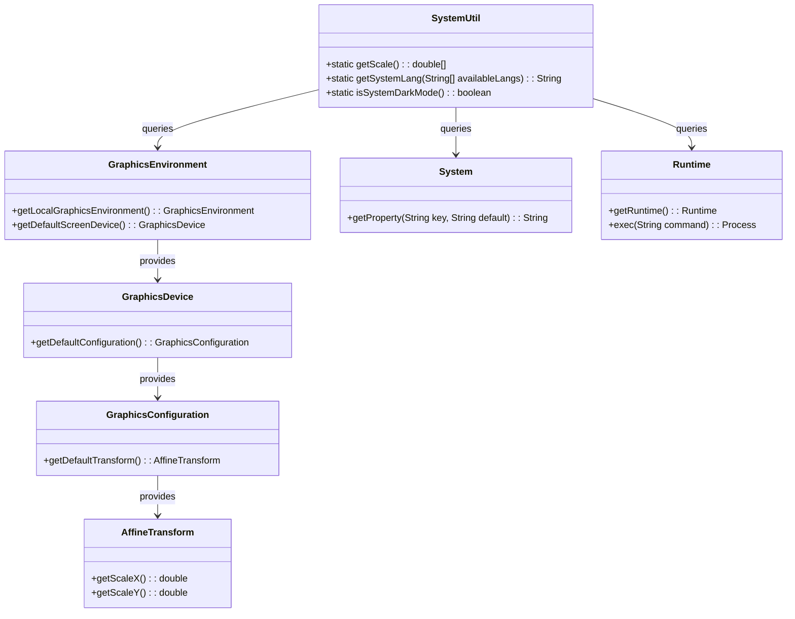
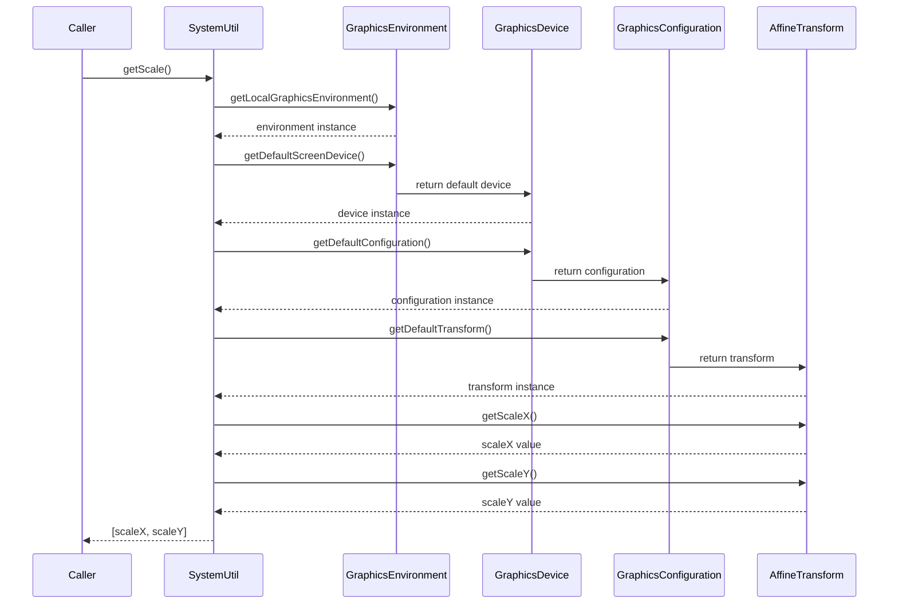
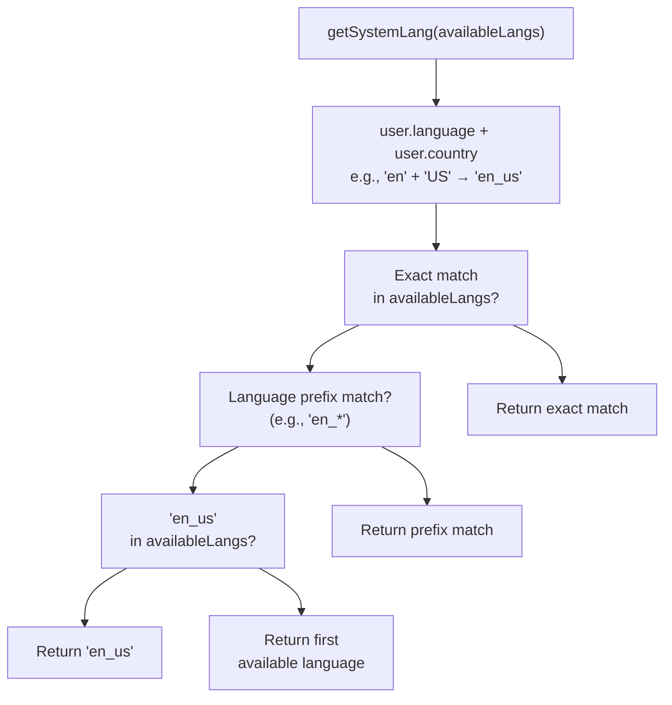
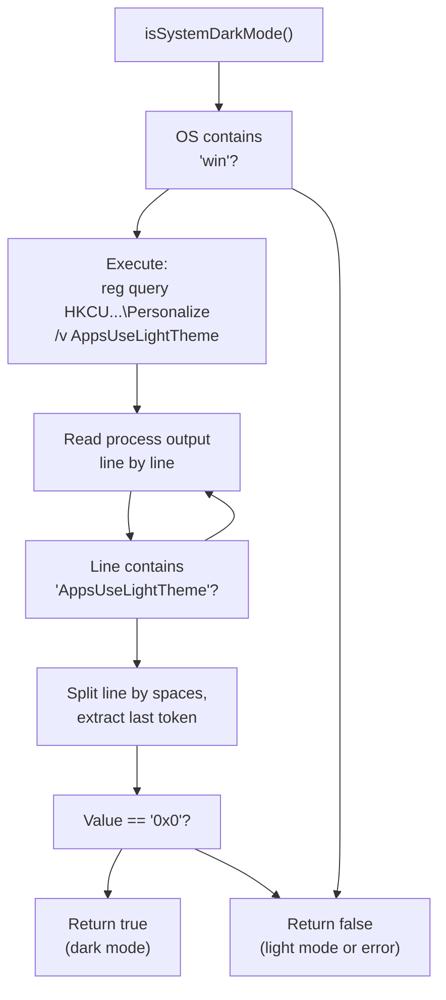
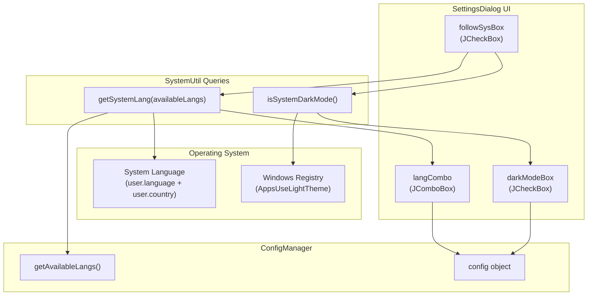
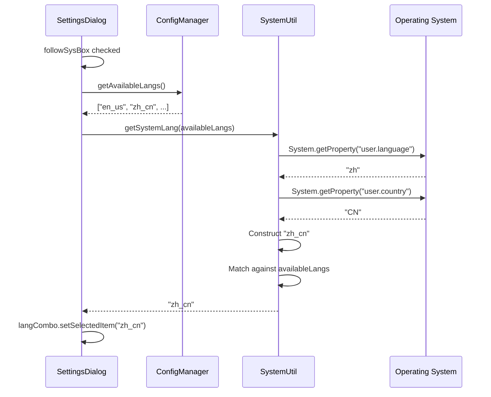
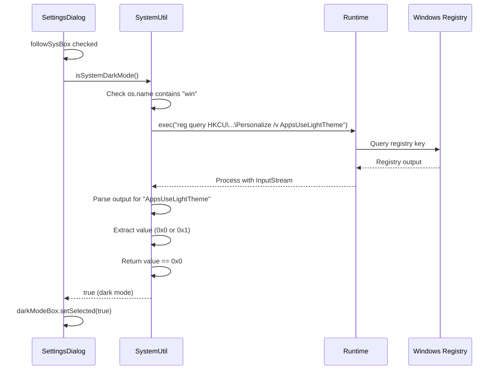

# System Utilities

> **Relevant source files**
> * [src/io/github/samera2022/mouse_macros/ui/frame/SettingsDialog.java](https://github.com/Samera2022/MouseMacros/blob/6b37ce1e/src/io/github/samera2022/mouse_macros/ui/frame/SettingsDialog.java)
> * [src/io/github/samera2022/mouse_macros/util/SystemUtil.java](https://github.com/Samera2022/MouseMacros/blob/6b37ce1e/src/io/github/samera2022/mouse_macros/util/SystemUtil.java)

## Purpose and Scope

This document covers the `SystemUtil` class, which provides low-level system queries required for OS integration and user preference detection. The class exposes three static utility methods:

* **Display scaling detection** - Retrieves DPI scaling factors for coordinate transformation
* **System language detection** - Identifies OS language with fallback logic
* **Dark mode detection** - Queries Windows registry to determine system appearance preferences

For coordinate transformation using scaling factors, see [Screen Utilities](/Samera2022/MouseMacros/8.1-screen-utilities). For UI theme application, see [Theming System](/Samera2022/MouseMacros/7.4-theming-system). For configuration persistence of detected values, see [ConfigManager](/Samera2022/MouseMacros/5.1-configmanager).

**Sources:** [src/io/github/samera2022/mouse_macros/util/SystemUtil.java L1-L52](https://github.com/Samera2022/MouseMacros/blob/6b37ce1e/src/io/github/samera2022/mouse_macros/util/SystemUtil.java#L1-L52)

---

## Class Overview

The `SystemUtil` class is a stateless utility class providing three independent system query methods. All methods are static and return immediately with system-derived values or defaults.



**Method Summary:**

| Method | Return Type | Purpose | Platform Support |
| --- | --- | --- | --- |
| `getScale()` | `double[]` | Returns `[scaleX, scaleY]` display scaling factors | Cross-platform |
| `getSystemLang(String[])` | `String` | Detects system language with fallback hierarchy | Cross-platform |
| `isSystemDarkMode()` | `boolean` | Queries if dark mode is enabled | Windows 10+ only |

**Sources:** [src/io/github/samera2022/mouse_macros/util/SystemUtil.java L5-L52](https://github.com/Samera2022/MouseMacros/blob/6b37ce1e/src/io/github/samera2022/mouse_macros/util/SystemUtil.java#L5-L52)

---

## Display Scaling Detection

### Method Signature

```
public static double[] getScale()
```

Returns a two-element array where index 0 is the X-axis scaling factor and index 1 is the Y-axis scaling factor.

### Implementation Details

The method queries the default screen device's graphics configuration to retrieve the current display scaling:

1. Obtains the local graphics environment via `GraphicsEnvironment.getLocalGraphicsEnvironment()`
2. Retrieves the default screen device
3. Accesses the default configuration
4. Extracts scaling factors from the affine transform



### Usage Context

This method is primarily used by coordinate transformation utilities but is not directly called within the macro system. The scaling factors compensate for high-DPI displays where logical pixels differ from physical pixels.

**Example scaling values:**

* `[1.0, 1.0]` - Standard 96 DPI display (100% scaling)
* `[1.5, 1.5]` - 144 DPI display (150% scaling)
* `[2.0, 2.0]` - 192 DPI display (200% scaling)

**Sources:** [src/io/github/samera2022/mouse_macros/util/SystemUtil.java L7-L13](https://github.com/Samera2022/MouseMacros/blob/6b37ce1e/src/io/github/samera2022/mouse_macros/util/SystemUtil.java#L7-L13)

---

## System Language Detection

### Method Signature

```
public static String getSystemLang(String[] availableLangs)
```

Detects the operating system's language setting and returns the closest match from the available language files. If no match is found, returns a sensible default.

### Detection Algorithm

The method implements a four-tier fallback hierarchy:



### Fallback Hierarchy

1. **Exact Match** - Full language and country match (e.g., `zh_cn` for Chinese Simplified)
2. **Language Prefix Match** - Language code match with any country (e.g., `en_gb` when system is `en_au`)
3. **English Default** - Falls back to `en_us` if available
4. **First Available** - Returns the first language in `availableLangs` array

### Implementation Flow

The method constructs a full locale string by combining `user.language` and `user.country` system properties:

```
// From system properties
String sysLang = System.getProperty("user.language", "en").toLowerCase();
String sysCountry = System.getProperty("user.country", "US").toLowerCase();
String full = sysLang + "_" + sysCountry; // e.g., "zh_cn"
```

Then iterates through available languages three times with increasingly relaxed matching criteria.

**Example scenarios:**

| System Language | Available Languages | Returned Value | Matching Tier |
| --- | --- | --- | --- |
| `en_US` | `[en_us, zh_cn]` | `en_us` | Exact match |
| `en_GB` | `[en_us, zh_cn]` | `en_us` | Prefix match (`en_*`) |
| `fr_FR` | `[en_us, zh_cn]` | `en_us` | English default |
| `de_DE` | `[zh_cn, ja_jp]` | `zh_cn` | First available |

**Sources:** [src/io/github/samera2022/mouse_macros/util/SystemUtil.java L14-L29](https://github.com/Samera2022/MouseMacros/blob/6b37ce1e/src/io/github/samera2022/mouse_macros/util/SystemUtil.java#L14-L29)

---

## Dark Mode Detection

### Method Signature

```
public static boolean isSystemDarkMode()
```

Returns `true` if the operating system is configured for dark mode, `false` otherwise. Currently supports Windows 10+ only; returns `false` for unsupported platforms.

### Windows Registry Query

The method queries the Windows registry to determine the appearance preference:

**Registry Key:** `HKEY_CURRENT_USER\Software\Microsoft\Windows\CurrentVersion\Themes\Personalize`
**Value Name:** `AppsUseLightTheme`
**Registry Command:** `reg query [KEY] /v AppsUseLightTheme`

**Registry value interpretation:**

* `0x0` - Dark mode enabled (returns `true`)
* `0x1` - Light mode enabled (returns `false`)

### Implementation Details



The method performs platform detection by checking if `os.name` contains `"win"`. If not on Windows, it immediately returns `false`. On Windows systems:

1. Executes `reg query` command via `Runtime.exec()`
2. Reads the process output stream line by line
3. Searches for lines containing `"AppsUseLightTheme"`
4. Parses the registry value (last space-separated token)
5. Returns `true` if value equals `"0x0"`, `false` otherwise

### Error Handling

All exceptions during registry query are caught and ignored, causing the method to return `false`. This ensures graceful degradation when:

* Registry access is denied
* Registry key does not exist (pre-Windows 10)
* Process execution fails

### Platform Support

| Platform | Support Status | Return Value |
| --- | --- | --- |
| Windows 10+ | ✅ Full support | Actual registry value |
| Windows 7/8 | ⚠️ Graceful fallback | `false` (registry key absent) |
| macOS | ❌ Not implemented | `false` |
| Linux | ❌ Not implemented | `false` |

**Sources:** [src/io/github/samera2022/mouse_macros/util/SystemUtil.java L31-L52](https://github.com/Samera2022/MouseMacros/blob/6b37ce1e/src/io/github/samera2022/mouse_macros/util/SystemUtil.java#L31-L52)

---

## Integration with Configuration System

### SettingsDialog Integration

The `SystemUtil` methods are invoked by `SettingsDialog` when the "Follow System Settings" option is enabled. This creates automatic synchronization between OS preferences and application configuration.



### Synchronization Logic

When `followSystemSettings` checkbox state changes, an `ItemListener` synchronizes the UI controls:

**Checkbox Unchecked (Manual Mode):**

* Language combo box is enabled
* Dark mode checkbox is enabled
* User can manually configure preferences

**Checkbox Checked (Follow System):**

* Language combo box is disabled
* Dark mode checkbox is disabled
* System values are automatically applied: ``` String sysLang = SystemUtil.getSystemLang(ConfigManager.getAvailableLangs()); boolean sysDark = SystemUtil.isSystemDarkMode(); langCombo.setSelectedItem(sysLang); darkModeBox.setSelected(sysDark); ```

The listener is triggered both on user interaction and during initial dialog construction, ensuring UI state consistency.

**Sources:** [src/io/github/samera2022/mouse_macros/ui/frame/SettingsDialog.java L154-L168](https://github.com/Samera2022/MouseMacros/blob/6b37ce1e/src/io/github/samera2022/mouse_macros/ui/frame/SettingsDialog.java#L154-L168)

---

## Usage Patterns

### Language Detection Flow



### Dark Mode Detection Flow



**Sources:**

* [src/io/github/samera2022/mouse_macros/ui/frame/SettingsDialog.java L154-L168](https://github.com/Samera2022/MouseMacros/blob/6b37ce1e/src/io/github/samera2022/mouse_macros/ui/frame/SettingsDialog.java#L154-L168)
* [src/io/github/samera2022/mouse_macros/util/SystemUtil.java L14-L52](https://github.com/Samera2022/MouseMacros/blob/6b37ce1e/src/io/github/samera2022/mouse_macros/util/SystemUtil.java#L14-L52)

---

## Method Reference

### getScale()

**Signature:** `public static double[] getScale()`

**Returns:** Two-element array `[scaleX, scaleY]` with display scaling factors

**Thread Safety:** Safe - queries immutable system state

**Performance:** Fast - single JNI call to graphics subsystem

**Usage Example:**

```
double[] scale = SystemUtil.getScale();
// scale[0] = X-axis scaling (e.g., 1.5)
// scale[1] = Y-axis scaling (e.g., 1.5)
```

### getSystemLang()

**Signature:** `public static String getSystemLang(String[] availableLangs)`

**Parameters:**

* `availableLangs` - Array of supported language codes (e.g., `["en_us", "zh_cn"]`)

**Returns:** Best matching language code from `availableLangs`

**Fallback Behavior:**

1. Exact match (full locale)
2. Language prefix match
3. English (`en_us`) if available
4. First element of `availableLangs`
5. Literal `"en_us"` if array is empty

**Thread Safety:** Safe - reads system properties only

**Performance:** Fast - iterates through available languages array (typically < 10 elements)

### isSystemDarkMode()

**Signature:** `public static boolean isSystemDarkMode()`

**Returns:** `true` if system dark mode is enabled, `false` otherwise

**Platform Behavior:**

* **Windows 10+:** Queries registry, returns actual value
* **Other platforms:** Returns `false`

**Thread Safety:** Safe but involves process spawning

**Performance:**

* **Windows:** Moderate (50-200ms) - spawns registry query process
* **Other platforms:** Fast (<1ms) - immediate return

**Error Handling:** All exceptions are caught and result in `false` return value

**Sources:** [src/io/github/samera2022/mouse_macros/util/SystemUtil.java L7-L52](https://github.com/Samera2022/MouseMacros/blob/6b37ce1e/src/io/github/samera2022/mouse_macros/util/SystemUtil.java#L7-L52)

---

## Design Considerations

### Stateless Architecture

All methods are static and stateless, avoiding the need for instance management. This design choice reflects the utility nature of the class - it provides pure functions that transform system state into application-usable values.

### Platform Abstraction

The class abstracts platform-specific details:

* Display scaling uses cross-platform `java.awt` APIs
* Language detection uses JVM system properties
* Dark mode detection is platform-aware with graceful degradation

### Error Resilience

All methods implement fail-safe behavior:

* `getScale()` cannot fail (always returns valid doubles)
* `getSystemLang()` guarantees a valid return value through fallback hierarchy
* `isSystemDarkMode()` catches all exceptions and returns `false`

This ensures the application remains functional even when system queries fail.

### Extensibility

The dark mode detection method includes a comment placeholder for future platform support:

```
// 其他平台可扩展 (Other platforms can be extended)
return false;
```

This indicates the design anticipates macOS and Linux dark mode detection in future versions.

**Sources:** [src/io/github/samera2022/mouse_macros/util/SystemUtil.java L1-L52](https://github.com/Samera2022/MouseMacros/blob/6b37ce1e/src/io/github/samera2022/mouse_macros/util/SystemUtil.java#L1-L52)