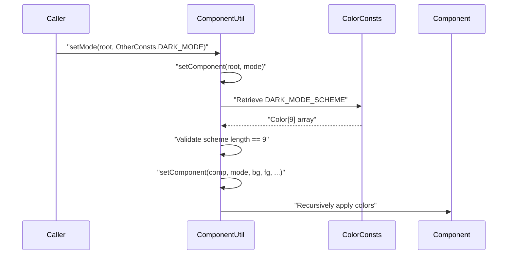
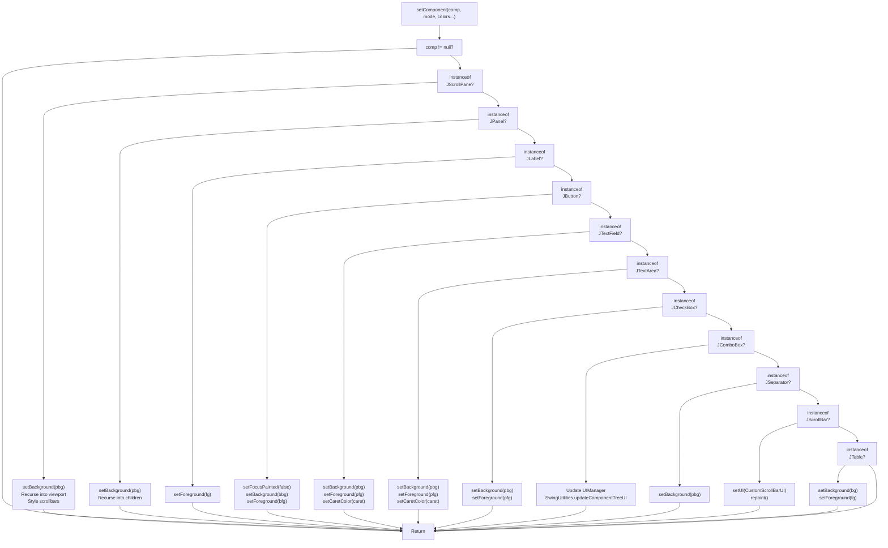
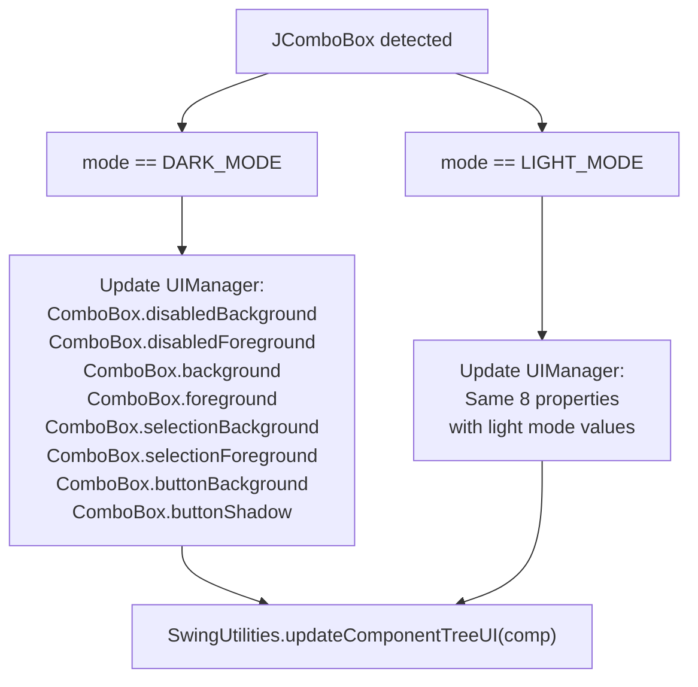
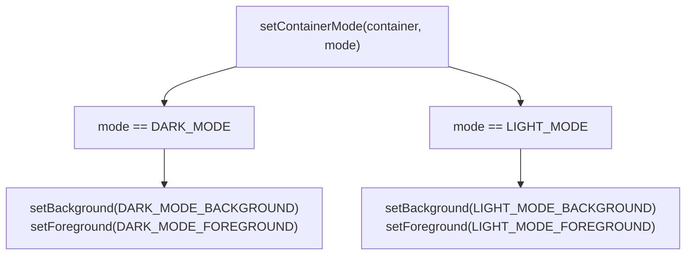
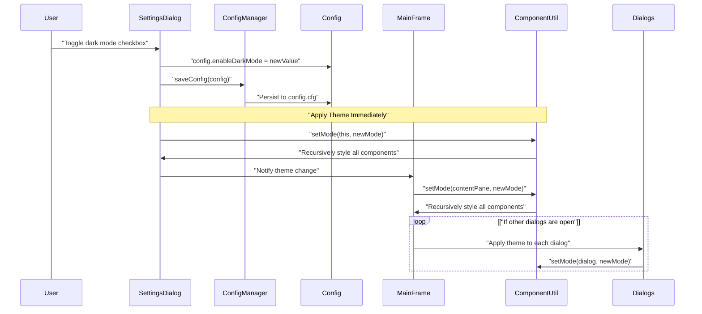

# Theming System

> **Relevant source files**
> * [src/io/github/samera2022/mouse_macros/constant/ColorConsts.java](https://github.com/Samera2022/MouseMacros/blob/6b37ce1e/src/io/github/samera2022/mouse_macros/constant/ColorConsts.java)
> * [src/io/github/samera2022/mouse_macros/constant/IconConsts.java](https://github.com/Samera2022/MouseMacros/blob/6b37ce1e/src/io/github/samera2022/mouse_macros/constant/IconConsts.java)
> * [src/io/github/samera2022/mouse_macros/util/ComponentUtil.java](https://github.com/Samera2022/MouseMacros/blob/6b37ce1e/src/io/github/samera2022/mouse_macros/util/ComponentUtil.java)

## Purpose and Scope

This document describes the theming infrastructure that provides dark mode and light mode support across the MouseMacros application. The theming system handles color scheme management, recursive component styling, custom UI component rendering, and optional synchronization with operating system appearance settings.

For general UI component documentation, see [User Interface Components](/Samera2022/MouseMacros/7-user-interface-components). For configuration of theme preferences, see [Configuration System](/Samera2022/MouseMacros/5-configuration-system). For system integration details, see [System Utilities](/Samera2022/MouseMacros/8.2-system-utilities).

## Overview

The theming system consists of three primary components:

| Component | File | Purpose |
| --- | --- | --- |
| `ComponentUtil` | [src/io/github/samera2022/mouse_macros/util/ComponentUtil.java](https://github.com/Samera2022/MouseMacros/blob/6b37ce1e/src/io/github/samera2022/mouse_macros/util/ComponentUtil.java) | Recursive theme application to component trees |
| `ColorConsts` | [src/io/github/samera2022/mouse_macros/constant/ColorConsts.java](https://github.com/Samera2022/MouseMacros/blob/6b37ce1e/src/io/github/samera2022/mouse_macros/constant/ColorConsts.java) | Dark and light mode color scheme definitions |
| `IconConsts` | [src/io/github/samera2022/mouse_macros/constant/IconConsts.java](https://github.com/Samera2022/MouseMacros/blob/6b37ce1e/src/io/github/samera2022/mouse_macros/constant/IconConsts.java) | Custom icons for checkboxes and selection states |

The system supports runtime theme switching without application restart and can optionally follow operating system dark mode settings through `SystemUtil` integration.

**Sources:** [src/io/github/samera2022/mouse_macros/util/ComponentUtil.java L1-L139](https://github.com/Samera2022/MouseMacros/blob/6b37ce1e/src/io/github/samera2022/mouse_macros/util/ComponentUtil.java#L1-L139)

 [src/io/github/samera2022/mouse_macros/constant/ColorConsts.java L1-L45](https://github.com/Samera2022/MouseMacros/blob/6b37ce1e/src/io/github/samera2022/mouse_macros/constant/ColorConsts.java#L1-L45)

## Color Scheme Architecture

### Color Constant Definitions

`ColorConsts` defines parallel color schemes for dark and light modes. Each mode specifies 14 distinct color constants:

```mermaid
flowchart TD

ColorConsts["ColorConsts"]
DMBg["DARK_MODE_BACKGROUND<br>40,40,40"]
DMFg["DARK_MODE_FOREGROUND<br>220,220,220"]
DMPBg["DARK_MODE_PANEL_BACKGROUND<br>55,55,55"]
DMPFg["DARK_MODE_PANEL_FOREGROUND<br>220,220,220"]
DMBBg["DARK_MODE_BUTTON_BACKGROUND<br>60,60,60"]
DMBFg["DARK_MODE_BUTTON_FOREGROUND<br>220,220,220"]
DMCaret["DARK_MODE_CARET<br>180,180,180"]
DMSBBg["DARK_MODE_SCROLLBAR_BACKGROUND<br>55,55,55"]
DMSBFg["DARK_MODE_SCROLLBAR_FOREGROUND<br>BLACK"]
DMLBg["DARK_MODE_LIST_BACKGROUND<br>45,45,45"]
DMLFg["DARK_MODE_LIST_FOREGROUND<br>220,220,220"]
DMLSBg["DARK_MODE_LIST_SELECTION_BG<br>80,80,80"]
DMLSFg["DARK_MODE_LIST_SELECTION_FG<br>240,240,240"]
DMBorder["DARK_MODE_PANEL_BORDER<br>80,80,80"]
LMBg["LIGHT_MODE_BACKGROUND<br>WHITE"]
LMFg["LIGHT_MODE_FOREGROUND<br>BLACK"]
LMPBg["LIGHT_MODE_PANEL_BACKGROUND<br>245,245,245"]
LMPFg["LIGHT_MODE_PANEL_FOREGROUND<br>BLACK"]
LMBBg["LIGHT_MODE_BUTTON_BACKGROUND<br>240,240,240"]
LMBFg["LIGHT_MODE_BUTTON_FOREGROUND<br>BLACK"]
LMCaret["LIGHT_MODE_CARET<br>BLACK"]
LMSBBg["LIGHT_MODE_SCROLLBAR_BACKGROUND<br>245,245,245"]
LMSBFg["LIGHT_MODE_SCROLLBAR_FOREGROUND<br>LIGHT_GRAY"]
LMLBg["LIGHT_MODE_LIST_BACKGROUND<br>250,250,250"]
LMLFg["LIGHT_MODE_LIST_FOREGROUND<br>50,50,50"]
LMLSBg["LIGHT_MODE_LIST_SELECTION_BG<br>200,200,200"]
LMLSFg["LIGHT_MODE_LIST_SELECTION_FG<br>30,30,30"]
LMBorder["LIGHT_MODE_PANEL_BORDER<br>180,180,180"]
DarkScheme["DARK_MODE_SCHEME[9]"]
LightScheme["LIGHT_MODE_SCHEME[9]"]

DMBg --> DarkScheme
DMFg --> DarkScheme
DMPBg --> DarkScheme
DMPFg --> DarkScheme
DMBBg --> DarkScheme
DMBFg --> DarkScheme
DMLBg --> DarkScheme
DMLFg --> DarkScheme
DMCaret --> DarkScheme
LMBg --> LightScheme
LMFg --> LightScheme
LMPBg --> LightScheme
LMPFg --> LightScheme
LMBBg --> LightScheme
LMBFg --> LightScheme
LMLBg --> LightScheme
LMLFg --> LightScheme
LMCaret --> LightScheme

subgraph LightModeColors ["LIGHT_MODE Colors"]
    LMBg
    LMFg
    LMPBg
    LMPFg
    LMBBg
    LMBFg
    LMCaret
    LMSBBg
    LMSBFg
    LMLBg
    LMLFg
    LMLSBg
    LMLSFg
    LMBorder
end

subgraph DarkModeColors ["DARK_MODE Colors"]
    DMBg
    DMFg
    DMPBg
    DMPFg
    DMBBg
    DMBFg
    DMCaret
    DMSBBg
    DMSBFg
    DMLBg
    DMLFg
    DMLSBg
    DMLSFg
    DMBorder
end
```



### Color Scheme Arrays

The color schemes are packaged into arrays for convenient passing to styling methods:

| Array | Definition | Elements |
| --- | --- | --- |
| `DARK_MODE_SCHEME` | [ColorConsts.java L21-L22](https://github.com/Samera2022/MouseMacros/blob/6b37ce1e/ColorConsts.java#L21-L22) | 9 colors: background, foreground, panel_bg, panel_fg, button_bg, button_fg, list_bg, list_fg, caret |
| `LIGHT_MODE_SCHEME` | [ColorConsts.java L41-L42](https://github.com/Samera2022/MouseMacros/blob/6b37ce1e/ColorConsts.java#L41-L42) | 9 colors: same structure as dark mode |

### Disabled State Colors

Additional colors handle disabled component states:

| Color Constant | Dark Mode Value | Light Mode Value |
| --- | --- | --- |
| `DISABLED_BACKGROUND` | `109,109,109,255` | `238,238,238,255` |
| `DISABLED_FOREGROUND` | `146,146,146,255` | `184,207,229,255` |

These are specifically applied to `JComboBox` components when setting their disabled appearance through `UIManager`.

**Sources:** [src/io/github/samera2022/mouse_macros/constant/ColorConsts.java L1-L45](https://github.com/Samera2022/MouseMacros/blob/6b37ce1e/src/io/github/samera2022/mouse_macros/constant/ColorConsts.java#L1-L45)

## Component Styling Engine

### Theme Application Entry Point

`ComponentUtil.setMode(Component root, int mode)` serves as the public entry point for theme application:



The `mode` parameter accepts constants from `OtherConsts`:

* `OtherConsts.DARK_MODE`
* `OtherConsts.LIGHT_MODE`

**Sources:** [src/io/github/samera2022/mouse_macros/util/ComponentUtil.java L24-L44](https://github.com/Samera2022/MouseMacros/blob/6b37ce1e/src/io/github/samera2022/mouse_macros/util/ComponentUtil.java#L24-L44)

### Recursive Component Traversal

The private `setComponent(Component comp, int mode, Color bg, Color fg, ...)` method implements recursive traversal with type-specific styling:



**Sources:** [src/io/github/samera2022/mouse_macros/util/ComponentUtil.java L47-L121](https://github.com/Samera2022/MouseMacros/blob/6b37ce1e/src/io/github/samera2022/mouse_macros/util/ComponentUtil.java#L47-L121)

### Component Type Styling Rules

The following table documents how each component type is styled:

| Component Type | Background Color | Foreground Color | Special Handling |
| --- | --- | --- | --- |
| `JScrollPane` | `pbg` (panel background) | - | Recursively style vertical/horizontal scrollbars and viewport contents |
| `JPanel` | `pbg` | - | Recursively style all child components |
| `JLabel` | - | `fg` (foreground) | Only foreground is set |
| `JButton` | `bbg` (button background) | `bfg` (button foreground) | `setFocusPainted(false)` to remove focus border |
| `JTextField` | `pbg` | `pfg` (panel foreground) | `setCaretColor(caret)` for text cursor |
| `JTextArea` | `pbg` | `pfg` | `setCaretColor(caret)` for text cursor |
| `JCheckBox` | `pbg` | `pfg` | Standard background/foreground |
| `JComboBox` | Via `UIManager` | Via `UIManager` | Updates 8 `UIManager` properties, calls `updateComponentTreeUI()` |
| `JSeparator` | `pbg` | - | Only background is set |
| `JScrollBar` | - | - | Delegates to `CustomScrollBarUI`, triggers repaint |
| `JTable` | `bg` (background) | `fg` | Used for file chooser internal tables |

**Sources:** [src/io/github/samera2022/mouse_macros/util/ComponentUtil.java L47-L121](https://github.com/Samera2022/MouseMacros/blob/6b37ce1e/src/io/github/samera2022/mouse_macros/util/ComponentUtil.java#L47-L121)

### JComboBox Specialized Styling

`JComboBox` requires `UIManager` property updates due to its complex rendering:



The 8 `UIManager` properties updated for each mode:

1. `ComboBox.disabledBackground` - Background when disabled
2. `ComboBox.disabledForeground` - Foreground when disabled
3. `ComboBox.background` - Normal background
4. `ComboBox.foreground` - Normal foreground
5. `ComboBox.selectionBackground` - Selected item background
6. `ComboBox.selectionForeground` - Selected item foreground
7. `ComboBox.buttonBackground` - Dropdown button background
8. `ComboBox.buttonShadow` - Dropdown button shadow/border

**Sources:** [src/io/github/samera2022/mouse_macros/util/ComponentUtil.java L85-L109](https://github.com/Samera2022/MouseMacros/blob/6b37ce1e/src/io/github/samera2022/mouse_macros/util/ComponentUtil.java#L85-L109)

## Custom UI Components

### CustomScrollBarUI

`CustomScrollBarUI` provides mode-aware scrollbar rendering. The class is instantiated with the current mode and set as the UI delegate for `JScrollBar` components:

```
((JScrollBar) comp).setUI(new CustomScrollBarUI(mode));
SwingUtilities.invokeLater(comp::repaint);
```

The `invokeLater` call ensures the scrollbar is repainted on the Event Dispatch Thread after the UI change.

**Sources:** [src/io/github/samera2022/mouse_macros/util/ComponentUtil.java L112-L114](https://github.com/Samera2022/MouseMacros/blob/6b37ce1e/src/io/github/samera2022/mouse_macros/util/ComponentUtil.java#L112-L114)

### Icon Constants

`IconConsts` defines custom icons for checkbox states:

| Icon Constant | Type | Size | Color |
| --- | --- | --- | --- |
| `UNSELECTED_ICON` | `CheckMarkIcon` | 13x13 | Blue |
| `SELECTED_ICON` | `CheckMarkIcon` | 13x13 | Blue |
| `CHECK_BOX` | `ContrastCheckboxIcon` | 15x15 | Blue |

These icons ensure consistent checkbox appearance across both themes.

**Sources:** [src/io/github/samera2022/mouse_macros/constant/IconConsts.java L1-L15](https://github.com/Samera2022/MouseMacros/blob/6b37ce1e/src/io/github/samera2022/mouse_macros/constant/IconConsts.java#L1-L15)

## Container Mode Setting

`ComponentUtil.setContainerMode(Container c, int mode)` provides a simplified method for setting theme colors on top-level containers without recursive traversal:



This method is typically used for content panes and other root containers before applying full recursive styling.

**Sources:** [src/io/github/samera2022/mouse_macros/util/ComponentUtil.java L127-L138](https://github.com/Samera2022/MouseMacros/blob/6b37ce1e/src/io/github/samera2022/mouse_macros/util/ComponentUtil.java#L127-L138)

## Frame Width Adjustment

`ComponentUtil.adjustFrameWidth(JFrame jf, JButton... btns)` handles dynamic frame sizing based on button widths:

The method calculates required width by:

1. Measuring first three buttons (row 1) with 40px spacing
2. Measuring last two buttons (row 2) with 20px spacing
3. Taking maximum of both rows
4. Adding 80px padding

This ensures the main frame accommodates localized button text without truncation.

**Sources:** [src/io/github/samera2022/mouse_macros/util/ComponentUtil.java L14-L22](https://github.com/Samera2022/MouseMacros/blob/6b37ce1e/src/io/github/samera2022/mouse_macros/util/ComponentUtil.java#L14-L22)

## DPI Scaling Integration

`ComponentUtil.setCorrectSize(Component c, int x, int y)` adjusts component dimensions for display scaling:

```
c.setSize((int)(x/SystemUtil.getScale()[0]), (int)(y/SystemUtil.getScale()[1]));
```

The method divides requested dimensions by the scaling factors returned from `SystemUtil.getScale()` to compensate for high-DPI displays. See [System Utilities](/Samera2022/MouseMacros/8.2-system-utilities) for details on `SystemUtil.getScale()`.

**Sources:** [src/io/github/samera2022/mouse_macros/util/ComponentUtil.java L123-L125](https://github.com/Samera2022/MouseMacros/blob/6b37ce1e/src/io/github/samera2022/mouse_macros/util/ComponentUtil.java#L123-L125)

## Theme Switching Flow

### Runtime Theme Change Process

When a user changes the theme setting in `SettingsDialog`, the following sequence occurs:



The theme change is applied immediately to all visible windows without requiring application restart.

**Sources:** Based on architecture from Diagram 6 in high-level diagrams

## Integration with Configuration System

### Theme Persistence

The selected theme is stored in `config.enableDarkMode` (boolean) and persisted to `config.cfg` via `ConfigManager`. On application startup, `MainFrame` reads this value and applies the corresponding theme.

### System Settings Synchronization

When `config.followSystemSettings` is enabled, the application queries the operating system's dark mode preference through `SystemUtil.isDarkMode()`. This query reads the Windows Registry key:

```
HKEY_CURRENT_USER\Software\Microsoft\Windows\CurrentVersion\Themes\Personalize
/v AppsUseLightTheme
```

If the registry value is 0, dark mode is enabled. If 1, light mode is enabled. The application synchronizes its theme with this system setting during initialization.

For details on system integration, see [System Utilities](/Samera2022/MouseMacros/8.2-system-utilities). For configuration persistence, see [ConfigManager](/Samera2022/MouseMacros/5.1-configmanager).

**Sources:** Based on Diagram 6 and configuration architecture from high-level diagrams