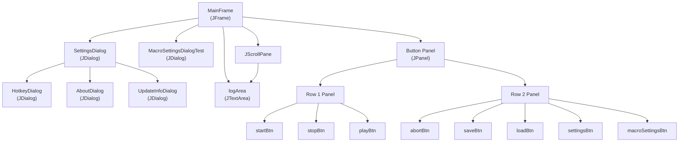
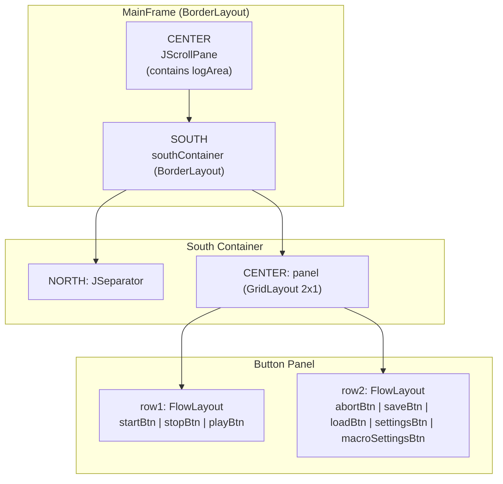
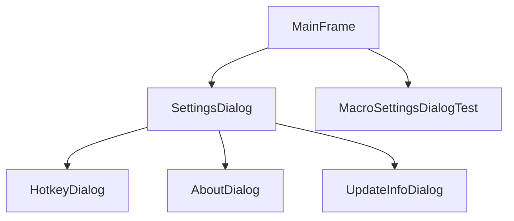
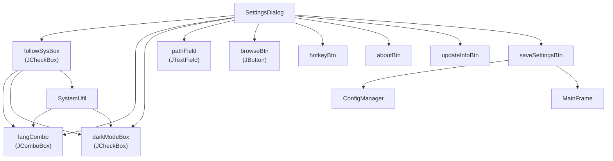
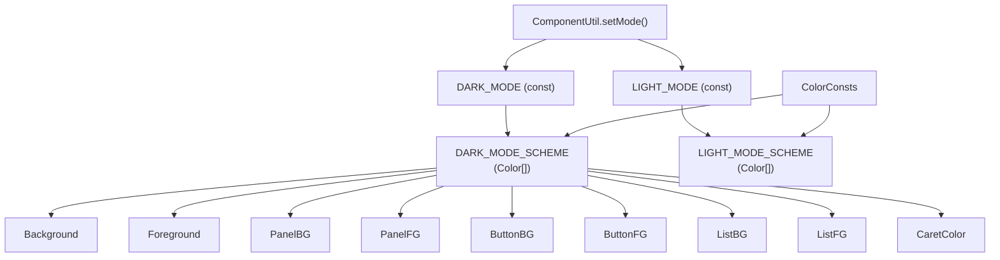
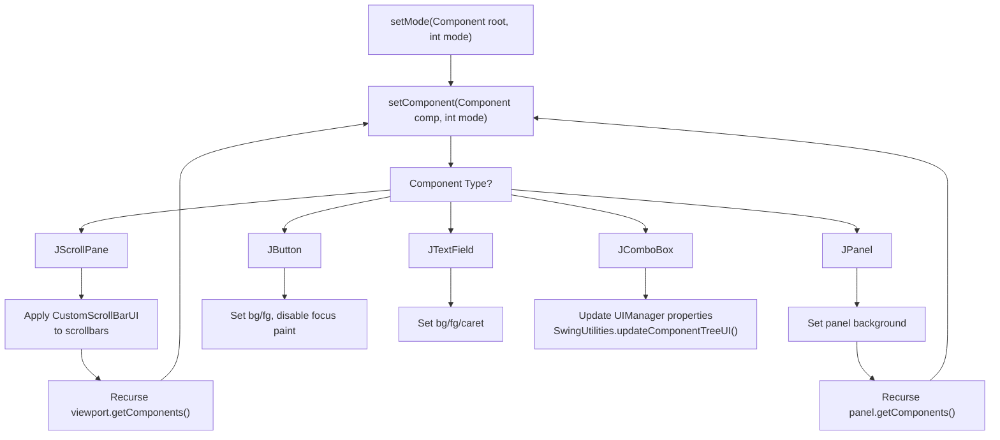
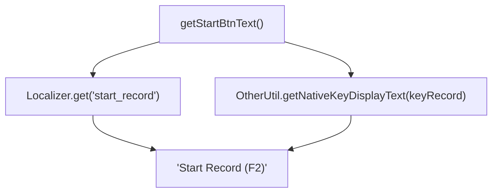
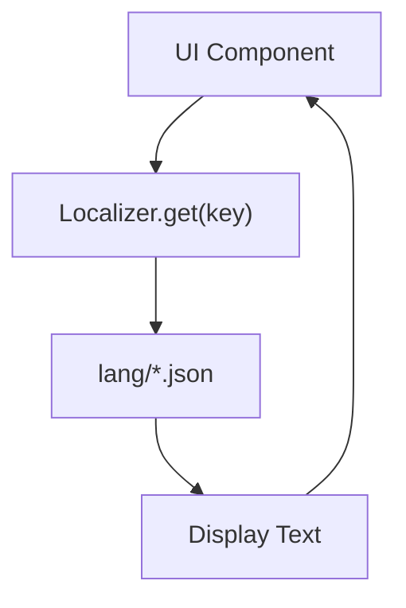

# User Interface Components

> **Relevant source files**
> * [src/io/github/samera2022/mouse_macros/ui/frame/MainFrame.java](https://github.com/Samera2022/MouseMacros/blob/6b37ce1e/src/io/github/samera2022/mouse_macros/ui/frame/MainFrame.java)
> * [src/io/github/samera2022/mouse_macros/ui/frame/SettingsDialog.java](https://github.com/Samera2022/MouseMacros/blob/6b37ce1e/src/io/github/samera2022/mouse_macros/ui/frame/SettingsDialog.java)
> * [src/io/github/samera2022/mouse_macros/util/ComponentUtil.java](https://github.com/Samera2022/MouseMacros/blob/6b37ce1e/src/io/github/samera2022/mouse_macros/util/ComponentUtil.java)

## Purpose and Scope

This page provides an overview of the user interface component system in MouseMacros, including the main window structure, dialog hierarchy, theming architecture, and custom UI components. It focuses on the architectural relationships between UI classes and how they integrate with the application's configuration and localization systems.

For detailed documentation of specific dialog implementations, see:

* Settings configuration UI: [Settings Dialog](/Samera2022/MouseMacros/7.1-settings-dialog)
* Hotkey customization: [Hotkey Dialog](/Samera2022/MouseMacros/7.2-hotkey-dialog)
* Author and version information: [About and Update Dialogs](/Samera2022/MouseMacros/7.3-about-and-update-dialogs)
* Dark/light mode theming: [Theming System](/Samera2022/MouseMacros/7.4-theming-system)

For the initialization sequence and event handling in the main window, see [Main Window (MainFrame)](/Samera2022/MouseMacros/3.2-main-window-(mainframe)).

---

## Component Hierarchy

The UI system follows a hierarchical structure with `MainFrame` as the root window and multiple modal dialogs for specialized configuration tasks.



**Sources:** [src/io/github/samera2022/mouse_macros/ui/frame/MainFrame.java L27-L122](https://github.com/Samera2022/MouseMacros/blob/6b37ce1e/src/io/github/samera2022/mouse_macros/ui/frame/MainFrame.java#L27-L122)

---

## Main Application Window

### MainFrame Structure

`MainFrame` extends `JFrame` and serves as the primary application window. It is implemented as a singleton pattern with a static `MAIN_FRAME` instance.

| Component | Type | Purpose |
| --- | --- | --- |
| `logArea` | `JTextArea` | Displays status messages and operation logs |
| `startBtn` | `JButton` | Initiates macro recording (F2 by default) |
| `stopBtn` | `JButton` | Stops recording (F3 by default) |
| `playBtn` | `JButton` | Plays recorded macro (F4 by default) |
| `abortBtn` | `JButton` | Aborts running macro (F5 by default) |
| `saveBtn` | `JButton` | Saves macro to .mmc file |
| `loadBtn` | `JButton` | Loads macro from .mmc file |
| `settingsBtn` | `JButton` | Opens general settings dialog |
| `macroSettingsBtn` | `JButton` | Opens macro-specific settings dialog |

**Sources:** [src/io/github/samera2022/mouse_macros/ui/frame/MainFrame.java L28-L29](https://github.com/Samera2022/MouseMacros/blob/6b37ce1e/src/io/github/samera2022/mouse_macros/ui/frame/MainFrame.java#L28-L29)

### Layout Structure

The window uses `BorderLayout` with three regions:



**Sources:** [src/io/github/samera2022/mouse_macros/ui/frame/MainFrame.java L76-L122](https://github.com/Samera2022/MouseMacros/blob/6b37ce1e/src/io/github/samera2022/mouse_macros/ui/frame/MainFrame.java#L76-L122)

### Button Text Localization

Button labels include hotkey indicators that are dynamically generated:

```
start_record + " (" + getNativeKeyDisplayText(keyRecord) + ")"
```

The hotkey values (`keyRecord`, `keyStop`, `keyPlay`, `keyAbort`) are configurable and loaded from `config.keyMap` during initialization at [src/io/github/samera2022/mouse_macros/ui/frame/MainFrame.java L62-L71](https://github.com/Samera2022/MouseMacros/blob/6b37ce1e/src/io/github/samera2022/mouse_macros/ui/frame/MainFrame.java#L62-L71)

**Sources:** [src/io/github/samera2022/mouse_macros/ui/frame/MainFrame.java L184-L187](https://github.com/Samera2022/MouseMacros/blob/6b37ce1e/src/io/github/samera2022/mouse_macros/ui/frame/MainFrame.java#L184-L187)

---

## Dialog System

### Modal Dialog Architecture

All dialogs extend `JDialog` and are configured as modal, preventing interaction with `MainFrame` until dismissed.



**Sources:** [src/io/github/samera2022/mouse_macros/ui/frame/MainFrame.java L134-L135](https://github.com/Samera2022/MouseMacros/blob/6b37ce1e/src/io/github/samera2022/mouse_macros/ui/frame/MainFrame.java#L134-L135)

 [src/io/github/samera2022/mouse_macros/ui/frame/SettingsDialog.java L113-L118](https://github.com/Samera2022/MouseMacros/blob/6b37ce1e/src/io/github/samera2022/mouse_macros/ui/frame/SettingsDialog.java#L113-L118)

### SettingsDialog Overview

`SettingsDialog` provides access to application-wide configuration options and launches specialized sub-dialogs.

**Key Features:**

* **System Settings Synchronization**: When `followSystemSettings` checkbox is enabled, language and dark mode settings automatically match the operating system
* **Language Selection**: `JComboBox` populated with languages from `ConfigManager.getAvailableLangs()`
* **Dark Mode Toggle**: `JCheckBox` with custom icons from `IconConsts.CHECK_BOX`
* **Default Storage Path**: `JTextField` with directory browser for default .mmc file location
* **Sub-Dialog Launchers**: Three buttons to open `HotkeyDialog`, `AboutDialog`, and `UpdateInfoDialog`

**Sources:** [src/io/github/samera2022/mouse_macros/ui/frame/SettingsDialog.java L23-L179](https://github.com/Samera2022/MouseMacros/blob/6b37ce1e/src/io/github/samera2022/mouse_macros/ui/frame/SettingsDialog.java#L23-L179)

### Settings Dialog Component Relationships



**Sources:** [src/io/github/samera2022/mouse_macros/ui/frame/SettingsDialog.java L38-L169](https://github.com/Samera2022/MouseMacros/blob/6b37ce1e/src/io/github/samera2022/mouse_macros/ui/frame/SettingsDialog.java#L38-L169)

---

## Theming Architecture

### ComponentUtil Theming System

`ComponentUtil` provides recursive theming for the entire component tree. The `setMode()` method traverses components and applies color schemes based on component type.

**Supported Component Types:**

* `JPanel`: Panel background
* `JLabel`: Foreground text color
* `JButton`: Background, foreground, focus painting disabled
* `JTextField`: Background, foreground, caret color
* `JTextArea`: Background, foreground, caret color
* `JCheckBox`: Background, foreground
* `JComboBox`: Uses `UIManager` properties for comprehensive styling
* `JSeparator`: Background color
* `JScrollBar`: Custom `CustomScrollBarUI` applied
* `JScrollPane`: Recursive styling of viewport components
* `JTable`: Background, foreground (for file chooser tables)

**Sources:** [src/io/github/samera2022/mouse_macros/util/ComponentUtil.java L24-L121](https://github.com/Samera2022/MouseMacros/blob/6b37ce1e/src/io/github/samera2022/mouse_macros/util/ComponentUtil.java#L24-L121)

### Color Scheme Mapping



**Sources:** [src/io/github/samera2022/mouse_macros/util/ComponentUtil.java L28-L44](https://github.com/Samera2022/MouseMacros/blob/6b37ce1e/src/io/github/samera2022/mouse_macros/util/ComponentUtil.java#L28-L44)

### Recursive Theming Process

The theming process recursively traverses container hierarchies:



**Sources:** [src/io/github/samera2022/mouse_macros/util/ComponentUtil.java L46-L121](https://github.com/Samera2022/MouseMacros/blob/6b37ce1e/src/io/github/samera2022/mouse_macros/util/ComponentUtil.java#L46-L121)

### Theme Application Points

Theming is applied at three key points:

1. **Initialization**: During `MainFrame` construction at [src/io/github/samera2022/mouse_macros/ui/frame/MainFrame.java L152](https://github.com/Samera2022/MouseMacros/blob/6b37ce1e/src/io/github/samera2022/mouse_macros/ui/frame/MainFrame.java#L152-L152)
2. **Settings Dialog Save**: When user saves settings at [src/io/github/samera2022/mouse_macros/ui/frame/SettingsDialog.java L144-L145](https://github.com/Samera2022/MouseMacros/blob/6b37ce1e/src/io/github/samera2022/mouse_macros/ui/frame/SettingsDialog.java#L144-L145)
3. **Dialog Construction**: Each dialog applies theming in its constructor (e.g., [src/io/github/samera2022/mouse_macros/ui/frame/SettingsDialog.java L173](https://github.com/Samera2022/MouseMacros/blob/6b37ce1e/src/io/github/samera2022/mouse_macros/ui/frame/SettingsDialog.java#L173-L173) )

**Sources:** [src/io/github/samera2022/mouse_macros/ui/frame/MainFrame.java L152](https://github.com/Samera2022/MouseMacros/blob/6b37ce1e/src/io/github/samera2022/mouse_macros/ui/frame/MainFrame.java#L152-L152)

 [src/io/github/samera2022/mouse_macros/ui/frame/SettingsDialog.java L144-L173](https://github.com/Samera2022/MouseMacros/blob/6b37ce1e/src/io/github/samera2022/mouse_macros/ui/frame/SettingsDialog.java#L144-L173)

---

## Custom UI Components

### CustomScrollBarUI

A custom scrollbar implementation that adapts its appearance based on dark/light mode. Applied to all `JScrollBar` instances during theming.

**Usage:**

```
scrollPane.getVerticalScrollBar().setUI(new CustomScrollBarUI(mode));
```

**Sources:** [src/io/github/samera2022/mouse_macros/ui/frame/MainFrame.java L82-L83](https://github.com/Samera2022/MouseMacros/blob/6b37ce1e/src/io/github/samera2022/mouse_macros/ui/frame/MainFrame.java#L82-L83)

 [src/io/github/samera2022/mouse_macros/util/ComponentUtil.java L113](https://github.com/Samera2022/MouseMacros/blob/6b37ce1e/src/io/github/samera2022/mouse_macros/util/ComponentUtil.java#L113-L113)

### IconConsts

Provides custom icons for checkbox components. The `CHECK_BOX` constant is used for creating custom-styled checkboxes throughout the application.

**Usage in SettingsDialog:**

```
JCheckBox followSysBox = new JCheckBox(IconConsts.CHECK_BOX);
JCheckBox darkModeBox = new JCheckBox(IconConsts.CHECK_BOX);
```

**Sources:** [src/io/github/samera2022/mouse_macros/ui/frame/SettingsDialog.java L41-L74](https://github.com/Samera2022/MouseMacros/blob/6b37ce1e/src/io/github/samera2022/mouse_macros/ui/frame/SettingsDialog.java#L41-L74)

---

## UI Refresh and Localization

### Dynamic Text Updates

The `MainFrame.refreshMainFrameTexts()` method updates all localized text when the user changes language settings:

**Update Sequence:**

1. Window title: `setTitle(Localizer.get("title"))`
2. Special buttons with hotkeys: `refreshSpecialTexts()`
3. Standard buttons: Direct `setText()` calls
4. Frame width adjustment: `ComponentUtil.adjustFrameWidth()`

**Sources:** [src/io/github/samera2022/mouse_macros/ui/frame/MainFrame.java L165-L175](https://github.com/Samera2022/MouseMacros/blob/6b37ce1e/src/io/github/samera2022/mouse_macros/ui/frame/MainFrame.java#L165-L175)

### Hotkey Display

Button labels dynamically include hotkey indicators:



The hotkey values are stored as integer constants:

* `keyRecord`: Default `NativeKeyEvent.VC_F2`
* `keyStop`: Default `NativeKeyEvent.VC_F3`
* `keyPlay`: Default `NativeKeyEvent.VC_F4`
* `keyAbort`: Default `NativeKeyEvent.VC_F5`

These can be overridden via `config.keyMap` loaded at initialization.

**Sources:** [src/io/github/samera2022/mouse_macros/ui/frame/MainFrame.java L32-L187](https://github.com/Samera2022/MouseMacros/blob/6b37ce1e/src/io/github/samera2022/mouse_macros/ui/frame/MainFrame.java#L32-L187)

---

## Frame Sizing and Scaling

### Automatic Width Adjustment

`ComponentUtil.adjustFrameWidth()` calculates optimal window width based on button sizes to prevent clipping:

**Algorithm:**

1. Calculate row 1 width: `btn[0] + btn[1] + btn[2] + 40px gaps`
2. Calculate row 2 width: `btn[3] + btn[4] + 20px gaps`
3. Take maximum of both rows
4. Add 80px padding
5. Set frame width to result

**Sources:** [src/io/github/samera2022/mouse_macros/util/ComponentUtil.java L14-L22](https://github.com/Samera2022/MouseMacros/blob/6b37ce1e/src/io/github/samera2022/mouse_macros/util/ComponentUtil.java#L14-L22)

### DPI Scaling

The frame height is adjusted for display scaling:

```
setSize(getWidth(), (int)(660 / SystemUtil.getScale()[1]));
```

This ensures consistent visual sizing across different DPI settings by dividing the target height by the vertical scale factor.

**Sources:** [src/io/github/samera2022/mouse_macros/ui/frame/MainFrame.java L160](https://github.com/Samera2022/MouseMacros/blob/6b37ce1e/src/io/github/samera2022/mouse_macros/ui/frame/MainFrame.java#L160-L160)

---

## Size Persistence

### SizeCache

Dialog dimensions are persisted using the `SizeCache` class:

```
pack();
SizeCache.SIZE = getSize();
```

This allows dialogs to remember their last size across application sessions.

**Sources:** [src/io/github/samera2022/mouse_macros/ui/frame/SettingsDialog.java L175-L176](https://github.com/Samera2022/MouseMacros/blob/6b37ce1e/src/io/github/samera2022/mouse_macros/ui/frame/SettingsDialog.java#L175-L176)

---

## Integration with Other Systems

### Configuration Integration

UI components read from and write to `ConfigManager.config`:

| Config Field | UI Component | Purpose |
| --- | --- | --- |
| `config.lang` | `langCombo` | Language selection |
| `config.enableDarkMode` | `darkModeBox` | Theme toggle |
| `config.followSystemSettings` | `followSysBox` | System synchronization |
| `config.defaultMmcStoragePath` | `pathField` | Default save location |
| `config.keyMap` | Hotkey values | Custom hotkey assignments |

**Sources:** [src/io/github/samera2022/mouse_macros/ui/frame/SettingsDialog.java L42-L136](https://github.com/Samera2022/MouseMacros/blob/6b37ce1e/src/io/github/samera2022/mouse_macros/ui/frame/SettingsDialog.java#L42-L136)

### Localization Integration

All user-facing text is retrieved via `Localizer.get()`:



Common localization keys:

* `"title"`: Window title
* `"settings"`: Settings button and dialog title
* `"start_record"`, `"stop_record"`, `"play_macro"`, `"abort_macro_operation"`: Button labels
* `"save_macro"`, `"load_macro"`: File operation buttons
* `"settings.custom_hotkey"`, `"settings.about_author"`, `"settings.update_info"`: Sub-dialog launchers

**Sources:** [src/io/github/samera2022/mouse_macros/ui/frame/MainFrame.java L72-L172](https://github.com/Samera2022/MouseMacros/blob/6b37ce1e/src/io/github/samera2022/mouse_macros/ui/frame/MainFrame.java#L72-L172)

 [src/io/github/samera2022/mouse_macros/ui/frame/SettingsDialog.java L24-L130](https://github.com/Samera2022/MouseMacros/blob/6b37ce1e/src/io/github/samera2022/mouse_macros/ui/frame/SettingsDialog.java#L24-L130)

---

## Summary

The UI component system is organized hierarchically with `MainFrame` as the root window and specialized modal dialogs for configuration tasks. The theming system provides comprehensive dark/light mode support through recursive component styling, while custom components like `CustomScrollBarUI` ensure visual consistency. All UI elements integrate with the localization system for multi-language support and dynamically update when settings change.