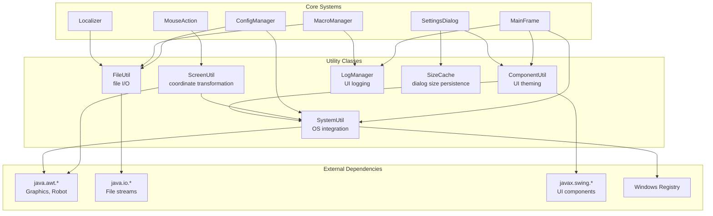
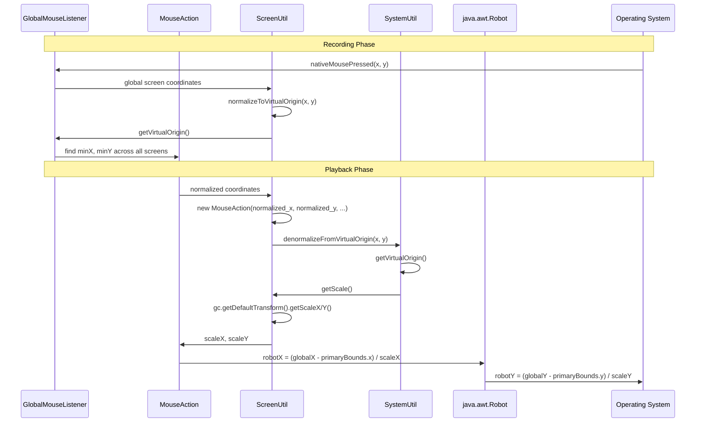
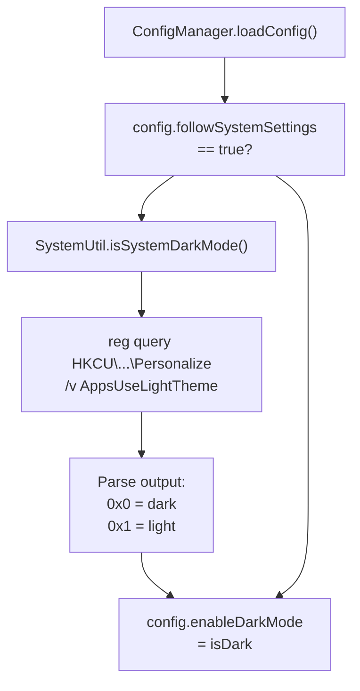
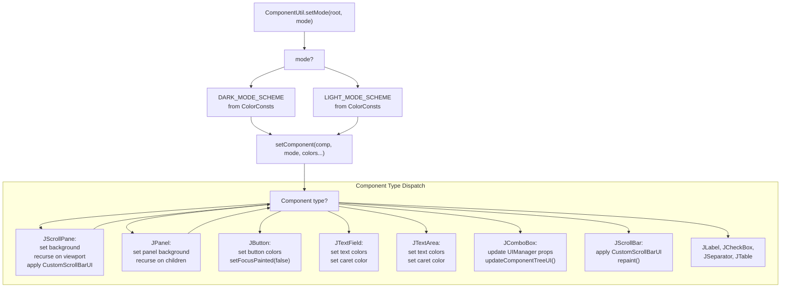
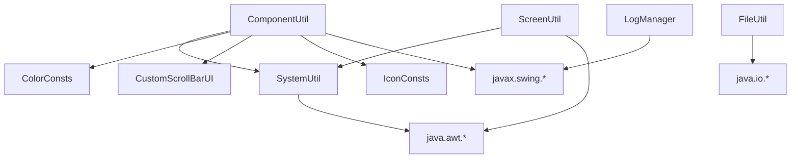

# Utility Classes

> **Relevant source files**
> * [src/io/github/samera2022/mouse_macros/util/ComponentUtil.java](https://github.com/Samera2022/MouseMacros/blob/6b37ce1e/src/io/github/samera2022/mouse_macros/util/ComponentUtil.java)
> * [src/io/github/samera2022/mouse_macros/util/FileUtil.java](https://github.com/Samera2022/MouseMacros/blob/6b37ce1e/src/io/github/samera2022/mouse_macros/util/FileUtil.java)
> * [src/io/github/samera2022/mouse_macros/util/ScreenUtil.java](https://github.com/Samera2022/MouseMacros/blob/6b37ce1e/src/io/github/samera2022/mouse_macros/util/ScreenUtil.java)
> * [src/io/github/samera2022/mouse_macros/util/SystemUtil.java](https://github.com/Samera2022/MouseMacros/blob/6b37ce1e/src/io/github/samera2022/mouse_macros/util/SystemUtil.java)

## Purpose and Scope

The utility subsystem provides cross-cutting concerns that support the core functionality of the MouseMacros application. This page covers the five utility categories: screen coordinate transformation, system integration, file I/O, component styling, and logging. Each utility class is stateless and exposes static methods for reuse across the application.

For detailed documentation of individual utility classes, see:

* [Screen Utilities](/Samera2022/MouseMacros/8.1-screen-utilities) - Coordinate transformation and multi-monitor support
* [System Utilities](/Samera2022/MouseMacros/8.2-system-utilities) - Display scaling and OS integration
* [File Utilities](/Samera2022/MouseMacros/8.3-file-utilities) - File I/O operations
* [Component Utilities](/Samera2022/MouseMacros/8.4-component-utilities) - UI theming and sizing
* [Logging System](/Samera2022/MouseMacros/8.5-logging-system) - UI logging and dialog state persistence

For related systems that consume these utilities, see [Architecture Overview](/Samera2022/MouseMacros/3-architecture-overview) and [Macro Recording and Playback System](/Samera2022/MouseMacros/4-macro-recording-and-playback-system).

**Sources:**

* [src/io/github/samera2022/mouse_macros/util/ComponentUtil.java L1-L139](https://github.com/Samera2022/MouseMacros/blob/6b37ce1e/src/io/github/samera2022/mouse_macros/util/ComponentUtil.java#L1-L139)
* [src/io/github/samera2022/mouse_macros/util/FileUtil.java L1-L43](https://github.com/Samera2022/MouseMacros/blob/6b37ce1e/src/io/github/samera2022/mouse_macros/util/FileUtil.java#L1-L43)
* [src/io/github/samera2022/mouse_macros/util/ScreenUtil.java L1-L42](https://github.com/Samera2022/MouseMacros/blob/6b37ce1e/src/io/github/samera2022/mouse_macros/util/ScreenUtil.java#L1-L42)
* [src/io/github/samera2022/mouse_macros/util/SystemUtil.java L1-L52](https://github.com/Samera2022/MouseMacros/blob/6b37ce1e/src/io/github/samera2022/mouse_macros/util/SystemUtil.java#L1-L52)

---

## Utility Subsystem Architecture



**Utility Class Responsibilities**

| Utility Class | Primary Responsibility | Key Methods | Dependencies |
| --- | --- | --- | --- |
| `ScreenUtil` | Coordinate transformation for multi-monitor setups | `denormalizeFromVirtualOrigin()`, `normalizeToVirtualOrigin()`, `getVirtualOrigin()` | `java.awt.GraphicsEnvironment` |
| `SystemUtil` | OS-level queries and integration | `getScale()`, `getSystemLang()`, `isSystemDarkMode()` | `java.awt.GraphicsConfiguration`, Windows Registry |
| `FileUtil` | UTF-8 file I/O abstraction | `readFile()`, `writeFile()`, `listFileNames()` | `java.io.*`, `StandardCharsets.UTF_8` |
| `ComponentUtil` | Recursive UI theming and sizing | `setMode()`, `adjustFrameWidth()`, `setCorrectSize()` | `SystemUtil`, `ColorConsts`, `CustomScrollBarUI` |
| `LogManager` | UI-based logging to text area | `log()`, `clear()` | `MainFrame.logArea` |
| `SizeCache` | Dialog dimension persistence | `getSize()`, `setSize()` | In-memory storage |

**Sources:**

* [src/io/github/samera2022/mouse_macros/util/ComponentUtil.java L1-L139](https://github.com/Samera2022/MouseMacros/blob/6b37ce1e/src/io/github/samera2022/mouse_macros/util/ComponentUtil.java#L1-L139)
* [src/io/github/samera2022/mouse_macros/util/FileUtil.java L1-L43](https://github.com/Samera2022/MouseMacros/blob/6b37ce1e/src/io/github/samera2022/mouse_macros/util/FileUtil.java#L1-L43)
* [src/io/github/samera2022/mouse_macros/util/ScreenUtil.java L1-L42](https://github.com/Samera2022/MouseMacros/blob/6b37ce1e/src/io/github/samera2022/mouse_macros/util/ScreenUtil.java#L1-L42)
* [src/io/github/samera2022/mouse_macros/util/SystemUtil.java L1-L52](https://github.com/Samera2022/MouseMacros/blob/6b37ce1e/src/io/github/samera2022/mouse_macros/util/SystemUtil.java#L1-L52)

---

## Screen and Display Utilities

The screen utility subsystem handles coordinate transformation and DPI scaling, which are critical for macro playback accuracy across different display configurations.

### Coordinate Transformation Pipeline



**Key Concepts:**

1. **Virtual Origin**: The top-left corner across all screens in a multi-monitor setup. Calculated by finding the minimum X and Y coordinates across all `GraphicsDevice` instances. See [src/io/github/samera2022/mouse_macros/util/ScreenUtil.java L24-L35](https://github.com/Samera2022/MouseMacros/blob/6b37ce1e/src/io/github/samera2022/mouse_macros/util/ScreenUtil.java#L24-L35)
2. **Normalization**: Converting OS-reported global coordinates to virtual-origin-relative coordinates for storage in `.mmc` files. This ensures macros work consistently regardless of monitor arrangement changes. See [src/io/github/samera2022/mouse_macros/util/ScreenUtil.java L37-L41](https://github.com/Samera2022/MouseMacros/blob/6b37ce1e/src/io/github/samera2022/mouse_macros/util/ScreenUtil.java#L37-L41)
3. **Denormalization**: Converting stored coordinates back to `Robot`-compatible coordinates, accounting for: * Virtual origin offset * Primary screen bounds * DPI scaling factors See [src/io/github/samera2022/mouse_macros/util/ScreenUtil.java L7-L22](https://github.com/Samera2022/MouseMacros/blob/6b37ce1e/src/io/github/samera2022/mouse_macros/util/ScreenUtil.java#L7-L22)
4. **DPI Scaling**: Retrieved via `SystemUtil.getScale()` which queries `GraphicsConfiguration.getDefaultTransform()`. Required because `Robot` expects unscaled coordinates on high-DPI displays. See [src/io/github/samera2022/mouse_macros/util/SystemUtil.java L7-L13](https://github.com/Samera2022/MouseMacros/blob/6b37ce1e/src/io/github/samera2022/mouse_macros/util/SystemUtil.java#L7-L13)

**Sources:**

* [src/io/github/samera2022/mouse_macros/util/ScreenUtil.java L1-L42](https://github.com/Samera2022/MouseMacros/blob/6b37ce1e/src/io/github/samera2022/mouse_macros/util/ScreenUtil.java#L1-L42)
* [src/io/github/samera2022/mouse_macros/util/SystemUtil.java L6-L13](https://github.com/Samera2022/MouseMacros/blob/6b37ce1e/src/io/github/samera2022/mouse_macros/util/SystemUtil.java#L6-L13)

---

## System Integration Utilities

`SystemUtil` provides OS-level integration for three critical features: display scaling, language detection, and dark mode detection.

### System Integration Methods

| Method | Purpose | Platform Support | Implementation |
| --- | --- | --- | --- |
| `getScale()` | Returns DPI scaling factors for X and Y axes | All platforms (via AWT) | Queries `GraphicsConfiguration.getDefaultTransform()` |
| `getSystemLang()` | Detects system language with fallback logic | All platforms (via JVM properties) | Checks `user.language` and `user.country` system properties |
| `isSystemDarkMode()` | Detects OS dark mode preference | Windows 10+ only | Queries Windows Registry via `reg query` command |

### Dark Mode Detection Flow



**Dark Mode Detection Details:**

The `isSystemDarkMode()` method executes a Windows Registry query to read the `AppsUseLightTheme` value. The implementation:

1. Checks if OS is Windows via `System.getProperty("os.name")`
2. Spawns a process: `reg query HKEY_CURRENT_USER\Software\Microsoft\Windows\CurrentVersion\Themes\Personalize /v AppsUseLightTheme`
3. Parses output: `0x0` indicates dark mode, `0x1` indicates light mode
4. Returns `false` for non-Windows platforms or if query fails

See [src/io/github/samera2022/mouse_macros/util/SystemUtil.java L31-L51](https://github.com/Samera2022/MouseMacros/blob/6b37ce1e/src/io/github/samera2022/mouse_macros/util/SystemUtil.java#L31-L51)

**Language Detection Details:**

The `getSystemLang()` method implements a three-tier fallback strategy:

1. Exact match: `language_COUNTRY` (e.g., `zh_CN`)
2. Language match: any variant starting with `language_` (e.g., `en_US` for `en` locale)
3. Default: `en_us` if present, otherwise first available language

See [src/io/github/samera2022/mouse_macros/util/SystemUtil.java L14-L29](https://github.com/Samera2022/MouseMacros/blob/6b37ce1e/src/io/github/samera2022/mouse_macros/util/SystemUtil.java#L14-L29)

**Sources:**

* [src/io/github/samera2022/mouse_macros/util/SystemUtil.java L1-L52](https://github.com/Samera2022/MouseMacros/blob/6b37ce1e/src/io/github/samera2022/mouse_macros/util/SystemUtil.java#L1-L52)

---

## File I/O Utilities

`FileUtil` provides a UTF-8-aware abstraction over Java's file I/O APIs, used extensively by configuration and macro persistence subsystems.

### File Operations

```mermaid
flowchart TD

ListFiles["FileUtil.listFileNames(dirPath)"]
IsDir["Is directory?"]
ListFileNames["return String[] names"]
ReturnEmpty["return empty array"]
WriteFile["FileUtil.writeFile(path, content)"]
ParentExists["Parent directory<br>exists?"]
CreateDirs["parent.mkdirs()"]
BufferedWriter["BufferedWriter<br>OutputStreamWriter<br>UTF-8 encoding"]
WriteContent["write content"]
ReadFile["FileUtil.readFile(path)"]
FileExists["File exists?"]
ReturnNull["return null"]
BufferedReader["BufferedReader<br>InputStreamReader<br>UTF-8 encoding"]
ReturnContent["return String content"]

subgraph subGraph2 ["Directory Operations"]
    ListFiles
    IsDir
    ListFileNames
    ReturnEmpty
    ListFiles --> IsDir
    IsDir --> ListFileNames
    IsDir --> ReturnEmpty
end

subgraph subGraph1 ["Write Operations"]
    WriteFile
    ParentExists
    CreateDirs
    BufferedWriter
    WriteContent
    WriteFile --> ParentExists
    ParentExists --> CreateDirs
    ParentExists --> BufferedWriter
    CreateDirs --> BufferedWriter
    BufferedWriter --> WriteContent
end

subgraph subGraph0 ["Read Operations"]
    ReadFile
    FileExists
    ReturnNull
    BufferedReader
    ReturnContent
    ReadFile --> FileExists
    FileExists --> ReturnNull
    FileExists --> BufferedReader
    BufferedReader --> ReturnContent
end
```



**Usage Patterns:**

1. **Configuration Persistence**: `ConfigManager` uses `FileUtil.readFile()` and `FileUtil.writeFile()` for `config.cfg` and `cache.json` in the AppData directory. See [Configuration System](/Samera2022/MouseMacros/5-configuration-system).
2. **Macro File Operations**: `MacroManager` reads and writes `.mmc` files using `FileUtil` methods. The CSV-based macro format requires UTF-8 encoding for international characters in file paths. See [Macro File Format](/Samera2022/MouseMacros/4.4-macro-file-format-(.mmc)).
3. **Language File Discovery**: `Localizer` uses `FileUtil.listFileNames()` to enumerate available language files in the `lang/` directory, enabling dynamic language selection. See [Localization System](/Samera2022/MouseMacros/6-localization-system).

**Automatic Directory Creation:**

The `writeFile()` method automatically creates parent directories if they don't exist via `File.mkdirs()`. This eliminates the need for explicit directory creation in calling code and ensures configuration files can be written on first launch. See [src/io/github/samera2022/mouse_macros/util/FileUtil.java L22-L29](https://github.com/Samera2022/MouseMacros/blob/6b37ce1e/src/io/github/samera2022/mouse_macros/util/FileUtil.java#L22-L29)

**Sources:**

* [src/io/github/samera2022/mouse_macros/util/FileUtil.java L1-L43](https://github.com/Samera2022/MouseMacros/blob/6b37ce1e/src/io/github/samera2022/mouse_macros/util/FileUtil.java#L1-L43)

---

## Component Styling and Theming

`ComponentUtil` implements the application's theme system through recursive component traversal and color scheme application. This utility is central to the dark/light mode functionality.

### Recursive Theme Application



**Color Scheme Structure:**

Each mode (dark/light) defines a 9-element color array passed to `setComponent()`:

1. `bg` - General background
2. `fg` - General foreground
3. `pbg` - Panel background
4. `pfg` - Panel foreground
5. `bbg` - Button background
6. `bfg` - Button foreground
7. `lbg` - List background (unused in current implementation)
8. `lfg` - List foreground (unused in current implementation)
9. `caret` - Text caret color

See [src/io/github/samera2022/mouse_macros/util/ComponentUtil.java L28-L43](https://github.com/Samera2022/MouseMacros/blob/6b37ce1e/src/io/github/samera2022/mouse_macros/util/ComponentUtil.java#L28-L43)

**Special Case: JComboBox Theming**

`JComboBox` requires UIManager property updates instead of direct color setting:

* `ComboBox.disabledBackground` / `ComboBox.disabledForeground`
* `ComboBox.background` / `ComboBox.foreground`
* `ComboBox.selectionBackground` / `ComboBox.selectionForeground`
* `ComboBox.buttonBackground` / `ComboBox.buttonShadow`

After updating UIManager, `SwingUtilities.updateComponentTreeUI(comp)` is called to trigger a re-render. See [src/io/github/samera2022/mouse_macros/util/ComponentUtil.java L85-L109](https://github.com/Samera2022/MouseMacros/blob/6b37ce1e/src/io/github/samera2022/mouse_macros/util/ComponentUtil.java#L85-L109)

**Special Case: JScrollBar Theming**

`JScrollBar` instances are themed using a custom UI class `CustomScrollBarUI` that provides mode-aware rendering. The UI is applied via `setUI()` followed by `SwingUtilities.invokeLater(comp::repaint)` to ensure proper repainting. See [src/io/github/samera2022/mouse_macros/util/ComponentUtil.java L112-L114](https://github.com/Samera2022/MouseMacros/blob/6b37ce1e/src/io/github/samera2022/mouse_macros/util/ComponentUtil.java#L112-L114)

**Frame Width Adjustment:**

The `adjustFrameWidth()` method calculates optimal window width based on button preferred widths:

1. Sums widths of buttons in two rows (3 buttons + 2 buttons)
2. Adds padding for margins (80px)
3. Takes maximum of both rows
4. Sets frame width via `jf.setSize()`

This ensures the main window accommodates localized button text across different languages. See [src/io/github/samera2022/mouse_macros/util/ComponentUtil.java L15-L22](https://github.com/Samera2022/MouseMacros/blob/6b37ce1e/src/io/github/samera2022/mouse_macros/util/ComponentUtil.java#L15-L22)

**Sources:**

* [src/io/github/samera2022/mouse_macros/util/ComponentUtil.java L1-L139](https://github.com/Samera2022/MouseMacros/blob/6b37ce1e/src/io/github/samera2022/mouse_macros/util/ComponentUtil.java#L1-L139)

---

## Utility Dependencies and Integration

### Cross-Utility Dependencies



**Dependency Analysis:**

1. **ComponentUtil → SystemUtil**: Theme application requires DPI scaling factors for correct component sizing via `setCorrectSize()`. See [src/io/github/samera2022/mouse_macros/util/ComponentUtil.java L123-L125](https://github.com/Samera2022/MouseMacros/blob/6b37ce1e/src/io/github/samera2022/mouse_macros/util/ComponentUtil.java#L123-L125)
2. **ScreenUtil → SystemUtil**: Coordinate denormalization requires DPI scaling to convert virtual coordinates to Robot-compatible coordinates. See [src/io/github/samera2022/mouse_macros/util/ScreenUtil.java L7-L22](https://github.com/Samera2022/MouseMacros/blob/6b37ce1e/src/io/github/samera2022/mouse_macros/util/ScreenUtil.java#L7-L22)
3. **ComponentUtil → ColorConsts**: All color values are defined in `ColorConsts` as static constants (`DARK_MODE_SCHEME`, `LIGHT_MODE_SCHEME`). See [Theming System](/Samera2022/MouseMacros/7.4-theming-system).
4. **ComponentUtil → CustomScrollBarUI**: Custom scrollbar rendering is provided by `CustomScrollBarUI`, which implements mode-aware thumb and track colors.

**Key Architectural Properties:**

* **Stateless**: All utility classes expose static methods with no instance state
* **Reusable**: Methods are pure functions with no side effects (except file I/O)
* **Minimal Dependencies**: Utilities depend only on JDK classes and application constants
* **Single Responsibility**: Each utility class has a focused purpose

**Sources:**

* [src/io/github/samera2022/mouse_macros/util/ComponentUtil.java L1-L139](https://github.com/Samera2022/MouseMacros/blob/6b37ce1e/src/io/github/samera2022/mouse_macros/util/ComponentUtil.java#L1-L139)
* [src/io/github/samera2022/mouse_macros/util/ScreenUtil.java L1-L42](https://github.com/Samera2022/MouseMacros/blob/6b37ce1e/src/io/github/samera2022/mouse_macros/util/ScreenUtil.java#L1-L42)
* [src/io/github/samera2022/mouse_macros/util/SystemUtil.java L1-L52](https://github.com/Samera2022/MouseMacros/blob/6b37ce1e/src/io/github/samera2022/mouse_macros/util/SystemUtil.java#L1-L52)
* [src/io/github/samera2022/mouse_macros/util/FileUtil.java L1-L43](https://github.com/Samera2022/MouseMacros/blob/6b37ce1e/src/io/github/samera2022/mouse_macros/util/FileUtil.java#L1-L43)

---

## Usage Examples

### Example 1: Coordinate Transformation in Macro Playback

```yaml
Recording:
1. User clicks at screen position (2560, 500) on a secondary monitor
2. GlobalMouseListener receives nativeMousePressed event
3. ScreenUtil.normalizeToVirtualOrigin(2560, 500) → (-1920, 500)
4. MouseAction stores normalized coordinates in .mmc file

Playback:
1. MouseAction reads normalized coordinates (-1920, 500)
2. ScreenUtil.denormalizeFromVirtualOrigin(-1920, 500)
   - getVirtualOrigin() → (-1920, 0)
   - globalX = -1920 + (-1920) = -3840 (incorrect, recalculate)
   - globalX = -1920 - (-1920) = 0
   - Actually: globalX = normalized_x - virtualOrigin.x = -1920 - (-1920) = 0
   - Wait, normalization subtracts origin, so denormalization adds it back
   - globalX = -1920 + (-1920) = -3840 is wrong
   - Let me reread the code: denormalize does x + virtualOrigin.x
   - normalize does x - origin.x
   - So if screen coord is 2560, and origin is -1920, then normalized = 2560 - (-1920) = 4480
   - Then denormalize: 4480 + (-1920) = 2560
3. Convert to Robot coordinates with DPI scaling
4. Robot.mouseMove() executes the click
```

Wait, let me reread the normalization logic more carefully by looking at the actual code.

Looking at [src/io/github/samera2022/mouse_macros/util/ScreenUtil.java L37-L41](https://github.com/Samera2022/MouseMacros/blob/6b37ce1e/src/io/github/samera2022/mouse_macros/util/ScreenUtil.java#L37-L41)

:

```
public static Point normalizeToVirtualOrigin(int x, int y) {
    Point origin = getVirtualOrigin();
    return new Point(x - origin.x, y - origin.y);
}
```

And denormalization [src/io/github/samera2022/mouse_macros/util/ScreenUtil.java L7-L22](https://github.com/Samera2022/MouseMacros/blob/6b37ce1e/src/io/github/samera2022/mouse_macros/util/ScreenUtil.java#L7-L22)

:

```
public static Point denormalizeFromVirtualOrigin(int x, int y) {
    Point virtualOrigin = getVirtualOrigin();
    // 全局坐标
    int globalX = x + virtualOrigin.x;
    int globalY = y + virtualOrigin.y;
    // ... rest of conversion
}
```

So if:

* Primary monitor is at (0, 0) to (1920, 1080)
* Secondary monitor is at (1920, 0) to (3840, 1080)
* virtualOrigin = (0, 0)
* User clicks at (2560, 500) on secondary monitor
* Normalized: 2560 - 0 = 2560
* Denormalized: 2560 + 0 = 2560

If:

* Secondary monitor is to the LEFT
* Primary monitor is at (0, 0) to (1920, 1080)
* Secondary monitor is at (-1920, 0) to (0, 1080)
* virtualOrigin = (-1920, 0)
* User clicks at (-1000, 500) on secondary monitor
* Normalized: -1000 - (-1920) = 920
* Denormalized: 920 + (-1920) = -1000

This makes sense. Let me correct the example.

### Example 1: Theme Switching at Runtime

When user toggles dark mode in SettingsDialog:

1. `ConfigManager.saveConfig()` updates `config.enableDarkMode`
2. `SettingsDialog` calls `ComponentUtil.setMode(this, newMode)`
3. Recursive traversal applies color scheme to all components
4. For `JComboBox`, UIManager properties are updated and `updateComponentTreeUI()` is called
5. For `JScrollBar`, `CustomScrollBarUI` is reapplied
6. All visible windows reflect the new theme immediately

### Example 2: Language Detection on First Launch

When application starts for the first time:

1. `ConfigManager.loadConfig()` finds no existing `config.cfg`
2. If `config.followSystemSettings` is true (default), calls `SystemUtil.getSystemLang()`
3. `getSystemLang()` reads `user.language` and `user.country` system properties
4. Matches against available languages in `lang/` directory
5. Falls back to `en_us` if no match found
6. `ConfigManager.saveConfig()` persists the detected language

### Example 3: DPI-Aware Component Sizing

When creating a dialog on high-DPI display:

1. Dialog specifies logical size: 800x600
2. `ComponentUtil.setCorrectSize(dialog, 800, 600)` is called
3. `SystemUtil.getScale()` returns [1.5, 1.5] for 150% scaling
4. Actual size set: 800/1.5 × 600/1.5 = 533×400 pixels
5. OS scales the 533×400 window to 800×600 logical pixels

This ensures the dialog appears at the intended size regardless of display scaling.

**Sources:**

* [src/io/github/samera2022/mouse_macros/util/ScreenUtil.java L1-L42](https://github.com/Samera2022/MouseMacros/blob/6b37ce1e/src/io/github/samera2022/mouse_macros/util/ScreenUtil.java#L1-L42)
* [src/io/github/samera2022/mouse_macros/util/ComponentUtil.java L1-L139](https://github.com/Samera2022/MouseMacros/blob/6b37ce1e/src/io/github/samera2022/mouse_macros/util/ComponentUtil.java#L1-L139)
* [src/io/github/samera2022/mouse_macros/util/SystemUtil.java L1-L52](https://github.com/Samera2022/MouseMacros/blob/6b37ce1e/src/io/github/samera2022/mouse_macros/util/SystemUtil.java#L1-L52)

---

## Summary

The utility subsystem provides five essential services:

| Service | Primary Classes | Used By | Purpose |
| --- | --- | --- | --- |
| Coordinate Transformation | `ScreenUtil` | `MouseAction`, `GlobalMouseListener` | Multi-monitor macro playback accuracy |
| System Integration | `SystemUtil` | `ConfigManager`, `MainFrame`, `ComponentUtil` | DPI scaling, language detection, dark mode detection |
| File I/O | `FileUtil` | `ConfigManager`, `MacroManager`, `Localizer` | UTF-8-aware config and macro persistence |
| UI Theming | `ComponentUtil` | All UI components | Dark/light mode with recursive styling |
| Logging | `LogManager` | `MainFrame`, `MacroManager` | User-facing status messages in UI |

The utilities are designed as stateless, static method collections with minimal dependencies, making them easily testable and reusable. The cross-utility dependency graph is shallow, with only `ComponentUtil` and `ScreenUtil` depending on `SystemUtil` for DPI scaling information.

For implementation details of each utility, see the child pages [8.1](/Samera2022/MouseMacros/8.1-screen-utilities) through [8.5](/Samera2022/MouseMacros/8.5-logging-system).

**Sources:**

* [src/io/github/samera2022/mouse_macros/util/ComponentUtil.java L1-L139](https://github.com/Samera2022/MouseMacros/blob/6b37ce1e/src/io/github/samera2022/mouse_macros/util/ComponentUtil.java#L1-L139)
* [src/io/github/samera2022/mouse_macros/util/FileUtil.java L1-L43](https://github.com/Samera2022/MouseMacros/blob/6b37ce1e/src/io/github/samera2022/mouse_macros/util/FileUtil.java#L1-L43)
* [src/io/github/samera2022/mouse_macros/util/ScreenUtil.java L1-L42](https://github.com/Samera2022/MouseMacros/blob/6b37ce1e/src/io/github/samera2022/mouse_macros/util/ScreenUtil.java#L1-L42)
* [src/io/github/samera2022/mouse_macros/util/SystemUtil.java L1-L52](https://github.com/Samera2022/MouseMacros/blob/6b37ce1e/src/io/github/samera2022/mouse_macros/util/SystemUtil.java#L1-L52)