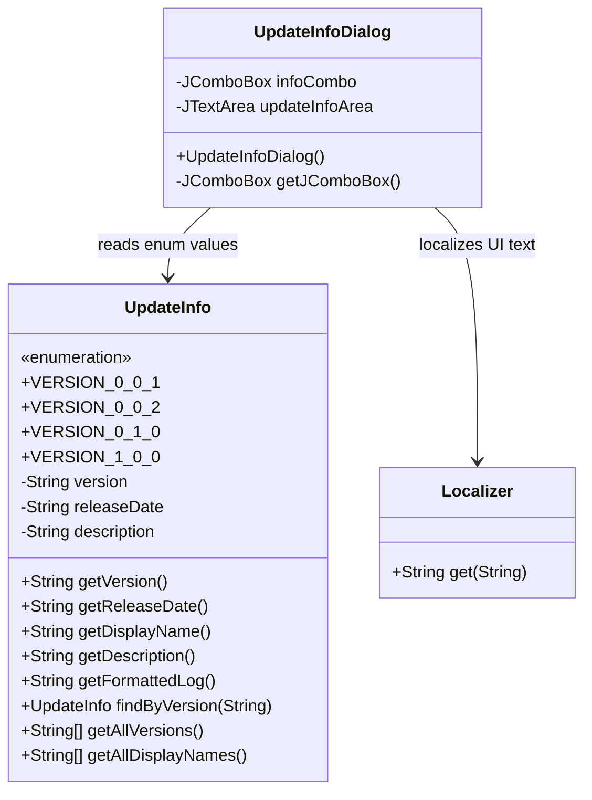
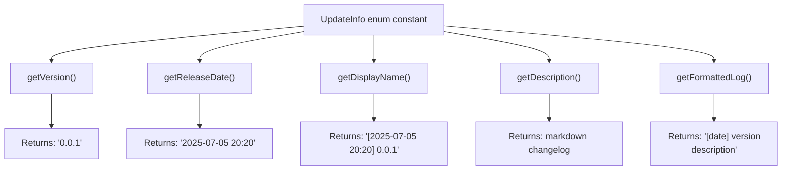
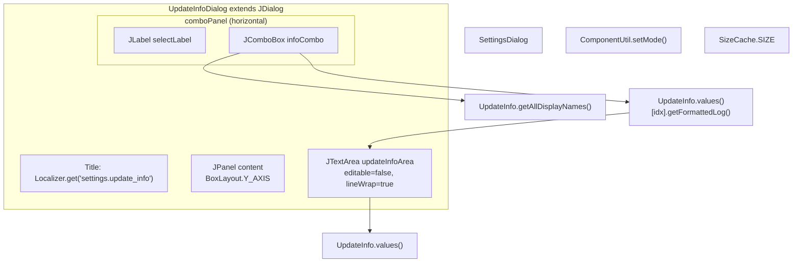
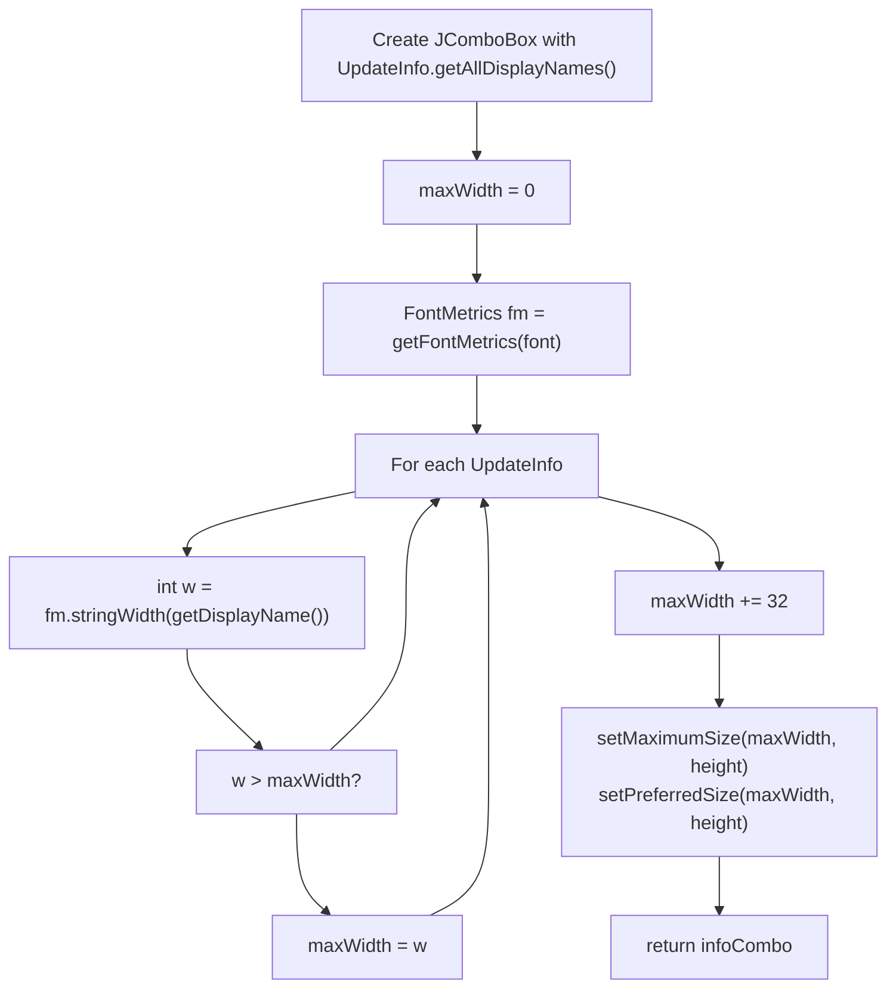

# Version History

> **Relevant source files**
> * [src/io/github/samera2022/mouse_macros/UpdateInfo.java](https://github.com/Samera2022/MouseMacros/blob/6b37ce1e/src/io/github/samera2022/mouse_macros/UpdateInfo.java)
> * [src/io/github/samera2022/mouse_macros/ui/frame/settings/UpdateInfoDialog.java](https://github.com/Samera2022/MouseMacros/blob/6b37ce1e/src/io/github/samera2022/mouse_macros/ui/frame/settings/UpdateInfoDialog.java)

## Purpose and Scope

This document describes the version history tracking system in the MouseMacros application, specifically the `UpdateInfo` enum and its integration with the user interface. The version history system provides structured changelog information for all application releases from version 0.0.1 to 1.0.0.

For information about the UI dialog that displays this version history, see the UpdateInfoDialog section below. For general configuration and settings management, see [Configuration System](/Samera2022/MouseMacros/5-configuration-system).

**Sources:** [src/io/github/samera2022/mouse_macros/UpdateInfo.java L1-L80](https://github.com/Samera2022/MouseMacros/blob/6b37ce1e/src/io/github/samera2022/mouse_macros/UpdateInfo.java#L1-L80)

---

## UpdateInfo Enum Architecture

The version history is implemented as an enum in `UpdateInfo`, which stores structured release information for each version. This design provides compile-time safety and easy iteration over all versions.

### Enum Structure



**Diagram: UpdateInfo System Architecture**

Each enum constant represents a distinct version release and contains three immutable fields initialized in the constructor [src/io/github/samera2022/mouse_macros/UpdateInfo.java L47-L52](https://github.com/Samera2022/MouseMacros/blob/6b37ce1e/src/io/github/samera2022/mouse_macros/UpdateInfo.java#L47-L52)

:

| Field | Type | Description |
| --- | --- | --- |
| `version` | `String` | Semantic version number (e.g., "0.0.1") |
| `releaseDate` | `String` | Release timestamp in format "YYYY-MM-DD HH:mm" |
| `description` | `String` | Markdown-formatted changelog with sections like ##[Added], ##[Changed], ##[Warn] |

**Sources:** [src/io/github/samera2022/mouse_macros/UpdateInfo.java L43-L52](https://github.com/Samera2022/MouseMacros/blob/6b37ce1e/src/io/github/samera2022/mouse_macros/UpdateInfo.java#L43-L52)

---

## Version History Entries

The MouseMacros application has undergone four major releases, each documented in the `UpdateInfo` enum. The changelog entries use markdown formatting and are written in Chinese.

### Version Timeline

| Version | Release Date | Lines | Key Features |
| --- | --- | --- | --- |
| 0.0.1 | 2025-07-05 20:20 | [7-13](https://github.com/Samera2022/MouseMacros/blob/6b37ce1e/7-13) | Initial release with basic macro recording, saving/loading, custom hotkeys, localization, and adaptive UI |
| 0.0.2 | 2025-07-06 22:51 | [14-26](https://github.com/Samera2022/MouseMacros/blob/6b37ce1e/14-26) | Added configuration file system, settings dialog, about dialog, and update log viewer |
| 0.1.0 | 2025-07-08 15:08 | [27-31](https://github.com/Samera2022/MouseMacros/blob/6b37ce1e/27-31) | Implemented keyMap in config files, major refactoring to reduce coupling |
| 1.0.0 | 2025-07-09 21:31 | [32-41](https://github.com/Samera2022/MouseMacros/blob/6b37ce1e/32-41) | Added middle mouse button support, mouse wheel, keyboard input, custom macro settings, abort functionality, and path persistence |

### Detailed Changelog Content

#### VERSION_0_0_1 (0.0.1)

[src/io/github/samera2022/mouse_macros/UpdateInfo.java L7-L13](https://github.com/Samera2022/MouseMacros/blob/6b37ce1e/src/io/github/samera2022/mouse_macros/UpdateInfo.java#L7-L13)

Features added in initial release:

* Start/stop mouse macro recording functionality
* Save/load mouse macro functionality
* Custom hotkey configuration
* Localization support
* Adaptive window sizing based on button length and system scaling settings

#### VERSION_0_0_2 (0.0.2)

[src/io/github/samera2022/mouse_macros/UpdateInfo.java L14-L26](https://github.com/Samera2022/MouseMacros/blob/6b37ce1e/src/io/github/samera2022/mouse_macros/UpdateInfo.java#L14-L26)

Features added:

* Configuration file system
* Settings dialog interface
* "About Author" button
* "Update Log" button

Changes:

* Moved custom hotkey functionality into Settings dialog

Details:
The configuration file system introduced the following configurable options: `followSystemSettings` (boolean), `enableDarkMode` (boolean), `lang` (String), `defaultMmcStoragePath` (String), and `keyMap` (Map<String,String>) marked as not yet implemented. The `followSystemSettings` option takes precedence over `enableDarkMode` and `lang` - when enabled, these settings are read from the system instead of user configuration.

#### VERSION_0_1_0 (0.1.0)

[src/io/github/samera2022/mouse_macros/UpdateInfo.java L27-L31](https://github.com/Samera2022/MouseMacros/blob/6b37ce1e/src/io/github/samera2022/mouse_macros/UpdateInfo.java#L27-L31)

Features added:

* Implemented keyMap configuration file integration

Changes:

* Major refactoring of project structure to reduce code coupling

#### VERSION_1_0_0 (1.0.0)

[src/io/github/samera2022/mouse_macros/UpdateInfo.java L32-L41](https://github.com/Samera2022/MouseMacros/blob/6b37ce1e/src/io/github/samera2022/mouse_macros/UpdateInfo.java#L32-L41)

Features added:

* Support for middle mouse button
* Mouse wheel support
* Keyboard input support
* Differentiation between left, right, and middle mouse buttons
* Custom macro settings dialog
* Abort macro hotkey functionality
* Path persistence for last used save/load locations

Warnings:

* After creating the custom hotkey dialog (`settings.custom_hotkey`), pressing keyboard keys without clicking any dialog element will directly modify the `start_record` hotkey setting
* JFileChooser interface cannot apply dark mode theme (rewriting this class would be too complex)

**Sources:** [src/io/github/samera2022/mouse_macros/UpdateInfo.java L7-L41](https://github.com/Samera2022/MouseMacros/blob/6b37ce1e/src/io/github/samera2022/mouse_macros/UpdateInfo.java#L7-L41)

---

## API Methods

The `UpdateInfo` enum provides both instance and static utility methods for accessing version information.

### Instance Methods



**Diagram: UpdateInfo Instance Methods**

| Method | Return Type | Description | Implementation |
| --- | --- | --- | --- |
| `getVersion()` | `String` | Returns the version number | [54](https://github.com/Samera2022/MouseMacros/blob/6b37ce1e/54) |
| `getReleaseDate()` | `String` | Returns the release date/time | [55](https://github.com/Samera2022/MouseMacros/blob/6b37ce1e/55) |
| `getDisplayName()` | `String` | Returns formatted string "[date] version" | [56](https://github.com/Samera2022/MouseMacros/blob/6b37ce1e/56) <br>  uses `String.format` |
| `getDescription()` | `String` | Returns the markdown changelog | [57](https://github.com/Samera2022/MouseMacros/blob/6b37ce1e/57) |
| `getFormattedLog()` | `String` | Returns complete formatted entry | [60-62](https://github.com/Samera2022/MouseMacros/blob/6b37ce1e/60-62) <br>  combines date, version, and description |

### Static Utility Methods

The enum provides three static methods for bulk operations:

| Method | Return Type | Description | Lines |
| --- | --- | --- | --- |
| `findByVersion(String version)` | `UpdateInfo` | Searches for enum constant by version string, throws `IllegalArgumentException` if not found | [65-70](https://github.com/Samera2022/MouseMacros/blob/6b37ce1e/65-70) |
| `getAllVersions()` | `String[]` | Returns array of all version numbers using `Stream.of(values()).map(...)` | [73-75](https://github.com/Samera2022/MouseMacros/blob/6b37ce1e/73-75) |
| `getAllDisplayNames()` | `String[]` | Returns array of all display names (formatted with dates) | [77-79](https://github.com/Samera2022/MouseMacros/blob/6b37ce1e/77-79) |

The static methods use Java 8+ Stream API for functional-style collection operations:

* `findByVersion` uses `Stream.of(values()).filter(...).findFirst().orElseThrow(...)`
* `getAllVersions` and `getAllDisplayNames` use `Stream.of(values()).map(...).toArray(String[]::new)`

**Sources:** [src/io/github/samera2022/mouse_macros/UpdateInfo.java L54-L79](https://github.com/Samera2022/MouseMacros/blob/6b37ce1e/src/io/github/samera2022/mouse_macros/UpdateInfo.java#L54-L79)

---

## UI Integration: UpdateInfoDialog

The `UpdateInfoDialog` class provides a graphical interface for browsing version history. It is launched from the SettingsDialog when the user clicks the update info button.

### Dialog Architecture



**Diagram: UpdateInfoDialog Component Structure**

### Component Initialization

The dialog initializes in the constructor [src/io/github/samera2022/mouse_macros/ui/frame/settings/UpdateInfoDialog.java L15-L70](https://github.com/Samera2022/MouseMacros/blob/6b37ce1e/src/io/github/samera2022/mouse_macros/ui/frame/settings/UpdateInfoDialog.java#L15-L70)

:

1. **Modal Configuration**: Set as modal dialog with title from `Localizer.get("settings.update_info")` [16-17](https://github.com/Samera2022/MouseMacros/blob/6b37ce1e/16-17)
2. **Layout Structure**: Uses `BorderLayout` with 10px gaps, content panel uses vertical `BoxLayout` [18-21](https://github.com/Samera2022/MouseMacros/blob/6b37ce1e/18-21)
3. **Title Label**: Bold 18pt font, left-aligned [23-26](https://github.com/Samera2022/MouseMacros/blob/6b37ce1e/23-26)
4. **Version Selector**: Horizontal panel with label and `JComboBox` populated by `UpdateInfo.getAllDisplayNames()` [31-42](https://github.com/Samera2022/MouseMacros/blob/6b37ce1e/31-42)
5. **Content Display**: Non-editable `JTextArea` with line wrapping, initialized with first version's formatted log [44-54](https://github.com/Samera2022/MouseMacros/blob/6b37ce1e/44-54)
6. **Event Handler**: `ActionListener` on combo box updates text area when selection changes [57-62](https://github.com/Samera2022/MouseMacros/blob/6b37ce1e/57-62)
7. **Theming**: Applies dark/light mode via `ComponentUtil.setMode()` based on `config.enableDarkMode` [65](https://github.com/Samera2022/MouseMacros/blob/6b37ce1e/65)
8. **Sizing**: Uses cached dialog dimensions from `SizeCache.SIZE` [68](https://github.com/Samera2022/MouseMacros/blob/6b37ce1e/68)

### Auto-Sizing ComboBox

The `getJComboBox()` static helper method [72-87](https://github.com/Samera2022/MouseMacros/blob/6b37ce1e/72-87)

 implements adaptive width sizing:



**Diagram: ComboBox Width Calculation Algorithm**

The algorithm:

1. Iterates through all `UpdateInfo.values()` [78](https://github.com/Samera2022/MouseMacros/blob/6b37ce1e/78)
2. Uses `FontMetrics.stringWidth()` to calculate pixel width of each display name [79](https://github.com/Samera2022/MouseMacros/blob/6b37ce1e/79)
3. Tracks maximum width [80-81](https://github.com/Samera2022/MouseMacros/blob/6b37ce1e/80-81)
4. Adds 32px padding for dropdown arrow and margins [83](https://github.com/Samera2022/MouseMacros/blob/6b37ce1e/83)
5. Sets both `maximumSize` and `preferredSize` to prevent layout expansion [84-85](https://github.com/Samera2022/MouseMacros/blob/6b37ce1e/84-85)

This ensures the combo box is exactly wide enough to display the longest version entry without truncation or excess space.

**Sources:** [src/io/github/samera2022/mouse_macros/ui/frame/settings/UpdateInfoDialog.java L1-L88](https://github.com/Samera2022/MouseMacros/blob/6b37ce1e/src/io/github/samera2022/mouse_macros/ui/frame/settings/UpdateInfoDialog.java#L1-L88)

---

## Version Evolution Summary

The MouseMacros application evolved from a basic macro recorder to a full-featured automation tool over four releases spanning four days (July 5-9, 2025):

```css
#mermaid-xxqvo0tziw{font-family:ui-sans-serif,-apple-system,system-ui,Segoe UI,Helvetica;font-size:16px;fill:#333;}@keyframes edge-animation-frame{from{stroke-dashoffset:0;}}@keyframes dash{to{stroke-dashoffset:0;}}#mermaid-xxqvo0tziw .edge-animation-slow{stroke-dasharray:9,5!important;stroke-dashoffset:900;animation:dash 50s linear infinite;stroke-linecap:round;}#mermaid-xxqvo0tziw .edge-animation-fast{stroke-dasharray:9,5!important;stroke-dashoffset:900;animation:dash 20s linear infinite;stroke-linecap:round;}#mermaid-xxqvo0tziw .error-icon{fill:#dddddd;}#mermaid-xxqvo0tziw .error-text{fill:#222222;stroke:#222222;}#mermaid-xxqvo0tziw .edge-thickness-normal{stroke-width:1px;}#mermaid-xxqvo0tziw .edge-thickness-thick{stroke-width:3.5px;}#mermaid-xxqvo0tziw .edge-pattern-solid{stroke-dasharray:0;}#mermaid-xxqvo0tziw .edge-thickness-invisible{stroke-width:0;fill:none;}#mermaid-xxqvo0tziw .edge-pattern-dashed{stroke-dasharray:3;}#mermaid-xxqvo0tziw .edge-pattern-dotted{stroke-dasharray:2;}#mermaid-xxqvo0tziw .marker{fill:#999;stroke:#999;}#mermaid-xxqvo0tziw .marker.cross{stroke:#999;}#mermaid-xxqvo0tziw svg{font-family:ui-sans-serif,-apple-system,system-ui,Segoe UI,Helvetica;font-size:16px;}#mermaid-xxqvo0tziw p{margin:0;}#mermaid-xxqvo0tziw .edge{stroke-width:3;}#mermaid-xxqvo0tziw .section--1 rect,#mermaid-xxqvo0tziw .section--1 path,#mermaid-xxqvo0tziw .section--1 circle,#mermaid-xxqvo0tziw .section--1 path{fill:hsl(0, 0%, 66.7647058824%);}#mermaid-xxqvo0tziw .section--1 text{fill:#333;}#mermaid-xxqvo0tziw .node-icon--1{font-size:40px;color:#333;}#mermaid-xxqvo0tziw .section-edge--1{stroke:hsl(0, 0%, 66.7647058824%);}#mermaid-xxqvo0tziw .edge-depth--1{stroke-width:17;}#mermaid-xxqvo0tziw .section--1 line{stroke:rgb(84.7499999999, 84.7499999999, 84.7499999999);stroke-width:3;}#mermaid-xxqvo0tziw .lineWrapper line{stroke:#333;}#mermaid-xxqvo0tziw .disabled,#mermaid-xxqvo0tziw .disabled circle,#mermaid-xxqvo0tziw .disabled text{fill:lightgray;}#mermaid-xxqvo0tziw .disabled text{fill:#efefef;}#mermaid-xxqvo0tziw .section-0 rect,#mermaid-xxqvo0tziw .section-0 path,#mermaid-xxqvo0tziw .section-0 circle,#mermaid-xxqvo0tziw .section-0 path{fill:hsl(-120, 0%, 66.7647058824%);}#mermaid-xxqvo0tziw .section-0 text{fill:#333;}#mermaid-xxqvo0tziw .node-icon-0{font-size:40px;color:#333;}#mermaid-xxqvo0tziw .section-edge-0{stroke:hsl(-120, 0%, 66.7647058824%);}#mermaid-xxqvo0tziw .edge-depth-0{stroke-width:14;}#mermaid-xxqvo0tziw .section-0 line{stroke:rgb(84.7499999999, 84.7499999999, 84.7499999999);stroke-width:3;}#mermaid-xxqvo0tziw .lineWrapper line{stroke:#333;}#mermaid-xxqvo0tziw .disabled,#mermaid-xxqvo0tziw .disabled circle,#mermaid-xxqvo0tziw .disabled text{fill:lightgray;}#mermaid-xxqvo0tziw .disabled text{fill:#efefef;}#mermaid-xxqvo0tziw .section-1 rect,#mermaid-xxqvo0tziw .section-1 path,#mermaid-xxqvo0tziw .section-1 circle,#mermaid-xxqvo0tziw .section-1 path{fill:hsl(0, 0%, 61.6666666667%);}#mermaid-xxqvo0tziw .section-1 text{fill:#333;}#mermaid-xxqvo0tziw .node-icon-1{font-size:40px;color:#333;}#mermaid-xxqvo0tziw .section-edge-1{stroke:hsl(0, 0%, 61.6666666667%);}#mermaid-xxqvo0tziw .edge-depth-1{stroke-width:11;}#mermaid-xxqvo0tziw .section-1 line{stroke:rgb(97.7499999999, 97.7499999999, 97.7499999999);stroke-width:3;}#mermaid-xxqvo0tziw .lineWrapper line{stroke:#333;}#mermaid-xxqvo0tziw .disabled,#mermaid-xxqvo0tziw .disabled circle,#mermaid-xxqvo0tziw .disabled text{fill:lightgray;}#mermaid-xxqvo0tziw .disabled text{fill:#efefef;}#mermaid-xxqvo0tziw .section-2 rect,#mermaid-xxqvo0tziw .section-2 path,#mermaid-xxqvo0tziw .section-2 circle,#mermaid-xxqvo0tziw .section-2 path{fill:hsl(30, 0%, 66.7647058824%);}#mermaid-xxqvo0tziw .section-2 text{fill:#333;}#mermaid-xxqvo0tziw .node-icon-2{font-size:40px;color:#333;}#mermaid-xxqvo0tziw .section-edge-2{stroke:hsl(30, 0%, 66.7647058824%);}#mermaid-xxqvo0tziw .edge-depth-2{stroke-width:8;}#mermaid-xxqvo0tziw .section-2 line{stroke:rgb(84.7499999999, 84.7499999999, 84.7499999999);stroke-width:3;}#mermaid-xxqvo0tziw .lineWrapper line{stroke:#333;}#mermaid-xxqvo0tziw .disabled,#mermaid-xxqvo0tziw .disabled circle,#mermaid-xxqvo0tziw .disabled text{fill:lightgray;}#mermaid-xxqvo0tziw .disabled text{fill:#efefef;}#mermaid-xxqvo0tziw .section-3 rect,#mermaid-xxqvo0tziw .section-3 path,#mermaid-xxqvo0tziw .section-3 circle,#mermaid-xxqvo0tziw .section-3 path{fill:hsl(60, 0%, 66.7647058824%);}#mermaid-xxqvo0tziw .section-3 text{fill:#333;}#mermaid-xxqvo0tziw .node-icon-3{font-size:40px;color:#333;}#mermaid-xxqvo0tziw .section-edge-3{stroke:hsl(60, 0%, 66.7647058824%);}#mermaid-xxqvo0tziw .edge-depth-3{stroke-width:5;}#mermaid-xxqvo0tziw .section-3 line{stroke:rgb(84.7499999999, 84.7499999999, 84.7499999999);stroke-width:3;}#mermaid-xxqvo0tziw .lineWrapper line{stroke:#333;}#mermaid-xxqvo0tziw .disabled,#mermaid-xxqvo0tziw .disabled circle,#mermaid-xxqvo0tziw .disabled text{fill:lightgray;}#mermaid-xxqvo0tziw .disabled text{fill:#efefef;}#mermaid-xxqvo0tziw .section-4 rect,#mermaid-xxqvo0tziw .section-4 path,#mermaid-xxqvo0tziw .section-4 circle,#mermaid-xxqvo0tziw .section-4 path{fill:hsl(90, 0%, 66.7647058824%);}#mermaid-xxqvo0tziw .section-4 text{fill:#333;}#mermaid-xxqvo0tziw .node-icon-4{font-size:40px;color:#333;}#mermaid-xxqvo0tziw .section-edge-4{stroke:hsl(90, 0%, 66.7647058824%);}#mermaid-xxqvo0tziw .edge-depth-4{stroke-width:2;}#mermaid-xxqvo0tziw .section-4 line{stroke:rgb(84.7499999999, 84.7499999999, 84.7499999999);stroke-width:3;}#mermaid-xxqvo0tziw .lineWrapper line{stroke:#333;}#mermaid-xxqvo0tziw .disabled,#mermaid-xxqvo0tziw .disabled circle,#mermaid-xxqvo0tziw .disabled text{fill:lightgray;}#mermaid-xxqvo0tziw .disabled text{fill:#efefef;}#mermaid-xxqvo0tziw .section-5 rect,#mermaid-xxqvo0tziw .section-5 path,#mermaid-xxqvo0tziw .section-5 circle,#mermaid-xxqvo0tziw .section-5 path{fill:hsl(120, 0%, 66.7647058824%);}#mermaid-xxqvo0tziw .section-5 text{fill:#333;}#mermaid-xxqvo0tziw .node-icon-5{font-size:40px;color:#333;}#mermaid-xxqvo0tziw .section-edge-5{stroke:hsl(120, 0%, 66.7647058824%);}#mermaid-xxqvo0tziw .edge-depth-5{stroke-width:-1;}#mermaid-xxqvo0tziw .section-5 line{stroke:rgb(84.7499999999, 84.7499999999, 84.7499999999);stroke-width:3;}#mermaid-xxqvo0tziw .lineWrapper line{stroke:#333;}#mermaid-xxqvo0tziw .disabled,#mermaid-xxqvo0tziw .disabled circle,#mermaid-xxqvo0tziw .disabled text{fill:lightgray;}#mermaid-xxqvo0tziw .disabled text{fill:#efefef;}#mermaid-xxqvo0tziw .section-6 rect,#mermaid-xxqvo0tziw .section-6 path,#mermaid-xxqvo0tziw .section-6 circle,#mermaid-xxqvo0tziw .section-6 path{fill:hsl(150, 0%, 66.7647058824%);}#mermaid-xxqvo0tziw .section-6 text{fill:#333;}#mermaid-xxqvo0tziw .node-icon-6{font-size:40px;color:#333;}#mermaid-xxqvo0tziw .section-edge-6{stroke:hsl(150, 0%, 66.7647058824%);}#mermaid-xxqvo0tziw .edge-depth-6{stroke-width:-4;}#mermaid-xxqvo0tziw .section-6 line{stroke:rgb(84.7499999999, 84.7499999999, 84.7499999999);stroke-width:3;}#mermaid-xxqvo0tziw .lineWrapper line{stroke:#333;}#mermaid-xxqvo0tziw .disabled,#mermaid-xxqvo0tziw .disabled circle,#mermaid-xxqvo0tziw .disabled text{fill:lightgray;}#mermaid-xxqvo0tziw .disabled text{fill:#efefef;}#mermaid-xxqvo0tziw .section-7 rect,#mermaid-xxqvo0tziw .section-7 path,#mermaid-xxqvo0tziw .section-7 circle,#mermaid-xxqvo0tziw .section-7 path{fill:hsl(210, 0%, 75%);}#mermaid-xxqvo0tziw .section-7 text{fill:#333;}#mermaid-xxqvo0tziw .node-icon-7{font-size:40px;color:#333;}#mermaid-xxqvo0tziw .section-edge-7{stroke:hsl(210, 0%, 75%);}#mermaid-xxqvo0tziw .edge-depth-7{stroke-width:-7;}#mermaid-xxqvo0tziw .section-7 line{stroke:rgb(63.75, 63.75, 63.75);stroke-width:3;}#mermaid-xxqvo0tziw .lineWrapper line{stroke:#333;}#mermaid-xxqvo0tziw .disabled,#mermaid-xxqvo0tziw .disabled circle,#mermaid-xxqvo0tziw .disabled text{fill:lightgray;}#mermaid-xxqvo0tziw .disabled text{fill:#efefef;}#mermaid-xxqvo0tziw .section-8 rect,#mermaid-xxqvo0tziw .section-8 path,#mermaid-xxqvo0tziw .section-8 circle,#mermaid-xxqvo0tziw .section-8 path{fill:hsl(270, 0%, 66.7647058824%);}#mermaid-xxqvo0tziw .section-8 text{fill:#333;}#mermaid-xxqvo0tziw .node-icon-8{font-size:40px;color:#333;}#mermaid-xxqvo0tziw .section-edge-8{stroke:hsl(270, 0%, 66.7647058824%);}#mermaid-xxqvo0tziw .edge-depth-8{stroke-width:-10;}#mermaid-xxqvo0tziw .section-8 line{stroke:rgb(84.7499999999, 84.7499999999, 84.7499999999);stroke-width:3;}#mermaid-xxqvo0tziw .lineWrapper line{stroke:#333;}#mermaid-xxqvo0tziw .disabled,#mermaid-xxqvo0tziw .disabled circle,#mermaid-xxqvo0tziw .disabled text{fill:lightgray;}#mermaid-xxqvo0tziw .disabled text{fill:#efefef;}#mermaid-xxqvo0tziw .section-9 rect,#mermaid-xxqvo0tziw .section-9 path,#mermaid-xxqvo0tziw .section-9 circle,#mermaid-xxqvo0tziw .section-9 path{fill:hsl(300, 0%, 66.7647058824%);}#mermaid-xxqvo0tziw .section-9 text{fill:#333;}#mermaid-xxqvo0tziw .node-icon-9{font-size:40px;color:#333;}#mermaid-xxqvo0tziw .section-edge-9{stroke:hsl(300, 0%, 66.7647058824%);}#mermaid-xxqvo0tziw .edge-depth-9{stroke-width:-13;}#mermaid-xxqvo0tziw .section-9 line{stroke:rgb(84.7499999999, 84.7499999999, 84.7499999999);stroke-width:3;}#mermaid-xxqvo0tziw .lineWrapper line{stroke:#333;}#mermaid-xxqvo0tziw .disabled,#mermaid-xxqvo0tziw .disabled circle,#mermaid-xxqvo0tziw .disabled text{fill:lightgray;}#mermaid-xxqvo0tziw .disabled text{fill:#efefef;}#mermaid-xxqvo0tziw .section-10 rect,#mermaid-xxqvo0tziw .section-10 path,#mermaid-xxqvo0tziw .section-10 circle,#mermaid-xxqvo0tziw .section-10 path{fill:hsl(330, 0%, 66.7647058824%);}#mermaid-xxqvo0tziw .section-10 text{fill:#333;}#mermaid-xxqvo0tziw .node-icon-10{font-size:40px;color:#333;}#mermaid-xxqvo0tziw .section-edge-10{stroke:hsl(330, 0%, 66.7647058824%);}#mermaid-xxqvo0tziw .edge-depth-10{stroke-width:-16;}#mermaid-xxqvo0tziw .section-10 line{stroke:rgb(84.7499999999, 84.7499999999, 84.7499999999);stroke-width:3;}#mermaid-xxqvo0tziw .lineWrapper line{stroke:#333;}#mermaid-xxqvo0tziw .disabled,#mermaid-xxqvo0tziw .disabled circle,#mermaid-xxqvo0tziw .disabled text{fill:lightgray;}#mermaid-xxqvo0tziw .disabled text{fill:#efefef;}#mermaid-xxqvo0tziw .section-root rect,#mermaid-xxqvo0tziw .section-root path,#mermaid-xxqvo0tziw .section-root circle{fill:hsl(0, 0%, 66.7647058824%);}#mermaid-xxqvo0tziw .section-root text{fill:#333;}#mermaid-xxqvo0tziw .icon-container{height:100%;display:flex;justify-content:center;align-items:center;}#mermaid-xxqvo0tziw .edge{fill:none;}#mermaid-xxqvo0tziw .eventWrapper{filter:brightness(120%);}#mermaid-xxqvo0tziw :root{--mermaid-font-family:"trebuchet ms",verdana,arial,sans-serif;}v0.0.1   (July   5)Basic   FunctionalityRecordingPlaybackHotkeysLocalizationv0.0.2   (July   6)ConfigurationSystemConfig   FilesSettings   UIDialogsv0.1.0   (July   8)ArchitectureKeyMapImplementationCode   Refactoringv1.0.0   (July   9)Extended   InputMiddle   MouseScroll   WheelKeyboardAbort   KeyMouseMacros Version Evolution
```

**Diagram: Release Timeline**

### Feature Progression

| Feature Category | v0.0.1 | v0.0.2 | v0.1.0 | v1.0.0 |
| --- | --- | --- | --- | --- |
| Mouse Recording | Left/Right buttons | - | - | Added middle button |
| Input Types | Mouse only | - | - | Added wheel + keyboard |
| Configuration | In-memory | File-based | KeyMap working | Path persistence |
| UI | Main window | Settings + dialogs | - | Custom macro settings |
| Hotkeys | Basic F-keys | - | Fully configurable | Added abort key |
| Code Quality | Initial | - | Refactored | - |

### Importance Ranking

According to the high-level architecture analysis, `UpdateInfo` has the highest individual importance score of 9.38 among all clusters in the codebase. This reflects:

1. **Version Documentation**: Provides complete feature history for user reference
2. **UI Integration**: Powers the UpdateInfoDialog for changelog browsing
3. **Development Tracking**: Documents architectural decisions and evolution
4. **User Communication**: Explains new features and known issues

**Sources:** [src/io/github/samera2022/mouse_macros/UpdateInfo.java L1-L80](https://github.com/Samera2022/MouseMacros/blob/6b37ce1e/src/io/github/samera2022/mouse_macros/UpdateInfo.java#L1-L80)

 High-Level System Architecture Diagrams (Diagram 4)