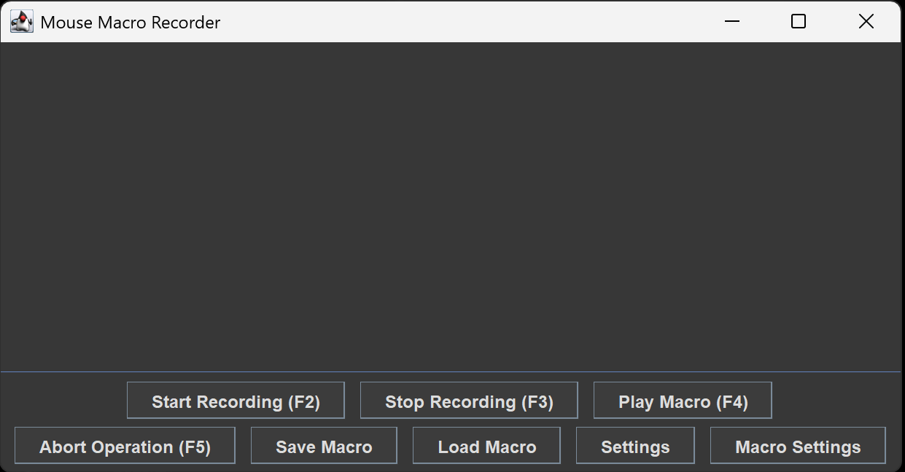
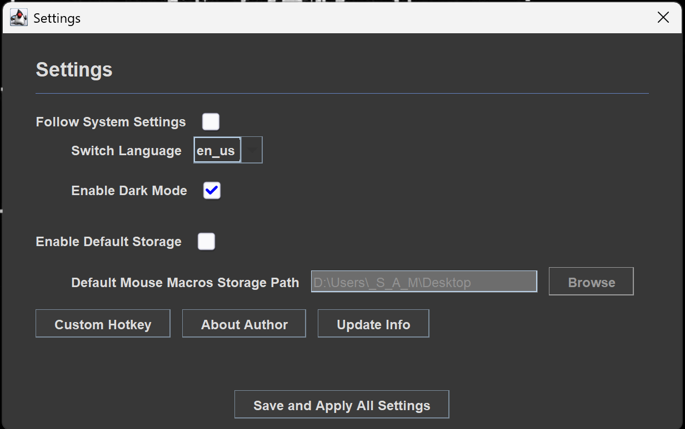

# MouseMacros

<p align="center">
  
  <br>
  <b>一款轻量级、跨平台的 Java 工具，用于录制和回放鼠标及键盘宏。</b>
  <br>
</p>

<p align="center">
  
  
  
  
  <br>
  
  <a href="https://deepwiki.com/Samera2022/MouseMacros"></a>
</p>

<div align="center">

| <sub>EN</sub> [English](../../README.md) | <sub>ZH</sub> [中文](README_ZH_CN.md) |
|---------------------------------------|---------------------------------------|

</div>

## 重要通知：项目升级至 saMacros

**MouseMacros** 已正式进入 **长期支持（LTS）** 模式。
我们很高兴地宣布它的继任者：**[saMacros](https://github.com/Samera2022/saMacros)**。

* **saMacros**（可脚本化与高级宏）是我们的下一代平台，具备 **GraalVM JavaScript 引擎**、现代化 **FlatLaf UI** 以及模块化 API。
* **MouseMacros** 将继续在此提供给喜欢轻量、简单工具的用户。它将获得关键的错误修复，但很少有新功能更新。

👉 **[探索 saMacros 并获取最新快照](https://github.com/Samera2022/saMacros)**

## 预览
<p align="center">
  
<br>
  <sub style="font-size: 14px;"><i>MouseMacros 主界面展示</i></sub>
</p>

## 功能特性

* **全方位录制**：无缝捕获鼠标左/中/右键点击、滚轮滚动以及键盘输入。
* **全局热键**：即使应用最小化也能进行控制。支持完全自定义以下功能键：
    * 开始/停止录制
    * 播放宏
    * 终止操作（针对失控宏的紧急停止）
* **多语言支持**：内置 **英语 (美国)** 和 **简体中文** 本地化，同时支持日语、俄语、韩语、西班牙语和法语。
* **主题引擎**：支持 **浅色** 和 **深色** 模式，并可选择自动跟随系统设置。
* **持久化**：宏以 `.mmc` (CSV 格式) 文件保存，方便分享和手动编辑。
* **智能记忆**：自动记住窗口大小、上次使用的目录以及跨会话的自定义配置。
* **悬浮提示**：在光标附近显示实用的操作说明和提示，方便操作。

## 安全性与二进制完整性
为了确保 Windows 二进制文件的安全性和真实性，MouseMacros 目前正在接入 SignPath Foundation 以获取免费的代码签名。
- **状态**：申请中 / 集成挂起。
- **未来发布**：一旦获得批准，所有的 Windows 安装程序 (.msi) 和可执行文件 (.exe) 都将由 SignPath Foundation 进行数字签名。
  

## 快速入门

### 快速启动
**I. Jar 用户**
1. 请确保已安装 JRE 1.8 或更高版本。如果没有，可以从[此处](https://www.oracle.com/technetwork/cn/java/javase/downloads/jre8-downloads-2133155-zhs.html)下载。
2. 从 [Releases](https://github.com/Samera2022/MouseMacros/releases) 页面下载最新的 `.jar` 文件。
3. 双击 jar 文件，或使用命令行运行应用：
    ```bash
    java -jar MouseMacros.jar
    ```
**II. Exe 用户**
1. 从 [Releases](https://github.com/Samera2022/MouseMacros/releases) 页面下载最新的 `.exe` 文件。
2. 点击即可启动！所有环境已集成到单个 `exe` 文件中！

### 使用方法
<p align="center">
  
</p>

1. **调整**：语言的选择将决定界面中的文字，从而导致某些按钮可能无法完整显示。在这种情况下，您需要将窗口调整至合适的尺寸。
2. **配置**：打开“设置”对话框和“宏设置”对话框来设置您偏好的热键。详细的配置文档请参考 [配置](#配置) 章节。
3. **录制**：按下您的“开始录制”热键或点击界面中的对应按钮，然后执行操作。
4. **保存**：使用“保存宏”将录制内容导出为 `.mmc` 文件。
5. **回放**：使用“加载宏”读取 `.mmc` 文件并按下“播放宏”。

## 配置

应用程序将设置存储在用户的 AppData 目录中：
`%USERPROFILE%/AppData/MouseMacros/`

| 文件 | 描述 |
|:-------------|:------------------------------------------------------------------------|
| `config.cfg` | 存储 UI 语言、主题模式、按键映射和默认存储路径。 |
| `cache.json` | 存储最近的文件路径和窗口尺寸。 |

### 设置对话框选项
| 名称 | 键名 | 描述 |
|:---------------------------------|:--------------------------------|:--------------------------------------------------------------------------------------------------------------------------------------------------------------------------------------------------------------------------------------------------------------------------------------------------------------------------------------|
| 跟随系统设置 | `followSystemSettings`(boolean) | 控制是否跟随系统默认设置。 |
| 切换语言 | `lang`(String) | 若 `followSystemSettings` 为 false，可通过此组合框选择其他显示语言。 |
| 启用深色模式 | `enableDarkMode`(boolean) | 若 `followSystemSettings` 为 false，可通过此复选框选择是否开启深色模式。 |
| 启用默认存储 | `enableDefaultStorage`(boolean) | 控制是否启用 `defaultMmcStoragePath`。若为真，`cache.json` 中的最近保存/加载目录将被忽略。每次打开文件选择对话框时，都会自动定位到该默认路径。 |
| 默认 MouseMacros 存储路径 | `defaultMmcStoragePath`(String) | 当启用默认存储时，此项决定默认文件夹。若文件夹不存在，应用将尝试创建，否则将打开默认的“用户文档”文件夹。 |
| 启用快速模式 | `enableQuickMode`(boolean) | 控制是否启用“无延迟模式”。在此模式下，应用将忽略动作间的等待时间。此模式具有危险性，强烈建议在启用前设置好 **终止操作** 热键和 **重复延迟**。 |
| 允许长提示文本 | `allowLongStr`(boolean) | 控制是否开启长提示显示。若为 false，提示将限制在给定宽度内；否则将尝试单行显示，除非超过窗口宽度。 |
| 窗口重调模式 | `readjustFrameMode`(String) | 控制在无缓存时以 3:2 比例显示窗口的模式。若存在缓存，在更改语言后，应用将在处理历史尺寸与推荐尺寸时从三种模式中选择。 |

### 宏设置对话框选项
| 名称 | 键名 | 描述 |
|:---------------------------------|:-------------------------------------|:---------------------------------------------------------------------------------------------------------------------------------------------------------------|
| 启用自定义宏设置 | `enableCustomMacroSettings`(boolean) | 控制是否开启自定义宏设置。 |
| 执行重复次数 | `repeatTime`(int) | 若启用，应用将按给定次数自动重复执行宏。 |
| 重复延迟 (秒) | `repeatDelay`(double) | 若启用，应用将在下次执行前推迟给定时间。最高支持三位小数（精确到毫秒）。 |

## 开发文档

由 DeepWiki 生成的详细文档可在 [GitHub Wiki](https://github.com/Samera2022/MouseMacros/wiki) 查看。由于该文档是由作者从 DeepWiki 手动汇编的，可能存在滞后性。

如需查看最新的文档，请参考 [Samera2022/MouseMacros | DeepWiki](https://deepwiki.com/Samera2022/MouseMacros) 或点击页面顶部的徽章。该网站每周更新本项目文档，并提供“Refresh this wiki”按钮及邮件输入框，以便在未索引时强制更新。

此外，关于版本命名规范、更新日志维护以及 CI/CD 工作流等内部开发细节，请参考我们的开发 [FAQ](FAQ_ZH_CN.md)。

## 其他

### 贡献
欢迎贡献代码！如果您发现 Bug 或有功能建议，请提交 Issue。
### 作者
**开发者: Samera2022**
* **GitHub**: [@Samera2022](https://github.com/Samera2022)
### 许可证
本项目采用 GNU General Public License v3.0 许可证 - 详见 `LICENSE` 文件。